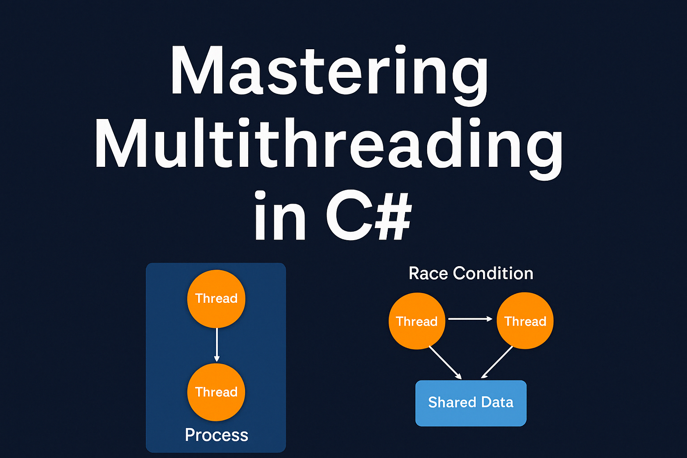

Let’s walk through what it is, how it works, and how you can use it — without getting lost in jargon.

---

## What is Multitasking?

Think of multitasking as your computer's way of doing several things at once — playing music, downloading a file, and letting you browse the web, all at the same time. Pretty normal these days, right?

Behind the scenes, the operating system rapidly switches between different tasks using techniques like **time-slicing** and **context switching**, so it feels like everything is running in parallel.

---

## What Are Processes and Threads?

Before diving into code, it’s helpful to understand what exactly is going on under the hood:

- A **process** is basically an instance of a running application. It has its own memory and resources.
- A **thread** is a smaller unit of work *within* a process. Threads can run code independently but share the same memory.

This shared memory between threads is what makes them powerful — and also what makes things tricky if you’re not careful.


---

## Why Multithreading?

If your app only does one thing at a time, you’re going to run into problems. Imagine a UI that freezes every time it loads data or performs a calculation. Nobody wants that.

### Problems with Single-Threaded Applications
- UI becomes unresponsive
- You don’t make the most of multi-core CPUs
- Users get frustrated — and leave

### What Multithreading Solves
- You can keep your UI smooth while doing background work
- You can run multiple operations in parallel
- You can scale tasks better on modern hardware

---

## A Simple Example Using `Thread`

Here’s a classic example to illustrate how threads work in C#:

```csharp
using System;
using System.Threading;

class Program
{
    static void PrintNumbers()
    {
        for (int i = 1; i <= 5; i++)
        {
            Console.WriteLine($"Worker Thread: {i}");
            Thread.Sleep(500);
        }
    }

    static void Main()
    {
        Thread t = new Thread(PrintNumbers);
        t.Start();

        for (int i = 1; i <= 5; i++)
        {
            Console.WriteLine($"Main Thread: {i}");
            Thread.Sleep(500);
        }
    }
}
```

You’ll see that both threads are printing at the same time — welcome to parallelism!

---

## The `Thread` Class: Low-Level Control

The `Thread` class gives you raw control. It’s part of `System.Threading`, and while it’s powerful, it's a bit old-school these days.

You can:
- Start threads manually with `Start()`
- Pause them using `Sleep()`
- Wait for them to finish with `Join()`
- Check if they’re still running with `IsAlive`

**But**: manual threads can be messy to manage. You have to handle errors, state, and cleanup yourself — not ideal in most cases.

---

## The Modern Way: `Task` and `async/await`

Nowadays, you’ll usually use `Task` along with `async/await`. It’s cleaner, safer, and built for the way we write code today.

Here’s what it looks like:

```csharp
using System;
using System.Threading.Tasks;

class Program
{
    static async Task Main()
    {
        Task task1 = Task.Run(() =>
        {
            for (int i = 1; i <= 5; i++)
            {
                Console.WriteLine($"Task: {i}");
                Task.Delay(500).Wait();
            }
        });

        for (int i = 1; i <= 5; i++)
        {
            Console.WriteLine($"Main Thread: {i}");
            await Task.Delay(500);
        }

        await task1;
    }
}
```

It looks almost like synchronous code, but it’s actually doing things in parallel.

---

## So… Thread or Task?

Here’s a quick comparison to help you decide:

| Feature            | `Thread`                      | `Task`                            |
|--------------------|-------------------------------|------------------------------------|
| Level              | Low-level                     | High-level                         |
| Ease of use        | Manual                        | Easier (with async/await)          |
| Exception handling | You manage it                 | Handled by the runtime             |
| Performance        | Less efficient                | Uses thread pool under the hood    |
| Best for           | Fine control, legacy code     | Everything else                    |

---

## What About Shared Data?

One of the biggest risks with multithreading is when threads access the same data. That’s where bugs like **race conditions** and **deadlocks** come in.

You can use things like `lock`, `Mutex`, and `SemaphoreSlim` to avoid these issues.

```csharp
private static object _lock = new object();

lock (_lock)
{
    // Safe to access shared resource
}
```


---

## Bonus: `Parallel.For` and PLINQ

If you need to run a bunch of similar tasks — like processing a big array — `Parallel.For` is a great option:

```csharp
using System;
using System.Threading.Tasks;

class Program
{
    static void Main()
    {
        Parallel.For(0, 10, i =>
        {
            Console.WriteLine($"Running task {i}");
        });
    }
}
```

For data queries, PLINQ lets you use LINQ but with automatic parallel execution.

---

## Want to Go Deeper?

Here are a few trusted resources that go further into these topics:

- [.NET Official Docs - Threading](https://learn.microsoft.com/en-us/dotnet/standard/threading/)
- [.NET Docs - Task Parallel Library](https://learn.microsoft.com/en-us/dotnet/standard/parallel-programming/)
- [Stephen Cleary’s Blog (deep dive into async/await)](https://blog.stephencleary.com/)

---

## Final Thoughts

Multithreading can seem overwhelming at first, but it’s totally worth learning. You don’t need to be a concurrency expert to take advantage of it — just start with `Task`, use `async/await`, and build from there.

---


