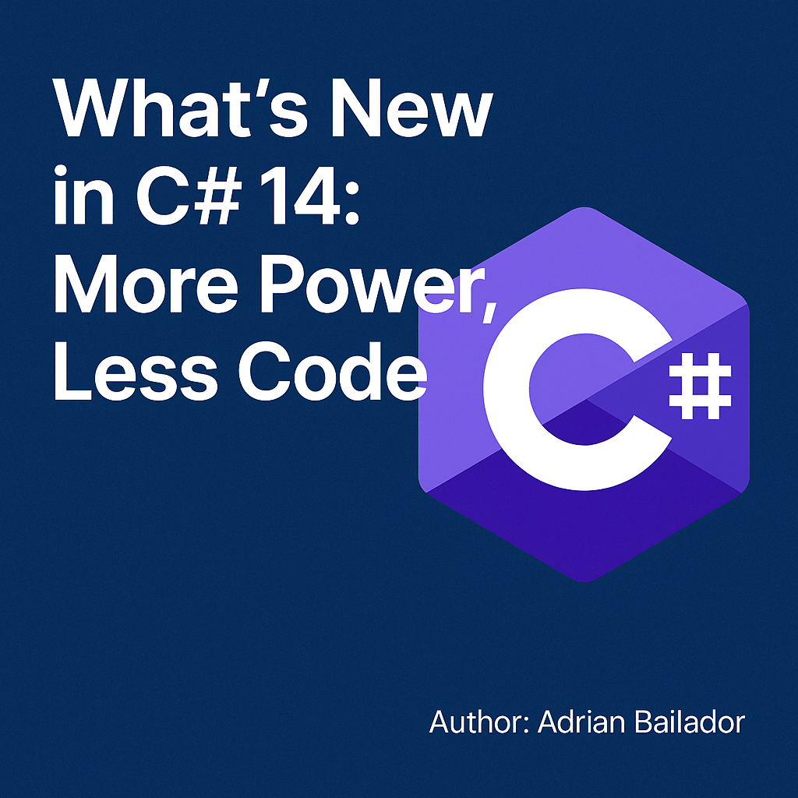

---

## 1. Extension Members: Beyond Extension Methods

C# 14 takes extension methods to the next level. You can now define properties, indexers and more within `extension` blocks, giving you more power to enhance existing types:

```csharp
public static class EnumerableExtensions
{
    extension<T>(IEnumerable<T> source)
    {
        public bool IsEmpty => !source.Any();
        public T this[int index] => source.Skip(index).First();
    }
}
```

This is great for encapsulating reusable logic without touching the original type.

---

## 2. Improved Null-Conditional Assignment

The `??=` operator gets an upgrade – it now works with more complex null-conditional expressions:

```csharp
myObject?.Property ??= defaultValue;
```

A clean and elegant way to assign values only when something is null, without needing if statements.

---

## 3. `nameof` Supports Open Generic Types

You can now get the name of an open generic type using `nameof`:

```csharp
nameof(List<>); // Returns "List"
```

Very handy for logging, code generation, or validation scenarios.

---

## 4. Better Support for `Span<T>` and `ReadOnlySpan<T>`

C# 14 expands implicit conversions between `Span<T>`, `ReadOnlySpan<T>`, and arrays (`T[]`), making high-performance memory operations safer and easier to work with.

---

## 5. Lambdas with Modifiers

Lambdas can now use modifiers like `ref`, `out`, `in` or `scoped` without needing explicit parameter types:

```csharp
TryParse<int> parse = (text, out result) => int.TryParse(text, out result);
```

This is especially useful with APIs that involve references or output parameters.

---

## 6. Accessing Auto-Property Backing Fields with `field`

A subtle but useful feature: you can now access the backing field of an auto-implemented property directly:

```csharp
public string Message
{
    get;
    set => field = value ?? throw new ArgumentNullException(nameof(value));
}
```

This allows you to add validation without having to declare a private field manually.

---

## 7. Partial Constructors and Events

The concept of partial members is expanding — you can now declare **partial constructors** and **partial events**. This is particularly useful in code generation scenarios or when working with partially generated classes.

---
