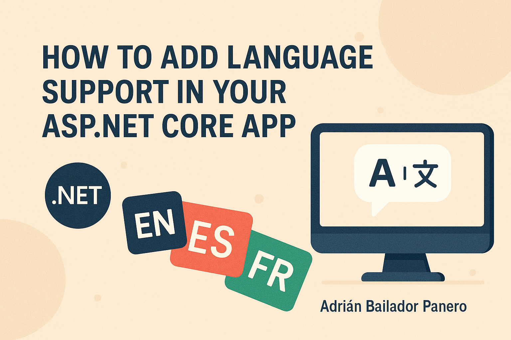

---

title: How to Add Multiple Languages to Your ASP.NET Core Application (Step-by-Step Localization Guide)  
summary: "Learn how to add localization support to your ASP.NET Core application, enabling multiple languages and culture-specific features."  
date: "2025-05-07"  
tags: ["ASP.NET Core", "Localization", "Multi-language", "Globalization", ".NET"]

---



---

# 🌐 How to Add Multiple Languages to Your ASP.NET Core Application (Step-by-Step Localization Guide)

Do you want your ASP.NET Core application to work in multiple languages? In this guide, you will learn how to do it from scratch using the **globalization and localization** features built into .NET.

You will see how to translate texts, validation messages, and allow users to change the language from the interface.

---

## 🧠 What is Localization in .NET?

**Localization** means adapting your application to different languages and cultures. This involves translating:

* Interface texts (e.g., “Hello world” or “Submit”)
* Error and validation messages
* Dates, numbers, currencies, etc.

.NET allows you to organize these translations using special files called **.resx**, and apply them automatically.

---

## ✅ Prerequisites

* Install [.NET 6 or later](https://dotnet.microsoft.com/en-us/download).
* Basic knowledge of ASP.NET Core MVC.
* Visual Studio or VS Code (with the C# extension).

---

## 🏗 Step 1 – Create the Project

Open your terminal or Visual Studio and create a new project:

```bash
dotnet new mvc -n LocalisationDemo
cd LocalisationDemo
````

This project will be a simple web application with multilingual support.

---

## 📦 Step 2 – Configure Localization Services

Open `Program.cs` and add these lines:

```csharp
builder.Services.AddLocalization(options => options.ResourcesPath = "Resources");

builder.Services.AddControllersWithViews()
    .AddViewLocalization()
    .AddDataAnnotationsLocalization();
```

This tells .NET to use resource files (`.resx`) in a folder called `Resources` to manage translations.

---

## 🌍 Step 3 – Support for Multiple Languages

In `Program.cs`, add this configuration:

```csharp
builder.Services.Configure<RequestLocalizationOptions>(options =>
{
    var supportedCultures = new[]
    {
        new CultureInfo("en"),
        new CultureInfo("es"),
        new CultureInfo("fr")
    };

    options.DefaultRequestCulture = new RequestCulture("en");
    options.SupportedCultures = supportedCultures;
    options.SupportedUICultures = supportedCultures;

    // Use cookies to remember the user's selected language
    options.RequestCultureProviders.Insert(0, new CookieRequestCultureProvider());
});
```

Then, activate this configuration before the routing middleware:

```csharp
var locOptions = app.Services.GetRequiredService<IOptions<RequestLocalizationOptions>>();
app.UseRequestLocalization(locOptions.Value);
```

---

## 🗂 Step 4 – Create Translation Files (.resx)

Create a folder called `Resources`.

Inside, create these files:

* `SharedResources.resx` → default (English)
* `SharedResources.es.resx` → Spanish
* `SharedResources.fr.resx` → French

Each file will contain the same keys but with different texts. For example:

### `SharedResources.resx`

```xml
<data name="Greeting">
  <value>Hello World!</value>
</data>
```

### `SharedResources.es.resx`

```xml
<data name="Greeting">
  <value>¡Hola Mundo!</value>
</data>
```

### `SharedResources.fr.resx`

```xml
<data name="Greeting">
  <value>Bonjour le monde!</value>
</data>
```

You can also translate validation messages:

```xml
<data name="RequiredField">
  <value>This field is required.</value>
</data>
```

---

## 📄 Step 5 – Create the SharedResources Class

This class serves as a reference for localization:

```csharp
namespace LocalisationDemo
{
    public class SharedResources
    {
    }
}
```

---

## 👨‍🏫 Step 6 – Use Translated Texts in the Controller

In `HomeController.cs`:

```csharp
private readonly IStringLocalizer<SharedResources> _localizer;

public HomeController(IStringLocalizer<SharedResources> localizer)
{
    _localizer = localizer;
}

public IActionResult Index()
{
    ViewBag.Message = _localizer["Greeting"];
    return View();
}
```

---

## 🌐 Step 7 – Create a Language Selector

In the `Index.cshtml` view:

```cshtml
@using System.Globalization
@{
    var currentCulture = CultureInfo.CurrentUICulture.TwoLetterISOLanguageName;
}

<h1>@ViewBag.Message</h1>

<form method="post" asp-controller="Home" asp-action="SetLanguage">
    <label>Choose language:</label>
    <select name="culture" onchange="this.form.submit()">
        <option value="en" selected="@(currentCulture == "en" ? "selected" : null)">English</option>
        <option value="es" selected="@(currentCulture == "es" ? "selected" : null)">Español</option>
        <option value="fr" selected="@(currentCulture == "fr" ? "selected" : null)">Français</option>
    </select>
</form>
```

And in the controller:

```csharp
[HttpPost]
public IActionResult SetLanguage(string culture)
{
    Response.Cookies.Append(
        CookieRequestCultureProvider.DefaultCookieName,
        CookieRequestCultureProvider.MakeCookieValue(new RequestCulture(culture)),
        new CookieOptions { Expires = DateTimeOffset.UtcNow.AddYears(1) }
    );

    return RedirectToAction("Index");
}
```

This saves the selected language in a **cookie** and keeps the dropdown in sync with the current culture.

---

## 🧪 Step 8 – Translate Validation Messages

Create a model with a validation message:

```csharp
public class DummyModel
{
    [Required(ErrorMessage = "RequiredField")]
    public string Name { get; set; }
}
```

.NET will look for the translation of `"RequiredField"` in the `.resx` files.

---

## 🎉 Final Result

You now have an application that:

✅ Displays translated texts
✅ Changes the language from the interface
✅ Remembers the selected language across sessions
✅ Translates validation messages
✅ Keeps the selected option in the dropdown correctly highlighted

---

## 📎 Useful Resources

* [Official Localization Documentation in ASP.NET Core](https://learn.microsoft.com/en-us/aspnet/core/fundamentals/localization)
* [GitHub](https://github.com/AdrianBailador/LocalisationDemoApp)

---
