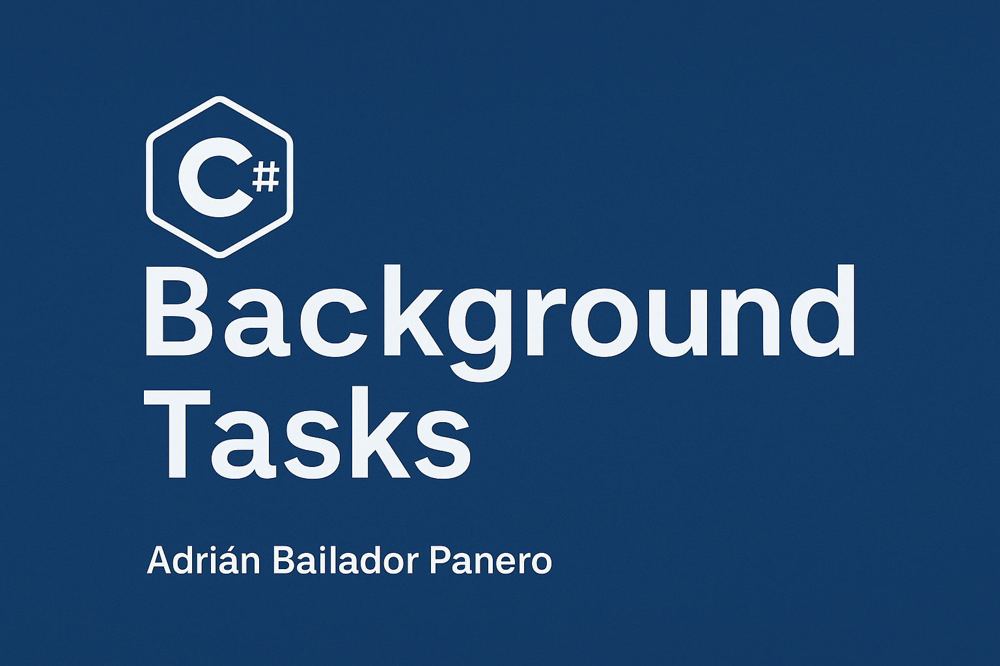

---

title: Background Tasks in C# 🧵
summary: "In modern applications, especially web and desktop apps, executing long-running tasks on the main thread can block user interactions or degrade performance. That’s where background tasks come in."
date: "2025-05-09"
tags: ["ASP.NET Core", "Background Tasks", "Queue", "IHostedService", "Channel", ".NET", "Concurrency", "Scalability"]


---



---

In this article, we’ll explore the different ways to run tasks in the background in C#, including:

* `Task.Run` for simple async operations.
* `BackgroundService` for long-running services in ASP.NET Core.
* `IHostedService` for more controlled services.
* Queued background tasks using `IBackgroundTaskQueue`.

We’ll also provide a working example you can use as a starting point in your projects.

---

### 🧠 Why Use Background Tasks?

Background tasks are useful for:

* Offloading long-running operations (e.g. report generation, image processing).
* Avoiding blocking the main thread in APIs or UI apps.
* Running scheduled or periodic jobs (e.g. sending emails, syncing data).
* Handling async operations in a scalable way.

---

### 🔹 1. Using `Task.Run` for Lightweight Background Work

If you need to run a simple piece of work in the background, `Task.Run` is the quickest way:

```csharp
public async Task ProcessImageAsync(string imagePath)
{
    await Task.Run(() =>
    {
        // Simulate long processing
        Thread.Sleep(2000);
        Console.WriteLine($"Processed image: {imagePath}");
    });
}
```

⚠️ **Note**: Avoid using `Task.Run` for CPU-intensive or long operations in ASP.NET apps—it's better suited for quick, non-blocking tasks.

---

### 🔹 2. Creating a Background Service with `BackgroundService`

For more robust needs, like polling or continuous background work in ASP.NET Core, use `BackgroundService`.

```csharp
public class WorkerService : BackgroundService
{
    private readonly ILogger<WorkerService> _logger;

    public WorkerService(ILogger<WorkerService> logger)
    {
        _logger = logger;
    }

    protected override async Task ExecuteAsync(CancellationToken stoppingToken)
    {
        while (!stoppingToken.IsCancellationRequested)
        {
            _logger.LogInformation("Worker running at: {time}", DateTimeOffset.Now);
            await Task.Delay(5000, stoppingToken);
        }
    }
}
```

Register it in `Program.cs`:

```csharp
builder.Services.AddHostedService<WorkerService>();
```

---

### 🔹 3. Implementing `IHostedService` Manually

If you need more control over lifecycle methods, implement `IHostedService` directly:

```csharp
public class TimedService : IHostedService, IDisposable
{
    private Timer _timer;
    
    public Task StartAsync(CancellationToken cancellationToken)
    {
        _timer = new Timer(DoWork, null, TimeSpan.Zero, TimeSpan.FromSeconds(10));
        return Task.CompletedTask;
    }

    private void DoWork(object state)
    {
        Console.WriteLine($"Work executed at {DateTime.Now}");
    }

    public Task StopAsync(CancellationToken cancellationToken)
    {
        _timer?.Change(Timeout.Infinite, 0);
        return Task.CompletedTask;
    }

    public void Dispose()
    {
        _timer?.Dispose();
    }
}
```

---

### 🔹 4. Queued Background Tasks with Channels

You can create a queue of background tasks using a producer-consumer pattern.

**Interface:**

```csharp
public interface IBackgroundTaskQueue
{
    void Enqueue(Func<CancellationToken, Task> workItem);
    Task<Func<CancellationToken, Task>> DequeueAsync(CancellationToken cancellationToken);
}
```

**Implementation:**

```csharp
public class BackgroundTaskQueue : IBackgroundTaskQueue
{
    private readonly Channel<Func<CancellationToken, Task>> _queue = Channel.CreateUnbounded<Func<CancellationToken, Task>>();

    public void Enqueue(Func<CancellationToken, Task> workItem)
    {
        _queue.Writer.TryWrite(workItem);
    }

    public async Task<Func<CancellationToken, Task>> DequeueAsync(CancellationToken cancellationToken)
    {
        return await _queue.Reader.ReadAsync(cancellationToken);
    }
}
```

**Worker:**

```csharp
public class QueuedHostedService : BackgroundService
{
    private readonly IBackgroundTaskQueue _taskQueue;

    public QueuedHostedService(IBackgroundTaskQueue taskQueue)
    {
        _taskQueue = taskQueue;
    }

    protected override async Task ExecuteAsync(CancellationToken stoppingToken)
    {
        while (!stoppingToken.IsCancellationRequested)
        {
            var workItem = await _taskQueue.DequeueAsync(stoppingToken);
            await workItem(stoppingToken);
        }
    }
}
```

**Register in `Program.cs`:**

```csharp
builder.Services.AddSingleton<IBackgroundTaskQueue, BackgroundTaskQueue>();
builder.Services.AddHostedService<QueuedHostedService>();
```

**Use in API Endpoint:**

```csharp
app.MapPost("/enqueue", (IBackgroundTaskQueue queue) =>
{
    queue.Enqueue(async token =>
    {
        await Task.Delay(3000, token);
        Console.WriteLine("Background task finished.");
    });

    return Results.Ok("Task enqueued.");
});
```

---

### ⚠️ Common Pitfalls

* ❌ **Blocking the thread**: Don’t use `Thread.Sleep` in async methods—use `await Task.Delay`.
* ❌ **Using Task.Run in ASP.NET**: Avoid it in web apps unless absolutely necessary—it uses up valuable thread pool resources.
* ❌ **Forgetting cancellation**: Always respect `CancellationToken` in long-running tasks.

---

### ✅ Best Practices

* Use `BackgroundService` or `IHostedService` for background workers.
* Use dependency injection to manage services within tasks.
* Respect cancellation tokens to allow graceful shutdown.
* Log exceptions in background tasks to avoid silent failures.
* Monitor performance and queue length in production.

---

### 🔗 Useful Links

* [.NET BackgroundService Docs](https://learn.microsoft.com/en-us/dotnet/core/extensions/background-service)
* [Queued Background Tasks in ASP.NET Core](https://learn.microsoft.com/en-us/aspnet/core/fundamentals/host/hosted-services?view=aspnetcore-8.0#queued-background-tasks)
* [Microsoft.Extensions.Hosting NuGet package](https://www.nuget.org/packages/Microsoft.Extensions.Hosting)

---

For the full code and examples, visit my [GitHub repository](https://github.com/AdrianBailador/BackgroundTasksExample).

---


