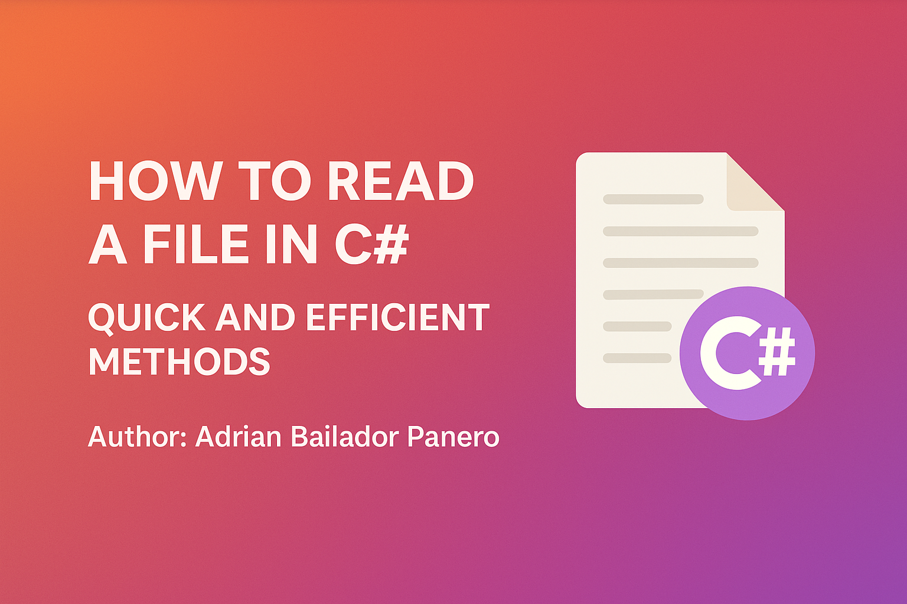

---

## Table of Contents

1. [ReadAllText – The Quickest Way](#1-readalltext-the-quickest-way)
2. [ReadAllLines – Easy Line-by-Line](#2-readalllines-easy-line-by-line)
3. [ReadLines – Best for Large Files](#3-readlines-best-for-large-files)
4. [StreamReader – Full Control](#4-streamreader-full-control)
5. [Asynchronous Reading](#5-asynchronous-reading)
6. [Benchmark Example](#6-benchmark-example)
7. [Encoding Considerations](#7-encoding-considerations)
8. [File Existence Check](#8-file-existence-check)
9. [Comparison Summary](#9-comparison-summary)
10. [GitHub Example](#10-github-example)
11. [Frequently Asked Questions (FAQ)](#11-frequently-asked-questions-faq)

---

## 1. ReadAllText – The Quickest Way

```csharp
string content = File.ReadAllText("example.txt");
Console.WriteLine(content);
````

Best for small files when you need the entire content at once.

---

## 2. ReadAllLines – Easy Line-by-Line

```csharp
string[] lines = File.ReadAllLines("example.txt");
foreach (var line in lines)
{
    Console.WriteLine(line);
}
```

Ideal when processing individual lines but the file size is moderate.

---

## 3. ReadLines – Best for Large Files

```csharp
foreach (var line in File.ReadLines("example.txt"))
{
    Console.WriteLine(line);
}
```

This method uses lazy evaluation, making it memory-efficient for large files.

---

## 4. StreamReader – Full Control

```csharp
using (var reader = new StreamReader("example.txt", Encoding.UTF8))
{
    string? line;
    while ((line = reader.ReadLine()) != null)
    {
        Console.WriteLine(line);
    }
}
```

Use when you need to specify encoding or implement custom logic for each line.

---

## 5. Asynchronous Reading

Reading an entire file asynchronously:

```csharp
string content = await File.ReadAllTextAsync("example.txt");
Console.WriteLine(content);
```

For asynchronous line-by-line reading:

```csharp
await foreach (var line in ReadLinesAsync("example.txt"))
{
    Console.WriteLine(line);
}

async IAsyncEnumerable<string> ReadLinesAsync(string path)
{
    using var reader = new StreamReader(path);
    while (await reader.ReadLineAsync() is { } line)
    {
        yield return line;
    }
}
```

Recommended for GUI applications or web servers where blocking is undesirable.

---

## 6. Benchmark Example

```csharp
var sw = Stopwatch.StartNew();
string content = File.ReadAllText("example.txt");
sw.Stop();
Console.WriteLine($"Elapsed time: {sw.ElapsedMilliseconds} ms");
```

Use similar code to compare different reading methods in your environment.

---

## 7. Encoding Considerations

To specify a particular encoding:

```csharp
string content = File.ReadAllText("example.txt", Encoding.GetEncoding("Windows-1252"));
```

Useful encodings include:

* `Encoding.UTF8` (default)
* `Encoding.Unicode` (UTF-16)
* `Encoding.ASCII`
* `Encoding.GetEncoding("ISO-8859-1")`

---

## 8. File Existence Check

Always check if the file exists to avoid exceptions:

```csharp
if (!File.Exists("example.txt"))
{
    Console.WriteLine("File not found.");
    return;
}
```

---

## 9. Comparison Summary

| Method               | Best For            | Memory Use | Async | Lazy |
| -------------------- | ------------------- | ---------- | ----- | ---- |
| ReadAllText          | Small files         | High       | Yes   | No   |
| ReadAllLines         | Small/medium files  | High       | Yes   | No   |
| ReadLines            | Large files         | Low        | No    | Yes  |
| StreamReader         | Full control        | Medium     | Yes   | Yes  |
| ReadAllTextAsync     | Async + small files | High       | Yes   | No   |
| StreamReader + async | Async + large files | Low        | Yes   | Yes  |

---

## 10. GitHub Example

The full example project will be available at:

[https://github.com/AdrianBailador/FileReadingDemo](https://github.com/AdrianBailador/FileReadingDemo)

---

## 11. Frequently Asked Questions (FAQ)

### What is considered a large file to read into memory?

As a general rule:

* Under 10 MB: Safe for full read
* 10–100 MB: Use with caution
* Over 100 MB: Use streaming (`ReadLines` or `StreamReader`)

### How to read a CSV file in C#?

For simple CSV parsing:

```csharp
foreach (var line in File.ReadLines("data.csv"))
{
    var fields = line.Split(',');
    Console.WriteLine($"Name: {fields[0]}, Age: {fields[1]}");
}
```

For complex CSV files, use a library like [CsvHelper](https://joshclose.github.io/CsvHelper/).

### How to check if a file exists before reading it in C#?

Use `File.Exists`:

```csharp
if (!File.Exists("example.txt"))
{
    Console.WriteLine("The file does not exist.");
    return;
}
```

---

