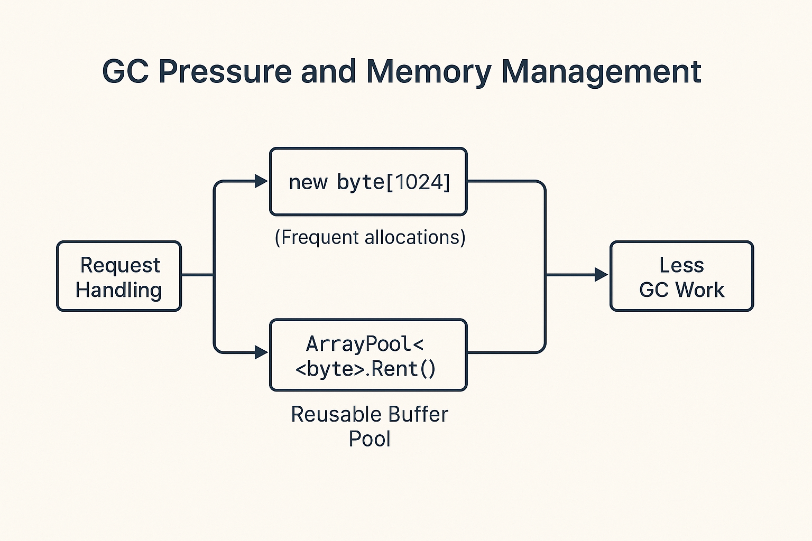

---

In high-performance .NET applications, memory allocation is a double-edged sword. While the Garbage Collector (GC) makes memory management easier, careless or excessive allocations can lead to severe performance issues.

This guide explores how to reduce GC pressure by using efficient memory patterns, including the use of `ArrayPool<T>`, `structs`, and design best practices. You'll also learn how to measure GC impact and avoid common pitfalls.

---

## 🔍 What Is GC Pressure?

GC pressure refers to the load placed on the .NET Garbage Collector due to memory allocations, particularly of short-lived or large objects. If too many objects are created and discarded quickly, or if large allocations occur frequently, the GC is forced to run more often and for longer durations.

This can lead to:

- High CPU usage.
- Application pauses (“stop-the-world” events).
- Latency spikes in APIs and services.
- Increased memory usage due to heap fragmentation.

---

## 🧪 Real-World Example (Fictional)

A fintech company built a high-throughput .NET 8 API that handled thousands of real-time market data events per second. Despite fast endpoints, latency spikes started appearing under load.

Investigation revealed excessive use of `new byte[1024]` buffers on each request. These temporary allocations were quickly discarded but filled up the Gen 0 heap rapidly, triggering frequent GC cycles.

By switching to `ArrayPool<byte>.Shared`, the team reduced GC collections by over 60%, smoothed out latency, and dropped CPU usage by nearly 20%.

---

## 📊 GC-Friendly Coding: Before vs After

| ❌ Inefficient Pattern                  | ✅ Improved Alternative                          |
|----------------------------------------|--------------------------------------------------|
| `new byte[1024]` in every request      | `ArrayPool<byte>.Shared.Rent(1024)`              |
| Frequent short-lived objects           | Object pooling or reuse                          |
| Classes for small, immutable data      | Use `readonly struct`                            |
| LINQ-heavy processing with `ToList()`  | Use `foreach` with lazy enumeration              |
| Capturing variables in lambdas         | Avoid closures in performance-critical paths     |

---

## 🧠 GC Pressure and Memory Management

Visualising the difference between direct allocations and pooled memory:



---

## 🧱 Use Structs (Value Types) When Appropriate

Value types in C# (`structs`) are stored on the stack or inlined within objects, avoiding heap allocation and GC tracking — **as long as they're small and immutable**.

### ✅ When to Use Structs

- You need small, frequently used objects.
- You want to avoid boxing/unboxing.
- You care about CPU cache performance.

### ⚠️ When Not to Use

- The struct is large (e.g. >16 bytes).
- It’s mutated often (immutability is safer).
- It's used polymorphically (structs can’t inherit).

```csharp
public readonly struct Coordinates
{
    public int X { get; }
    public int Y { get; }

    public Coordinates(int x, int y) => (X, Y) = (x, y);
}
````

---

## ♻️ Use `ArrayPool<T>` for Buffer Reuse

Avoid allocating a new array every time. Instead:

```csharp
var pool = ArrayPool<byte>.Shared;
var buffer = pool.Rent(1024);

try
{
    // Use buffer
}
finally
{
    pool.Return(buffer);
}
```

This drastically reduces GC pressure in buffer-heavy operations (web APIs, serialisation, etc.).

---

## 🔥 Avoid Allocations in Hot Paths

Allocating inside tight loops or critical code paths hurts performance.

**Avoid**:

* LINQ + `ToList()` in real-time code
* `string.Concat` in loops
* Closures/lambdas that capture local variables

**Prefer**:

* `foreach`
* `Span<T>` when possible
* Explicit pooling

```csharp
foreach (var item in collection)
{
    Process(item);
}
```

---

## 🧩 Design Patterns That Reduce Allocations

* **Object Pooling**: For expensive objects (parsers, buffers).
* **Flyweight**: Share immutable objects instead of duplicating.
* **Factories**: Centralised creation allows reuse or pooling.

```csharp
ObjectPool<MyParser> pool = new DefaultObjectPool<MyParser>(new MyParserPolicy());

var parser = pool.Get();
try
{
    parser.Parse(data);
}
finally
{
    pool.Return(parser);
}
```

---

## 📏 Measuring GC Pressure

Use [BenchmarkDotNet](https://benchmarkdotnet.org/) or `dotnet-counters` to measure memory usage and GC stats:

```csharp
[MemoryDiagnoser]
public class GCPressureTests
{
    [Benchmark]
    public void WithArrayAllocation()
    {
        var buffer = new byte[1024];
    }

    [Benchmark]
    public void WithArrayPool()
    {
        var pool = ArrayPool<byte>.Shared;
        var buffer = pool.Rent(1024);
        pool.Return(buffer);
    }
}
```

Other tools:

* `dotnet-counters monitor -p <PID>`
* `dotnet-trace`
* `PerfView`

---

## ✅ Conclusion

Reducing GC pressure is not just about micro-optimisations — it’s about **writing efficient, stable software**. With small, deliberate changes (structs, pooling, pattern-based reuse), you can prevent many hidden performance issues.

Mastering memory behaviour in .NET will help you build systems that scale, respond faster, and cost less to run in production.

---

## 🔗 Resources

* [ArrayPool<T> Documentation](https://learn.microsoft.com/en-us/dotnet/api/system.buffers.arraypool-1)
* [BenchmarkDotNet](https://benchmarkdotnet.org/)
* [Understanding .NET GC](https://learn.microsoft.com/en-us/dotnet/standard/garbage-collection/)
* [Performance Best Practices in .NET](https://learn.microsoft.com/en-us/dotnet/core/performance/)
* [GitHub Code Examples](https://github.com/AdrianBailador/GCPressureDemo/tree/main)


---

