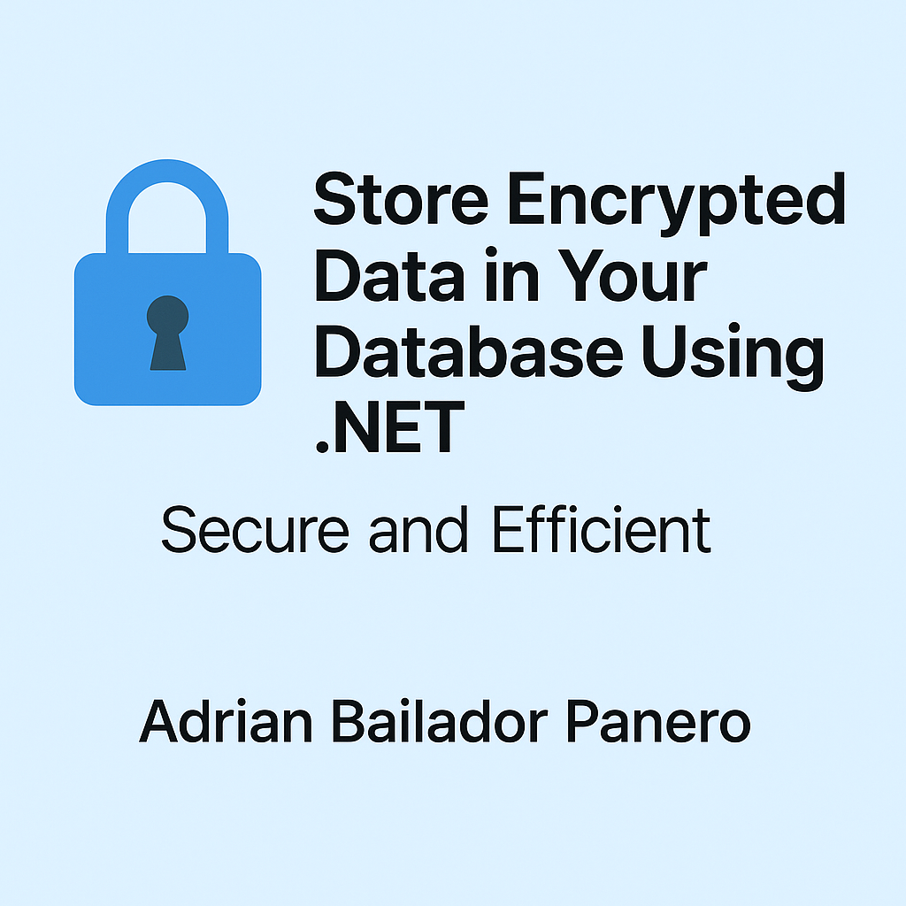

---

In this article, we’ll explore how to **store encrypted data** in a database using **.NET**, with a strong focus on **security** and **efficiency**.

---

## Why Encrypt Data in the Database?

Even if your database is protected, if someone gains direct access and your data is stored in plain text, the impact can be immediate and severe.

Encryption helps you:

* Avoid direct exposure of critical information.
* Add an extra layer of defence against unauthorised access.
* Comply with regulations like **GDPR** or **HIPAA**.

---

## Our Approach: Application-Level Encryption

Encryption can be implemented at the database, OS, or application level. We’ll use the **application layer** in .NET, as it provides flexibility, portability, and full control over keys and algorithms.

---

## Implementation with Improvements

We’ll use:

* The `Aes` symmetric encryption algorithm.
* Key and IV loaded from `appsettings.json`.
* EF Core `ValueConverter` to automate encryption/decryption.
* A ready-to-run example project for GitHub.

---

Lo ideal es añadir el apartado de claves de producción justo **después del bloque de configuración `appsettings.json` y antes de la clase `EncryptionHelper`**, para que quede claro cómo se cargan las claves y cuál es la recomendación para entornos reales. Así el flujo del artículo queda ordenado y lógico.

Te dejo la ubicación exacta con el contenido añadido:

---

## 1. Configuration in `appsettings.json`

```json
{
  "Encryption": {
    "Key": "g+Rdsg8J8ULr3kKkA1X6lqXH4Bb2+3oOHHGWDWkT1nc=", // base64 for 32 bytes
    "IV": "8H9KaNm8fjfGm+q3Nef2QA==" // base64 for 16 bytes
  }
}
```

---

## 🔐 Secure Key Management in Production

For this example, we use `appsettings.json` to store the encryption key and IV for simplicity. However, **in real production environments, you should never store sensitive keys directly in configuration files or source code**.

Recommended secure options include:

* **Azure Key Vault**: Managed encryption keys with automatic rotation and access control.
* **AWS Secrets Manager**: Secure secrets storage integrated with IAM and audit logging.
* **Environment Variables**: Easy to configure on local machines and CI/CD pipelines without exposing secrets in the repository.
* **User Secrets (for development only)**: Keeps secrets out of your source code during development.

Example of loading keys from environment variables:

```csharp
_key = Convert.FromBase64String(Environment.GetEnvironmentVariable("ENCRYPTION_KEY")!);
_iv = Convert.FromBase64String(Environment.GetEnvironmentVariable("ENCRYPTION_IV")!);
```

> Always ensure secrets are excluded from source control and your deployment environment is properly configured to provide these values securely.

---


## 2. Encryption Helper Class

```csharp
using System.Security.Cryptography;
using System.Text;

public class EncryptionHelper
{
    private readonly byte[] _key;
    private readonly byte[] _iv;

    public EncryptionHelper(IConfiguration config)
    {
        _key = Convert.FromBase64String(config["Encryption:Key"]!);
        _iv = Convert.FromBase64String(config["Encryption:IV"]!);
    }

    public string Encrypt(string plainText)
    {
        using var aes = Aes.Create();
        aes.Key = _key;
        aes.IV = _iv;

        using var encryptor = aes.CreateEncryptor();
        using var ms = new MemoryStream();
        using (var cs = new CryptoStream(ms, encryptor, CryptoStreamMode.Write))
        using (var writer = new StreamWriter(cs))
        {
            writer.Write(plainText);
        }

        return Convert.ToBase64String(ms.ToArray());
    }

    public string Decrypt(string cipherText)
    {
        var buffer = Convert.FromBase64String(cipherText);

        using var aes = Aes.Create();
        aes.Key = _key;
        aes.IV = _iv;

        using var decryptor = aes.CreateDecryptor();
        using var ms = new MemoryStream(buffer);
        using var cs = new CryptoStream(ms, decryptor, CryptoStreamMode.Read);
        using var reader = new StreamReader(cs);

        return reader.ReadToEnd();
    }
}
```

---

## 3. Entity and ValueConverter

```csharp
public class User
{
    public int Id { get; set; }
    public string Name { get; set; } = default!;
    public string SSN { get; set; } = default!;
}
```

```csharp
public class AppDbContext : DbContext
{
    private readonly EncryptionHelper _encryption;

    public AppDbContext(DbContextOptions<AppDbContext> options, EncryptionHelper encryption) : base(options)
    {
        _encryption = encryption;
    }

    public DbSet<User> Users => Set<User>();

    protected override void OnModelCreating(ModelBuilder modelBuilder)
    {
        var ssnConverter = new ValueConverter<string, string>(
            v => _encryption.Encrypt(v),
            v => _encryption.Decrypt(v)
        );

        modelBuilder.Entity<User>()
            .Property(u => u.SSN)
            .HasConversion(ssnConverter);
    }
}
```

---

## 4. Dependency Injection

```csharp
builder.Services.AddSingleton<EncryptionHelper>();
builder.Services.AddDbContext<AppDbContext>(options =>
    options.UseSqlite("Data Source=encrypted.db"));
```

---

## 5. Controller Usage

```csharp
[ApiController]
[Route("api/users")]
public class UsersController : ControllerBase
{
    private readonly AppDbContext _context;

    public UsersController(AppDbContext context)
    {
        _context = context;
    }

    [HttpPost]
    public async Task<IActionResult> Post(User user)
    {
        _context.Users.Add(user);
        await _context.SaveChangesAsync();
        return Ok(user);
    }

    [HttpGet]
    public async Task<IEnumerable<User>> Get() => await _context.Users.ToListAsync();
}
```

---

## 6. Result

The `SSN` property is stored encrypted in the database, yet used within the app as if it were plain text. Thanks to the `ValueConverter`, this process is entirely automatic and efficient.

---

## GitHub Example

You can clone or fork the complete working project:

🔗 [https://github.com/AdrianBailador/EncryptedData](https://github.com/AdrianBailador/EncryptedData)

---

## Final Thoughts

Protecting sensitive data doesn’t have to be difficult. With the tools .NET provides, you can implement robust encryption with minimal code — securely and efficiently. This approach is scalable and ideal for fields such as emails, tokens, addresses, and more.

🔐 **Reminder**: When storing passwords, always use **hashing** with `PBKDF2`, `BCrypt`, or `Argon2`, not reversible encryption.

---


