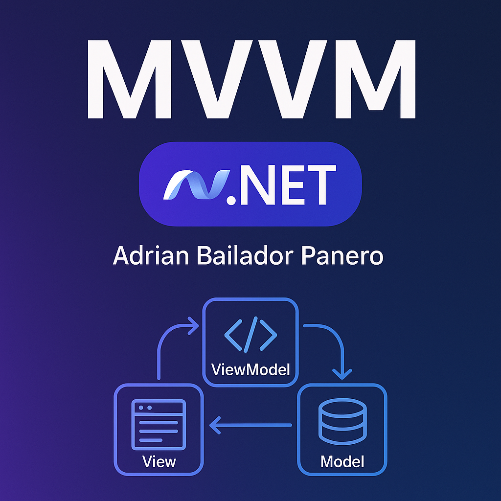

---


## 🧠 What is MVVM?

MVVM is based on three main components:

- **Model** – Represents data and business logic.
- **View** – The user interface layer.
- **ViewModel** – Acts as a mediator between the View and the Model, exposing properties, commands, and state.

Each component has a clear role, helping reduce coupling and making the application easier to maintain and test.

---

## 🔧 Example Implementation in WPF

Let's walk through a simple WPF application using MVVM and [CommunityToolkit.Mvvm](https://learn.microsoft.com/en-us/dotnet/communitytoolkit/mvvm/).

### 1. The Model

```csharp
public class User
{
    public string Name { get; set; }
    public int Age { get; set; }
}
```

⸻

2. The ViewModel

We’ll use [ObservableProperty] and [RelayCommand] from CommunityToolkit.

```csharp
using CommunityToolkit.Mvvm.ComponentModel;
using CommunityToolkit.Mvvm.Input;

public partial class UserViewModel : ObservableObject
{
    [ObservableProperty]
    private string name;

    [ObservableProperty]
    private int age;

    [RelayCommand]
    private void IncrementAge()
    {
        Age++;
    }
}
```

⸻

3. The View (XAML)

```csharp
<Window x:Class="MVVMExample.MainWindow"
        xmlns="http://schemas.microsoft.com/winfx/2006/xaml/presentation"
        xmlns:d="http://schemas.microsoft.com/expression/blend/2008"
        xmlns:local="clr-namespace:MVVMExample"
        xmlns:vm="clr-namespace:MVVMExample.ViewModels"
        xmlns:x="http://schemas.microsoft.com/winfx/2006/xaml"
        Title="MVVM Example" Height="200" Width="400">

    <Window.DataContext>
        <vm:UserViewModel />
    </Window.DataContext>

    <StackPanel Margin="20">
        <TextBox Text="{Binding Name, UpdateSourceTrigger=PropertyChanged}" />
        <TextBlock Text="{Binding Age}" Margin="0,10,0,0"/>
        <Button Content="Increase Age" Command="{Binding IncrementAgeCommand}" />
    </StackPanel>
</Window>

```
⸻

🧩 MVVM Diagram


⸻

✅ Benefits of MVVM

| Benefit                | Description                                                     |
| ---------------------- | --------------------------------------------------------------- |
| Separation of concerns | UI logic and data are clearly separated.                        |
| Testability            | ViewModels can be unit tested without the UI.                   |
| Scalability            | Well-suited for larger apps with many views.                    |
| Tooling support        | Strong Visual Studio support for bindings and design-time data. |


⸻

❌ Drawbacks of MVVM

| Drawback                | Description                                                        |
| ----------------------- | ------------------------------------------------------------------ |
| Learning curve          | Can be complex for beginners or small projects.                    |
| Boilerplate code        | Without helpers like `CommunityToolkit.Mvvm`, code can be verbose. |
| Overkill for small apps | Not ideal for simple or one-off apps.                              |


⸻

💡 Best Practices for Clean MVVM

	•	Use CommunityToolkit.Mvvm to reduce boilerplate.
	•	Keep ViewModels free of direct UI calls (no MessageBox.Show()).
	•	Use ICommand and bind actions properly.
	•	Respect the Single Responsibility Principle in your ViewModels.


⸻

🔚 Conclusion

MVVM helps structure your .NET applications in a clean and scalable way. Thanks to tooling like CommunityToolkit.Mvvm, you can simplify much of the boilerplate and focus on writing clear, testable code. Whether you’re building desktop or cross-platform apps, MVVM remains a strong architectural foundation.

⸻

