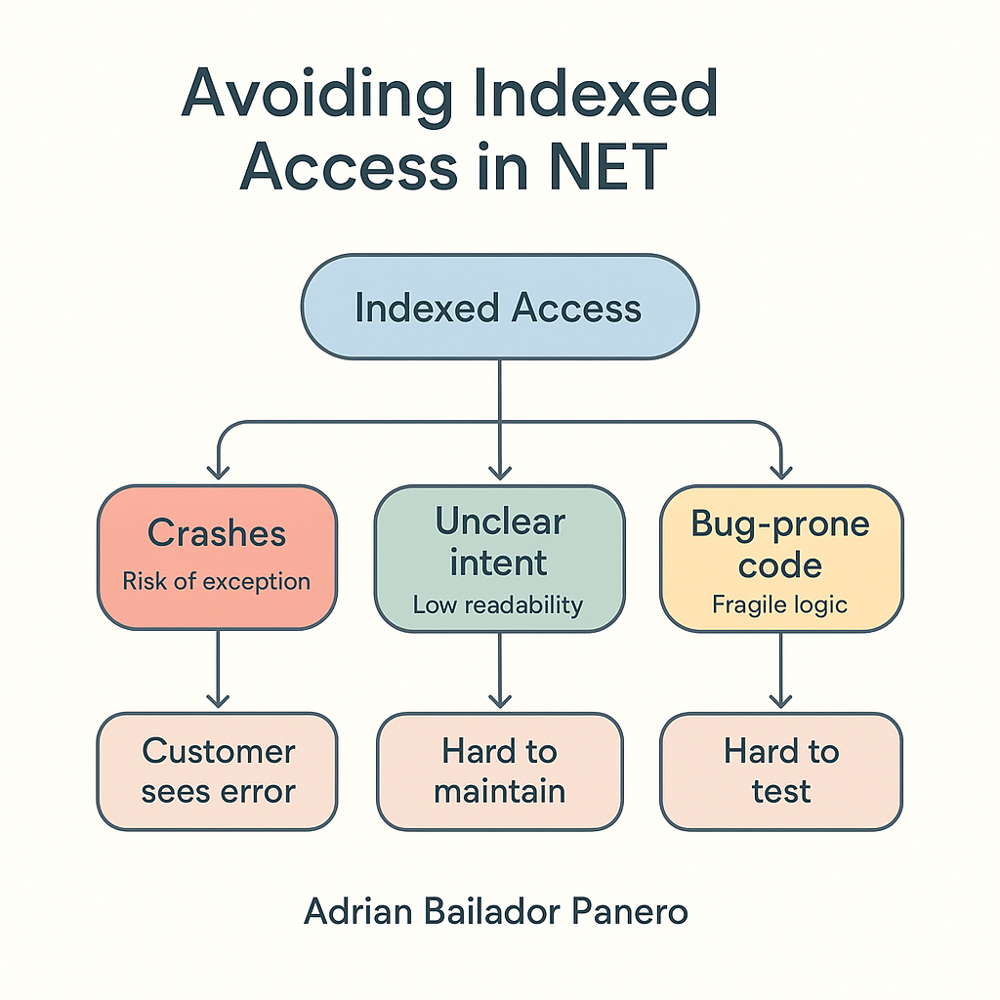

---


Accessing elements by index is a common pattern in .NET, especially when working with arrays or lists. However, when used carelessly in production code, it can lead to runtime exceptions, fragile logic, and poor readability. This article explores why avoiding direct indexed access can lead to safer and more maintainable .NET applications, and what alternatives you can use instead.

---

## A Real-World Scenario

"Our dropdown list broke in production. Customers couldn’t select the default option, and support tickets flooded in. The reason? A developer accessed `options[2]`, assuming the third item was always the default. It wasn’t anymore."

Indexed access seems simple—until real data or UI changes prove it fragile.

---

## Why Indexed Access Can Be Dangerous

### 1. Risk of Runtime Exceptions

Accessing elements without validating the index can result in `IndexOutOfRangeException` or `ArgumentOutOfRangeException`.

```csharp
var items = new List<string>();
var first = items[0]; // Throws an exception if the list is empty
```

### 2. Fragile Logic Based on Implicit Assumptions

When you use an index, you assume a fixed order or a guaranteed number of elements, which can easily change over time.

### 3. Poor Readability and Intent

An access like `orders[3]` doesn't convey the purpose of that element. What is at index 3? Why 3?

---

## Safer and More Expressive Alternatives

### Use LINQ Methods

```csharp
var customer = customers.FirstOrDefault(c => c.Id == targetId);
```

This is safer and more expressive than using an index if the position is not guaranteed.

### Use `ElementAtOrDefault`

```csharp
var item = items.ElementAtOrDefault(2);
```

This avoids exceptions and returns `default(T)` if the index is out of range.

### Validate Index If Absolutely Necessary

```csharp
if (items.Count > 2)
{
    var safeItem = items[2];
}
```

Still fragile, but safer than blind access.

### Prefer `foreach` Over Indexed `for`

```csharp
foreach (var item in items)
{
    Process(item);
}
```

This avoids issues with incorrect bounds and improves readability.

### Encapsulate Indexed Logic

```csharp
public Customer GetPreferredCustomer() => customers.FirstOrDefault(c => c.IsPreferred);
```

Encapsulation makes your code more expressive and less error-prone.

---

## When Indexed Access is Justified

There are valid cases where indexed access is efficient and appropriate:

* Performance-critical code (e.g., numerical algorithms, processing large datasets)
* Accessing arrays or spans in tight loops
* You’ve already validated the range
* Working with `Span<T>` or `Memory<T>` where bounds are controlled

Example:

```csharp
Span<byte> buffer = stackalloc byte[1024];
for (int i = 0; i < buffer.Length; i++)
{
    buffer[i] = 0xFF;
}
```

---

## Benchmarks: Index vs Safer Alternatives

Using [BenchmarkDotNet](https://benchmarkdotnet.org/), we compared indexed access and LINQ methods. Benchmarks were executed using .NET 8 in Release mode on a Windows x64 environment.

```csharp
[Benchmark]
public string Indexed() => items[3];

[Benchmark]
public string ElementAt() => items.ElementAt(3);

[Benchmark]
public string FirstOrDefault() => items.FirstOrDefault(x => x == "target");
```

### Results (simplified example)

* `items[3]`: **0.5 ns**
* `ElementAt(3)`: **5.1 ns**
* `FirstOrDefault`: **15.3 ns**

**Conclusion:** Direct access is faster—but in most business applications, safety and clarity outweigh nanosecond-level gains.

---

## Real-World Example: Fragile UI Logic

```csharp
// Bad: assumes fixed order in a dropdown
var selected = options[2];

// Better:
var selected = options.FirstOrDefault(o => o.IsDefault);
```

Using index assumes `options` will never change order—a risky bet in production.

---

## Visual Summary




---

## Conclusion

Avoiding direct indexed access in .NET improves your code’s safety, readability, and maintainability. While it has its place in performance-critical or algorithm-heavy code, most business applications benefit more from expressive and validated alternatives.


