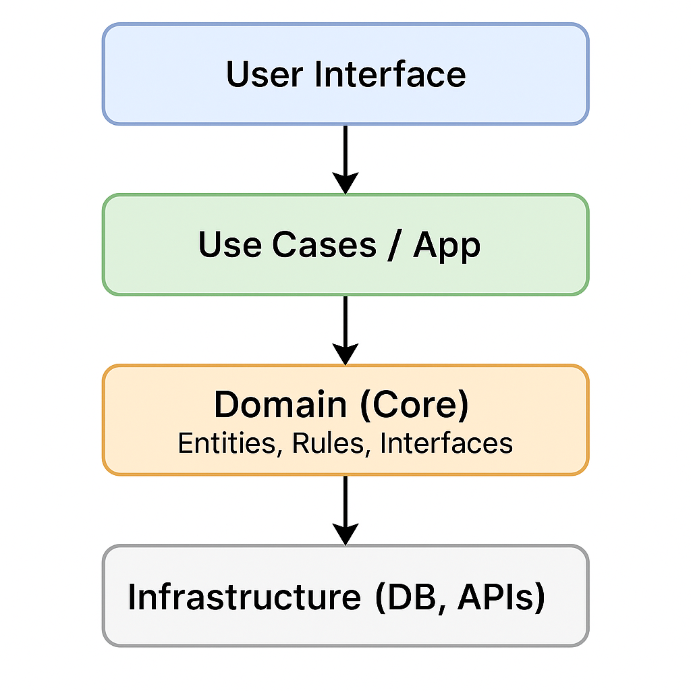

---


---


# Core-Driven Architecture: Master Your Domain

> A practical and in-depth guide to structuring business-logic-centred applications.

---

## 🧠 What is Core-Driven Architecture?

**Core-Driven Architecture** is based on a fundamental idea: **the heart of the system must be the business domain**, completely isolated from technologies, frameworks, or infrastructure. This structure promotes software that is more **maintainable, scalable, and testable**.

Inspired by approaches such as **Clean Architecture**, **Onion**, and **Hexagonal**, this architecture seeks a balance between solid principles and real-world applicability. Its purpose is to keep the core logic clean and protected from external changes.

---

## 🧩 Separation of Responsibilities

The architecture is divided into well-defined layers. Below, each layer is explained with examples and notes on its role.

---

### 1️⃣ Application Entry Point

> Orchestrates and composes, contains no business logic.

```csharp
// Program.cs - Entry point
var builder = WebApplication.CreateBuilder(args);

builder.Services.AddScoped<ICreateOrderUseCase, CreateOrderUseCase>();
builder.Services.AddScoped<IOrderRepository, SqlOrderRepository>();

var app = builder.Build();

app.MapPost("/orders", async (CreateOrderDto dto, ICreateOrderUseCase useCase) =>
{
    await useCase.Execute(dto);
    return Results.Ok();
});

app.Run();
```

---

### 2️⃣ Use Case Layer

> Contains application logic that orchestrates domain entities.

```csharp
// Application Layer - Core

public interface ICreateOrderUseCase
{
    Task Execute(CreateOrderDto dto);
}

public class CreateOrderUseCase : ICreateOrderUseCase
{
    private readonly IOrderRepository _repo;

    public CreateOrderUseCase(IOrderRepository repo) => _repo = repo;

    public async Task Execute(CreateOrderDto dto)
    {
        var order = Order.Create(dto.ClientId, dto.Products);
        await _repo.Save(order);
    }
}
```

---

### 3️⃣ External Elements (Infrastructure)

> Adapters such as databases, external APIs, frameworks.

```csharp
// Infrastructure Layer - Persistence adapter

public class SqlOrderRepository : IOrderRepository
{
    private readonly AppDbContext _context;

    public SqlOrderRepository(AppDbContext context) => _context = context;

    public async Task Save(Order order)
    {
        _context.Orders.Add(order);
        await _context.SaveChangesAsync();
    }
}
```

---

## 🧷 Dependency Inversion

The **domain must not depend on technical implementations**, only on interfaces. This is solved by injecting dependencies during app startup, as shown earlier (`Program.cs`).

---

## 🆚 Comparison with Other Architectures

| Architecture            | Domain Independence | Use Case Oriented | Complexity | Ideal for…                |
| ----------------------- | ------------------- | ----------------- | ---------- | ------------------------- |
| **Core-Driven**         | ✅ High              | ✅ Explicit        | ⚠️ Medium  | Evolving systems          |
| **Clean Architecture**  | ✅ Very High         | ✅ Very structured | ⚠️ High    | Experienced teams         |
| **Hexagonal**           | ✅ High              | ⚠️ Variable       | ⚠️ Medium  | Complex integrations      |
| **Traditional Layered** | ❌ Low               | ❌ Implicit        | ✅ Low      | Quick MVPs or legacy apps |

---

## 🛠️ How to Migrate Towards Core-Driven?

> Migration doesn’t have to be total or immediate. It can be done module by module.

1. **Identify** scattered business logic (in controllers, services).
2. **Extract entities and rules** into a `Core` project.
3. **Create interfaces** in the Core for external services.
4. **Orchestrate use cases** from a new application layer.
5. **Relocate infrastructure** to external projects.
6. **Adjust the entry point** to inject dependencies properly.

---

## 🧱 Conceptual Diagram



---

## 🧪 Effective Testing in Core-Driven

One of the great advantages: **you can test without external dependencies**.

### ✅ Domain Test

```csharp
[Fact]
public void CreateOrder_Succeeds()
{
    var order = Order.Create("client123", new[] { "product1", "product2" });

    Assert.NotNull(order);
    Assert.Equal(2, order.Products.Count);
}
```

### ✅ Use Case Test with Mock

```csharp
[Fact]
public async Task Execute_CallsRepository()
{
    var repo = new Mock<IOrderRepository>();
    var useCase = new CreateOrderUseCase(repo.Object);

    await useCase.Execute(new CreateOrderDto { ClientId = "123", Products = new[] { "p1" } });

    repo.Verify(r => r.Save(It.IsAny<Order>()), Times.Once);
}
```

---

## ⚠️ Important Considerations

While powerful, this architecture isn’t for every context:

* **Learning curve**: It can be challenging for junior teams.
* **Structural overhead**: More files and layers to maintain.
* **Initial development time**: Not ideal for MVPs or quick prototypes.
* **Architectural discipline**: If layer separation breaks, the value is lost.

---

## ❓ FAQs and Common Mistakes

### ❓ Can I use Entity Framework inside the Core?

No. You must use interfaces like `IOrderRepository`, leaving EF to the infrastructure adapter.

---

### ❓ When is Core-Driven worth using?

When your system has complex logic, grows fast, or requires high maintainability. For simple, short-lived CRUD apps, it may be overkill.

---

### ⚠️ Common mistake: Coupling Core to infrastructure

Do not use `DbContext`, `HttpClient`, or EF classes inside the Core. That breaks independence.

---

### ⚠️ Common mistake: Putting business logic in controllers

Controllers should orchestrate, not decide. Delegate logic to use cases.

---

## 🏁 Conclusion

Core-Driven Architecture forces you to think **business first, technology second**. This allows you to build applications that:

* Scale better
* Adapt more easily to change
* Are easier to test
* Stay clean over time

It’s not the fastest architecture to implement, but one of the most **resilient to change**. If your system needs to live for many years, it’s a great technical investment.

---


