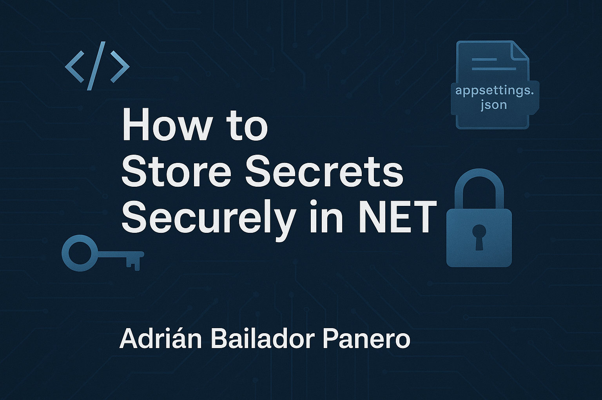

---

# 🔐 How to Store Secrets Securely in .NET

When building .NET applications, you’ll often need to handle secrets like API keys, connection strings, or credentials. Storing these securely is essential to prevent accidental exposure or security breaches.

In this guide, we’ll explore the main methods for managing secrets in .NET:

- Configuration sources in .NET
- When to use each method
- Security best practices
- Practical examples using `IOptions<T>`
- Managing secrets across environments (Dev, QA, Prod)

---

## 📁 1. `appsettings.json`

Best suited for general, **non-sensitive** configuration.

```json
{
  "ApiSettings": {
    "BaseUrl": "https://api.mysite.com",
    "Timeout": 30
  }
}
````

Access with:

```csharp
var timeout = configuration["ApiSettings:Timeout"];
```

Or using `IOptions<T>` for cleaner code:

```csharp
public class ApiSettings
{
    public string BaseUrl { get; set; }
    public int Timeout { get; set; }
}
```

In `Program.cs`:

```csharp
builder.Services.Configure<ApiSettings>(
    builder.Configuration.GetSection("ApiSettings"));
```

Then inject:

```csharp
public class MyService
{
    private readonly ApiSettings _apiSettings;

    public MyService(IOptions<ApiSettings> options)
    {
        _apiSettings = options.Value;
    }

    public void CallApi()
    {
        var url = _apiSettings.BaseUrl;
        var timeout = _apiSettings.Timeout;
        // Use them
    }
}
```

---

## 🧑‍💻 2. User Secrets (Development Only)

Ideal for local development without hardcoding credentials.

1. Add a `UserSecretsId` to your `.csproj`:

```xml
<PropertyGroup>
  <UserSecretsId>your-app-guid</UserSecretsId>
</PropertyGroup>
```

2. Set a secret:

```bash
dotnet user-secrets set "ApiSettings:ApiKey" "super-secret"
```

> Stored safely in OS-specific locations.

---

## 🌍 3. Environment Variables

Best for production and CI/CD pipelines.

```bash
export ApiSettings__ApiKey="prod-secret-key"
```

.NET reads these automatically. The `__` maps to nested keys.

---

## ☁️ 4. Azure Key Vault

Enterprise-grade storage with encryption and access controls.

Add the package:

```bash
dotnet add package Azure.Extensions.AspNetCore.Configuration.Secrets
```

Then:

```csharp
builder.Configuration.AddAzureKeyVault(
    new Uri("https://myvault.vault.azure.net/"),
    new DefaultAzureCredential()
);
```

Use Managed Identity for secure access.

---

## 🌐 5. Environment-Specific Config Files

.NET supports loading config per environment:

* `appsettings.json`
* `appsettings.Development.json`
* `appsettings.Production.json`

Set the environment:

```bash
export ASPNETCORE_ENVIRONMENT=Development
```

.NET merges them automatically.

---

## 📊 Configuration Precedence

From lowest to highest priority:

1. `appsettings.json`
2. `appsettings.{Env}.json`
3. User Secrets
4. Environment Variables
5. Command-line arguments
6. Hardcoded values

---

## ✅ Best Practices

* Use `IOptions<T>` for maintainability
* Never commit secrets
* Use environment variables or Key Vault for production
* Add `secrets.json` to `.gitignore`
* Leverage `ASPNETCORE_ENVIRONMENT`
* Consider Vaults or secret managers for scale

---

## 📚 References

* [User Secrets – Microsoft Docs](https://learn.microsoft.com/aspnet/core/security/app-secrets)
* [Azure Key Vault](https://learn.microsoft.com/azure/key-vault/general/)
* [Options Pattern in ASP.NET Core](https://learn.microsoft.com/aspnet/core/fundamentals/configuration/options)

---

## 🏁 Conclusion

| Scenario       | Recommended Method         |
| -------------- | -------------------------- |
| Local Dev      | User Secrets               |
| CI/CD or QA    | Environment Variables      |
| Production     | Env Vars + Azure Key Vault |
| General config | AppSettings + IOptions<T>  |

Use the right tool in the right context to avoid leaks and ensure your app is robust and secure.

---

