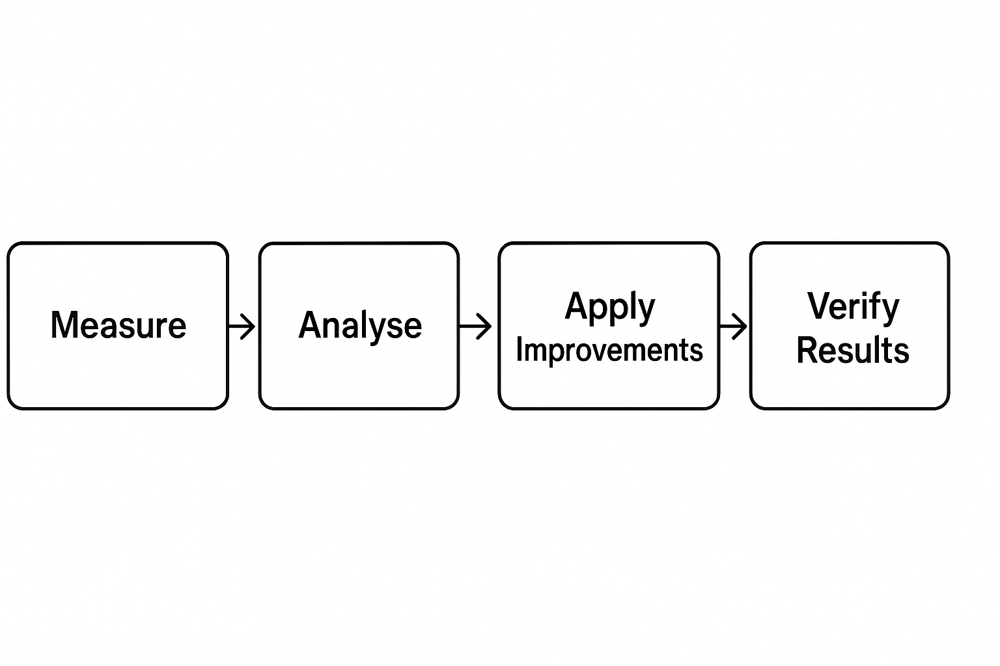

---

# How to Measure and Improve Performance in .NET

A practical guide to diagnosing and optimising .NET applications in real-world environments.

---

## Introduction

Performance is not an afterthought — it is a necessity. As .NET applications evolve and gain new features, efficiency often degrades, affecting user experience and operational costs.

This article covers:

* What to measure in .NET and why
* Tools for diagnosing bottlenecks
* Patterns and best practices for boosting performance
* Common anti-patterns to avoid

---

## The Diagnosis Workflow

Before making changes, follow a structured approach:




---

## What to Measure in .NET

Focus on metrics that matter:

1. **Response Time** for key operations (API endpoints, critical commands)
2. **Memory Usage and GC** (particularly for long-running services)
3. **CPU Usage** (saturated threads, overused parallelism)
4. **Database and External Service Latency**
5. **Throughput** (requests per second)

---

## Tools for Measuring

* **dotnet-counters**:
  `dotnet-counters monitor -p <PID>`

* **dotnet-trace**:
  `dotnet-trace collect -p <PID> --providers Microsoft-DotNETCore-SampleProfiler`

* **BenchmarkDotNet** (for measuring critical methods):

  ```csharp
  [MemoryDiagnoser]
  public class MyBenchmark
  {
      [Benchmark]
      public void DoWork() => /* logic */;
  }
  ```

* **Application Insights / OpenTelemetry**: Enables end-to-end visibility in production environments.

* **PerfView**: Advanced tool for diagnosing CPU hotspots and GC pressure.

---

## What to Improve in .NET

### 1. Avoid Unnecessary Allocations

Replace `List<T>` with `Span<T>` when processing intensive sequences.
Use `StringBuilder` for concatenation in critical loops.

**Before:**

```csharp
string result = "";  
foreach (var item in items) result += item.ToString();
```

**After:**

```csharp
var sb = new StringBuilder();
foreach (var item in items) sb.Append(item);
string result = sb.ToString();
```

---

### 2. Choose the Right Data Structures

Use `Dictionary` for frequent lookups and `ArrayPool<T>` for temporary buffers.

---

### 3. Reduce Blocking I/O Operations

Switch blocking calls to asynchronous versions and cache frequently used data to reduce external requests.

---

### 4. Profile to Eliminate Hotspots

Use profiling tools to detect:

* Methods with long execution times
* Unindexed database queries
* Expensive serialisation and deserialisation

---

### 5. Evaluate External Dependencies

Review REST calls and external requests. Can any be replaced by caching or in-memory storage? Can their frequency be reduced?

---

## Common Anti-Patterns

* Premature optimisation — measure first, then optimise.
* Excessive caching — can cause inconsistencies and waste memory.
* Profiling in production environments — may degrade performance if done carelessly.

---

## Case Study

An e‑commerce application suffered rising response times when load increased from 100 to 1,000 requests per second. Diagnosis revealed:

* Costly JSON serialisation
* Unindexed database queries

After applying:

* Serialisation improvements using `System.Text.Json`
* Adding database indexes

Results:

* Average response times dropped from 450 ms to 130 ms (71%)
* Reduced GC pressure

---

## General Best Practices

* Always measure first — don’t guess.
* Change one variable at a time to measure its impact.
* Maintain performance test coverage to spot regressions.

---

## References for Further Reading

* [.NET Profiling Tools (Microsoft)](https://learn.microsoft.com/dotnet/core/diagnostics/)
* [BenchmarkDotNet Documentation](https://benchmarkdotnet.org/)
* [System.Text.Json Best Practices](https://learn.microsoft.com/dotnet/standard/serialization/system-text-json-overview)

---

## Conclusion

Measuring and improving performance in .NET is about applying a method, using the right tools, and following best practices. By focusing on actionable improvements and verifying their results, you can build .NET applications that are faster, more predictable, and more resilient.

---
