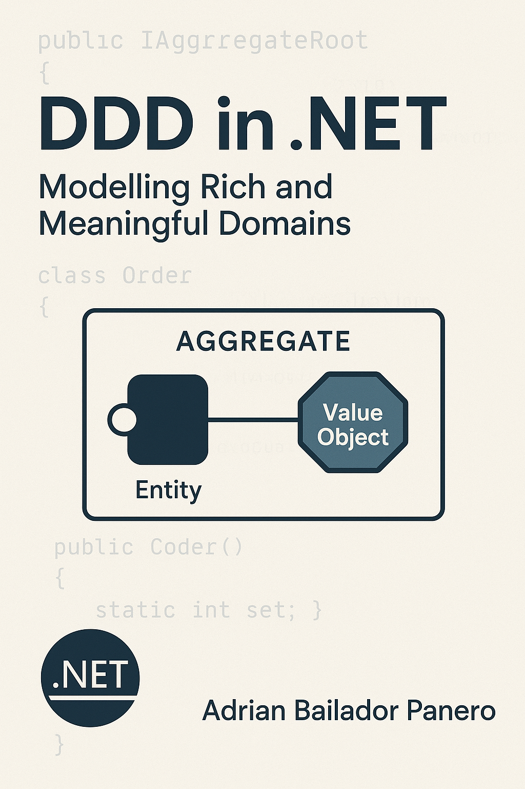

---

title: "DDD in .NET: Modelling Rich and Meaningful Domains"
summary: "Learn how to apply Domain-Driven Design in .NET to create expressive, maintainable, and business-focused domain models. Includes practical examples with Value Objects, Aggregates, Repositories, and tests."
date: "2025-06-28"
tags: [".NET", "DDD", "Architecture", "Software Design", "Clean Code", "Domain-Driven Design"]
---



Domain-Driven Design (DDD) is a software design strategy that focuses on the core of an application: its **domain model**. By explicitly separating "what the system does" from "how it does it", DDD enables maintainable, evolving solutions that align with the business.

This article explains how to apply DDD in .NET with practical examples and clear advice for modelling rich and coherent domains.

---

## ⚖️ DDD Principles Applied in .NET

1. **Model with meaning**: domain classes should represent business concepts, not just technical structures.
2. **Ubiquitous language**: names must reflect the vocabulary of domain experts.
3. **Domain isolation**: business logic should live in its own layer, free from framework or database dependencies.

---

## 🤝 Value Objects: Data defined by their value

```csharp
public record Email
{
    public string Value { get; }

    public Email(string value)
    {
        if (!Regex.IsMatch(value, @"^[^@]+@[^@]+\\.[^@]+$"))
            throw new ArgumentException("Invalid email", nameof(value));

        Value = value;
    }

    public override string ToString() => Value;
}
```

This Value Object encapsulates validation and meaning. It doesn’t need an ID, as two instances with the same value are considered equal.

---

## 🏛️ Aggregates: Grouping consistency and rules

```csharp
public class Order
{
    private readonly List<OrderItem> _items = new();

    public Guid Id { get; private set; } = Guid.NewGuid();
    public Email ClientEmail { get; private set; }
    public IReadOnlyCollection<OrderItem> Items => _items.AsReadOnly();

    private Order() { }

    public Order(Email clientEmail)
    {
        ClientEmail = clientEmail ?? throw new ArgumentNullException();
    }

    public void AddItem(string productId, int quantity)
    {
        if (quantity <= 0) throw new InvalidOperationException("Invalid quantity");
        _items.Add(new OrderItem(productId, quantity));
    }
}

public record OrderItem(string ProductId, int Quantity);
```

The `Order` aggregate controls its internal consistency and exposes valid operations. The protected constructor simplifies persistence with EF.

---

## 🚫 Common DDD Anti-Patterns

### ❌ Using EF directly as the domain model

Avoid placing business logic in `DbContext` or EF entities. Instead, create a separate domain model.

### ❌ Logic in controllers or infrastructure services

Controllers should orchestrate, not decide. All business decisions must live in the domain or use cases.

### ❌ Dependency injection inside domain entities

Entities should not have dependencies on external services such as `DbContext`, `HttpClient`, etc.

---

## ✅ Domain Testing: Behaviour over data

```csharp
[Fact]
public void Order_Should_Add_Item()
{
    var order = new Order(new Email("user@example.com"));

    order.AddItem("product-1", 2);

    Assert.Single(order.Items);
    Assert.Equal(2, order.Items.First().Quantity);
}
```

These tests are fast, deterministic, and require no database. They validate the model’s behaviour.

---

## ⚖️ Use Case: Creating an Order

```csharp
public interface ICreateOrderUseCase
{
    Task Execute(CreateOrderDto dto);
}

public class CreateOrderUseCase : ICreateOrderUseCase
{
    private readonly IOrderRepository _repository;

    public CreateOrderUseCase(IOrderRepository repository)
    {
        _repository = repository;
    }

    public async Task Execute(CreateOrderDto dto)
    {
        var order = new Order(new Email(dto.Email));

        foreach (var item in dto.Items)
            order.AddItem(item.ProductId, item.Quantity);

        await _repository.Save(order);
    }
}
```

The use case orchestrates entities but contains no business rules — these reside in the aggregate.

---

## 📄 Domain Repository

```csharp
public interface IOrderRepository
{
    Task Save(Order order);
    Task<Order?> GetById(Guid id);
}
```

This contract belongs to the core; the implementation lives in the infrastructure layer.

---

## 📚 Recommended References

* *Domain-Driven Design*, Eric Evans
* *Implementing Domain-Driven Design*, Vaughn Vernon
* [Microsoft Docs on DDD](https://learn.microsoft.com/en-us/dotnet/architecture/microservices/microservice-ddd-cqrs-patterns/ddd-oriented-microservice)

---

## 📋 Conclusion

Applying DDD in .NET enables building applications centred around business, capable of evolving coherently and resilient to change.

Though it demands more discipline and learning upfront, the benefits in maintainability, clarity, and expressiveness far outweigh the cost.

To go further, you can:

* Extend this model with Specifications, Domain Events or Bounded Contexts
* Automate domain testing
* Combine with a Core-Driven approach to isolate the system’s core even more

Your domain is not a technical detail — it's the reason your software exists.
