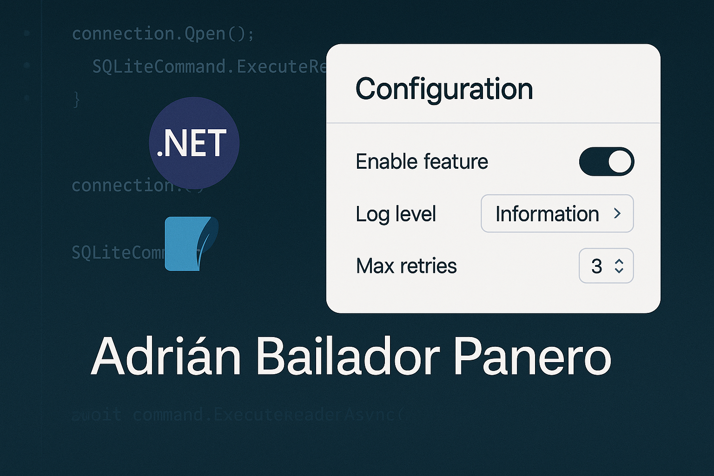

## Introduction

By default, ASP.NET Core applications load configuration from JSON files, environment variables, or secret stores like Azure Key Vault. However, there are scenarios where storing configuration in a **relational database like SQL Server** can be advantageous—especially when values need to change at runtime, or when managing settings for multiple environments or tenants.

This article shows you how to build a **custom `IConfigurationProvider`** that loads configuration from a SQL Server database. We’ll cover setup, integration with `IConfiguration`, reload support, and security considerations to make the solution robust and production-ready.

## Why Store Configuration in SQL Server?

Some typical use cases:

* Need to update app settings dynamically without restarting the app.
* Centralised configuration management for multiple apps or tenants.
* Business users want a UI to manage settings (e.g. feature flags).
* DevOps workflows demand live changes in specific environments.

## Creating the Configuration Table

Start by creating a simple table that stores key-value pairs:

```sql
CREATE TABLE AppConfiguration (
    [Key] NVARCHAR(200) PRIMARY KEY,
    [Value] NVARCHAR(MAX) NOT NULL
);
```

Example records:

| Key                | Value            |
| ------------------ | ---------------- |
| AppSettings\:Theme | dark             |
| FeatureFlags\:Beta | true             |
| Smtp\:Host         | smtp.example.com |

Using `:` in keys allows us to map hierarchical values like `appsettings.json`.

## Implementing a Custom Configuration Provider

We’ll implement two core components:

### `SqlConfigurationSource`

```csharp
public class SqlConfigurationSource : IConfigurationSource
{
    public string ConnectionString { get; set; }
    public SqlConfigurationProvider ProviderInstance { get; set; }

    public IConfigurationProvider Build(IConfigurationBuilder builder)
    {
        var provider = new SqlConfigurationProvider(ConnectionString);
        ProviderInstance = provider;
        return provider;
    }
}
```

### `SqlConfigurationProvider`

```csharp
public class SqlConfigurationProvider : ConfigurationProvider
{
    private readonly string _connectionString;

    public SqlConfigurationProvider(string connectionString)
    {
        _connectionString = connectionString;
    }

    public override void Load()
    {
        using var connection = new SqlConnection(_connectionString);
        connection.Open();

        using var command = new SqlCommand("SELECT [Key], [Value] FROM AppConfiguration", connection);
        using var reader = command.ExecuteReader();

        var data = new Dictionary<string, string>(StringComparer.OrdinalIgnoreCase);

        while (reader.Read())
        {
            data[reader.GetString(0)] = reader.GetString(1);
        }

        Data = data;
    }
}
```

## Integrating It with the Host

In `Program.cs`, add the custom provider before building the app:

```csharp
var builder = WebApplication.CreateBuilder(args);

var sqlSource = new SqlConfigurationSource
{
    ConnectionString = builder.Configuration.GetConnectionString("DefaultConnection")
};

builder.Configuration.Add(sqlSource);

// Register provider for later use (optional)
builder.Services.AddSingleton(sqlSource.ProviderInstance);

var app = builder.Build();
```

To simplify, create an extension method:

```csharp
public static class SqlConfigurationExtensions
{
    public static IConfigurationBuilder AddSqlServerConfiguration(
        this IConfigurationBuilder builder,
        string connectionString,
        out SqlConfigurationProvider provider)
    {
        var source = new SqlConfigurationSource { ConnectionString = connectionString };
        builder.Add(source);
        provider = source.ProviderInstance;
        return builder;
    }
}
```

This allows access to the provider instance for reloads or diagnostics.

## Consuming Configuration from SQL

If you have this record in the table:

```sql
INSERT INTO AppConfiguration ([Key], [Value]) VALUES ('AppSettings:Theme', 'dark');
```

You can access it via:

```csharp
public class HomeController : Controller
{
    private readonly IConfiguration _config;

    public HomeController(IConfiguration config)
    {
        _config = config;
    }

    public IActionResult Index()
    {
        var theme = _config["AppSettings:Theme"];
        return View("Index", theme);
    }
}
```

This works seamlessly, just like values from `appsettings.json`.

## Reloading Configuration Dynamically

By default, `IConfigurationProvider.Load()` is called once at startup. If you want **live reload**, you can implement it using a background service:

```csharp
public class ConfigReloadService : BackgroundService
{
    private readonly SqlConfigurationProvider _provider;

    public ConfigReloadService(SqlConfigurationProvider provider)
    {
        _provider = provider;
    }

    protected override async Task ExecuteAsync(CancellationToken stoppingToken)
    {
        while (!stoppingToken.IsCancellationRequested)
        {
            _provider.Load();
            _provider.OnReload();
            await Task.Delay(TimeSpan.FromMinutes(5), stoppingToken);
        }
    }
}
```

Register the service:

```csharp
builder.Services.AddHostedService<ConfigReloadService>();
```

This enables runtime updates to config values with no need to restart the app.

## Using `IOptions<T>` with SQL Configuration

ASP.NET Core’s options pattern still works with values from SQL. For example:

```csharp
builder.Services.Configure<MySettings>(builder.Configuration.GetSection("MySettings"));
```

As long as your SQL keys match the section format, this will bind correctly.

## Security and Best Practices

* **Secure sensitive values**: Never store secrets like API keys or SMTP passwords as plain text. Encrypt them or use a hybrid setup (e.g. SQL + Azure Key Vault).
* **Access control**: Only trusted users should be allowed to update configuration rows in the database.
* **Fail-safe defaults**: Ensure your app can fall back to safe defaults if the SQL configuration fails to load.
* **Caching**: If configuration doesn’t change often, you can reduce load with caching strategies.
* **Migration safety**: Treat your config table as part of your schema. Add it to your EF Core migrations or provisioning scripts.


## Conclusion

SQL Server can be a powerful configuration backend for ASP.NET Core apps. With a custom `IConfigurationProvider`, you can load settings dynamically, integrate them with the options pattern, and even enable live reload.

This setup gives you centralised config management without sacrificing the powerful features of the built-in configuration system.

