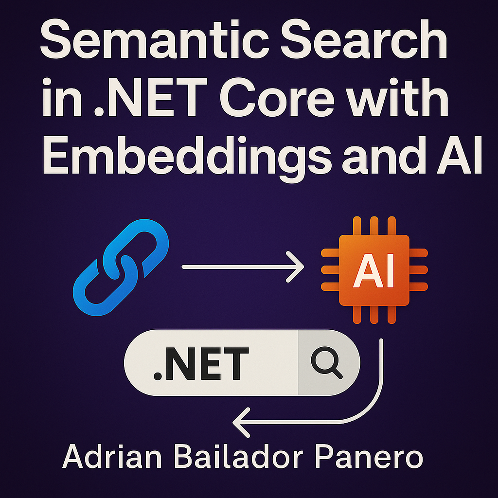

In this tutorial, you’ll learn how to create an API using **.NET Core** that understands the meaning of text — not just keywords — thanks to the power of **OpenAI embeddings**. You’ll integrate **semantic search**, **SQLite**, **Dapper**, and **.NET** in a clean, beginner-friendly project.

> 💡 Want your search engine to return *relevant* results even if they don’t contain the exact words? You’re in the right place.

---

## What is Semantic Search?

Traditional search looks for literal keyword matches. **Semantic search**, on the other hand, understands the intent behind the query.

This is achieved using **embeddings** — numerical vector representations of text that capture meaning. Once texts are converted into vectors, they can be compared based on similarity (not keywords) to find the closest match.

---

## What Are We Building?

A minimal REST API with two endpoints:

| Method | Route         | Purpose                                                       |
|--------|---------------|---------------------------------------------------------------|
| POST   | `/documents`  | Saves a document and generates its embedding automatically     |
| GET    | `/search?q=`  | Searches for documents similar to the input query using AI     |

Technologies used:
- ✅ ASP.NET Core Minimal APIs  
- ✅ SQLite (with Dapper)  
- ✅ OpenAI embeddings (via HTTP)  
- ✅ No frontend — pure backend logic


---

## API Key Management

Never hardcode your OpenAI key. Set it securely as an environment variable:

```bash
export OPENAI_API_KEY=sk-xxxxxxxxxxxxxxxxxxxxxxxxxxxxxxxx
````

Access it in your code:

```csharp
var apiKey = Environment.GetEnvironmentVariable("OPENAI_API_KEY");
```

---

## ▶️ Running the API

To start your API, run:

```bash
dotnet run
```

---

## 🧪 Testing the API

### 1. Add Documents (`POST /documents`)

Using `curl`:

```bash
curl -X POST http://localhost:5000/documents \
  -H "Content-Type: application/json" \
  -d '{"title": "ASP.NET Guide", "content": "ASP.NET Core is a powerful web framework..."}'
```

Or with **Postman**:

* Method: `POST`
* URL: `http://localhost:5000/documents`
* Body → Raw → JSON:

```json
{
  "title": "ASP.NET Guide",
  "content": "ASP.NET Core is a powerful web framework..."
}
```

### 2. Search (`GET /search?q=`)

```bash
curl "http://localhost:5000/search?q=microsoft web framework"
```

Example response:

```json
[
  {
    "title": "ASP.NET Guide",
    "content": "ASP.NET Core is a powerful web framework...",
    "score": 0.91
  }
]
```

---

## 🧠 How It Works

### Step 1: Embedding Text

The `EmbeddingService` sends your content to OpenAI's API:

```json
POST https://api.openai.com/v1/embeddings
{
  "model": "text-embedding-ada-002",
  "input": "ASP.NET Core is a powerful framework..."
}
```

The API returns a 1536-dimensional vector representing the **meaning** of the input.

---

### Step 2: Storing in SQLite

The embedding is serialized as JSON and saved in SQLite using **Dapper**. Each document has:

* ID
* Title
* Content
* Embedding vector

---

### Step 3: Semantic Search

When a user searches, the input is embedded the same way, and then compared to all stored embeddings using **cosine similarity** — a mathematical measure of how similar two vectors are.

> 🎯 Cosine similarity measures how “close” two vectors point in the same direction, regardless of their magnitude.

---

## Error Handling

Robust error handling is included to deal with:

* Invalid or missing API key → Returns 401 with error message from OpenAI
* OpenAI API errors → Logged and returned as 500 errors
* JSON deserialization failures → Gracefully handled with proper responses

You can extend this with:

* Logging (e.g. to file or Application Insights)
* Retry policies (e.g. using Polly)
* Input validation

---

## ⚙️ Performance Considerations

| Concern          | Recommendation                                                                                                                                                                 |
| ---------------- | ------------------------------------------------------------------------------------------------------------------------------------------------------------------------------ |
| Embedding size   | `text-embedding-ada-002` produces 1536 floats. Keep storage optimised.                                                                                                         |
| Batch insertions | Embed and insert multiple documents in batches for performance.                                                                                                                |
| Search scale     | Current in-memory similarity works for small data. For large sets, use [FAISS](https://github.com/facebookresearch/faiss) or [pgvector](https://github.com/pgvector/pgvector). |
| Vector database  | Consider using **PostgreSQL + pgvector** for scalable production search.                                                                                                       |

---

## Source Code

You can find the complete code here:

👉 [https://github.com/AdrianBailador/SemanticSearchApp](https://github.com/AdrianBailador/SemanticSearchApp)

```bash
git clone https://github.com/AdrianBailador/SemanticSearchApp.git
cd SemanticSearchApp
dotnet run
```

---

## Further Reading

* [OpenAI Embeddings Guide](https://platform.openai.com/docs/guides/embeddings)
* [Minimal APIs in ASP.NET Core](https://learn.microsoft.com/en-us/aspnet/core/fundamentals/minimal-apis)
* [Dapper GitHub Repository](https://github.com/DapperLib/Dapper)

---

## Conclusion

With just a few components and under 200 lines of code, you’ve built an intelligent API capable of **understanding language**. This is a powerful starting point for building smarter applications — from search engines to recommendation systems.

✨ Want to go further? Add categories, weights, filtering, or switch to a production-grade vector store like **pgvector** or **Pinecone**.

> Start simple. Scale smart. Think semantically.

---

```

