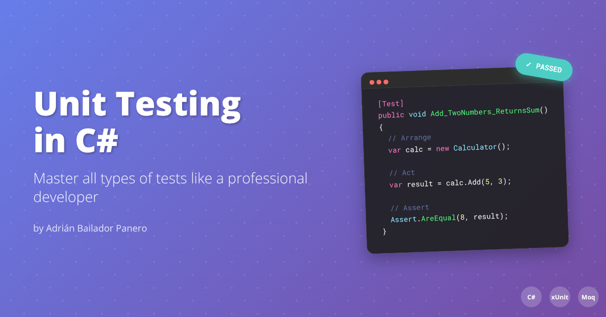

---

If you're a C# developer looking to improve your code quality, unit tests are your best mate. In this guide, I'll walk you through all the types you need to know, with practical examples you can use straight away.

## What Are Unit Tests?

Unit tests are small programmes that verify a specific part of your code (a function, a method) works correctly. Think of them as an automated quality control system that runs every time you change something.

**Why are they important?**
- Catch bugs early
- Give you confidence to refactor
- Document how your code should behave
- Reduce debugging time

## 1. Basic Unit Tests

Let's start with the fundamentals. A basic unit test follows the **AAA** pattern (Arrange-Act-Assert):

```csharp
using NUnit.Framework;

[TestFixture]
public class CalculatorTests
{
    [Test]
    public void Add_TwoPositiveNumbers_ReturnsCorrectSum()
    {
        // Arrange: Prepare the data
        var calculator = new Calculator();
        int a = 5, b = 3;
        
        // Act: Execute the action
        int result = calculator.Add(a, b);
        
        // Assert: Verify the result
        Assert.AreEqual(8, result);
    }
}
```

**Popular frameworks in C#:**
- **xUnit**: The most modern and recommended
- **NUnit**: Very comprehensive and flexible
- **MSTest**: Integrated with Visual Studio

## 2. Tests with Mocks and Stubs

When your code depends on external services (databases, APIs, files), you need to "simulate" those dependencies to isolate what you actually want to test.

```csharp
using Moq;
using NUnit.Framework;

public class OrderServiceTests
{
    [Test]
    public void ProcessOrder_ValidOrder_CallsPaymentService()
    {
        // Arrange
        var mockPaymentService = new Mock<IPaymentService>();
        var mockEmailService = new Mock<IEmailService>();
        var orderService = new OrderService(mockPaymentService.Object, mockEmailService.Object);
        
        var order = new Order { Amount = 100, CustomerEmail = "test@email.com" };
        
        // Act
        orderService.ProcessOrder(order);
        
        // Assert
        mockPaymentService.Verify(x => x.ProcessPayment(100), Times.Once);
        mockEmailService.Verify(x => x.SendConfirmation("test@email.com"), Times.Once);
    }
}
```

**When to use Mocks:**
- For external dependencies (APIs, databases)
- For expensive services to create
- To control behaviour in specific scenarios

## 3. Parametrised Tests

Why write 10 similar tests when you can write 1? Parametrised tests allow you to execute the same logic with different data:

```csharp
[TestCase(0, 0, 0)]
[TestCase(1, 1, 2)]
[TestCase(-1, 1, 0)]
[TestCase(100, -50, 50)]
public void Add_DifferentInputs_ReturnsExpectedResult(int a, int b, int expected)
{
    var calculator = new Calculator();
    var result = calculator.Add(a, b);
    Assert.AreEqual(expected, result);
}

// You can also use TestCaseSource for more complex cases
[TestCaseSource(nameof(DivisionTestCases))]
public void Divide_VariousInputs_ReturnsCorrectResult(decimal dividend, decimal divisor, decimal expected)
{
    var calculator = new Calculator();
    var result = calculator.Divide(dividend, divisor);
    Assert.AreEqual(expected, result, 0.001m);
}

private static IEnumerable<TestCaseData> DivisionTestCases()
{
    yield return new TestCaseData(10m, 2m, 5m);
    yield return new TestCaseData(7m, 3m, 2.333m);
    yield return new TestCaseData(-6m, 2m, -3m);
}
```

## 4. Exception Tests

Your code should handle errors properly. These tests verify that exceptions are thrown when they should be:

```csharp
[Test]
public void Divide_ByZero_ThrowsArgumentException()
{
    var calculator = new Calculator();
    
    var exception = Assert.Throws<ArgumentException>(
        () => calculator.Divide(10, 0)
    );
    
    Assert.That(exception.Message, Contains.Substring("divisor cannot be zero"));
}

[Test]
public void CreateUser_NullEmail_ThrowsArgumentNullException()
{
    var userService = new UserService();
    
    Assert.Throws<ArgumentNullException>(
        () => userService.CreateUser(null, "password")
    );
}
```

## 5. Asynchronous Tests

With `async/await` being so common, you need to know how to test asynchronous code:

```csharp
[Test]
public async Task GetUserAsync_ValidId_ReturnsUser()
{
    // Arrange
    var mockRepository = new Mock<IUserRepository>();
    mockRepository.Setup(x => x.GetByIdAsync(1))
              .ReturnsAsync(new User { Id = 1, Name = "John" });
    
    var userService = new UserService(mockRepository.Object);
    
    // Act
    var user = await userService.GetUserAsync(1);
    
    // Assert
    Assert.IsNotNull(user);
    Assert.AreEqual(1, user.Id);
    Assert.AreEqual("John", user.Name);
}

[Test]
public async Task SaveDataAsync_DatabaseTimeout_ThrowsTimeoutException()
{
    var mockRepository = new Mock<IDataRepository>();
    mockRepository.Setup(x => x.SaveAsync(It.IsAny<Data>()))
              .ThrowsAsync(new TimeoutException());
    
    var service = new DataService(mockRepository.Object);
    
    await Assert.ThrowsAsync<TimeoutException>(
        () => service.SaveDataAsync(new Data())
    );
}
```

## 6. State vs Behaviour Tests

**State Tests**: Verify the final state of the object
```csharp
[Test]
public void AddItem_ToCart_IncreasesItemCount()
{
    var cart = new ShoppingCart();
    cart.AddItem(new Item("Laptop", 1000));
    
    Assert.AreEqual(1, cart.ItemCount);
    Assert.AreEqual(1000, cart.TotalAmount);
}
```

**Behaviour Tests**: Verify that the correct methods were called
```csharp
[Test]
public void ProcessOrder_ValidOrder_CallsRequiredServices()
{
    var mockInventory = new Mock<IInventoryService>();
    var mockPayment = new Mock<IPaymentService>();
    var processor = new OrderProcessor(mockInventory.Object, mockPayment.Object);
    
    processor.ProcessOrder(new Order());
    
    mockInventory.Verify(x => x.ReserveItems(It.IsAny<Order>()), Times.Once);
    mockPayment.Verify(x => x.ProcessPayment(It.IsAny<Order>()), Times.Once);
}
```

## 7. Property-Based Testing

An advanced technique where you automatically generate test cases:

```csharp
using FsCheck;
using FsCheck.NUnit;

[Property]
public bool Add_IsCommutative(int a, int b)
{
    var calculator = new Calculator();
    return calculator.Add(a, b) == calculator.Add(b, a);
}

[Property]
public bool Sort_ListIsOrdered(int[] input)
{
    var sorted = input.OrderBy(x => x).ToArray();
    
    for (int i = 0; i < sorted.Length - 1; i++)
    {
        if (sorted[i] > sorted[i + 1])
            return false;
    }
    return true;
}
```

## 8. "Light" Integration Tests

Whilst not technically unit tests, sometimes you need to test how several components interact:

```csharp
[Test]
public void UserRegistration_EndToEndFlow_WorksCorrectly()
{
    // Use an in-memory database
    var options = new DbContextOptionsBuilder<UserContext>()
        .UseInMemoryDatabase(databaseName: "TestDb")
        .Options;
    
    using var context = new UserContext(options);
    var repository = new UserRepository(context);
    var emailService = new Mock<IEmailService>();
    var userService = new UserService(repository, emailService.Object);
    
    // Act
    var result = userService.RegisterUser("john@email.com", "password123");
    
    // Assert
    Assert.IsTrue(result.Success);
    Assert.AreEqual(1, context.Users.Count());
    emailService.Verify(x => x.SendWelcomeEmail("john@email.com"), Times.Once);
}
```

## Best Practices for Successful Tests

### 1. Descriptive Names
```csharp
// ❌ Poor
[Test]
public void Test1() { }

// ✅ Good
[Test]
public void CalculateDiscount_CustomerIsVIP_Returns20PercentDiscount() { }
```

### 2. Single Responsibility per Test
```csharp
// ❌ Poor - tests many things
[Test]
public void UserService_Tests()
{
    // Tests creation, updating, deletion...
}

// ✅ Good - each test has a specific purpose
[Test]
public void CreateUser_ValidInput_ReturnsSuccessResult() { }

[Test]
public void CreateUser_DuplicateEmail_ReturnsErrorResult() { }
```

### 3. Clear Test Data
```csharp
// ❌ Poor - magic numbers
[Test]
public void CalculateTotal_ReturnsCorrectAmount()
{
    var result = calculator.Calculate(100, 0.15, 5);
    Assert.AreEqual(120, result);
}

// ✅ Good - meaningful values
[Test]
public void CalculateTotal_WithTaxAndShipping_ReturnsCorrectAmount()
{
    const decimal baseAmount = 100m;
    const decimal taxRate = 0.15m;
    const decimal shipping = 5m;
    const decimal expected = 120m;
    
    var result = calculator.Calculate(baseAmount, taxRate, shipping);
    Assert.AreEqual(expected, result);
}
```

### 4. Setup and Cleanup
```csharp
[TestFixture]
public class DatabaseTests
{
    private TestDatabase _database;
    
    [SetUp]
    public void Setup()
    {
        _database = new TestDatabase();
        _database.Initialise();
    }
    
    [TearDown]
    public void Cleanup()
    {
        _database.Cleanup();
        _database.Dispose();
    }
}
```

## Useful Tools and Extensions

### Testing Frameworks
- **xUnit.net**: Modern and extensible
- **NUnit**: Mature with many features
- **MSTest**: Native integration with Visual Studio

### Mocking
- **Moq**: The most popular
- **NSubstitute**: Cleaner syntax
- **FakeItEasy**: Easy to use

### Coverage Measurement
- **Coverlet**: For .NET Core
- **dotCover**: By JetBrains
- **Visual Studio**: Integrated tools

### Test Runners
- **Visual Studio Test Explorer**
- **ReSharper Unit Test Runner**
- **Rider**: Complete IDE by JetBrains

## Conclusion

Unit tests aren't just a "good practice" - they're essential for developing reliable and maintainable software. Start with basic tests and gradually incorporate more advanced techniques.

**Remember:**
- Tests should be fast and reliable
- A descriptive name is worth a thousand comments
- Each test should have a single purpose
- Mocks are your friends for isolating dependencies
- 100% coverage doesn't guarantee quality, but well-written tests do

**Your next step?** Take an existing project and add tests to a small class. You'll immediately see the benefits and want to keep writing more.


---

