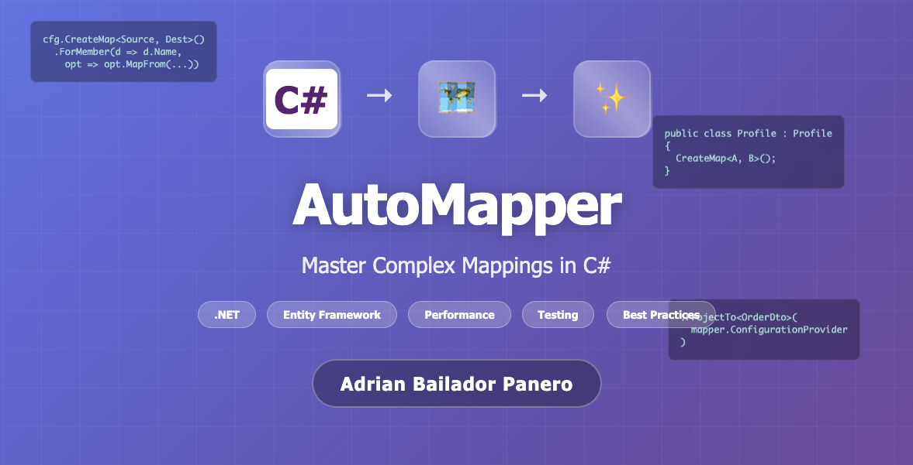

## Introduction to Advanced Mapping with AutoMapper

If you’ve worked with .NET for a while, chances are you’ve faced the same issue over and over again: copying properties from a class to a DTO. At first, it seems straightforward, but once your model grows and you need to map dozens of properties (or worse, nested ones), maintaining that code quickly becomes repetitive and error-prone.

That’s where AutoMapper comes in. You configure how you want conversions to happen, and it takes care of the tedious part. The basics are easy to learn, but the real value appears in more complex scenarios: collections, calculations, projections with Entity Framework, testing, and performance.

In this article, I’ll show you how to go beyond simple examples and use AutoMapper in more advanced ways, with practical examples and best practices you can apply directly in your projects.

---

## Basic Configuration

Before we jump into complex scenarios, let’s start with the simplest configuration:

```csharp
var config = new MapperConfiguration(cfg => {
    cfg.CreateMap<Source, Destination>();
});

IMapper mapper = config.CreateMapper();
````

---

## Complex Mappings: Advanced Techniques

### 1. Nested Property Mapping (Flattening)

AutoMapper can automatically “flatten” nested objects using naming conventions:

```csharp
public class Order
{
    public Customer Customer { get; set; }
}

public class Customer
{
    public string Name { get; set; }
    public Address Address { get; set; }
}

public class Address
{
    public string City { get; set; }
}

public class OrderDto
{
    public string CustomerName { get; set; }
    public string CustomerAddressCity { get; set; }
}

// Configuration
cfg.CreateMap<Order, OrderDto>();
```

---

### 2. Custom Mapping with ForMember

For more specific mapping logic:

```csharp
cfg.CreateMap<Source, Destination>()
    .ForMember(dest => dest.FullName, 
               opt => opt.MapFrom(src => $"{src.FirstName} {src.LastName}"))
    .ForMember(dest => dest.Age, 
               opt => opt.MapFrom(src => DateTime.Now.Year - src.BirthYear));
```

---

### 3. Conditional Mapping

Map properties only when certain conditions are met:

```csharp
cfg.CreateMap<Source, Destination>()
    .ForMember(dest => dest.Status, opt => {
        opt.PreCondition(src => src.IsActive);
        opt.MapFrom(src => "Active");
    })
    .ForMember(dest => dest.Premium, 
               opt => opt.Condition(src => src.AccountBalance > 1000));
```

---

### 4. Custom Resolvers

For complex calculations or transformations, use resolvers:

```csharp
public class FullNameResolver : IValueResolver<Person, PersonDto, string>
{
    public string Resolve(Person source, PersonDto destination, 
                         string destMember, ResolutionContext context)
    {
        return $"{source.Title} {source.FirstName} {source.LastName}";
    }
}

cfg.CreateMap<Person, PersonDto>()
    .ForMember(dest => dest.FullName, 
               opt => opt.MapFrom<FullNameResolver>());
```

---

### 5. Collection Mapping with Projection

Transform collections automatically:

```csharp
cfg.CreateMap<Order, OrderDto>()
    .ForMember(dest => dest.ProductNames, 
               opt => opt.MapFrom(src => src.OrderItems
                   .Select(item => item.Product.Name)
                   .ToList()));
```

This avoids manual loops in services or controllers and keeps transformation logic in one place.

---

### 6. Reverse Mapping (ReverseMap)

Create bidirectional mappings:

```csharp
cfg.CreateMap<Employee, EmployeeDto>()
    .ForMember(dest => dest.DepartmentName, 
               opt => opt.MapFrom(src => src.Department.Name))
    .ReverseMap()
    .ForPath(src => src.Department.Name, 
             opt => opt.MapFrom(dest => dest.DepartmentName));
```

---

### 7. Value Converters

Convert specific data types:

```csharp
public class DateTimeToStringConverter : IValueConverter<DateTime, string>
{
    public string Convert(DateTime source, ResolutionContext context)
    {
        return source.ToString("yyyy-MM-dd");
    }
}

cfg.CreateMap<Event, EventDto>()
    .ForMember(dest => dest.EventDate, 
               opt => opt.ConvertUsing<DateTimeToStringConverter, DateTime>(
                   src => src.EventDateTime));
```

---

### 8. Mapping with Dependency Injection

Use external services in mappings:

```csharp
public class PriceResolver : IValueResolver<Product, ProductDto, decimal>
{
    private readonly IPricingService _pricingService;
    
    public PriceResolver(IPricingService pricingService)
    {
        _pricingService = pricingService;
    }
    
    public decimal Resolve(Product source, ProductDto destination, 
                          decimal destMember, ResolutionContext context)
    {
        return _pricingService.CalculatePrice(source.BasePrice, source.Category);
    }
}
```

---

### 9. Null Substitution

Define default values for null properties:

```csharp
cfg.CreateMap<Source, Destination>()
    .ForMember(dest => dest.Description, 
               opt => opt.NullSubstitute("No description available"));
```

---

### 10. Before and After Map

Execute logic before or after mapping:

```csharp
cfg.CreateMap<User, UserDto>()
    .BeforeMap((src, dest) => {
        Console.WriteLine($"Mapping user {src.Id}");
    })
    .AfterMap((src, dest) => {
        dest.MappedAt = DateTime.UtcNow;
    });
```

---

## Performance Considerations

### The Cost of Reflection

AutoMapper relies on reflection and expression compilation, which introduces overhead. For very simple mappings inside high-performance loops, manual mapping can be faster:

```csharp
// Manual mapping – faster for simple cases
var dto = new PersonDto 
{
    Id = person.Id,
    Name = person.Name
};

// vs AutoMapper – unnecessary overhead here
var dto = mapper.Map<PersonDto>(person);
```

---

### ProjectTo: Critical Optimisation with Entity Framework

Fetching full entities and mapping in memory is inefficient. `ProjectTo()` generates an optimised SQL query:

```csharp
var dtos = await context.Orders
    .ProjectTo<OrderDto>(mapper.ConfigurationProvider)
    .ToListAsync();
```

This selects only the necessary columns, reducing memory usage and execution time. With thousands of records, the difference is significant.

---

## Testing Mappings

A key practice with AutoMapper is validating your configuration to catch issues early:

```csharp
var config = new MapperConfiguration(cfg => {
    cfg.CreateMap<User, UserDto>();
});

config.AssertConfigurationIsValid(); // Throws if mappings are invalid
```

You can also write unit tests to ensure mappings remain valid as your models evolve:

```csharp
[Fact]
public void AutoMapper_Configuration_IsValid()
{
    var config = new MapperConfiguration(cfg => {
        cfg.AddProfile<MappingProfile>();
    });

    config.AssertConfigurationIsValid();
}
```

---

## Common Errors and How to Avoid Them

* **Unmapped properties:** AutoMapper ignores unmapped properties by default, which can hide mistakes. Use `AssertConfigurationIsValid()` to catch them.
* **Mapping after materialisation:** Don’t fetch full entities into memory before mapping. Use `ProjectTo()` with EF queries.
* **Overusing AutoMapper:** For trivial mappings in hot paths, manual mapping may still be faster.
* **Scattered configuration:** Keep mappings organised in Profiles to avoid duplication and improve maintainability.

---

## Best Practices

* Organise mappings into **Profiles**.
* Validate configuration with `AssertConfigurationIsValid()`.
* Use `ProjectTo()` instead of `Map()` with EF.
* Document complex mappings for your team.

---

## Conclusion

AutoMapper is more than just a tool to avoid repetitive boilerplate: properly configured, it improves both clarity and performance in your applications.

Use it wisely. For simple, performance-critical mappings, manual mapping can still be the better choice. For collections, nested properties, or EF projections, AutoMapper provides a clean, maintainable solution.

Two key practices make the biggest difference: validate your configuration in tests and leverage `ProjectTo()` to prevent unnecessary database overhead. With these in place, most common pitfalls are avoided.

---


