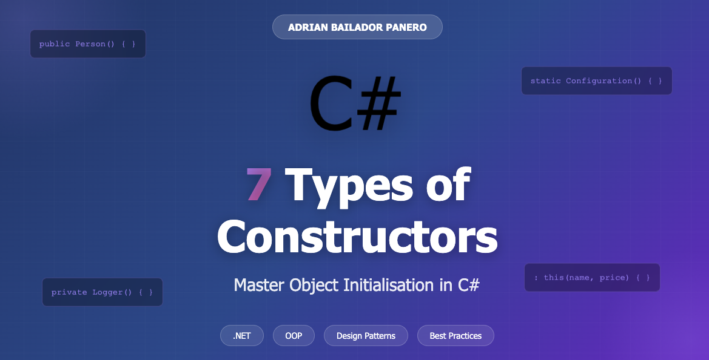

Constructors are special methods that execute automatically when an instance of a class is created. In C#, there are different types of constructors that allow us to initialise objects in various ways. In this article, we'll explore the 7 main types of constructors with practical examples.

## 1. Default Constructor

The default constructor has no parameters and is provided automatically by the compiler if we don't define any constructor. However, we can define it explicitly.

```csharp
public class Person
{
    public string Name { get; set; }
    public int Age { get; set; }
    
    // Default constructor
    public Person()
    {
        Name = "No name";
        Age = 0;
    }
}

// Usage
Person person = new Person();
Console.WriteLine($"{person.Name}, {person.Age} years old");
```

## 2. Parameterised Constructor

This type of constructor accepts parameters to initialise the object with specific values at the time of its creation.

```csharp
public class Person
{
    public string Name { get; set; }
    public int Age { get; set; }
    
    // Parameterised constructor
    public Person(string name, int age)
    {
        Name = name;
        Age = age;
    }
}

// Usage
Person person = new Person("Adri", 30);
Console.WriteLine($"{person.Name}, {person.Age} years old");
```

## 3. Copy Constructor

A copy constructor creates a new object by copying the values from an existing object of the same type.

```csharp
public class Person
{
    public string Name { get; set; }
    public int Age { get; set; }
    
    public Person(string name, int age)
    {
        Name = name;
        Age = age;
    }
    
    // Copy constructor
    public Person(Person otherPerson)
    {
        Name = otherPerson.Name;
        Age = otherPerson.Age;
    }
}

// Usage
Person person1 = new Person("Anna", 25);
Person person2 = new Person(person1);
Console.WriteLine($"{person2.Name}, {person2.Age} years old");
// Output: Anna, 25 years old
```

## 4. Static Constructor

A static constructor is used to initialise static members of a class. It executes only once, before the first instance is created or any static member is accessed.

```csharp
public class Configuration
{
    public static string BasePath { get; set; }
    public static int Timeout { get; set; }
    
    // Static constructor
    static Configuration()
    {
        BasePath = "C:/App/";
        Timeout = 5000;
        Console.WriteLine("Static constructor executed");
    }
}

// Usage
Console.WriteLine(Configuration.BasePath);
// Output: 
// Static constructor executed
// C:/App/
```

## 5. Private Constructor

A private constructor prevents the creation of instances of a class from outside it. It's useful for implementing patterns like Singleton or for classes with only static methods.

```csharp
public class Logger
{
    private static Logger instance;
    
    // Private constructor
    private Logger()
    {
        Console.WriteLine("Logger initialised");
    }
    
    public static Logger GetInstance()
    {
        if (instance == null)
        {
            instance = new Logger();
        }
        return instance;
    }
    
    public void Write(string message)
    {
        Console.WriteLine($"[LOG]: {message}");
    }
}

// Usage
Logger logger = Logger.GetInstance();
logger.Write("Application started");
// Output:
// Logger initialised
// [LOG]: Application started
```

## 6. Constructor Chaining

Constructor chaining allows one constructor to call another constructor in the same class using the `this` keyword, avoiding code duplication.

```csharp
public class Product
{
    public string Name { get; set; }
    public decimal Price { get; set; }
    public string Category { get; set; }
    
    
    public Product(string name, decimal price, string category)
    {
        Name = name;
        Price = price;
        Category = category;
    }
    
    
    public Product(string name, decimal price) 
        : this(name, price, "General")
    {
    }
    
    // Another chained constructor
    public Product(string name) 
        : this(name, 0.0m, "General")
    {
    }
}

// Usage
Product p1 = new Product("Laptop", 999.99m, "Electronics");
Product p2 = new Product("Mouse", 19.99m);
Product p3 = new Product("Keyboard");
```

## 7. Constructor with Optional Parameters

C# allows defining constructors with optional parameters, providing default values for some or all parameters.

```csharp
public class Email
{
    public string Recipient { get; set; }
    public string Subject { get; set; }
    public string Body { get; set; }
    public bool IsUrgent { get; set; }
    
    // Constructor with optional parameters
    public Email(string recipient, 
                 string subject = "No subject", 
                 string body = "", 
                 bool isUrgent = false)
    {
        Recipient = recipient;
        Subject = subject;
        Body = body;
        IsUrgent = isUrgent;
    }
}

// Usage
Email email1 = new Email("user@example.com");
Email email2 = new Email("user@example.com", "Meeting");
Email email3 = new Email("user@example.com", "Urgent", "Need help", true);
```

## Conclusion

Constructors are fundamental in object-oriented programming in C#. Each type of constructor has its specific purpose:

- **Default constructor**: For basic initialisations without parameters
- **Parameterised constructor**: When we need specific values when creating objects
- **Copy constructor**: To duplicate existing objects
- **Static constructor**: To initialise static members of the class
- **Private constructor**: To control instance creation (Singleton patterns)
- **Constructor chaining**: To reuse code between constructors
- **Constructor with optional parameters**: For greater flexibility in object creation

Mastering these concepts will allow you to write cleaner, more maintainable, and efficient code in C#.