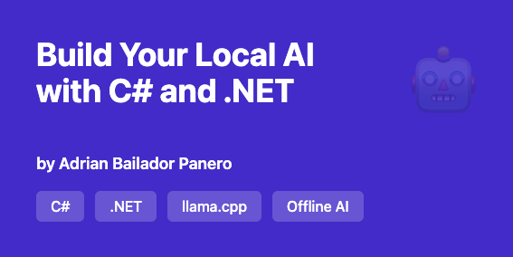

## Introduction

In a world where **data privacy** and **control over technological infrastructure** are increasingly important, running artificial intelligence models **completely offline** is no longer just a technical curiosity: it's a necessity.

In this guide you'll learn to build your **own local AI in C# and .NET**, using [llama.cpp](https://github.com/ggerganov/llama.cpp) and its native wrapper [LLamaSharp](https://github.com/SciSharp/LLamaSharp).

You'll be able to generate text, answer questions, or build your own chatbot **without internet connection**, **without depending on OpenAI or other APIs**, and **with complete control over your data**.

> ⚠️ **Minimum requirements**: 8 GB RAM, modern CPU (4+ cores), 10 GB disk space

---

## What We'll Cover

**0/** Installing and setting up llama-cli  
**1/** Downloading and using GGUF models  
**2/** Running text generation locally without an internet connection  
**3/** Building a simple C# integration to send prompts and receive AI responses  
**4/** Why learning to run AI offline is critical — for privacy, cost control, performance, and future-proofing your projects  
**5/** Best practices for using offline AI in your own apps

Whether you're building secure apps, working with sensitive data, or just want full control over your AI models, this guide will help you get started!

---

## 0️⃣ Installing and Setting Up llama-cli

### What is llama.cpp?

**llama.cpp** is a CPU-optimised C/C++ implementation that allows you to run language models (LLMs) locally — without expensive GPUs or internet connection. It's the foundation of many current offline AI tools.

### Installation on Windows

```bash
# Download precompiled binaries from:
# https://github.com/ggerganov/llama.cpp/releases

# Or compile from source:
git clone https://github.com/ggerganov/llama.cpp
cd llama.cpp
mkdir build && cd build
cmake .. && cmake --build . --config Release
```

### Installation on Linux/macOS

```bash
git clone https://github.com/ggerganov/llama.cpp
cd llama.cpp
make
```

Once finished, you'll have the `llama-cli` executable available.

---

## 1️⃣ Downloading and Using GGUF Models

### What are GGUF models?

**GGUF** (GPT-Generated Unified Format) is the standard format for running quantised language models, optimised for CPU. Thanks to quantisation, models are lighter and faster, with minimal quality loss.

### Where to download models

- [Hugging Face](https://huggingface.co/models?library=gguf)
- [TheBloke](https://huggingface.co/TheBloke) — high-quality GGUF conversions

### Recommended models

| Model | Size | RAM needed | Ideal for |
|-------|------|------------|-----------|
| Llama-3.2-3B | ~2 GB | 4 GB | Basic tasks |
| Mistral-7B | ~4 GB | 8 GB | General use |
| Llama-3.1-8B | ~5 GB | 10 GB | High quality |

### Download example

```bash
mkdir models && cd models
wget https://huggingface.co/TheBloke/Mistral-7B-Instruct-v0.2-GGUF/resolve/main/mistral-7b-instruct-v0.2.Q4_K_M.gguf
```

💡 **Tip**: Use the **Q4_K_M** version for the best balance between performance and quality.

---

## 2️⃣ Running Locally Without Connection

### Basic command

```bash
./llama-cli -m ./models/mistral-7b-instruct-v0.2.Q4_K_M.gguf \
  -p "Explain what artificial intelligence is in simple terms" \
  -n 256 -c 2048
```

```json
{
  "Logging": {
    "LogLevel": {
      "Default": "Information",
      "Microsoft.AspNetCore": "Warning"
    }
  },
  "AllowedHosts": "*",
  "AI": {
    "ModelPath": "C:\\Users\\Adri\\AI\\models\\mistral-7b-instruct-v0.2.Q4_K_M.gguf"
  }
}
```

| Parameter | Description |
|-----------|-------------|
| `-m` | Path to GGUF model |
| `-p` | Prompt or user input |
| `-n` | Maximum output tokens |
| `-c` | Context size |
| `--temp` | Temperature (0.1–1.0) |

### Interactive mode

```bash
./llama-cli -m ./models/mistral-7b-instruct-v0.2.Q4_K_M.gguf \
  --interactive \
  --reverse-prompt "User:" \
  -c 4096
```

---

## 3️⃣ Simple C# Integration

### Option A: Running llama-cli from C#

```csharp
using System.Diagnostics;

public class LocalAI
{
    private readonly string _modelPath;
    private readonly string _llamaPath;

    public LocalAI(string modelPath, string llamaPath)
    {
        _modelPath = modelPath;
        _llamaPath = llamaPath;
    }

    public async Task<string> GenerateAsync(string prompt)
    {
        var args = $"-m \"{_modelPath}\" -p \"{prompt}\" -n 256 -c 2048 --log-disable";
        
        var psi = new ProcessStartInfo
        {
            FileName = _llamaPath,
            Arguments = args,
            RedirectStandardOutput = true,
            UseShellExecute = false,
            CreateNoWindow = true
        };

        using var process = Process.Start(psi)!;
        var output = await process.StandardOutput.ReadToEndAsync();
        await process.WaitForExitAsync();

        return CleanOutput(output);
    }

    private string CleanOutput(string text)
    {
        var lines = text.Split('\n')
            .Where(l => !l.Contains("llama_") && !l.Contains("main:"));
        return string.Join('\n', lines).Trim();
    }
}
```

**Usage:**

```csharp
var ai = new LocalAI(
    modelPath: @"C:\Users\Adri\AI\models\mistral-7b.gguf",
    llamaPath: @"C:\Users\Adri\llama.cpp\llama-cli.exe"
);

var response = await ai.GenerateAsync("What is .NET?");
Console.WriteLine(response);
```

### Option B: Using LLamaSharp

```bash
dotnet add package LLamaSharp
dotnet add package LLamaSharp.Backend.Cpu
```

```csharp
using LLama;
using LLama.Common;

public class LLamaService
{
    private readonly LLamaContext _context;

    public LLamaService(string modelPath)
    {
        var parameters = new ModelParams(modelPath)
        {
            ContextSize = 2048,
            GpuLayerCount = 0
        };

        var weights = LLamaWeights.LoadFromFile(parameters);
        _context = weights.CreateContext(parameters);
    }

    public async Task<string> GenerateAsync(string prompt)
    {
        var executor = new InteractiveExecutor(_context);
        var config = new InferenceParams { MaxTokens = 256 };

        var result = new StringBuilder();
        await foreach (var token in executor.InferAsync(prompt, config))
            result.Append(token);

        return result.ToString();
    }
}
```

### Minimal REST API

```csharp
// Program.cs
var builder = WebApplication.CreateBuilder(args);
builder.Services.AddSingleton(_ => 
    new LLamaService(@"C:\Users\Adri\AI\models\mistral-7b.gguf"));

var app = builder.Build();

app.MapPost("/generate", async (PromptRequest req, LLamaService ai) =>
{
    var response = await ai.GenerateAsync(req.Prompt);
    return Results.Ok(new { response });
});

app.Run();

record PromptRequest(string Prompt);
```

---

## 4️⃣ Why Running AI Offline is Critical

### 🔒 Privacy and Security

✅ **Complete data control** — Nothing leaves your infrastructure  
✅ **Regulatory compliance** — GDPR, HIPAA compatible  
✅ **No leak risk** — Your prompts never travel to the cloud  
✅ **Protected intellectual property** — Your code remains private


### ⚡ Performance and Availability

- **Ultra-low latency**: 10-50ms vs 500-2000ms with cloud APIs
- **Always available**: No internet dependency
- **No rate limits**: Process as many requests as your hardware supports
- **Controlled scalability**: Adjust resources as needed

### Future-Proofing

- Models constantly improve and become more efficient
- Privacy regulations are tightening
- The ability to run AI locally will be a competitive advantage
- Technological independence and no vendor lock-in

---

## 5️⃣ Best Practices

### Optimisation

- Use Q4_K_M quantised models for the best balance
- Adjust `--threads` to your CPU core count
- Consider GPU if you have NVIDIA (with `GpuLayerCount > 0`)
- Implement caching for frequent prompts

### Security

- Validate and sanitise all user inputs
- Implement rate limiting on public APIs
- Monitor resource usage (CPU, RAM)
- Log metrics to detect anomalies

### Monitoring

```csharp
public async Task<(string Response, TimeSpan Duration)> GenerateWithMetricsAsync(string prompt)
{
    var sw = Stopwatch.StartNew();
    var response = await _ai.GenerateAsync(prompt);
    sw.Stop();
    
    _logger.LogInformation("Generated {Tokens} tokens in {Ms}ms", 
        response.Split(' ').Length, sw.ElapsedMilliseconds);
    
    return (response, sw.Elapsed);
}
```

### Persistence

```csharp
// Simple cache with IMemoryCache
public async Task<string> GetOrGenerateAsync(string prompt)
{
    var key = $"ai:{prompt.GetHashCode()}";
    
    if (_cache.TryGetValue(key, out string? cached))
        return cached!;
    
    var result = await _ai.GenerateAsync(prompt);
    _cache.Set(key, result, TimeSpan.FromHours(1));
    
    return result;
}
```

---

## Use Cases

**Internal support chatbot** — Without exposing data to third parties  
**Code assistant** — Generate tests, document functions  
**Sensitive data processing** — Analyse confidential information  
**Ticket auto-response** — Automated help system  
**Documentation generation** — Explain legacy code  

---

## Next Steps

1. **Download a GGUF model** and try llama-cli
2. **Integrate with C#** using one of the methods shown
3. **Measure performance** on your hardware
4. **Implement caching** to improve speed
5. **Explore fine-tuning** with your own data

---

## Conclusion

Running AI offline with C# and .NET is **accessible, powerful, and necessary**.

With llama.cpp and LLamaSharp you can:

✅ Protect your users' privacy  
✅ Drastically reduce operational costs  
✅ Gain technological independence  
✅ Build faster and more reliable applications

**Offline AI isn't the future — it's already the present.**  
**And with .NET, you can master it today.**

---

## Resources

- [LLamaSharp Documentation](https://github.com/SciSharp/LLamaSharp)
- [llama.cpp GitHub](https://github.com/ggerganov/llama.cpp)
- [GGUF Models](https://huggingface.co/models?library=gguf)


