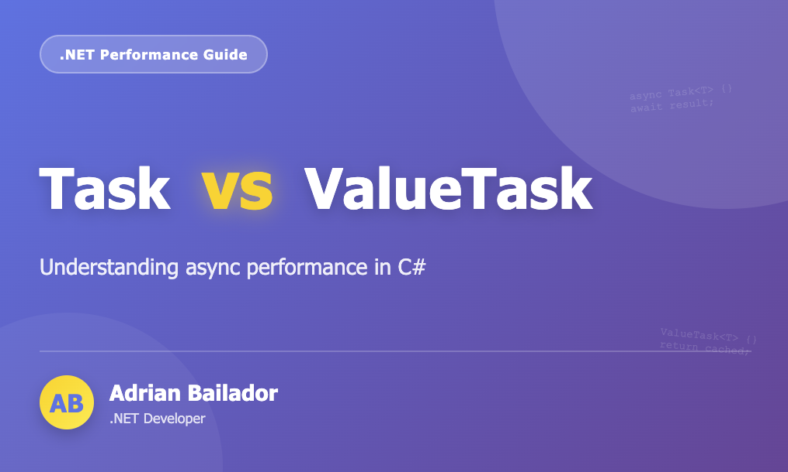

Asynchronous programming is a core part of modern .NET applications. But when it comes to performance-sensitive code, developers often face a difficult question:

**Should I return `Task` or `ValueTask`?**

At first glance, the difference appears trivial. In reality, the wrong choice can lead to unnecessary allocations, reduced throughput, and subtle bugs. This article provides a practical, real-world explanation, with clear rules to apply in your own applications.

---

## 1. What Problem Does `ValueTask` Solve?

Every time a method returns a `Task`, .NET allocates an object on the heap.  
For most applications, this cost is negligible.

But in high-performance scenarios—where the same asynchronous method may be invoked millions of times—these allocations can accumulate and become expensive.

`ValueTask<T>` solves this by being a **value type (`struct`)**, allowing .NET to avoid allocating a heap object when the result is already available synchronously.

---

## 2. Key Differences Between Task and ValueTask

| Feature | Task | ValueTask |
|--------|------|-----------|
| Type | Reference type | Value type |
| Heap allocation | Always | Avoided if completed synchronously |
| Awaitable multiple times | Yes | No |
| Safe to store and reuse | Yes | No |
| Supports pooling | Yes | No (but can wrap pooled Tasks) |
| Ideal scenarios | General async code, I/O operations | Hot paths, synchronous fast-paths |
| Complexity | Low | Higher |

---

## 3. Example: A Good Use Case for `ValueTask`

Below is the classic example of a method that frequently returns synchronously from cache:

```csharp
public ValueTask<string> GetItemAsync(string key)
{
    if (_cache.TryGetValue(key, out var value))
    {
        return new ValueTask<string>(value); // No allocation
    }

    return new ValueTask<string>(LoadFromDatabaseAsync(key));
}
```

If `LoadFromDatabaseAsync` is only rarely called, `ValueTask` reduces the number of heap allocations dramatically.

---

## 4. A Bad Use Case for ValueTask

Use `ValueTask` incorrectly, and you may introduce subtle (and costly) bugs:

```csharp
ValueTask<int> result = GetCachedValueAsync();

var a = await result;
var b = await result; // Not allowed — ValueTask may only be awaited once
```

With `Task`, this is perfectly safe.

---

## 5. Performance Considerations

### When ValueTask Saves Time

`ValueTask` shines when:
- your method returns synchronously at least 80–90% of the time
- the method is called very frequently (hundreds of thousands of calls or more)
- you are inside a hot path such as parsers, protocol decoders, low-level libraries or high-throughput APIs

Removing millions of allocations per second can yield measurable improvements.

### When ValueTask Makes Things Worse

Using `ValueTask` incorrectly can introduce:
- additional copying (because it's a struct)
- more IL instructions
- added complexity for consumers
- the risk of double-await bugs
- unnecessary boxing in generic scenarios

For most applications, these costs outweigh any benefit.

---

## 6. Real-World Guidelines

### Use Task by default

It is simpler, safer, and perfectly adequate for the vast majority of .NET applications.

### Only use ValueTask when:
- you have measured that Task allocation is a bottleneck
- your method often completes synchronously
- your code is part of a high-performance subsystem

### Avoid ValueTask
- in public APIs (unless you really need it)
- when your method is rarely awaited synchronously
- when consumers will store or re-await the result
- when simplicity is more valuable than micro-optimisation

---

## 7. A Practical Example with Both Approaches

### Using Task (recommended for most scenarios)

```csharp
public Task<User> GetUserAsync(Guid id)
{
    return _database.LoadUserAsync(id);
}
```

Clear, safe, conventional.

### Using ValueTask (when data is often cached)

```csharp
public ValueTask<User> GetUserAsync(Guid id)
{
    if (_cache.TryGetValue(id, out var user))
    {
        return new ValueTask<User>(user);
    }

    return new ValueTask<User>(_database.LoadUserAsync(id));
}
```

Avoids allocation in the synchronous path.

---

## 8. The Rule of 90%

A popular rule among .NET performance engineers:

**Only use ValueTask if your method returns synchronously at least 90% of the time and you have benchmarks proving allocation is a bottleneck.**

This rule alone prevents most incorrect uses of `ValueTask`.

---

## 9. Conclusion

`ValueTask` is a powerful tool for high-performance .NET applications, but it is often misunderstood and misused. For most developers and most APIs, `Task` remains the best choice:
- simpler
- safer
- easier to reason about
- suitable for almost all workloads

Use `ValueTask` only when performance measurements justify it, and when you understand its limitations.

You now have a clear, reliable framework for deciding between `Task` and `ValueTask` in your own applications.

---