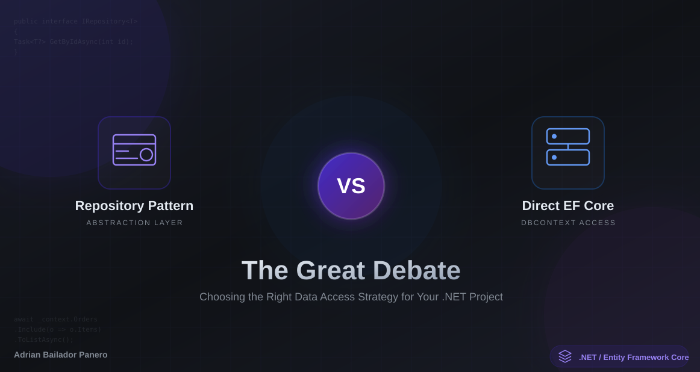

## Introduction

Working with .NET and Entity Framework Core inevitably leads you into one of the community’s most debated topics: Should you use the Repository Pattern, or should you work directly with DbContext? Opinions vary wildly, and it can be difficult to decide which approach is right for your application.

In this article, I’ll guide you through both options using practical examples, clear explanations, and real-world context. We’ll explore their advantages, drawbacks, performance differences, and where each approach genuinely shines. By the end, you’ll be able to make an informed, pragmatic choice that fits the needs of your .NET projects—without unnecessary complexity or over-engineering.

⸻


## Table of Contents

- Understanding the Repository Pattern
- Direct EF Core Approach
- The Case FOR Repository Pattern
- The Case AGAINST Repository Pattern
- Performance Comparison
- Real-World Scenarios
- My Recommendation
- Best Practices

## Understanding the Repository Pattern

The Repository Pattern is a design pattern that creates an abstraction layer between your business logic and data access logic. It encapsulates the logic required to access data sources.

### Basic Repository Implementation

```csharp
// Generic repository interface
public interface IRepository<T> where T : class
{
    Task<T?> GetByIdAsync(int id);
    Task<IEnumerable<T>> GetAllAsync();
    Task<T> AddAsync(T entity);
    Task UpdateAsync(T entity);
    Task DeleteAsync(int id);
    Task<IEnumerable<T>> FindAsync(Expression<Func<T, bool>> predicate);
}

// Generic repository implementation
public class Repository<T> : IRepository<T> where T : class
{
    private readonly ApplicationDbContext _context;
    private readonly DbSet<T> _dbSet;

    public Repository(ApplicationDbContext context)
    {
        _context = context;
        _dbSet = context.Set<T>();
    }

    public async Task<T?> GetByIdAsync(int id)
    {
        return await _dbSet.FindAsync(id);
    }

    public async Task<IEnumerable<T>> GetAllAsync()
    {
        return await _dbSet.ToListAsync();
    }

    public async Task<T> AddAsync(T entity)
    {
        await _dbSet.AddAsync(entity);
        await _context.SaveChangesAsync();
        return entity;
    }

    public async Task UpdateAsync(T entity)
    {
        _dbSet.Update(entity);
        await _context.SaveChangesAsync();
    }

    public async Task DeleteAsync(int id)
    {
        var entity = await GetByIdAsync(id);
        if (entity != null)
        {
            _dbSet.Remove(entity);
            await _context.SaveChangesAsync();
        }
    }

    public async Task<IEnumerable<T>> FindAsync(Expression<Func<T, bool>> predicate)
    {
        return await _dbSet.Where(predicate).ToListAsync();
    }
}
```

### Specific Repository for Complex Queries

```csharp
public interface IOrderRepository : IRepository<Order>
{
    Task<IEnumerable<Order>> GetOrdersByCustomerIdAsync(int customerId);
    Task<IEnumerable<Order>> GetPendingOrdersAsync();
    Task<decimal> GetTotalRevenueByDateRangeAsync(DateTime start, DateTime end);
}

public class OrderRepository : Repository<Order>, IOrderRepository
{
    private readonly ApplicationDbContext _context;

    public OrderRepository(ApplicationDbContext context) : base(context)
    {
        _context = context;
    }

    public async Task<IEnumerable<Order>> GetOrdersByCustomerIdAsync(int customerId)
    {
        return await _context.Orders
            .Include(o => o.OrderItems)
            .ThenInclude(oi => oi.Product)
            .Where(o => o.CustomerId == customerId)
            .OrderByDescending(o => o.OrderDate)
            .ToListAsync();
    }

    public async Task<IEnumerable<Order>> GetPendingOrdersAsync()
    {
        return await _context.Orders
            .Include(o => o.Customer)
            .Where(o => o.Status == OrderStatus.Pending)
            .ToListAsync();
    }

    public async Task<decimal> GetTotalRevenueByDateRangeAsync(DateTime start, DateTime end)
    {
        return await _context.Orders
            .Where(o => o.OrderDate >= start && o.OrderDate <= end)
            .SumAsync(o => o.TotalAmount);
    }
}
```

### Usage in Service Layer

```csharp
public class OrderService
{
    private readonly IOrderRepository _orderRepository;

    public OrderService(IOrderRepository orderRepository)
    {
        _orderRepository = orderRepository;
    }

    public async Task<OrderDto> CreateOrderAsync(CreateOrderDto dto)
    {
        var order = new Order
        {
            CustomerId = dto.CustomerId,
            OrderDate = DateTime.UtcNow,
            Status = OrderStatus.Pending,
            TotalAmount = dto.TotalAmount
        };

        var createdOrder = await _orderRepository.AddAsync(order);
        return MapToDto(createdOrder);
    }

    public async Task<IEnumerable<OrderDto>> GetCustomerOrdersAsync(int customerId)
    {
        var orders = await _orderRepository.GetOrdersByCustomerIdAsync(customerId);
        return orders.Select(MapToDto);
    }
}
```

## Direct EF Core Approach

The direct approach means using DbContext directly in your services without an abstraction layer.

### Service with Direct DbContext

```csharp
public class OrderService
{
    private readonly ApplicationDbContext _context;

    public OrderService(ApplicationDbContext context)
    {
        _context = context;
    }

    public async Task<OrderDto> CreateOrderAsync(CreateOrderDto dto)
    {
        var order = new Order
        {
            CustomerId = dto.CustomerId,
            OrderDate = DateTime.UtcNow,
            Status = OrderStatus.Pending,
            TotalAmount = dto.TotalAmount
        };

        _context.Orders.Add(order);
        await _context.SaveChangesAsync();
        
        return MapToDto(order);
    }

    public async Task<IEnumerable<OrderDto>> GetCustomerOrdersAsync(int customerId)
    {
        var orders = await _context.Orders
            .Include(o => o.OrderItems)
            .ThenInclude(oi => oi.Product)
            .Where(o => o.CustomerId == customerId)
            .OrderByDescending(o => o.OrderDate)
            .ToListAsync();

        return orders.Select(MapToDto);
    }

    public async Task<IEnumerable<OrderDto>> GetPendingOrdersAsync()
    {
        return await _context.Orders
            .Include(o => o.Customer)
            .Where(o => o.Status == OrderStatus.Pending)
            .Select(o => new OrderDto
            {
                Id = o.Id,
                CustomerName = o.Customer.Name,
                OrderDate = o.OrderDate,
                Status = o.Status.ToString(),
                TotalAmount = o.TotalAmount
            })
            .ToListAsync();
    }

    public async Task<decimal> GetTotalRevenueByDateRangeAsync(DateTime start, DateTime end)
    {
        return await _context.Orders
            .Where(o => o.OrderDate >= start && o.OrderDate <= end)
            .SumAsync(o => o.TotalAmount);
    }
}
```

## The Case FOR Repository Pattern

### 1. **Testability**

Repository Pattern makes unit testing easier by allowing you to mock the repository:

```csharp
public class OrderServiceTests
{
    [Fact]
    public async Task CreateOrder_ShouldReturnOrderDto()
    {
        // Arrange
        var mockRepository = new Mock<IOrderRepository>();
        var expectedOrder = new Order { Id = 1, CustomerId = 1 };
        
        mockRepository
            .Setup(r => r.AddAsync(It.IsAny<Order>()))
            .ReturnsAsync(expectedOrder);

        var service = new OrderService(mockRepository.Object);
        var dto = new CreateOrderDto { CustomerId = 1, TotalAmount = 100 };

        // Act
        var result = await service.CreateOrderAsync(dto);

        // Assert
        Assert.NotNull(result);
        mockRepository.Verify(r => r.AddAsync(It.IsAny<Order>()), Times.Once);
    }
}
```

### 2. **Separation of Concerns**

Clear separation between business logic and data access:

```csharp
// Business logic layer
public class OrderProcessingService
{
    private readonly IOrderRepository _orderRepository;
    private readonly IPaymentService _paymentService;
    private readonly IEmailService _emailService;

    public OrderProcessingService(
        IOrderRepository orderRepository,
        IPaymentService paymentService,
        IEmailService emailService)
    {
        _orderRepository = orderRepository;
        _paymentService = paymentService;
        _emailService = emailService;
    }

    public async Task<bool> ProcessOrderAsync(int orderId)
    {
        // Business logic here - clean and focused
        var order = await _orderRepository.GetByIdAsync(orderId);
        if (order == null) return false;

        var paymentResult = await _paymentService.ProcessPaymentAsync(order);
        if (!paymentResult.Success) return false;

        order.Status = OrderStatus.Paid;
        await _orderRepository.UpdateAsync(order);

        await _emailService.SendOrderConfirmationAsync(order);
        return true;
    }
}
```

### 3. **Centralized Data Access Logic**

All database queries in one place, making maintenance easier:

```csharp
public class ProductRepository : Repository<Product>, IProductRepository
{
    private readonly ApplicationDbContext _context;

    public ProductRepository(ApplicationDbContext context) : base(context)
    {
        _context = context;
    }

    // Centralized complex query
    public async Task<IEnumerable<Product>> GetActiveProductsWithStockAsync()
    {
        return await _context.Products
            .Include(p => p.Category)
            .Include(p => p.Supplier)
            .Where(p => p.IsActive && p.Stock > 0)
            .OrderBy(p => p.Name)
            .ToListAsync();
    }

    // If the query logic changes, you only update it here
    public async Task<IEnumerable<Product>> GetLowStockProductsAsync(int threshold = 10)
    {
        return await _context.Products
            .Where(p => p.IsActive && p.Stock <= threshold)
            .Include(p => p.Supplier)
            .ToListAsync();
    }
}
```

### 4. **Database Provider Independence**

Easier to switch between different data sources:

```csharp
// Interface remains the same
public interface ICustomerRepository
{
    Task<Customer?> GetByEmailAsync(string email);
    Task<IEnumerable<Customer>> GetActiveCustomersAsync();
}

// SQL Server implementation
public class SqlServerCustomerRepository : ICustomerRepository
{
    private readonly ApplicationDbContext _context;
    
    public async Task<Customer?> GetByEmailAsync(string email)
    {
        return await _context.Customers
            .FirstOrDefaultAsync(c => c.Email == email);
    }
    
    public async Task<IEnumerable<Customer>> GetActiveCustomersAsync()
    {
        return await _context.Customers
            .Where(c => c.IsActive)
            .ToListAsync();
    }
}

// MongoDB implementation (hypothetical)
public class MongoCustomerRepository : ICustomerRepository
{
    private readonly IMongoCollection<Customer> _collection;
    
    public async Task<Customer?> GetByEmailAsync(string email)
    {
        return await _collection
            .Find(c => c.Email == email)
            .FirstOrDefaultAsync();
    }
    
    public async Task<IEnumerable<Customer>> GetActiveCustomersAsync()
    {
        return await _collection
            .Find(c => c.IsActive)
            .ToListAsync();
    }
}
```

## The Case AGAINST Repository Pattern

### 1. **EF Core is Already a Repository Pattern**

DbContext and DbSet already implement the Repository and Unit of Work patterns:

```csharp
// DbContext IS a Unit of Work
public class ApplicationDbContext : DbContext
{
    // DbSet<T> IS a Repository
    public DbSet<Order> Orders { get; set; }
    public DbSet<Customer> Customers { get; set; }
    public DbSet<Product> Products { get; set; }

    // SaveChanges manages the transaction
    public override async Task<int> SaveChangesAsync(CancellationToken cancellationToken = default)
    {
        return await base.SaveChangesAsync(cancellationToken);
    }
}
```

### 2. **Over-Abstraction and Unnecessary Complexity**

Adding a repository layer can create unnecessary indirection:

```csharp
// With Repository: 3 layers of indirection
Controller -> Service -> Repository -> DbContext

// Direct EF Core: 2 layers
Controller -> Service (with DbContext)

// Example of over-abstraction
public class CustomerRepository : ICustomerRepository
{
    private readonly ApplicationDbContext _context;
    
    // This method literally just wraps DbContext
    public async Task<Customer?> GetByIdAsync(int id)
    {
        return await _context.Customers.FindAsync(id); // Pointless wrapper
    }
}
```

### 3. **Loss of EF Core Power Features**

Repositories can hide powerful EF Core features:

```csharp
// Direct EF Core - Full power of IQueryable
public async Task<PagedResult<ProductDto>> GetProductsAsync(ProductFilter filter)
{
    IQueryable<Product> query = _context.Products
        .Include(p => p.Category)
        .AsQueryable();

    // Dynamic filtering
    if (!string.IsNullOrEmpty(filter.CategoryName))
        query = query.Where(p => p.Category.Name == filter.CategoryName);

    if (filter.MinPrice.HasValue)
        query = query.Where(p => p.Price >= filter.MinPrice.Value);

    if (filter.MaxPrice.HasValue)
        query = query.Where(p => p.Price <= filter.MaxPrice.Value);

    // Efficient projection - only selects needed columns
    var pagedQuery = query
        .OrderBy(p => p.Name)
        .Skip((filter.Page - 1) * filter.PageSize)
        .Take(filter.PageSize)
        .Select(p => new ProductDto
        {
            Id = p.Id,
            Name = p.Name,
            Price = p.Price,
            CategoryName = p.Category.Name
        });

    var items = await pagedQuery.ToListAsync();
    var totalCount = await query.CountAsync();

    return new PagedResult<ProductDto>
    {
        Items = items,
        TotalCount = totalCount,
        Page = filter.Page,
        PageSize = filter.PageSize
    };
}

// With Repository - You'd need to expose IQueryable or create countless methods
public interface IProductRepository
{
    IQueryable<Product> GetQueryable(); // Leaky abstraction
    // OR
    Task<IEnumerable<Product>> GetByCategoryAsync(string category);
    Task<IEnumerable<Product>> GetByPriceRangeAsync(decimal min, decimal max);
    Task<IEnumerable<Product>> GetByCategoryAndPriceAsync(string category, decimal min, decimal max);
    // ... endless combinations
}
```

### 4. **Testing EF Core is Easier Than You Think**

With InMemory provider or SQLite, testing is straightforward:

```csharp
public class OrderServiceTests
{
    private ApplicationDbContext CreateDbContext()
    {
        var options = new DbContextOptionsBuilder<ApplicationDbContext>()
            .UseInMemoryDatabase(databaseName: Guid.NewGuid().ToString())
            .Options;

        return new ApplicationDbContext(options);
    }

    [Fact]
    public async Task GetPendingOrders_ShouldReturnOnlyPendingOrders()
    {
        // Arrange
        await using var context = CreateDbContext();
        context.Orders.AddRange(
            new Order { Id = 1, Status = OrderStatus.Pending },
            new Order { Id = 2, Status = OrderStatus.Completed },
            new Order { Id = 3, Status = OrderStatus.Pending }
        );
        await context.SaveChangesAsync();

        var service = new OrderService(context);

        // Act
        var result = await service.GetPendingOrdersAsync();

        // Assert
        Assert.Equal(2, result.Count());
        Assert.All(result, o => Assert.Equal("Pending", o.Status));
    }
}
```

### 5. **Performance Overhead**

Every abstraction adds overhead:

```csharp
// Repository approach - Multiple layers of execution
var orders = await _orderRepository.GetOrdersByCustomerIdAsync(customerId);
// Execution: Controller -> Service -> Repository -> DbContext -> Database

// Direct DbContext - Fewer layers
var orders = await _context.Orders
    .Where(o => o.CustomerId == customerId)
    .ToListAsync();
// Execution: Controller -> Service (DbContext) -> Database
```

## Performance Comparison

Let’s look at a real benchmark comparing both approaches:

```csharp
[MemoryDiagnoser]
public class RepositoryVsDirectBenchmark
{
    private ApplicationDbContext _context;
    private IOrderRepository _repository;

    [GlobalSetup]
    public void Setup()
    {
        var options = new DbContextOptionsBuilder<ApplicationDbContext>()
            .UseInMemoryDatabase("BenchmarkDb")
            .Options;

        _context = new ApplicationDbContext(options);
        _repository = new OrderRepository(_context);

        // Seed data
        for (int i = 1; i <= 1000; i++)
        {
            _context.Orders.Add(new Order
            {
                Id = i,
                CustomerId = i % 100,
                OrderDate = DateTime.UtcNow.AddDays(-i),
                TotalAmount = i * 10
            });
        }
        _context.SaveChanges();
    }

    [Benchmark]
    public async Task<int> WithRepository()
    {
        var orders = await _repository.FindAsync(o => o.CustomerId == 50);
        return orders.Count();
    }

    [Benchmark]
    public async Task<int> WithDirectDbContext()
    {
        var orders = await _context.Orders
            .Where(o => o.CustomerId == 50)
            .ToListAsync();
        return orders.Count;
    }

    [Benchmark]
    public async Task<int> WithDirectDbContext_Projection()
    {
        // Most efficient - only selects needed data
        return await _context.Orders
            .Where(o => o.CustomerId == 50)
            .CountAsync();
    }
}

/*
Results (typical):
|                        Method |     Mean |   Error |  StdDev |  Gen 0 | Allocated |
|------------------------------ |---------:|--------:|--------:|-------:|----------:|
|                WithRepository | 125.4 μs | 2.1 μs  | 1.9 μs  | 2.4414 |   15.6 KB |
|          WithDirectDbContext  | 118.2 μs | 1.8 μs  | 1.6 μs  | 2.1973 |   14.2 KB |
| WithDirectDbContext_Projection|  95.3 μs | 1.2 μs  | 1.1 μs  | 0.9766 |    6.1 KB |
*/
```

## Real-World Scenarios

### Scenario 1: Simple CRUD Application

**Best Choice: Direct EF Core**

```csharp
// For a simple blog or todo app, repositories add unnecessary complexity
public class BlogPostService
{
    private readonly ApplicationDbContext _context;

    public BlogPostService(ApplicationDbContext context)
    {
        _context = context;
    }

    public async Task<IEnumerable<BlogPostDto>> GetRecentPostsAsync(int count = 10)
    {
        return await _context.BlogPosts
            .Include(p => p.Author)
            .Include(p => p.Category)
            .Where(p => p.IsPublished)
            .OrderByDescending(p => p.PublishedDate)
            .Take(count)
            .Select(p => new BlogPostDto
            {
                Id = p.Id,
                Title = p.Title,
                Excerpt = p.Content.Substring(0, 200),
                AuthorName = p.Author.Name,
                CategoryName = p.Category.Name,
                PublishedDate = p.PublishedDate
            })
            .ToListAsync();
    }
}
```

### Scenario 2: Complex Enterprise Application

**Best Choice: Repository Pattern (with caveats)**

```csharp
// Multiple teams, complex business logic, need for abstraction
public interface IOrderRepository
{
    Task<Order?> GetOrderWithDetailsAsync(int orderId);
    Task<IEnumerable<Order>> GetOrdersByStatusAsync(OrderStatus status);
    Task<OrderStatistics> GetOrderStatisticsAsync(DateTime from, DateTime to);
}

public class OrderProcessingService
{
    private readonly IOrderRepository _orderRepository;
    private readonly IPaymentRepository _paymentRepository;
    private readonly IInventoryRepository _inventoryRepository;
    private readonly INotificationService _notificationService;

    public OrderProcessingService(
        IOrderRepository orderRepository,
        IPaymentRepository paymentRepository,
        IInventoryRepository inventoryRepository,
        INotificationService notificationService)
    {
        _orderRepository = orderRepository;
        _paymentRepository = paymentRepository;
        _inventoryRepository = inventoryRepository;
        _notificationService = notificationService;
    }

    public async Task<ProcessOrderResult> ProcessOrderAsync(int orderId)
    {
        var order = await _orderRepository.GetOrderWithDetailsAsync(orderId);
        if (order == null)
            return ProcessOrderResult.NotFound();

        // Complex business logic coordinating multiple repositories
        var inventoryCheck = await _inventoryRepository.CheckAvailabilityAsync(order.OrderItems);
        if (!inventoryCheck.AllAvailable)
            return ProcessOrderResult.InsufficientInventory(inventoryCheck.UnavailableItems);

        var payment = await _paymentRepository.ProcessPaymentAsync(order);
        if (!payment.Success)
            return ProcessOrderResult.PaymentFailed(payment.ErrorMessage);

        await _inventoryRepository.ReserveItemsAsync(order.OrderItems);
        order.Status = OrderStatus.Processing;
        await _orderRepository.UpdateAsync(order);

        await _notificationService.SendOrderConfirmationAsync(order);

        return ProcessOrderResult.Success(order);
    }
}
```

### Scenario 3: Microservices Architecture

**Best Choice: Hybrid Approach**

```csharp
// Use repositories for cross-cutting concerns, direct DbContext for simple queries
public class OrderService
{
    private readonly ApplicationDbContext _context;
    private readonly ICacheRepository _cacheRepository;
    private readonly IAuditRepository _auditRepository;

    public OrderService(
        ApplicationDbContext context,
        ICacheRepository cacheRepository,
        IAuditRepository auditRepository)
    {
        _context = context;
        _cacheRepository = cacheRepository;
        _auditRepository = auditRepository;
    }

    public async Task<OrderDto?> GetOrderAsync(int orderId)
    {
        // Check cache first (repository for cross-cutting concern)
        var cached = await _cacheRepository.GetAsync<OrderDto>($"order:{orderId}");
        if (cached != null)
            return cached;

        // Direct DbContext for data access
        var order = await _context.Orders
            .Include(o => o.Customer)
            .Include(o => o.OrderItems)
            .FirstOrDefaultAsync(o => o.Id == orderId);

        if (order == null)
            return null;

        var dto = MapToDto(order);

        // Cache the result
        await _cacheRepository.SetAsync($"order:{orderId}", dto, TimeSpan.FromMinutes(10));

        return dto;
    }

    public async Task<Order> CreateOrderAsync(CreateOrderDto createDto)
    {
        var order = MapToOrder(createDto);

        _context.Orders.Add(order);
        await _context.SaveChangesAsync();

        // Audit logging through repository
        await _auditRepository.LogAsync(new AuditEntry
        {
            EntityType = nameof(Order),
            EntityId = order.Id.ToString(),
            Action = "Create",
            Timestamp = DateTime.UtcNow
        });

        return order;
    }
}
```

## My Recommendation: The Pragmatic Approach

After years of working with both approaches, here’s my take:

### Use Direct EF Core When:

1. **Simple applications** - CRUD operations, small teams
1. **Prototypes or MVPs** - Speed of development matters more
1. **Read-heavy operations** - You need IQueryable’s full power
1. **Performance is critical** - Every layer adds overhead
1. **Small team** - Everyone understands EF Core well

```csharp
// Simple, clean, effective
public class ProductService
{
    private readonly ApplicationDbContext _context;

    public ProductService(ApplicationDbContext context)
    {
        _context = context;
    }

    public async Task<IEnumerable<ProductDto>> SearchProductsAsync(string searchTerm)
    {
        return await _context.Products
            .Where(p => p.Name.Contains(searchTerm) || p.Description.Contains(searchTerm))
            .Select(p => new ProductDto
            {
                Id = p.Id,
                Name = p.Name,
                Price = p.Price
            })
            .ToListAsync();
    }
}
```

### Use Repository Pattern When:

1. **Complex business logic** - Multiple data sources, complex transactions
1. **Large teams** - Need clear boundaries and contracts
1. **Multiple data sources** - SQL + NoSQL + External APIs
1. **Heavy testing requirements** - Need to mock data layer easily
1. **Domain-Driven Design** - Following DDD principles

```csharp
// Clear abstraction for complex scenarios
public interface IOrderRepository
{
    Task<Order?> GetByIdWithFullDetailsAsync(int orderId);
    Task<IEnumerable<Order>> GetOrdersRequiringAttentionAsync();
    Task<bool> CanFulfillOrderAsync(Order order);
}

public class OrderRepository : IOrderRepository
{
    private readonly ApplicationDbContext _context;
    private readonly IInventoryService _inventoryService;

    public async Task<bool> CanFulfillOrderAsync(Order order)
    {
        // Complex logic combining database queries and external service calls
        var items = await _context.OrderItems
            .Where(oi => oi.OrderId == order.Id)
            .Include(oi => oi.Product)
            .ToListAsync();

        foreach (var item in items)
        {
            var available = await _inventoryService.CheckStockAsync(item.ProductId, item.Quantity);
            if (!available)
                return false;
        }

        return true;
    }
}
```

### The Hybrid Approach (My Favorite)

```csharp
// Use repositories ONLY when they add value
public class OrderService
{
    private readonly ApplicationDbContext _context;
    private readonly ISpecificationEvaluator _specificationEvaluator;

    public OrderService(ApplicationDbContext context, ISpecificationEvaluator specificationEvaluator)
    {
        _context = context;
        _specificationEvaluator = specificationEvaluator;
    }

    // Simple queries: direct DbContext
    public async Task<Order?> GetOrderByIdAsync(int id)
    {
        return await _context.Orders
            .Include(o => o.Customer)
            .FirstOrDefaultAsync(o => o.Id == id);
    }

    // Complex queries: use Specification Pattern (lightweight abstraction)
    public async Task<IEnumerable<Order>> GetOrdersAsync(ISpecification<Order> specification)
    {
        return await _specificationEvaluator
            .GetQuery(_context.Orders, specification)
            .ToListAsync();
    }
}

// Specification Pattern - reusable query logic without full repository
public class OrdersWithItemsSpecification : Specification<Order>
{
    public OrdersWithItemsSpecification(int customerId)
    {
        AddInclude(o => o.OrderItems);
        AddInclude("OrderItems.Product");
        AddCriteria(o => o.CustomerId == customerId);
        ApplyOrderByDescending(o => o.OrderDate);
    }
}
```

## Best Practices

### 1. **Don’t Leak IQueryable from Repositories**

```csharp
// BAD - Leaky abstraction
public interface IProductRepository
{
    IQueryable<Product> GetAll();
}

// GOOD - Encapsulated query
public interface IProductRepository
{
    Task<IEnumerable<Product>> GetActiveProductsAsync();
    Task<IEnumerable<Product>> SearchAsync(string searchTerm);
}
```

### 2. **Use Specifications for Complex Queries**

```csharp
public interface ISpecification<T>
{
    Expression<Func<T, bool>>? Criteria { get; }
    List<Expression<Func<T, object>>> Includes { get; }
    List<string> IncludeStrings { get; }
}

public class ActiveProductsWithCategorySpecification : ISpecification<Product>
{
    public Expression<Func<Product, bool>> Criteria => p => p.IsActive;

    public List<Expression<Func<Product, object>>> Includes { get; } = new()
    {
        p => p.Category
    };

    public List<string> IncludeStrings { get; } = new();
}
```

### 3. **Avoid Generic Repositories for Everything**

```csharp
// BAD - Generic repository trying to do everything
public class Repository<T> : IRepository<T> where T : class
{
    // 50+ methods trying to cover all possible scenarios
}

// GOOD - Specific repositories for specific needs
public interface IOrderRepository
{
    Task<Order?> GetByIdAsync(int id);
    Task<IEnumerable<Order>> GetPendingOrdersAsync();
    Task<OrderStatistics> GetStatisticsAsync(DateTime from, DateTime to);
    // Only methods you actually need
}
```

### 4. **Consider Using MediatR for Complex Operations**

```csharp
// Clean separation without heavy repository layer
public class GetOrderByIdQuery : IRequest<OrderDto?>
{
    public int OrderId { get; set; }
}

public class GetOrderByIdQueryHandler : IRequestHandler<GetOrderByIdQuery, OrderDto?>
{
    private readonly ApplicationDbContext _context;

    public GetOrderByIdQueryHandler(ApplicationDbContext context)
    {
        _context = context;
    }

    public async Task<OrderDto?> Handle(GetOrderByIdQuery request, CancellationToken cancellationToken)
    {
        return await _context.Orders
            .Include(o => o.Customer)
            .Where(o => o.Id == request.OrderId)
            .Select(o => new OrderDto
            {
                Id = o.Id,
                CustomerName = o.Customer.Name,
                TotalAmount = o.TotalAmount
            })
            .FirstOrDefaultAsync(cancellationToken);
    }
}
```

## Conclusion

There’s no universal answer to the Repository vs Direct EF Core debate. The best approach depends on your specific scenario:

- **Small projects, simple CRUD**: Direct EF Core is cleaner and faster
- **Large enterprise applications**: Repository Pattern provides structure
- **Most real-world apps**: A hybrid approach works best

**My advice**: Start simple with direct DbContext. Add repositories only when you genuinely need the abstraction. Don’t over-engineer prematurely, but don’t be afraid to refactor when complexity demands it.

Remember: **EF Core is already well-designed. Respect its patterns, and only abstract when you’re adding real value, not just layers.**

What approach do you prefer? Let me know in the comments!

-----

**Further Reading:**

- [EF Core Documentation](https://learn.microsoft.com/en-us/ef/core/)
- [Specification Pattern in .NET](https://ardalis.com/specification-pattern/)
- [CQRS Pattern](https://martinfowler.com/bliki/CQRS.html)

