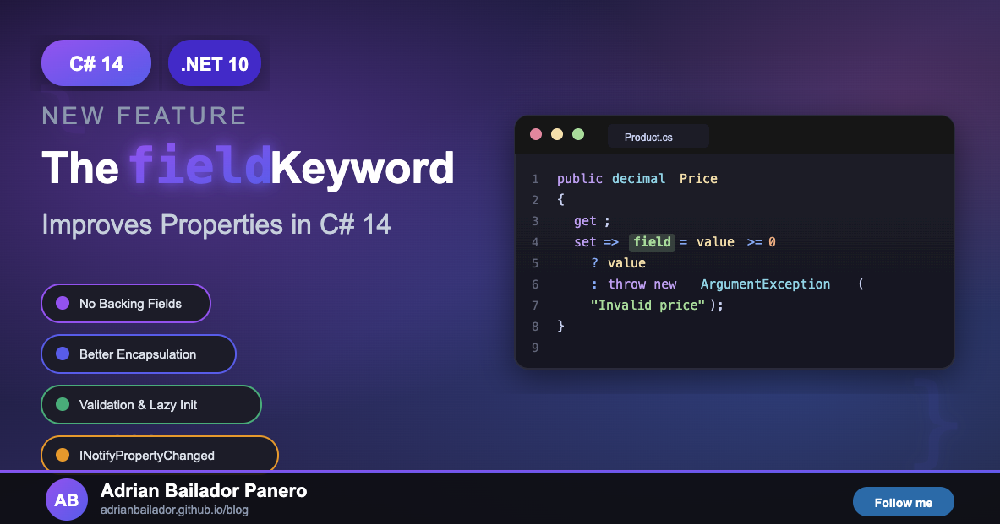

C# 14, released alongside .NET 10, introduces a powerful contextual keyword that developers have been waiting for since 2008: the `field` keyword. This feature bridges the gap between the simplicity of auto-implemented properties and the flexibility of full properties with explicit backing fields.

## The Problem: The Auto-Property Dilemma

Since their introduction in C# 3.0, auto-implemented properties have been a favourite tool for reducing boilerplate code:

```csharp
public class Person
{
    public string FirstName { get; set; }
    public int Age { get; set; }
}
```

Behind the scenes, the compiler generates a private backing field for each property. This works brilliantly for simple scenarios, but what happens when you need to add validation, change notification, or any custom logic?

Before C# 14, you had to convert your elegant auto-property into a verbose full property:

```csharp
public class Person
{
    private string _firstName;
    private int _age;

    public string FirstName
    {
        get => _firstName;
        set
        {
            if (string.IsNullOrWhiteSpace(value))
                throw new ArgumentException("First name cannot be empty.");
            _firstName = value;
        }
    }

    public int Age
    {
        get => _age;
        set
        {
            if (value < 0 || value > 150)
                throw new ArgumentOutOfRangeException(nameof(value), "Age must be between 0 and 150.");
            _age = value;
        }
    }
}
```

This approach has several drawbacks:

- **More boilerplate code**: You must declare and maintain separate backing fields
- **Risk of bypassing validation**: Other methods in the class can accidentally use `_firstName` instead of `FirstName`, bypassing your validation logic
- **Inconsistent naming**: You need to maintain naming conventions between fields and properties

## The Solution: The `field` Keyword

C# 14 introduces the `field` contextual keyword, which provides direct access to the compiler-generated backing field within property accessors. This elegant solution lets you add custom logic whilst maintaining the conciseness of auto-properties.

```csharp
public class Person
{
    public string FirstName
    {
        get;
        set
        {
            if (string.IsNullOrWhiteSpace(value))
                throw new ArgumentException("First name cannot be empty.");
            field = value;
        }
    }

    public int Age
    {
        get;
        set
        {
            if (value < 0 || value > 150)
                throw new ArgumentOutOfRangeException(nameof(value), "Age must be between 0 and 150.");
            field = value;
        }
    }
}
```

Notice how the getter remains auto-implemented (`get;`) whilst the setter contains custom logic. The `field` keyword refers to the compiler-generated backing field, eliminating the need for explicit field declarations.

## Key Benefits

### 1. Encapsulated Backing Fields

The backing field created by the compiler is only accessible through the `field` keyword within the property's accessors. This prevents accidental misuse from other methods or properties:

```csharp
public class BankAccount
{
    public decimal Balance
    {
        get;
        set
        {
            if (value < 0)
                throw new InvalidOperationException("Balance cannot be negative.");
            field = value;
        }
    }

    public void ProcessTransaction(decimal amount)
    {
        // You MUST use the property, ensuring validation always runs
        Balance += amount;
        
        // This would NOT compile - field is not accessible here:
        // field += amount;
    }
}
```

### 2. Reduced Boilerplate

The code reduction is significant. Consider a ViewModel with multiple properties requiring `INotifyPropertyChanged`:

**Before C# 14:**

```csharp
public class CustomerViewModel : INotifyPropertyChanged
{
    private string _name;
    private string _email;
    private int _orderCount;

    public string Name
    {
        get => _name;
        set
        {
            if (_name != value)
            {
                _name = value;
                OnPropertyChanged();
            }
        }
    }

    public string Email
    {
        get => _email;
        set
        {
            if (_email != value)
            {
                _email = value;
                OnPropertyChanged();
            }
        }
    }

    public int OrderCount
    {
        get => _orderCount;
        set
        {
            if (_orderCount != value)
            {
                _orderCount = value;
                OnPropertyChanged();
            }
        }
    }

    public event PropertyChangedEventHandler? PropertyChanged;

    protected virtual void OnPropertyChanged([CallerMemberName] string? propertyName = null)
    {
        PropertyChanged?.Invoke(this, new PropertyChangedEventArgs(propertyName));
    }
}
```

**With C# 14:**

```csharp
public class CustomerViewModel : INotifyPropertyChanged
{
    public string Name
    {
        get;
        set
        {
            if (field != value)
            {
                field = value;
                OnPropertyChanged();
            }
        }
    }

    public string Email
    {
        get;
        set
        {
            if (field != value)
            {
                field = value;
                OnPropertyChanged();
            }
        }
    }

    public int OrderCount
    {
        get;
        set
        {
            if (field != value)
            {
                field = value;
                OnPropertyChanged();
            }
        }
    }

    public event PropertyChangedEventHandler? PropertyChanged;

    protected virtual void OnPropertyChanged([CallerMemberName] string? propertyName = null)
    {
        PropertyChanged?.Invoke(this, new PropertyChangedEventArgs(propertyName));
    }
}
```

### 3. Flexible Accessor Combinations

You can mix auto-implemented and custom accessors in any combination:

```csharp
public class Product
{
    // Auto getter, custom setter with validation
    public decimal Price
    {
        get;
        set => field = value >= 0 
            ? value 
            : throw new ArgumentOutOfRangeException(nameof(value), "Price cannot be negative.");
    }

    // Custom getter with lazy initialisation, auto setter
    public string Description
    {
        get => field ??= "No description available";
        set;
    }

    // Both accessors custom
    public int Stock
    {
        get
        {
            Console.WriteLine($"Stock accessed: {field}");
            return field;
        }
        set
        {
            if (value < 0)
                throw new ArgumentOutOfRangeException(nameof(value));
            Console.WriteLine($"Stock changed from {field} to {value}");
            field = value;
        }
    }
}
```

## Practical Use Cases

### Validation

The most common use case is adding input validation without losing the simplicity of auto-properties:

```csharp
public class EmailConfiguration
{
    public string SmtpServer
    {
        get;
        set => field = !string.IsNullOrWhiteSpace(value) 
            ? value 
            : throw new ArgumentException("SMTP server cannot be empty.");
    }

    public int Port
    {
        get;
        set => field = value is >= 1 and <= 65535 
            ? value 
            : throw new ArgumentOutOfRangeException(nameof(value), "Port must be between 1 and 65535.");
    }

    public string SenderEmail
    {
        get;
        set
        {
            if (!IsValidEmail(value))
                throw new ArgumentException("Invalid email format.");
            field = value;
        }
    }

    private static bool IsValidEmail(string email) =>
        !string.IsNullOrWhiteSpace(email) && email.Contains('@');
}
```

### Lazy Initialisation

The `field` keyword works elegantly with null-coalescing assignment for lazy initialisation:

```csharp
public class ReportGenerator
{
    public ILogger Logger
    {
        get => field ??= new ConsoleLogger();
        set;
    }

    public List<string> CachedReports
    {
        get => field ??= LoadReportsFromDatabase();
        set;
    }

    private List<string> LoadReportsFromDatabase()
    {
        Console.WriteLine("Loading reports from database...");
        return new List<string> { "Q1 Report", "Q2 Report", "Q3 Report" };
    }
}
```

### Change Notification (INotifyPropertyChanged)

As mentioned earlier, this is one of the most impactful use cases, particularly for MVVM applications:

```csharp
public class SettingsViewModel : INotifyPropertyChanged
{
    public bool IsDarkMode
    {
        get;
        set
        {
            if (field != value)
            {
                field = value;
                OnPropertyChanged();
                ApplyTheme(value);
            }
        }
    }

    public int FontSize
    {
        get;
        set
        {
            if (field != value && value is >= 8 and <= 72)
            {
                field = value;
                OnPropertyChanged();
            }
        }
    }

    private void ApplyTheme(bool isDark) =>
        Console.WriteLine($"Theme changed to: {(isDark ? "Dark" : "Light")}");

    public event PropertyChangedEventHandler? PropertyChanged;

    protected virtual void OnPropertyChanged([CallerMemberName] string? propertyName = null) =>
        PropertyChanged?.Invoke(this, new PropertyChangedEventArgs(propertyName));
}
```

### Data Transformation

You can use `field` to transform or normalise data during assignment:

```csharp
public class UserProfile
{
    public string Username
    {
        get;
        set => field = value?.Trim().ToLowerInvariant() 
            ?? throw new ArgumentNullException(nameof(value));
    }

    public string PhoneNumber
    {
        get;
        set => field = NormalisePhoneNumber(value);
    }

    private static string NormalisePhoneNumber(string? phone)
    {
        if (string.IsNullOrWhiteSpace(phone))
            return string.Empty;
        
        // Remove all non-digit characters
        return new string(phone.Where(char.IsDigit).ToArray());
    }
}
```

## Important Considerations

### Property Initialisers

When using a property initialiser with the `field` keyword, the initialiser directly sets the backing field without invoking the setter:

```csharp
public class Configuration
{
    public int MaxRetries
    {
        get;
        set
        {
            Console.WriteLine("Setter invoked!"); // NOT called during initialisation
            field = value;
        }
    } = 3; // Directly sets the backing field
}
```

If you need the setter logic to run during initialisation, assign the value in the constructor instead:

```csharp
public class Configuration
{
    public Configuration()
    {
        MaxRetries = 3; // This WILL invoke the setter
    }

    public int MaxRetries
    {
        get;
        set
        {
            Console.WriteLine("Setter invoked!");
            field = value;
        }
    }
}
```

### Naming Conflicts

Since `field` is a contextual keyword (not a reserved word), you might have existing code with variables or fields named `field`. Within property accessors, the keyword takes precedence:

```csharp
public class Legacy
{
    private int field; // Existing field named "field"

    public int Value
    {
        get;
        set
        {
            field = value; // Refers to the backing field, NOT the private field
            
            // To access the class member named "field", use:
            this.field = value; // or @field = value;
        }
    }
}
```

The compiler will issue a warning if it detects potential ambiguity, prompting you to use `@field` or `this.field` to reference your explicitly declared member.

### Not Available for Events

The `field` keyword is specifically designed for properties and indexers. It cannot be used in event add/remove accessors.

### Thread Safety

The `field` keyword provides no additional thread-safety guarantees. If you need thread-safe lazy initialisation, continue using `Lazy<T>`:

```csharp
public class ThreadSafeService
{
    private readonly Lazy<ExpensiveResource> _resource = new(() => new ExpensiveResource());

    public ExpensiveResource Resource => _resource.Value;
}
```

## Getting Started

To use the `field` keyword, you need:

- **.NET 10** or later (or .NET 9 with `preview` language version)
- **C# 14** language version

Update your project file:

```xml
<Project Sdk="Microsoft.NET.Sdk">
  <PropertyGroup>
    <TargetFramework>net10.0</TargetFramework>
    <!-- Or for .NET 9 preview -->
    <!-- <TargetFramework>net9.0</TargetFramework> -->
    <!-- <LangVersion>preview</LangVersion> -->
  </PropertyGroup>
</Project>
```

## Summary

The `field` keyword in C# 14 represents a thoughtful evolution of the property syntax, providing:

- **Cleaner code**: No need to declare explicit backing fields
- **Better encapsulation**: Backing fields are only accessible within property accessors
- **Flexibility**: Mix auto-implemented and custom accessors as needed
- **Backwards compatibility**: Works seamlessly with existing code and patterns

This feature is particularly valuable for:

- **Validation scenarios**: Add input checking without boilerplate
- **MVVM applications**: Simplify `INotifyPropertyChanged` implementations
- **Lazy initialisation**: Clean syntax for deferred object creation
- **Data transformation**: Normalise or transform values during assignment

The `field` keyword strikes an elegant balance between simplicity and control, making it a welcome addition to the C# language that developers will find themselves using regularly.

## References

- [Microsoft Learn: The field contextual keyword](https://learn.microsoft.com/en-us/dotnet/csharp/language-reference/keywords/field)
- [What's new in C# 14](https://learn.microsoft.com/en-us/dotnet/csharp/whats-new/csharp-14)
- [C# Language Specification: Field-backed properties](https://learn.microsoft.com/en-us/dotnet/csharp/language-reference/proposals/csharp-14.0/field-keyword)