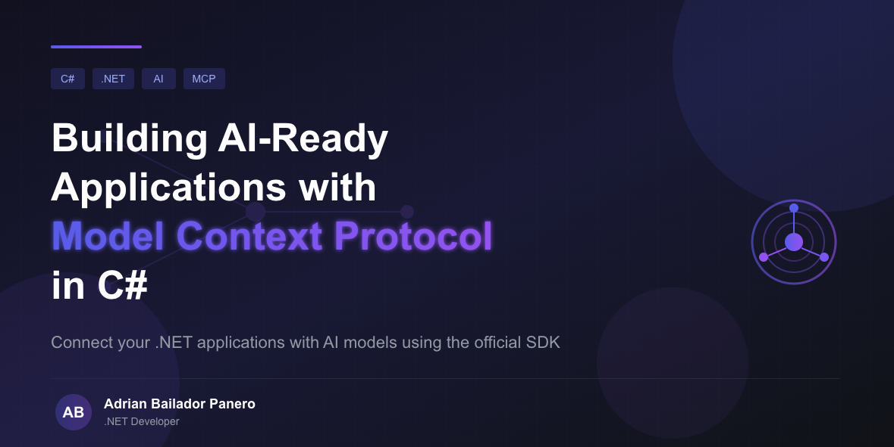
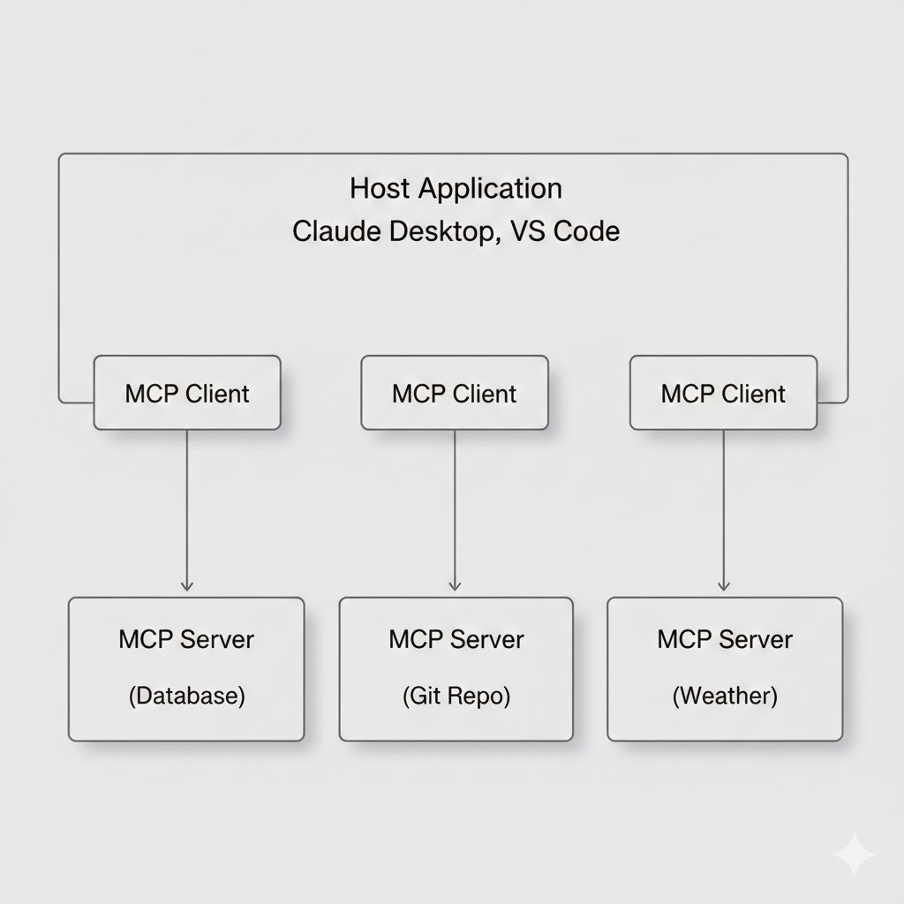

AI-powered applications are no longer just about calling a model and getting a response. Real-world AI systems need **context**: access to databases, APIs, internal tools, and business logic. The challenge is doing this in a way that is **standardised, reusable, and model-agnostic**.

This is where **Model Context Protocol (MCP)** comes in.

MCP is an open protocol that defines how AI applications can discover and invoke tools, load contextual data, and execute guided workflows — without hard-coding integrations for each model or platform.

With the release of the **official MCP C# SDK**, maintained in collaboration with Microsoft, .NET developers can now build MCP servers and clients using familiar patterns like dependency injection, hosting, and middleware.

In this article, we'll explore what MCP is, when it makes sense to use it, and how to implement practical MCP servers and clients in C#.

---

## What is Model Context Protocol?

Model Context Protocol (MCP) was announced by Anthropic in November 2024 as an **open standard** for connecting AI assistants to external systems.

It addresses a common architectural problem in AI integrations: the **M×N problem**.

- **M** models
- **N** tools or data sources
- **M × N** custom integrations

As the number of models or tools grows, the integration cost quickly becomes unmanageable.

MCP solves this by introducing a **standard protocol** that both AI clients and servers can agree on.

> A useful mental model is to think of MCP as a **USB-C port for AI applications**.  
> Tools and data sources expose a standard interface, and AI applications can plug into them without custom wiring.

---

## When Should You Use MCP?

MCP is especially useful when:

- You want to expose **existing systems** (databases, APIs, services) to AI models
- You're building **AI-powered developer tools** (IDEs, CLIs, internal assistants)
- You need **model-agnostic integrations** (Claude, OpenAI, local models, future providers)
- You're building **agent-style workflows** that call tools repeatedly
- You want **stronger boundaries** between AI reasoning and business logic

If you're only doing simple prompt + response calls, MCP may be overkill.  
But as soon as tools, data access, or workflows enter the picture, MCP becomes very compelling.

---

## MCP vs Function Calling

At first glance, MCP may look similar to *function calling* features offered by LLM APIs. The difference is architectural:

**Function calling:**

- Model-specific
- Tightly coupled to a single provider
- Defined inline with prompts

**MCP:**

- Provider-agnostic
- Standardised protocol
- Tools live outside the model
- Discoverable at runtime

MCP treats tools and context as **infrastructure**, not prompt tricks.

---

## Core Concepts

An MCP server can expose three types of capabilities:

### Tools

Tools are executable functions the AI can invoke.  
They are similar to **POST endpoints** in a REST API.

- Input → execution → output
- Can cause side effects
- Often backed by business logic

### Resources

Resources provide **read-only structured data** to the model.  
They are similar to **GET endpoints**.

- No side effects
- Used to load reference information into context

### Prompts

Prompts are reusable templates that guide complex interactions.

- Standardise workflows
- Reduce prompt duplication
- Improve consistency across clients

---

## MCP Architecture

MCP uses a **client–server model** built on JSON-RPC 2.0.



Each MCP server exposes capabilities, and clients can discover and invoke them dynamically.

---

## Getting Started with the MCP C# SDK

The MCP C# SDK is distributed via NuGet.  
Let's start by building a simple MCP server.

---

## Creating a Basic MCP Server

Create a new console application and install the required packages:

```bash
dotnet new console -n MyFirstMcpServer
cd MyFirstMcpServer
dotnet add package ModelContextProtocol --prerelease
dotnet add package Microsoft.Extensions.Hosting
```

Now create a minimal MCP server with a couple of tools:

```csharp
using Microsoft.Extensions.DependencyInjection;
using Microsoft.Extensions.Hosting;
using Microsoft.Extensions.Logging;
using ModelContextProtocol.Server;
using System.ComponentModel;

var builder = Host.CreateApplicationBuilder(args);

builder.Logging.AddConsole(options =>
{
    options.LogToStandardErrorThreshold = LogLevel.Trace;
});

builder.Services
    .AddMcpServer()
    .WithStdioServerTransport()
    .WithToolsFromAssembly();

await builder.Build().RunAsync();

[McpServerToolType]
public static class EchoTools
{
    [McpServerTool, Description("Echoes the message back to the client.")]
    public static string Echo(string message) =>
        $"Hello from C#: {message}";

    [McpServerTool, Description("Echoes the message in reverse.")]
    public static string ReverseEcho(string message) =>
        new string(message.Reverse().ToArray());
}
```

The SDK scans the assembly for `[McpServerToolType]` classes and automatically registers all methods decorated with `[McpServerTool]`.

---

## Testing the Server with VS Code and GitHub Copilot

To expose your MCP server to VS Code, create a `.vscode/mcp.json` file:

```json
{
  "inputs": [],
  "servers": {
    "MyFirstMcpServer": {
      "type": "stdio",
      "command": "dotnet",
      "args": [
        "run",
        "--project",
        "path/to/MyFirstMcpServer.csproj"
      ]
    }
  }
}
```

Once configured, GitHub Copilot (Agent mode) can discover and invoke your tools:

```
User: Can you reverse this message for me: "Hello MCP World"

Copilot: [Uses ReverseEcho tool]
Result: dlroW PCM olleH
```

---

## Building a Real-World MCP Server

Let's move beyond toy examples and build a small product catalogue server.

```csharp
public record Product(
    int Id,
    string Name,
    string Category,
    decimal Price,
    int Stock);
```

### Service Layer

```csharp
public class ProductService
{
    private readonly List<Product> _products =
    [
        new(1, "Mechanical Keyboard", "Electronics", 149.99m, 50),
        new(2, "Ergonomic Mouse", "Electronics", 79.99m, 100),
        new(3, "USB-C Hub", "Accessories", 49.99m, 200),
        new(4, "Monitor Stand", "Furniture", 89.99m, 30),
        new(5, "Desk Lamp", "Furniture", 45.99m, 75)
    ];

    public IReadOnlyList<Product> GetAll() => _products;

    public Product? GetById(int id) =>
        _products.FirstOrDefault(p => p.Id == id);

    public IReadOnlyList<Product> Search(string query) =>
        _products.Where(p =>
            p.Name.Contains(query, StringComparison.OrdinalIgnoreCase) ||
            p.Category.Contains(query, StringComparison.OrdinalIgnoreCase))
        .ToList();
}
```

### Tools Layer

```csharp
[McpServerToolType]
public class ProductTools(ProductService productService)
{
    [McpServerTool, Description("Gets all products.")]
    public string GetAllProducts() =>
        JsonSerializer.Serialize(productService.GetAll(),
            new JsonSerializerOptions { WriteIndented = true });

    [McpServerTool, Description("Gets a product by ID.")]
    public string GetProduct(int productId)
    {
        var product = productService.GetById(productId);
        return product is null
            ? "Product not found"
            : JsonSerializer.Serialize(product);
    }

    [McpServerTool, Description("Searches products by name or category.")]
    public string SearchProducts(string searchTerm) =>
        JsonSerializer.Serialize(productService.Search(searchTerm),
            new JsonSerializerOptions { WriteIndented = true });
}
```

This clean separation keeps business logic independent from MCP concerns.

---

## Adding Prompts

Prompts help standardise complex interactions:

```csharp
[McpServerPromptType]
public static class ProductPrompts
{
    [McpServerPrompt, Description("Analyses inventory levels.")]
    public static ChatMessage AnalyseInventory(int threshold = 50) =>
        new(ChatRole.User,
            $"Identify products with stock below {threshold} units " +
            $"and recommend restocking actions.");
}
```

---

## Creating an MCP Client

The SDK also allows you to consume MCP servers:

```csharp
var transport = new StdioClientTransport(new()
{
    Name = "ProductServer",
    Command = "dotnet",
    Arguments = ["run", "--project", "path/to/ProductServer.csproj"]
});

var client = await McpClient.CreateAsync(transport);

foreach (var tool in await client.ListToolsAsync())
{
    Console.WriteLine($"{tool.Name}: {tool.Description}");
}
```

---

## Using MCP Tools with AI Chat Clients

MCP tools integrate directly with `IChatClient`:

```csharp
IList<McpClientTool> tools = await client.ListToolsAsync();

var response = await chatClient.GetResponseAsync(
    "Which electronics products are low in stock?",
    new ChatOptions { Tools = [.. tools] });

Console.WriteLine(response);
```

---

## Transport Options

MCP supports:

- **STDIO** — ideal for local tools and IDE integrations
- **HTTP/SSE** — ideal for remote or cloud-hosted servers

Example with ASP.NET Core:

```csharp
builder.Services
    .AddMcpServer()
    .WithHttpTransport()
    .WithToolsFromAssembly();

app.MapMcp();
```

---

## Best Practices

- **Design idempotent tools** — LLM agents may retry tool invocations
- **Keep inputs and outputs simple and explicit** — use JSON-serializable DTOs
- **Use dependency injection** — makes testing and swapping implementations easy
- **Write descriptive metadata** — helps AI models understand when to use each tool
- **Return machine-readable error messages** — structured errors are easier to handle

---

## Conclusion

Model Context Protocol provides a clean, standardised way to connect AI models with real-world systems. Instead of embedding business logic inside prompts or model-specific APIs, MCP treats context and tools as first-class infrastructure.

With the official C# SDK, .NET developers can build AI-ready applications using familiar patterns and existing systems — while remaining model-agnostic and future-proof.

The SDK is still evolving, but the core concepts are solid. If you're building AI-powered tools, MCP is well worth exploring.

---

## Further Reading

- [Model Context Protocol Specification](https://modelcontextprotocol.io/)
- [MCP C# SDK on GitHub](https://github.com/modelcontextprotocol/csharp-sdk)
- [.NET Blog: Build an MCP Server in C#](https://devblogs.microsoft.com/dotnet/build-a-model-context-protocol-mcp-server-in-csharp/)

---

