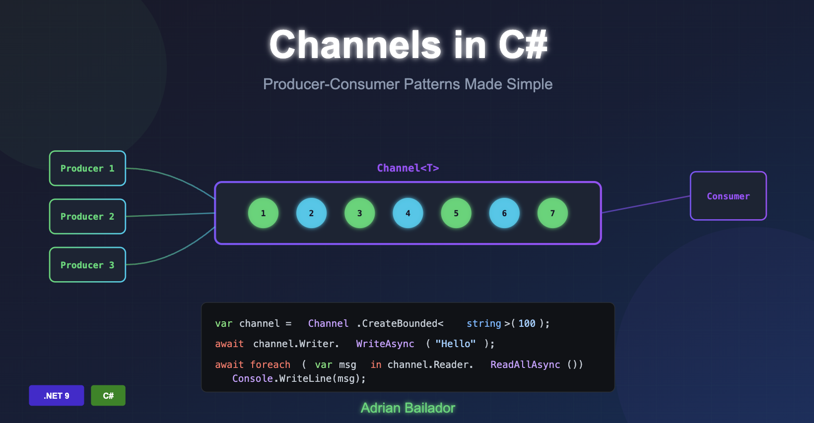

Modern applications frequently need to handle concurrent data processing, where one or more producers generate data whilst consumers process it. The `System.Threading.Channels` namespace provides a powerful, thread-safe mechanism for implementing these producer-consumer patterns without the complexity of manual synchronisation.

## What Are Channels?

Channels are a high-level abstraction for passing data between producers and consumers asynchronously. Think of a channel as a thread-safe queue that allows multiple threads to send and receive messages without requiring external locking or synchronisation mechanisms.

The key components of a channel are:

- **Writer**: Pushes data into the channel
- **Reader**: Pulls data from the channel
- **Channel**: The conduit that manages the data flow between writers and readers

Unlike traditional concurrent collections, channels are designed specifically for async/await patterns and provide built-in support for completion signalling and backpressure management.

## When Should You Use Channels?

Channels are ideal for scenarios where:

- You need to decouple producers from consumers
- Multiple threads or tasks need to communicate safely
- You want to implement background processing pipelines
- You require backpressure to prevent system overload
- You need an in-memory alternative to message queues within a single application

Channels are particularly well-suited for streaming events, processing background tasks, and building high-throughput data pipelines.

## Channel Types: Bounded vs Unbounded

The `Channel` static class provides factory methods for creating two types of channels:

### Unbounded Channels

An unbounded channel has no capacity limit and accepts as many messages as memory allows:

```csharp
var channel = Channel.CreateUnbounded<string>();
```

Unbounded channels are simpler to use but carry risk: if producers generate data faster than consumers can process it, memory usage can grow unboundedly.

### Bounded Channels

A bounded channel has a fixed maximum capacity. When the capacity is reached, the channel applies backpressure to control the flow:

```csharp
var channel = Channel.CreateBounded<string>(new BoundedChannelOptions(100)
{
    FullMode = BoundedChannelFullMode.Wait
});
```

Bounded channels provide better resource management and are generally preferred for production scenarios.

## Understanding BoundedChannelFullMode

When a bounded channel reaches capacity, the `FullMode` property determines what happens:

| Mode | Behaviour |
|------|-----------|
| `Wait` | The writer waits until space becomes available (default, safest) |
| `DropWrite` | The item being written is dropped; channel remains full |
| `DropOldest` | The oldest item in the channel is removed to make room |
| `DropNewest` | The most recently added item is removed to make room |

Choosing the right mode depends on your use case:

- **Wait**: Best for background tasks where every message matters
- **DropOldest**: Useful when only the latest data is relevant (e.g., real-time telemetry)
- **DropNewest**: Rarely used, but can preserve historical data
- **DropWrite**: When losing occasional new messages is acceptable

You can also register a callback to observe dropped items:

```csharp
var channel = Channel.CreateBounded(
    new BoundedChannelOptions(10)
    {
        FullMode = BoundedChannelFullMode.DropOldest
    },
    droppedItem => Console.WriteLine($"Dropped: {droppedItem}")
);
```

## Basic Producer-Consumer Pattern

Here's a fundamental example demonstrating the producer-consumer pattern:

```csharp
using System.Threading.Channels;

var channel = Channel.CreateUnbounded<int>();

// Producer task
var producer = Task.Run(async () =>
{
    for (int i = 0; i < 10; i++)
    {
        await channel.Writer.WriteAsync(i);
        Console.WriteLine($"Produced: {i}");
        await Task.Delay(100);
    }
    channel.Writer.Complete();
});

// Consumer task
var consumer = Task.Run(async () =>
{
    await foreach (var item in channel.Reader.ReadAllAsync())
    {
        Console.WriteLine($"Consumed: {item}");
    }
});

await Task.WhenAll(producer, consumer);
```

Key points to note:

1. `WriteAsync` adds items to the channel asynchronously
2. `ReadAllAsync` provides an async enumerable for consuming items
3. `Complete()` signals that no more items will be written
4. Both operations are non-blocking and thread-safe

## Writer and Reader APIs

### Writer Methods

| Method | Description |
|--------|-------------|
| `WriteAsync(T item)` | Writes an item asynchronously; awaits if channel is full |
| `TryWrite(T item)` | Attempts to write synchronously; returns false if unable |
| `WaitToWriteAsync()` | Waits until writing is possible |
| `Complete()` | Marks the channel as complete; no more writes allowed |
| `TryComplete()` | Attempts to mark complete; returns false if already complete |

### Reader Methods

| Method | Description |
|--------|-------------|
| `ReadAsync()` | Reads an item asynchronously; awaits if channel is empty |
| `TryRead(out T item)` | Attempts to read synchronously; returns false if empty |
| `WaitToReadAsync()` | Waits until an item is available or channel completes |
| `ReadAllAsync()` | Returns an async enumerable of all items |
| `Completion` | A Task that completes when the channel is marked complete |

## Integrating Channels with ASP.NET Core

Channels work excellently with ASP.NET Core's dependency injection and background services. Here's a practical implementation:

### Registering the Channel

```csharp
builder.Services.AddSingleton(Channel.CreateBounded<WorkItem>(
    new BoundedChannelOptions(100)
    {
        FullMode = BoundedChannelFullMode.Wait,
        SingleReader = true,
        SingleWriter = false
    }));
```

### Background Service Consumer

```csharp
public class WorkItemProcessor : BackgroundService
{
    private readonly Channel<WorkItem> _channel;
    private readonly ILogger<WorkItemProcessor> _logger;

    public WorkItemProcessor(
        Channel<WorkItem> channel,
        ILogger<WorkItemProcessor> logger)
    {
        _channel = channel;
        _logger = logger;
    }

    protected override async Task ExecuteAsync(CancellationToken stoppingToken)
    {
        _logger.LogInformation("Work item processor starting");

        await foreach (var workItem in _channel.Reader.ReadAllAsync(stoppingToken))
        {
            try
            {
                await ProcessWorkItemAsync(workItem, stoppingToken);
            }
            catch (Exception ex)
            {
                _logger.LogError(ex, "Error processing work item {Id}", workItem.Id);
            }
        }
    }

    private async Task ProcessWorkItemAsync(WorkItem item, CancellationToken ct)
    {
        _logger.LogInformation("Processing work item {Id}", item.Id);
        await Task.Delay(100, ct); // Simulate work
        _logger.LogInformation("Completed work item {Id}", item.Id);
    }
}
```

### API Endpoint Producer

```csharp
app.MapPost("/api/work", async (
    WorkItem workItem,
    Channel<WorkItem> channel) =>
{
    await channel.Writer.WriteAsync(workItem);
    return Results.Accepted();
});
```

## Channel Options for Performance Tuning

Both bounded and unbounded channels support options that can improve performance in specific scenarios:

```csharp
var options = new BoundedChannelOptions(100)
{
    // Set true when only one task reads from the channel
    SingleReader = true,
    
    // Set true when only one task writes to the channel
    SingleWriter = false,
    
    // Allows synchronous continuations for better performance
    // but can cause stack dives in some scenarios
    AllowSynchronousContinuations = false,
    
    // Behaviour when channel is full
    FullMode = BoundedChannelFullMode.Wait
};
```

Setting `SingleReader` and `SingleWriter` appropriately allows the channel implementation to use optimised code paths, improving throughput.

## Best Practices

### Always Use Async Methods

Channels are designed for async code. Always use `await` when writing or reading to avoid blocking threads:

```csharp
// Good
await channel.Writer.WriteAsync(data, cancellationToken);
await foreach (var item in channel.Reader.ReadAllAsync(cancellationToken))
{
    // Process item
}

// Avoid unless you have a specific reason
channel.Writer.TryWrite(data);  // Synchronous, may lose data
```

### Always Use Cancellation Tokens

Pass cancellation tokens to allow graceful shutdown:

```csharp
await channel.Writer.WriteAsync(item, cancellationToken);
await channel.Reader.ReadAsync(cancellationToken);
```

### Signal Completion

Always call `Complete()` on the writer when finished producing:

```csharp
try
{
    // Produce items
}
finally
{
    channel.Writer.Complete();
}
```

### Handle Exceptions Properly

Use `TryComplete(Exception)` to propagate errors to consumers:

```csharp
try
{
    await ProduceItemsAsync(channel.Writer, cancellationToken);
    channel.Writer.Complete();
}
catch (Exception ex)
{
    channel.Writer.TryComplete(ex);
}
```

### Prefer Bounded Channels in Production

Unless you have a specific reason for unbounded channels, use bounded channels to prevent memory issues:

```csharp
// Production-ready configuration
var channel = Channel.CreateBounded<T>(new BoundedChannelOptions(capacity)
{
    FullMode = BoundedChannelFullMode.Wait,
    SingleReader = true
});
```

## Channels vs Other Approaches

| Approach | When to Use |
|----------|------------|
| **Channels** | Fast producer-consumer scenarios, background processing, streaming data |
| **TPL Dataflow** | Complex pipelines with branching, joining, and transformation |
| **ConcurrentQueue** | Simple scenarios without async support or completion signalling |
| **BlockingCollection** | Legacy code or when blocking semantics are required |
| **Message Queues** | Cross-process or distributed communication |

Channels offer a sweet spot between simplicity and power, providing excellent performance for in-memory producer-consumer scenarios whilst maintaining a clean, async-friendly API.

## Conclusion

`System.Threading.Channels` provides a robust foundation for building concurrent applications in .NET. By understanding the differences between bounded and unbounded channels, choosing appropriate full mode behaviours, and following best practices for async programming, you can create efficient, scalable producer-consumer systems.

The key takeaways are:

- Use bounded channels with appropriate capacity for production workloads
- Choose `FullMode` based on whether losing messages is acceptable
- Always use async methods and cancellation tokens
- Signal completion when production is finished
- Consider `SingleReader`/`SingleWriter` options for performance optimisation

Start incorporating channels into your applications today to simplify concurrent programming and improve your application's throughput and responsiveness.
