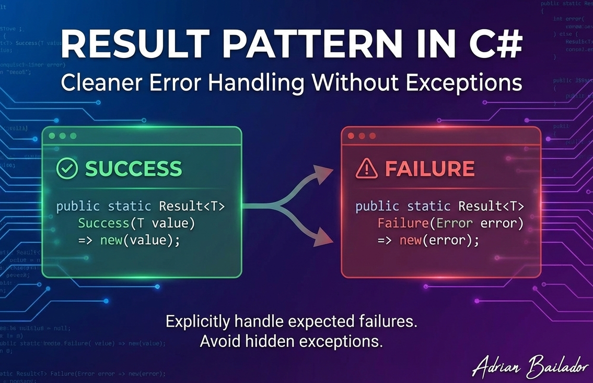

Error handling can make or break the clarity and reliability of your code. While exceptions are powerful, using them for expected business failures leads to cluttered code, hidden control flow, and performance overhead. The Result Pattern offers a cleaner alternative: making success and failure explicit in your method signatures.

## The Problem with Exceptions as Flow Control

Consider this common approach:

```csharp
public User GetUserById(int id)
{
    var user = _repository.Find(id);
    if (user is null)
        throw new UserNotFoundException($"User {id} not found");
    return user;
}
```

The caller must somehow know that `UserNotFoundException` might be thrown. This information isn't visible in the method signature, leading to:

- **Hidden control flow**: The caller must read implementation details to know what to catch
- **Performance overhead**: Exception creation captures stack traces, which is expensive
- **Unclear intent**: Is this a programming error or an expected business case?

## What is the Result Pattern?

The Result Pattern encapsulates the outcome of an operation in a single object that represents either success (with data) or failure (with error details). Instead of throwing exceptions, methods return a `Result` that the caller must explicitly handle.

```csharp
public Result<User> GetUserById(int id)
{
    var user = _repository.Find(id);
    if (user is null)
        return Result<User>.Failure(Error.NotFound("User.NotFound", $"User {id} not found"));
    return Result<User>.Success(user);
}
```

Now the method signature tells you: "This operation might fail, and here's how to handle it."

## When to Use Each Approach

| Scenario | Approach |
|----------|----------|
| Database connection lost | Exception |
| File system errors | Exception |
| Out of memory | Exception |
| User not found | Result |
| Validation failures | Result |
| Business rule violations | Result |
| Insufficient permissions | Result |
| Invalid input | Result |

**Rule of thumb**: Use exceptions for truly exceptional situations you don't know how to handle. Use Result for expected failures that are part of normal business logic.

## Building the Result Pattern from Scratch

Let's implement a robust Result Pattern step by step.

### The Error Class

First, we need a way to represent errors:

```csharp
public sealed record Error(string Code, string Description)
{
    public static readonly Error None = new(string.Empty, string.Empty);

    // Factory methods for common error types
    public static Error NotFound(string code, string description) =>
        new NotFoundError(code, description);

    public static Error Validation(string code, string description) =>
        new ValidationError(code, description);

    public static Error Conflict(string code, string description) =>
        new ConflictError(code, description);

    public static Error Unauthorized(string code, string description) =>
        new UnauthorizedError(code, description);

    public static Error Failure(string code, string description) =>
        new(code, description);
}

// Typed errors for better categorisation
public sealed record NotFoundError(string Code, string Description) 
    : Error(Code, Description);

public sealed record ValidationError(string Code, string Description) 
    : Error(Code, Description);

public sealed record ConflictError(string Code, string Description) 
    : Error(Code, Description);

public sealed record UnauthorizedError(string Code, string Description) 
    : Error(Code, Description);
```

### The Result Class (Without Value)

For operations that don't return data:

```csharp
public class Result
{
    public bool IsSuccess { get; }
    public bool IsFailure => !IsSuccess;
    public Error Error { get; }

    protected Result(bool isSuccess, Error error)
    {
        if (isSuccess && error != Error.None)
            throw new ArgumentException("Success result cannot have an error", nameof(error));
        if (!isSuccess && error == Error.None)
            throw new ArgumentException("Failure result must have an error", nameof(error));

        IsSuccess = isSuccess;
        Error = error;
    }

    public static Result Success() => new(true, Error.None);
    public static Result Failure(Error error) => new(false, error);

    // Implicit conversion from Error to Result
    public static implicit operator Result(Error error) => Failure(error);
}
```

### The Generic Result Class (With Value)

For operations that return data on success:

```csharp
public class Result<TValue> : Result
{
    private readonly TValue? _value;

    public TValue Value => IsSuccess
        ? _value!
        : throw new InvalidOperationException("Cannot access value of a failed result");

    private Result(TValue value) : base(true, Error.None)
    {
        _value = value;
    }

    private Result(Error error) : base(false, error)
    {
        _value = default;
    }

    public static Result<TValue> Success(TValue value) => new(value);
    public new static Result<TValue> Failure(Error error) => new(error);

    // Implicit conversions for cleaner syntax
    public static implicit operator Result<TValue>(TValue value) => Success(value);
    public static implicit operator Result<TValue>(Error error) => Failure(error);
}
```

## Functional Extension Methods

To avoid nested `if` statements, add functional extensions:

```csharp
public static class ResultExtensions
{
    // Transform the value if successful
    public static Result<TOut> Map<TIn, TOut>(
        this Result<TIn> result,
        Func<TIn, TOut> mapper)
    {
        return result.IsSuccess
            ? Result<TOut>.Success(mapper(result.Value))
            : Result<TOut>.Failure(result.Error);
    }

    // Chain operations that return Results
    public static Result<TOut> Bind<TIn, TOut>(
        this Result<TIn> result,
        Func<TIn, Result<TOut>> binder)
    {
        return result.IsSuccess
            ? binder(result.Value)
            : Result<TOut>.Failure(result.Error);
    }

    // Handle both success and failure cases
    public static TOut Match<TIn, TOut>(
        this Result<TIn> result,
        Func<TIn, TOut> onSuccess,
        Func<Error, TOut> onFailure)
    {
        return result.IsSuccess
            ? onSuccess(result.Value)
            : onFailure(result.Error);
    }

    // Execute action on success
    public static Result<T> Tap<T>(
        this Result<T> result,
        Action<T> action)
    {
        if (result.IsSuccess)
            action(result.Value);
        return result;
    }

    // Convert Result to Result<T>
    public static Result<T> ToResult<T>(this Result result, T value)
    {
        return result.IsSuccess
            ? Result<T>.Success(value)
            : Result<T>.Failure(result.Error);
    }
}
```

## Using the Result Pattern

### Basic Usage

```csharp
public class UserService
{
    private readonly IUserRepository _repository;

    public Result<User> GetById(int id)
    {
        var user = _repository.Find(id);
        
        if (user is null)
            return Error.NotFound("User.NotFound", $"User with ID {id} was not found");

        return user; // Implicit conversion to Result<User>.Success
    }

    public Result<User> Create(CreateUserRequest request)
    {
        // Validation
        if (string.IsNullOrWhiteSpace(request.Email))
            return Error.Validation("User.EmailRequired", "Email is required");

        if (_repository.ExistsByEmail(request.Email))
            return Error.Conflict("User.EmailExists", "A user with this email already exists");

        // Create user
        var user = new User(request.Name, request.Email);
        _repository.Add(user);

        return user;
    }
}
```

### Chaining Operations with Bind

```csharp
public Result<OrderConfirmation> ProcessOrder(CreateOrderRequest request)
{
    return ValidateOrder(request)
        .Bind(order => CheckInventory(order))
        .Bind(order => ProcessPayment(order))
        .Bind(order => CreateShipment(order))
        .Map(shipment => new OrderConfirmation(shipment.TrackingNumber));
}

private Result<Order> ValidateOrder(CreateOrderRequest request)
{
    if (request.Items.Count == 0)
        return Error.Validation("Order.NoItems", "Order must contain at least one item");
    
    return new Order(request.CustomerId, request.Items);
}

private Result<Order> CheckInventory(Order order)
{
    foreach (var item in order.Items)
    {
        if (!_inventory.IsAvailable(item.ProductId, item.Quantity))
            return Error.Conflict("Order.OutOfStock", $"Product {item.ProductId} is out of stock");
    }
    return order;
}
```

### Using Match for Clean Handling

```csharp
var message = userService.GetById(userId).Match(
    onSuccess: user => $"Welcome, {user.Name}!",
    onFailure: error => $"Error: {error.Description}"
);
```

## Integration with ASP.NET Core Minimal APIs

The Result Pattern integrates beautifully with Minimal APIs and ProblemDetails:

### Extension Method for API Responses

```csharp
public static class ResultApiExtensions
{
    public static IResult ToApiResult<T>(this Result<T> result)
    {
        if (result.IsSuccess)
            return Results.Ok(result.Value);

        return result.Error switch
        {
            NotFoundError => Results.NotFound(CreateProblemDetails(result.Error, 404)),
            ValidationError => Results.BadRequest(CreateProblemDetails(result.Error, 400)),
            ConflictError => Results.Conflict(CreateProblemDetails(result.Error, 409)),
            UnauthorizedError => Results.Json(
                CreateProblemDetails(result.Error, 401),
                statusCode: 401),
            _ => Results.BadRequest(CreateProblemDetails(result.Error, 400))
        };
    }

    public static IResult ToApiResult(this Result result, object? successValue = null)
    {
        if (result.IsSuccess)
            return successValue is not null 
                ? Results.Ok(successValue) 
                : Results.Ok();

        return result.Error switch
        {
            NotFoundError => Results.NotFound(CreateProblemDetails(result.Error, 404)),
            ValidationError => Results.BadRequest(CreateProblemDetails(result.Error, 400)),
            ConflictError => Results.Conflict(CreateProblemDetails(result.Error, 409)),
            _ => Results.BadRequest(CreateProblemDetails(result.Error, 400))
        };
    }

    public static IResult ToCreatedResult<T>(
        this Result<T> result,
        string location)
    {
        if (result.IsSuccess)
            return Results.Created(location, result.Value);

        return result.ToApiResult();
    }

    private static ProblemDetails CreateProblemDetails(Error error, int statusCode) =>
        new()
        {
            Status = statusCode,
            Title = error.Code,
            Detail = error.Description,
            Type = $"https://httpstatuses.com/{statusCode}"
        };
}
```

### Using in Endpoints

```csharp
var app = builder.Build();

app.MapGet("/api/users/{id}", (int id, UserService userService) =>
{
    return userService.GetById(id).ToApiResult();
});

app.MapPost("/api/users", (CreateUserRequest request, UserService userService) =>
{
    return userService.Create(request)
        .ToCreatedResult($"/api/users/{request.Email}");
});

app.MapPost("/api/orders", (CreateOrderRequest request, OrderService orderService) =>
{
    return orderService.ProcessOrder(request).Match(
        onSuccess: confirmation => Results.Ok(confirmation),
        onFailure: error => error switch
        {
            ValidationError => Results.BadRequest(new { error.Code, error.Description }),
            ConflictError => Results.Conflict(new { error.Code, error.Description }),
            _ => Results.Problem(error.Description)
        }
    );
});
```

## Centralising Domain Errors

Keep all your domain errors in one place for consistency:

```csharp
public static class DomainErrors
{
    public static class User
    {
        public static Error NotFound(int id) =>
            Error.NotFound("User.NotFound", $"User with ID {id} was not found");

        public static Error EmailAlreadyExists(string email) =>
            Error.Conflict("User.EmailExists", $"Email {email} is already registered");

        public static Error InvalidEmail =>
            Error.Validation("User.InvalidEmail", "The email format is invalid");

        public static Error PasswordTooWeak =>
            Error.Validation("User.PasswordTooWeak", 
                "Password must be at least 8 characters with uppercase, lowercase, and digits");
    }

    public static class Order
    {
        public static Error NotFound(Guid id) =>
            Error.NotFound("Order.NotFound", $"Order {id} was not found");

        public static Error EmptyCart =>
            Error.Validation("Order.EmptyCart", "Cannot create order with empty cart");

        public static Error InsufficientStock(string productId) =>
            Error.Conflict("Order.InsufficientStock", $"Insufficient stock for product {productId}");

        public static Error PaymentFailed(string reason) =>
            Error.Failure("Order.PaymentFailed", $"Payment failed: {reason}");
    }
}
```

Usage becomes very clean:

```csharp
public Result<User> GetById(int id)
{
    var user = _repository.Find(id);
    return user is null 
        ? DomainErrors.User.NotFound(id) 
        : user;
}
```

## Third-Party Libraries

If you prefer not to build your own, consider these libraries:

### FluentResults

```csharp
// Install: dotnet add package FluentResults

Result<User> result = Result.Ok(user);
Result<User> failure = Result.Fail<User>("User not found");

// Chaining
var final = await Result.Try(async () => await GetUserAsync())
    .Bind(user => ValidateUser(user))
    .Map(user => new UserDto(user));
```

### CSharpFunctionalExtensions

```csharp
// Install: dotnet add package CSharpFunctionalExtensions

Result<User> result = Result.Success(user);
Result<User> failure = Result.Failure<User>("User not found");

// Wrap exceptions automatically
var result = await Result.Try(async () => await _api.CallAsync());
```

## Best Practices

### Keep It in the Business Layer

Use Result Pattern in your service/domain layer. Don't use it in repositories (let them throw exceptions for database errors) or controllers (convert to HTTP responses).

```
Repository (throws exceptions) 
    → Service (returns Results) 
        → Controller/Endpoint (converts to HTTP)
```

### Don't Overuse It

Not every method needs to return a Result. Simple queries that shouldn't fail can return values directly:

```csharp
// This is fine - no Result needed
public string GetUserDisplayName(User user) => $"{user.FirstName} {user.LastName}";
```

### Fail Fast in Development

Consider adding a helper for development scenarios:

```csharp
public static T GetValueOrThrow<T>(this Result<T> result)
{
    if (result.IsFailure)
        throw new InvalidOperationException($"Result failed: {result.Error.Description}");
    return result.Value;
}
```

### Validate Multiple Fields

For validation with multiple errors:

```csharp
public class ValidationResult : Result
{
    public IReadOnlyList<Error> Errors { get; }

    private ValidationResult(IReadOnlyList<Error> errors) 
        : base(errors.Count == 0, errors.FirstOrDefault() ?? Error.None)
    {
        Errors = errors;
    }

    public static ValidationResult WithErrors(params Error[] errors) =>
        new(errors);

    public static ValidationResult Ok() => new(Array.Empty<Error>());
}
```

## Conclusion

The Result Pattern brings clarity to error handling by making failures explicit in method signatures. It's not a replacement for exceptions—it's a complement for handling expected business failures gracefully.

Key takeaways:

- Use exceptions for truly exceptional situations (I/O failures, corrupted state)
- Use Result for expected failures (validation, not found, business rules)
- Keep error definitions centralised for consistency
- Use extension methods (Map, Bind, Match) for clean chaining
- Integrate with ASP.NET Core using ProblemDetails for API responses

The Result Pattern may add some ceremony, but the benefits—explicit error handling, self-documenting code, and cleaner control flow—make it worthwhile for any serious application.