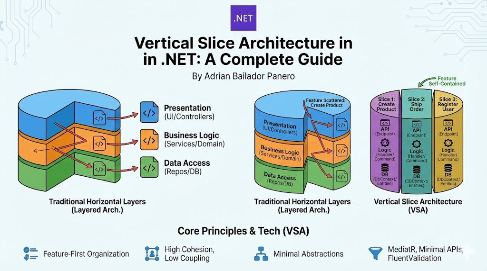

## Organize your code by what it does, not where it lives

Most .NET applications are organized in horizontal layers: Presentation, Business Logic, and Data Access. But what if we organized code by **business features** instead? 

Welcome to **Vertical Slice Architecture (VSA)**, a pattern that's changing how we structure modern .NET applications.

> **TL;DR:** Vertical Slice Architecture groups all code for a feature together (API → Logic → Database). No more jumping between 5 folders to understand one thing.

---

## 🎂 What is Vertical Slice Architecture?

Vertical Slice Architecture is a code organization pattern that groups all code for a single feature or use case together, from the user interface down to the database.

### The Core Concept

Think of your application as a cake. Traditional architectures cut the cake **horizontally** into layers:

* **Top layer:** Presentation (Controllers, Views)
* **Middle layer:** Business Logic (Services, Commands)
* **Bottom layer:** Data Access (Repositories, DbContext)

**Vertical Slice Architecture** cuts the cake vertically. Each slice contains everything needed for one specific feature:

* **Slice 1:** "Create Product" → Complete from API to Database
* **Slice 2:** "Ship Order" → Complete from API to Database
* **Slice 3:** "Register User" → Complete from API to Database

### Why "Vertical"?

A vertical slice **cuts through all layers** for a single feature. When you need to add a field to "Create Product", you only touch files in `Features/Products/Create/`. No jumping between Controllers → Services → Repositories.

---

## 📁 Project Structure

```
MyApp/
├── Features/
│   ├── Products/
│   │   ├── Create/
│   │   │   ├── CreateProduct.cs
│   │   │   └── CreateProductEndpoint.cs
│   │   ├── Update/
│   │   ├── Delete/
│   │   └── GetById/
│   ├── Orders/
│   │   ├── Create/
│   │   ├── Ship/
│   │   └── Cancel/
│   └── Customers/
├── Common/              # Only truly shared infrastructure
│   ├── Behaviors/       # MediatR pipeline behaviors
│   └── Results/
├── Data/
│   ├── AppDbContext.cs
│   └── Entities/
└── Program.cs
```

Everything for "Create Product" lives in one place: `Features/Products/Create/`.

---

## ⚖️ Core Principles

### 1. Feature-First Organization

Code is organized by **what it does** (business capability), not by **what it is** (technical role). 

| Traditional (Layered) | Vertical Slice |
| :--- | :--- |
| `Controllers/ProductsController.cs` | `Features/Products/Create/CreateProduct.cs` |
| `Services/ProductService.cs` | `Features/Products/Create/CreateProductEndpoint.cs` |
| `Repositories/ProductRepository.cs` | (Logic & Data access are inside the slice) |

To understand "Create Product", you read **one folder** instead of **three files in three different folders**.

### 2. High Cohesion, Low Coupling

* **High Cohesion:** Related code stays together. Command, validation, and logic are all in one file or folder. You see the complete picture immediately.
* **Low Coupling:** Features don't depend on each other. Deleting "Create Product" won't break "Ship Order". Each feature can evolve independently.

### 3. Minimal Abstractions

Create abstractions only when you have actual shared behavior. In VSA, we often use the `DbContext` directly in the handler. 

**Don't do this:**
```csharp
// Abstraction for a single implementation
public interface IProductRepository
{
    Task<Product> GetByIdAsync(int id);
}

public class ProductRepository : IProductRepository
{
    // Only implementation, will never be swapped
}
```

**Do this:**
```csharp
// Direct database access in the handler
public class Handler : IRequestHandler<Query, Result<ProductDto>>
{
    private readonly AppDbContext _db;
    
    public async Task<Result<ProductDto>> Handle(Query request, CancellationToken ct)
    {
        var product = await _db.Products
            .Where(p => p.Id == request.Id)
            .Select(p => new ProductDto { Id = p.Id, Name = p.Name })
            .FirstOrDefaultAsync(ct);
        
        return product != null 
            ? Result<ProductDto>.Success(product)
            : Result<ProductDto>.Failure("Product not found");
    }
}
```

If you aren't swapping your DB for a text file tomorrow, you probably don't need a Repository Layer.

### 4. Duplication Over Wrong Abstraction

It's okay to duplicate a DTO or a small piece of logic between slices if it keeps them independent. 

```csharp
// Products/Create
var product = new Product {
    CreatedAt = DateTime.UtcNow,
    CreatedBy = _currentUser.Id
};

// Orders/Create - Same code, that's OK!
var order = new Order {
    CreatedAt = DateTime.UtcNow,
    CreatedBy = _currentUser.Id
};
```

> **The Rule of Three:** Extract common code only when you use it in 3+ features, not before.

Why? Because those two features might diverge in the future. Premature abstraction creates coupling.

---

## 🛠️ Complete Implementation: "Create Product"

Let's build a feature from scratch using **MediatR** and **Minimal APIs**.

### Step 1: The Command and Handler

```csharp
// Features/Products/Create/CreateProduct.cs

namespace MyApp.Features.Products.Create;

public static class CreateProduct
{
    // The request
    public record Command(
        string Name, 
        decimal Price, 
        int CategoryId
    ) : IRequest<Result<int>>;
    
    // Validation rules
    public class Validator : AbstractValidator<Command>
    {
        public Validator()
        {
            RuleFor(x => x.Name).NotEmpty().MaximumLength(100);
            RuleFor(x => x.Price).GreaterThan(0).LessThan(1000000);
            RuleFor(x => x.CategoryId).GreaterThan(0);
        }
    }
    
    // Business logic
    public class Handler : IRequestHandler<Command, Result<int>>
    {
        private readonly AppDbContext _db;
        private readonly ILogger<Handler> _logger;
        
        public Handler(AppDbContext db, ILogger<Handler> logger)
        {
            _db = db;
            _logger = logger;
        }
        
        public async Task<Result<int>> Handle(Command request, CancellationToken ct)
        {
            // Business rule: Category must exist
            var categoryExists = await _db.Categories
                .AnyAsync(c => c.Id == request.CategoryId, ct);
            
            if (!categoryExists)
                return Result<int>.Failure("Category not found");
            
            // Create product
            var product = new Product {
                Name = request.Name,
                Price = request.Price,
                CategoryId = request.CategoryId,
                CreatedAt = DateTime.UtcNow
            };
            
            _db.Products.Add(product);
            await _db.SaveChangesAsync(ct);
            
            _logger.LogInformation(
                "Created product {ProductId}: {ProductName}",
                product.Id, product.Name);
            
            return Result<int>.Success(product.Id);
        }
    }
}
```

**Everything in one file:** Request, validation, and business logic. You can understand the entire feature without opening multiple files.

### Step 2: The Endpoint

```csharp
// Features/Products/Create/CreateProductEndpoint.cs

public class CreateProductEndpoint : ICarterModule
{
    public void AddRoutes(IEndpointRouteBuilder app)
    {
        app.MapPost("/api/products", async (
            CreateProduct.Command request, 
            IMediator mediator,
            CancellationToken ct) =>
        {
            var result = await mediator.Send(request, ct);
            
            return result.IsSuccess 
                ? Results.Created($"/api/products/{result.Value}", new { id = result.Value }) 
                : Results.BadRequest(new { error = result.Error });
        })
        .WithName("CreateProduct")
        .WithTags("Products");
    }
}
```

That's it! A complete feature in **2 files**.

### Step 3: Supporting Types

```csharp
// Common/Results/Result.cs

public class Result<T>
{
    public bool IsSuccess { get; }
    public T Value { get; }
    public string Error { get; }
    
    private Result(bool isSuccess, T value, string error)
    {
        IsSuccess = isSuccess;
        Value = value;
        Error = error;
    }
    
    public static Result<T> Success(T value) => new(true, value, string.Empty);
    public static Result<T> Failure(string error) => new(false, default!, error);
}
```

---

## 🌊 How a Request Flows

Let's trace a request through the system:

**User Request:** `POST /api/products`
```json
{
  "name": "Laptop",
  "price": 1299.99,
  "categoryId": 5
}
```

**Flow:**

1. **Endpoint receives request** → Deserializes into `CreateProduct.Command`

2. **MediatR pipeline begins** → `mediator.Send(request)`

3. **Validation runs automatically** → `ValidationBehavior` intercepts and runs `CreateProduct.Validator`
   - If validation fails → Returns `400 Bad Request`
   - If validation passes → Continues to handler

4. **Logging (automatic)** → `LoggingBehavior` logs the request

5. **Handler executes** → Business rules, database operations

6. **Response returned** → `Result<int>` converted to HTTP response
   - Success → `201 Created`
   - Failure → `400 Bad Request`

**Key insight:** Validation and logging happen automatically via MediatR pipeline behaviors. You don't write that code in every handler.

---

## 🔄 Cross-Cutting Concerns with MediatR Behaviors

Common functionality is handled by pipeline behaviors, not inheritance or base classes.

### Validation Behavior

```csharp
// Common/Behaviors/ValidationBehavior.cs

public class ValidationBehavior<TRequest, TResponse> : IPipelineBehavior<TRequest, TResponse>
    where TRequest : IRequest<TResponse>
{
    private readonly IEnumerable<IValidator<TRequest>> _validators;
    
    public async Task<TResponse> Handle(
        TRequest request,
        RequestHandlerDelegate<TResponse> next,
        CancellationToken ct)
    {
        if (!_validators.Any())
            return await next();
        
        var context = new ValidationContext<TRequest>(request);
        var failures = _validators
            .Select(v => v.Validate(context))
            .SelectMany(result => result.Errors)
            .Where(f => f != null)
            .ToList();
        
        if (failures.Any())
            throw new ValidationException(failures);
        
        return await next();
    }
}
```

### Logging Behavior

```csharp
// Common/Behaviors/LoggingBehavior.cs

public class LoggingBehavior<TRequest, TResponse> : IPipelineBehavior<TRequest, TResponse>
    where TRequest : IRequest<TResponse>
{
    private readonly ILogger<LoggingBehavior<TRequest, TResponse>> _logger;
    
    public async Task<TResponse> Handle(
        TRequest request,
        RequestHandlerDelegate<TResponse> next,
        CancellationToken ct)
    {
        _logger.LogInformation("Handling {RequestName}", typeof(TRequest).Name);
        var response = await next();
        _logger.LogInformation("Handled {RequestName}", typeof(TRequest).Name);
        return response;
    }
}
```

### Register Behaviors in Program.cs

```csharp
builder.Services.AddMediatR(cfg =>
{
    cfg.RegisterServicesFromAssembly(typeof(Program).Assembly);
    cfg.AddBehavior(typeof(IPipelineBehavior<,>), typeof(LoggingBehavior<,>));
    cfg.AddBehavior(typeof(IPipelineBehavior<,>), typeof(ValidationBehavior<,>));
});
```

Every feature automatically gets validation and logging without touching each handler.

---

## 🧪 Testing Strategy

In VSA, we prioritize **Integration Tests**. Since the slice is self-contained, testing the API endpoint with a real (or in-memory) database gives you the highest confidence with the least effort.

```csharp
public class CreateProductTests : IClassFixture<WebApplicationFactory<Program>>
{
    private readonly HttpClient _client;
    
    public CreateProductTests(WebApplicationFactory<Program> factory)
    {
        _client = factory.CreateClient();
    }
    
    [Fact]
    public async Task CreateProduct_WithValidData_ReturnsCreated()
    {
        // Arrange
        var command = new { 
            name = "Laptop", 
            price = 999, 
            categoryId = 1 
        };
        
        // Act
        var response = await _client.PostAsJsonAsync("/api/products", command);
        
        // Assert
        response.StatusCode.Should().Be(HttpStatusCode.Created);
        var productId = await response.Content.ReadFromJsonAsync<int>();
        productId.Should().BeGreaterThan(0);
    }
    
    [Fact]
    public async Task CreateProduct_WithInvalidPrice_ReturnsBadRequest()
    {
        // Arrange
        var command = new { 
            name = "Laptop", 
            price = -10,  // Invalid
            categoryId = 1 
        };
        
        // Act
        var response = await _client.PostAsJsonAsync("/api/products", command);
        
        // Assert
        response.StatusCode.Should().Be(HttpStatusCode.BadRequest);
    }
}
```

**Why integration tests?**
- Tests the entire slice end-to-end
- Validates that all pieces work together
- Catches integration issues early
- Closer to how users actually use the system

---

## 🔧 Essential Setup

### Required NuGet Packages

```bash
# MediatR for request/response pattern
dotnet add package MediatR

# FluentValidation for validation
dotnet add package FluentValidation
dotnet add package FluentValidation.DependencyInjectionExtensions

# Carter for minimal API organization (optional)
dotnet add package Carter

# Entity Framework Core
dotnet add package Microsoft.EntityFrameworkCore
dotnet add package Microsoft.EntityFrameworkCore.SqlServer
```

### Program.cs Configuration

```csharp
var builder = WebApplication.CreateBuilder(args);

// Database
builder.Services.AddDbContext<AppDbContext>(options =>
    options.UseSqlServer(builder.Configuration.GetConnectionString("DefaultConnection")));

// MediatR with behaviors
builder.Services.AddMediatR(cfg =>
{
    cfg.RegisterServicesFromAssembly(typeof(Program).Assembly);
    cfg.AddBehavior(typeof(IPipelineBehavior<,>), typeof(LoggingBehavior<,>));
    cfg.AddBehavior(typeof(IPipelineBehavior<,>), typeof(ValidationBehavior<,>));
});

// FluentValidation
builder.Services.AddValidatorsFromAssemblyContaining<Program>();

// Carter (if using)
builder.Services.AddCarter();

var app = builder.Build();

app.UseHttpsRedirection();
app.MapCarter();  // Maps all endpoints

app.Run();
```

---

## 📚 Common Patterns

### Pattern 1: Query Features (Read-Only)

```csharp
// Features/Products/GetById/GetProduct.cs

public static class GetProduct
{
    public record Query(int Id) : IRequest<Result<ProductDto>>;
    
    public record ProductDto(int Id, string Name, decimal Price, string CategoryName);
    
    public class Handler : IRequestHandler<Query, Result<ProductDto>>
    {
        private readonly AppDbContext _db;
        
        public async Task<Result<ProductDto>> Handle(Query request, CancellationToken ct)
        {
            var product = await _db.Products
                .Where(p => p.Id == request.Id)
                .Select(p => new ProductDto(
                    p.Id,
                    p.Name,
                    p.Price,
                    p.Category.Name
                ))
                .FirstOrDefaultAsync(ct);
            
            return product != null
                ? Result<ProductDto>.Success(product)
                : Result<ProductDto>.Failure("Product not found");
        }
    }
}
```

**Key points:**
- Use `Select` to project only needed data
- Return DTOs, not entities
- One query, optimized for this specific use case

### Pattern 2: List/Search Features

```csharp
// Features/Products/List/ListProducts.cs

public static class ListProducts
{
    public record Query(
        int Page = 1,
        int PageSize = 20,
        string? SearchTerm = null,
        int? CategoryId = null
    ) : IRequest<Result<PagedResult<ProductDto>>>;
    
    public record ProductDto(int Id, string Name, decimal Price);
    
    public record PagedResult<T>(List<T> Items, int TotalCount, int Page, int PageSize);
    
    public class Handler : IRequestHandler<Query, Result<PagedResult<ProductDto>>>
    {
        private readonly AppDbContext _db;
        
        public async Task<Result<PagedResult<ProductDto>>> Handle(
            Query request,
            CancellationToken ct)
        {
            var query = _db.Products.AsQueryable();
            
            // Apply filters
            if (!string.IsNullOrWhiteSpace(request.SearchTerm))
                query = query.Where(p => p.Name.Contains(request.SearchTerm));
            
            if (request.CategoryId.HasValue)
                query = query.Where(p => p.CategoryId == request.CategoryId.Value);
            
            // Get total count
            var totalCount = await query.CountAsync(ct);
            
            // Pagination
            var items = await query
                .Skip((request.Page - 1) * request.PageSize)
                .Take(request.PageSize)
                .Select(p => new ProductDto(p.Id, p.Name, p.Price))
                .ToListAsync(ct);
            
            return Result<PagedResult<ProductDto>>.Success(
                new PagedResult<ProductDto>(items, totalCount, request.Page, request.PageSize));
        }
    }
}
```

### Pattern 3: Features with Domain Events

```csharp
// Features/Orders/Create/CreateOrder.cs

public static class CreateOrder
{
    public record Command(int CustomerId, List<OrderItemDto> Items) : IRequest<Result<int>>;
    
    public class Handler : IRequestHandler<Command, Result<int>>
    {
        private readonly AppDbContext _db;
        private readonly IMediator _mediator;
        
        public async Task<Result<int>> Handle(Command request, CancellationToken ct)
        {
            var order = new Order
            {
                CustomerId = request.CustomerId,
                Status = OrderStatus.Pending,
                CreatedAt = DateTime.UtcNow
            };
            
            _db.Orders.Add(order);
            await _db.SaveChangesAsync(ct);
            
            // Publish event - other features can react
            await _mediator.Publish(new OrderCreated(order.Id, request.Items), ct);
            
            return Result<int>.Success(order.Id);
        }
    }
}

// Features/Inventory/ReserveStock/OrderCreatedHandler.cs

public class OrderCreatedHandler : INotificationHandler<OrderCreated>
{
    private readonly AppDbContext _db;
    
    public async Task Handle(OrderCreated notification, CancellationToken ct)
    {
        // Update inventory in its own feature
        foreach (var item in notification.Items)
        {
            var product = await _db.Products.FindAsync(item.ProductId, ct);
            if (product != null)
                product.ReservedStock += item.Quantity;
        }
        
        await _db.SaveChangesAsync(ct);
    }
}
```

**Key insight:** Features stay decoupled but can react to each other's events through MediatR notifications.

---

## 🚀 Can I Use This in an Existing App?

**Yes!** VSA's superpower is that you can start TODAY without rewriting anything.

### Incremental Adoption Strategy

**Phase 1: Coexistence (Month 1-2)**

Keep your layered code. Build new features as slices. They can coexist:

```
MyApp/
├── Controllers/          # Old layered code - still works
│   ├── ProductsController.cs
│   └── OrdersController.cs
├── Services/             # Old layered code - still works
│   ├── ProductService.cs
│   └── OrderService.cs
├── Repositories/         # Old layered code - still works
│   └── ProductRepository.cs
├── Features/             # New slices - start here!
│   ├── Shipping/
│   │   ├── CalculateRate/
│   │   └── TrackPackage/
│   └── Notifications/
│       └── SendEmail/
```

**Benefits:**
✅ Zero risk to existing functionality  
✅ Team learns VSA gradually  
✅ New features ship faster  
✅ Easy to rollback if needed  

**Phase 2: Strategic Migration (Month 3-6)**

Migrate one feature at a time. Start with simple CRUD:

```csharp

// Step 1: Pick a simple feature
// Good candidates:
// - Recently added features (less legacy baggage)
// - Features that change frequently
// - Simple CRUD with few dependencies

// Step 2: Create slice
Features/Products/Archive/ArchiveProduct.cs

// Step 3: Test thoroughly

// Step 4: Delete old code ONLY after new code is in production
```

**Phase 3: Live with Both (Ongoing)**

After 6 months:
- 70-80% slice-based
- 20-30% still layered
- **That's perfectly fine!**

Don't force migration if the old code works. Focus on new development in slices.

**Real Timeline Example:**

```
Month 1:  Build 3 new features as slices
Month 2:  Migrate 5 simple CRUD operations
Month 3:  Migrate 3 medium features
Month 4:  Build all new features as slices
Month 5:  Migrate 2 complex features
Month 6:  Stop migrating, focus on new development
Result:   ~75% slice-based, team velocity up 40%
```

**When to Stop Migrating:**
- Feature is complex and working fine
- Migration cost > benefit
- Feature rarely changes
- Team isn't comfortable yet

---

## ⚠️ Common Pitfalls (And How to Avoid Them)

Even with its simplicity, it's easy to lose the "Vertical" spirit. Here are the most common mistakes:

### 1. The "Shared" Folder Trap

**The #1 question when starting with VSA:** *"Where do I put code that's used by multiple features? Won't I end up with a huge Shared folder?"*

**The Problem:**

You see two features that both send emails and immediately create:

```
Common/
├── Services/
│   └── EmailService.cs
├── DTOs/
│   ├── ProductDto.cs         # Feature-specific!
│   └── OrderDto.cs           # Feature-specific!
├── Validators/
│   └── CreateOrderValidator.cs  # Feature-specific!
└── Helpers/
    └── (Everything else)
```

Before you know it, `Common` is a dumping ground and features are tightly coupled.

**The Solution: A Simple Rule**

> **Share infrastructure, duplicate business logic.**

**✅ OK to share:**

```
Common/
├── Behaviors/              # MediatR pipeline (logging, validation)
├── Results/               # Generic Result<T> type
├── Interfaces/
│   ├── IEmailSender.cs    # External services
│   └── IFileStorage.cs
└── Extensions/
    └── ValidationExtensions.cs  # Simple reusable rules
```

**Why:** These are cross-cutting concerns that apply to ALL features uniformly.

**❌ Don't share:**

- DTOs between features (each feature has its own)
- Business logic between features (duplicate instead)
- Feature-specific validators
- "Helpers" or "Utilities" folders

**The Key Insight:**

Just because features share the same database entity doesn't mean they share DTOs:

```csharp
// Data/Entities/Product.cs - Shared database entity
public class Product
{
    public int Id { get; set; }
    public string Name { get; set; }
    public decimal Price { get; set; }
}

// Features/Products/Create/CreateProduct.cs
public record Command(string Name, decimal Price); // Only what Create needs

// Features/Products/List/ListProducts.cs  
public record ProductDto(int Id, string Name, decimal Price); // Different!

// Features/Products/GetDetails/GetProductDetails.cs
public record DetailedProductDto(
    int Id, 
    string Name, 
    decimal Price, 
    string Description,
    List<ReviewDto> Reviews
); // Completely different!
```

**The Health Check:**

Your `Common` folder is healthy if:

✅ < 10 files total  
✅ No business logic  
✅ No feature-specific code  
✅ Could be published as a NuGet package  

Your `Common` folder has problems if:

❌ > 20 files  
❌ Has "Helpers" folder  
❌ Has DTOs  
❌ Features depend on it heavily  

**When in Doubt:**

Ask: **"Is this infrastructure or business logic?"**
- Infrastructure → Common (maybe)
- Business logic → Feature (definitely)

**Remember:** Three files in Common is better than thirty.

### 2. Logic Leaking into Endpoints

**The Error:** Putting `if/else` business rules inside the Minimal API or Controller.

```csharp
// ❌ DON'T DO THIS
app.MapPost("/api/products", async (CreateProductRequest request, AppDbContext db) =>
{
    // Business logic in endpoint!
    if (string.IsNullOrEmpty(request.Name))
        return Results.BadRequest("Name is required");
    
    if (request.Price <= 0)
        return Results.BadRequest("Price must be positive");
    
    var product = new Product { ... };
    db.Products.Add(product);
    await db.SaveChangesAsync();
    
    return Results.Created(...);
});
```

**The Solution:** The endpoint should be a thin wrapper. Its only job is to receive the request and call `mediator.Send()`.

```csharp
// ✅ DO THIS
app.MapPost("/api/products", async (CreateProduct.Command request, IMediator mediator) =>
{
    var result = await mediator.Send(request);
    return result.IsSuccess ? Results.Created(...) : Results.BadRequest(result.Error);
});
```

All business logic and validation stays in the handler and validator.

### 3. Creating "God" Slices

**The Error:** Creating a single slice called `ProductManagement` that handles Create, Update, Delete, List, Search, Export, Import.

```
Features/
└── Products/
    └── ProductManagement/     # ❌ God slice
        └── ProductManager.cs   # 2000 lines of code
```

**The Solution:** Split them! Each use case is its own slice.

```
Features/
└── Products/
    ├── Create/               # ✅ One responsibility
    ├── Update/               # ✅ One responsibility
    ├── Delete/               # ✅ One responsibility
    ├── List/                 # ✅ One responsibility
    └── Search/               # ✅ One responsibility
```

**Why:** Keeping them separate makes code easier to:
- Find (knows exactly where "Create Product" lives)
- Test (smaller, focused tests)
- Modify (changes don't affect other operations)
- Delete (remove entire folder if feature is deprecated)

### 4. Premature Extraction to Common

**The Error:** Seeing similar code twice and immediately extracting to Common.

```csharp
// Two features have similar validation
// Features/Products/Create - validates price
// Features/Orders/Create - validates total

// DON'T immediately create:
// Common/Validators/MoneyValidator.cs
```

**The Solution:** Wait for the third usage (Rule of Three). The code might diverge:
- Products might need different price rules per category
- Orders might need different rules for wholesale vs retail

**Copy-paste twice. Extract on the third usage.**

---

## ✅ When to Use Vertical Slice Architecture

**Perfect for:**

✅ **CRUD-heavy applications** - E-commerce, CMS, dashboards  
✅ **Microservices** - Each service naturally organized by features  
✅ **APIs with many endpoints** - Easy to find and modify specific operations  
✅ **Teams that value velocity** - Less ceremony = faster development  
✅ **Evolutionary systems** - When you don't know how the system will grow  

**Consider alternatives when:**

❌ **Complex shared domain logic** - Heavy domain modeling with aggregates  
❌ **Need to swap infrastructure frequently** - Multiple database providers  
❌ **Building frameworks or libraries** - Reusability > feature velocity  

---

## 🎯 Key Takeaways

1. **Organize by feature, not by layer** - Everything for "Create Product" in one place

2. **High cohesion, low coupling** - Features are self-contained and independent

3. **Minimal abstractions** - Only create them when you have actual shared behavior

4. **Incremental adoption** - Start today with new features, migrate gradually

5. **Share infrastructure, duplicate business logic** - Keep the Common folder small

6. **MediatR behaviors handle cross-cutting concerns** - Validation and logging are automatic

7. **Integration tests give highest confidence** - Test complete slices end-to-end

---

## 💬 What's Next?

Now that you understand Vertical Slice Architecture, here are some questions you might have:

**"How do I handle Domain Events to communicate between slices without coupling them?"**

Domain events with MediatR notifications let features react to each other while staying independent. A `OrderCreated` event can trigger inventory updates, email notifications, and analytics tracking - all in separate handlers.

**"What about complex business rules shared across features?"**

If you truly have shared domain logic (not just similar code), you can create a small Domain layer with that core logic. Features call into it, but remain independent slices.

**"Can I mix this with DDD?"**

Absolutely! Use Vertical Slices for most features, and a Domain layer for your core business aggregates. They complement each other well.

---

