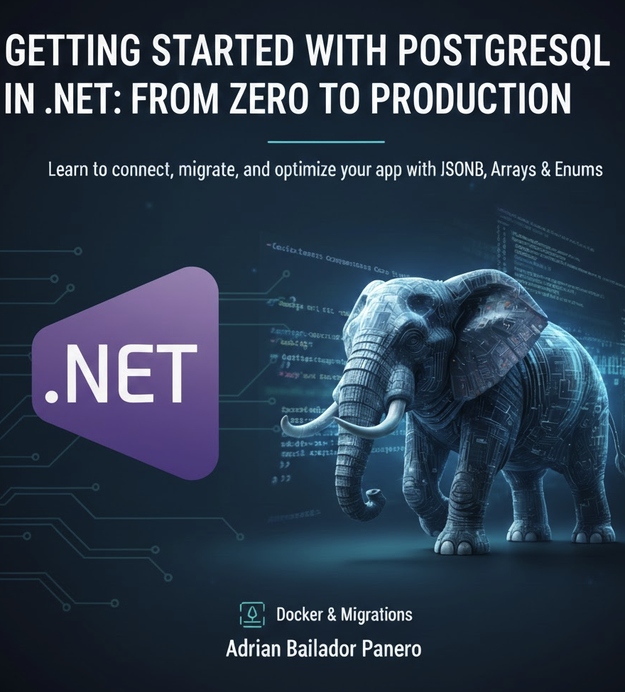

Getting started with PostgreSQL in .NET using Entity Framework Core and Dapper. Learn how to set up PostgreSQL with Docker, run migrations, use JSONB and arrays, and connect your ASP.NET Core API to a production-ready database.

---

## Introduction: Why PostgreSQL Over SQL Server?

If you've been working with SQL Server for a while, switching to PostgreSQL might feel unnecessary. But more and more .NET teams are making the move — and for good reasons.

PostgreSQL is open source, free, and runs on any platform. It's battle-tested at scale by companies like Apple, Instagram, and Spotify. It handles relational data as well as SQL Server, but also supports native JSON storage, full-text search, arrays, custom types, and vector search through the `pgvector` extension — all without additional licensing costs.

For .NET developers, the ecosystem is mature. The Npgsql driver has first-class support for Entity Framework Core and Dapper, and the development experience is practically identical to what you're used to.

In this article, I'll walk you through everything you need to go from zero to a working .NET application backed by PostgreSQL — locally with Docker, through migrations, and into production-ready territory.

---

## Setting Up PostgreSQL Locally with Docker

The fastest way to get PostgreSQL running locally is with Docker. No installation, no PATH conflicts, no version headaches.

Create a `docker-compose.yml` in your project root:

```yaml
version: '3.8'

services:
  postgres:
    image: postgres:16
    container_name: pg_dev
    environment:
      POSTGRES_USER: admin
      POSTGRES_PASSWORD: yourpassword
      POSTGRES_DB: myapp
    ports:
      - "5432:5432"
    volumes:
      - pgdata:/var/lib/postgresql/data

volumes:
  pgdata:
```

Start it with:

```bash
docker compose up -d
```

Verify it's running:

```bash
docker exec -it pg_dev psql -U admin -d myapp
```

You can also use a GUI like **pgAdmin** or **DBeaver** if you prefer a visual interface. Connect with:

- **Host:** `localhost`
- **Port:** `5432`
- **User:** `admin`
- **Password:** `yourpassword`
- **Database:** `myapp`

---

## Connecting to PostgreSQL with Entity Framework Core (Npgsql)

### Install the packages

```bash
dotnet add package Npgsql.EntityFrameworkCore.PostgreSQL
dotnet add package Microsoft.EntityFrameworkCore.Design
```

### Create your models

```csharp
public class Product
{
    public int Id { get; set; }
    public string Name { get; set; } = string.Empty;
    public decimal Price { get; set; }
    public DateTime CreatedAt { get; set; }
    public bool IsAvailable { get; set; }
}
```

### Configure the DbContext

```csharp
public class AppDbContext : DbContext
{
    public AppDbContext(DbContextOptions<AppDbContext> options) : base(options) { }

    public DbSet<Product> Products => Set<Product>();

    protected override void OnModelCreating(ModelBuilder modelBuilder)
    {
        modelBuilder.Entity<Product>(entity =>
        {
            entity.HasKey(e => e.Id);
            entity.Property(e => e.Name).IsRequired().HasMaxLength(200);
            entity.Property(e => e.Price).HasColumnType("numeric(18,2)");
            entity.Property(e => e.CreatedAt).HasDefaultValueSql("NOW()");
        });
    }
}
```

### Register in Program.cs

```csharp
builder.Services.AddDbContext<AppDbContext>(options =>
    options.UseNpgsql(builder.Configuration.GetConnectionString("Postgres")));
```

### Add the connection string to appsettings.json

```json
{
  "ConnectionStrings": {
    "Postgres": "Host=localhost;Port=5432;Database=myapp;Username=admin;Password=yourpassword"
  }
}
```

---

## Connecting with Dapper

For scenarios where you need raw SQL — reports, complex joins, stored procedures — Dapper is a great companion to EF Core.

### Install the package

```bash
dotnet add package Dapper
dotnet add package Npgsql
```

### Create a connection factory

```csharp
public interface IDbConnectionFactory
{
    NpgsqlConnection CreateConnection();
}

public class PostgresConnectionFactory : IDbConnectionFactory
{
    private readonly string _connectionString;

    public PostgresConnectionFactory(IConfiguration configuration)
    {
        _connectionString = configuration.GetConnectionString("Postgres")!;
    }

    public NpgsqlConnection CreateConnection()
    {
        return new NpgsqlConnection(_connectionString);
    }
}
```

Register it in `Program.cs`:

```csharp
builder.Services.AddSingleton<IDbConnectionFactory, PostgresConnectionFactory>();
```

### Query with Dapper

```csharp
public class ProductRepository
{
    private readonly IDbConnectionFactory _factory;

    public ProductRepository(IDbConnectionFactory factory)
    {
        _factory = factory;
    }

    public async Task<IEnumerable<Product>> GetAvailableAsync()
    {
        using var connection = _factory.CreateConnection();

        return await connection.QueryAsync<Product>(
            "SELECT * FROM products WHERE is_available = true ORDER BY created_at DESC");
    }

    public async Task<Product?> GetByIdAsync(int id)
    {
        using var connection = _factory.CreateConnection();

        return await connection.QuerySingleOrDefaultAsync<Product>(
            "SELECT * FROM products WHERE id = @Id",
            new { Id = id });
    }

    public async Task<int> CreateAsync(Product product)
    {
        using var connection = _factory.CreateConnection();

        return await connection.ExecuteScalarAsync<int>(
            """
            INSERT INTO products (name, price, is_available)
            VALUES (@Name, @Price, @IsAvailable)
            RETURNING id
            """,
            product);
    }
}
```

---

## PostgreSQL-Specific Features You'll Love

This is where PostgreSQL starts to shine beyond standard relational databases.

### JSONB — Storing Flexible Data

JSONB stores JSON as binary, making it fast to query and index. Perfect for dynamic attributes, metadata, or configuration data.

```csharp
public class Order
{
    public int Id { get; set; }
    public string CustomerEmail { get; set; } = string.Empty;
    public JsonDocument Metadata { get; set; } = JsonDocument.Parse("{}");
}
```

Configure it in your `DbContext`:

```csharp
modelBuilder.Entity<Order>()
    .Property(o => o.Metadata)
    .HasColumnType("jsonb");
```

Query specific JSONB keys with Dapper:

```sql
SELECT * FROM orders
WHERE metadata->>'region' = 'EU'
  AND (metadata->>'total')::numeric > 500;
```

### Arrays — Native List Support

No junction tables needed for simple lists of primitive values.

```csharp
public class Article
{
    public int Id { get; set; }
    public string Title { get; set; } = string.Empty;
    public string[] Tags { get; set; } = [];
}
```

Configure it:

```csharp
modelBuilder.Entity<Article>()
    .Property(a => a.Tags)
    .HasColumnType("text[]");
```

Query articles that have a specific tag:

```csharp
var articles = await context.Articles
    .Where(a => a.Tags.Contains("dotnet"))
    .ToListAsync();
```

### Enum Types — Readable Data in the Database

Instead of storing magic numbers or plain strings, use PostgreSQL native enums.

```csharp
public enum OrderStatus
{
    Pending,
    Processing,
    Shipped,
    Delivered,
    Cancelled
}

public class Order
{
    public int Id { get; set; }
    public OrderStatus Status { get; set; }
}
```

Register the enum in Npgsql:

```csharp
builder.Services.AddDbContext<AppDbContext>(options =>
    options.UseNpgsql(builder.Configuration.GetConnectionString("Postgres"),
        o => o.MapEnum<OrderStatus>("order_status")));
```

And in `OnModelCreating`:

```csharp
modelBuilder.HasPostgresEnum<OrderStatus>("order_status");
```

---

## Running Migrations with EF Core

### Install the CLI tool (if you haven't already)

```bash
dotnet tool install --global dotnet-ef
```

### Create and apply your first migration

```bash
dotnet ef migrations add InitialCreate
dotnet ef database update
```

### Generating a script for production

Never run `dotnet ef database update` directly in production. Instead, generate a SQL script and run it through your deployment pipeline:

```bash
dotnet ef migrations script --idempotent -o migrations.sql
```

The `--idempotent` flag makes the script safe to run multiple times — it only applies migrations that haven't been applied yet.

### Applying migrations programmatically on startup

For containerised environments, you can apply pending migrations automatically when the app starts:

```csharp
using (var scope = app.Services.CreateScope())
{
    var db = scope.ServiceProvider.GetRequiredService<AppDbContext>();
    await db.Database.MigrateAsync();
}
```

> ⚠️ Use this pattern with care in multi-instance deployments. Consider using an init container or a dedicated migration job instead.

---

## Common Errors and How to Avoid Them

**`Npgsql.PostgresException: column does not exist`**
PostgreSQL is case-sensitive by default. Column and table names created without quotes are lowercased automatically. If your model has `CreatedAt`, EF Core maps it to `created_at` with snake_case conventions (enabled via `UseSnakeCaseNamingConvention()`). Enable it explicitly:

```csharp
options.UseNpgsql(connectionString)
       .UseSnakeCaseNamingConvention();
```

---

**`System.InvalidOperationException: No suitable constructor found for entity type`**
EF Core needs either a parameterless constructor or one it can match to properties. Add a protected parameterless constructor if you have a custom one:

```csharp
public class Product
{
    protected Product() { } // For EF Core
    public Product(string name, decimal price) { ... }
}
```

---

**`NpgsqlException: SSL connection is required`**
Production PostgreSQL instances (like Azure Database for PostgreSQL) enforce SSL. Update your connection string:

```
Host=myserver.postgres.database.azure.com;...;Ssl Mode=Require;Trust Server Certificate=true;
```

---

**Enum migration fails with `type already exists`**
If you drop and recreate the database during development, Npgsql may try to create the enum type again. Wrap the enum creation in a migration check, or use `HasPostgresEnum()` which handles this safely.

---

**Slow queries after a large data load**
PostgreSQL relies on table statistics to build query plans. After bulk inserts, run:

```sql
ANALYZE products;
```

Or let the autovacuum daemon handle it automatically in production.

---

## Best Practices

- **Use snake_case naming conventions** with `UseSnakeCaseNamingConvention()` — this avoids constant quoting issues and aligns with PostgreSQL conventions.
- **Don't use `dotnet ef database update` in production** — always generate and review SQL scripts before applying them.
- **Index foreign keys** — PostgreSQL does not create indexes on foreign key columns automatically, unlike SQL Server.
- **Use `NOW()` for server-side timestamps** — instead of setting `DateTime.UtcNow` in C#, use `HasDefaultValueSql("NOW()")` to let the database handle it.
- **Prefer `jsonb` over `json`** — `jsonb` is stored as parsed binary and supports indexing. `json` stores raw text and is slower to query.
- **Pool your connections** — Npgsql includes connection pooling by default. Avoid creating `NpgsqlConnection` instances as singletons; always open and dispose per request.
- **Monitor with `pg_stat_statements`** — enable this extension to track slow queries across your application in production.

---

## Conclusion

PostgreSQL is a powerful, production-proven database that integrates seamlessly with the .NET ecosystem. Whether you're using Entity Framework Core for its migration and LINQ support, or Dapper for raw SQL performance, the tooling is mature and the developer experience is excellent.

The features covered here — JSONB, arrays, enum types, and EF Core migrations — are the ones you'll reach for most often in real projects. Start with them, and you'll quickly see why so many teams are moving away from SQL Server and never looking back.

In the next article in this series, we'll go deeper into PostgreSQL query performance: understanding `EXPLAIN ANALYZE`, building the right indexes, and optimising the queries that EF Core generates under the hood.

---