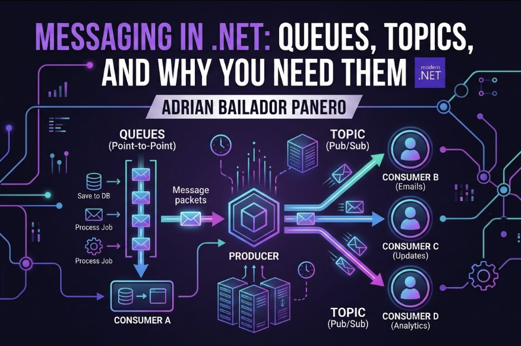

An introduction to asynchronous messaging in .NET — what queues and topics are, how delivery semantics work, and which broker to choose for your next project.

---

## Introduction: The Problem with Direct API Calls

Imagine you have an e-commerce application. When a customer places an order, your API needs to:

1. Save the order to the database
2. Send a confirmation email
3. Notify the warehouse system
4. Update the inventory
5. Trigger a loyalty points calculation

The naive approach is to do all of this synchronously in a single HTTP request. Your controller calls five different services, waits for each one to respond, and then returns a 200 OK to the user.

This works — until it doesn't.

What happens when the email service is slow? The user waits. What happens when the warehouse system is down? The entire order fails. What happens under heavy traffic? Your API becomes a bottleneck, holding connections open while it waits for downstream services to respond.

This is the problem that messaging solves. Instead of calling downstream services directly, you publish a message to a broker. The broker stores it. The downstream services consume it when they're ready. Your API returns immediately. The customer gets a fast response. Everything else happens in the background, reliably, even if individual services are temporarily unavailable.

In this article, I'll cover the core concepts you need before diving into any specific broker — queues, topics, delivery semantics, and the key patterns that make distributed messaging reliable.

---

## Synchronous vs Asynchronous Communication

Before queues and topics, it's worth being precise about what we mean by synchronous and asynchronous.

**Synchronous communication** means the caller waits for a response. HTTP REST calls are synchronous. Your API calls the inventory service and blocks until it gets a reply. The caller and the receiver are temporally coupled — they must both be available at the same moment.

**Asynchronous communication** means the caller sends a message and moves on. The receiver processes it independently, at its own pace, potentially much later. The caller and receiver are decoupled in time — the receiver doesn't even need to be running when the message is sent.

```
// Synchronous — tight coupling
var result = await _inventoryService.UpdateStockAsync(productId, quantity);
// If inventory service is down, this throws. Order fails.

// Asynchronous — loose coupling
await _messageBus.PublishAsync(new StockUpdateRequested(productId, quantity));
// Message is stored. Even if inventory service is down, it processes when it recovers.
```

Asynchronous messaging doesn't replace synchronous communication — it complements it. Use HTTP when you need an immediate response. Use messaging when you need reliability, scalability, or decoupling.

---

## Queues vs Topics: What's the Difference?

These two concepts are the foundation of every messaging system, and they're frequently confused.

### Queues — One Producer, One Consumer

A queue is a first-in, first-out data structure. A producer sends a message to the queue. One consumer picks it up and processes it. Once processed, the message is gone.

```
Producer → [Queue] → Consumer A
```

This is a **point-to-point** pattern. If you have multiple consumers reading from the same queue, each message goes to exactly one of them (competing consumers). This is ideal for work distribution — multiple workers processing jobs in parallel without duplicating the work.

**Use queues when:**
- You need to distribute work across multiple workers
- Each message should be processed exactly once
- You're building task queues, job runners, or command handlers

### Topics — One Producer, Many Consumers

A topic (sometimes called an exchange or a pub/sub channel) allows one producer to send a message that gets delivered to multiple independent consumers simultaneously. Each consumer gets its own copy.

```
Producer → [Topic] → Consumer A (sends email)
                   → Consumer B (updates warehouse)
                   → Consumer C (calculates points)
```

This is the **publish/subscribe** (pub/sub) pattern. When an `OrderPlaced` event is published, every service that cares about orders receives it independently. The order service doesn't know or care who's listening.

**Use topics when:**
- Multiple independent services need to react to the same event
- You want to add new subscribers without modifying the producer
- You're building an event-driven architecture

### The Practical Difference in Code

```csharp
// Queue: send a command to be processed once
await bus.Send(new ProcessPaymentCommand
{
    OrderId = orderId,
    Amount = total
});

// Topic: publish an event that multiple services can react to
await bus.Publish(new OrderPlacedEvent
{
    OrderId = orderId,
    CustomerId = customerId,
    TotalAmount = total,
    PlacedAt = DateTime.UtcNow
});
```

The naming convention reveals the intent: commands are sent (to a specific queue), events are published (to anyone who's interested).

---

## Delivery Semantics: At Most Once, At Least Once, Exactly Once

This is where things get interesting — and where many developers make mistakes that lead to data corruption or silent data loss.

### At Most Once

The broker delivers the message once and doesn't retry if something goes wrong. The message may be lost if the consumer crashes mid-processing. No duplicates, but possible data loss.

```
Broker → Consumer (crashes mid-process)
Message is lost. No retry.
```

**When to use it:** Metrics, analytics, log events — data where occasional loss is acceptable.

### At Least Once

The broker keeps the message until the consumer explicitly acknowledges (acks) it. If the consumer crashes before acking, the broker redelivers. This guarantees no data loss, but the same message may be delivered more than once.

```
Broker → Consumer (processes but crashes before ack)
Broker → Consumer (redeliver — message processed twice)
```

**This is the default in most production systems.** RabbitMQ, Azure Service Bus, and AWS SQS all default to at-least-once delivery.

**The consequence:** your consumers must be idempotent — processing the same message twice must produce the same result as processing it once.

```csharp
public async Task HandleAsync(OrderPlacedEvent message)
{
    // ✅ Idempotent — checking prevents duplicate processing
    if (await _db.Orders.AnyAsync(o => o.Id == message.OrderId))
        return;

    await _db.Orders.AddAsync(new Order(message));
    await _db.SaveChangesAsync();
}
```

### Exactly Once

The broker guarantees each message is processed exactly once. In theory this is ideal. In practice, true exactly-once delivery is extremely difficult to achieve across distributed systems and comes with significant performance overhead.

**Most teams don't need exactly-once delivery at the broker level.** At-least-once delivery with idempotent consumers achieves the same result in practice.

---

## Key Concepts Every .NET Developer Should Know

### Dead Letter Queues (DLQ)

When a message can't be processed — because of an exception, a schema mismatch, or too many failed retries — it gets moved to a dead letter queue instead of being lost.

```
[Main Queue] → Consumer (fails 3 times)
                    ↓
             [Dead Letter Queue] ← inspect, fix, replay
```

Dead letter queues are essential for observability. Without them, failed messages vanish silently. With them, you can inspect what went wrong, fix the bug, and replay the messages.

### Idempotency Keys

Since at-least-once delivery means duplicates are possible, consumers need a way to detect them. An idempotency key is a unique identifier per message that the consumer checks before processing.

```csharp
public class ProcessPaymentHandler
{
    private readonly IIdempotencyStore _store;

    public async Task HandleAsync(ProcessPaymentCommand command)
    {
        // Check if already processed
        if (await _store.ExistsAsync(command.MessageId))
            return;

        await ProcessPaymentAsync(command);

        // Mark as processed
        await _store.MarkAsync(command.MessageId);
    }
}
```

### Deduplication Windows

Some brokers (Azure Service Bus, AWS SQS FIFO) support server-side deduplication. Within a time window, messages with the same deduplication ID are automatically discarded.

```csharp
// Azure Service Bus — set the message ID for deduplication
var message = new ServiceBusMessage(payload)
{
    MessageId = $"order-{orderId}-placed"  // Broker deduplicates on this
};
```

### Retry Policies and Backoff

Most brokers support automatic retries on failure. The key is to use exponential backoff — increasing the delay between retries to avoid hammering a struggling downstream service.

```csharp
// MassTransit retry policy
cfg.UseMessageRetry(r =>
    r.Exponential(
        retryLimit: 5,
        minInterval: TimeSpan.FromSeconds(1),
        maxInterval: TimeSpan.FromMinutes(5),
        intervalDelta: TimeSpan.FromSeconds(5)
    ));
```

---

## Which Broker to Choose

The three most common options in the .NET ecosystem each have different strengths.

### RabbitMQ

Open source, self-hosted, extremely flexible. Supports complex routing rules, multiple exchange types, and fine-grained control over message flow. The AMQP protocol gives you features that cloud-managed services don't offer.

**Choose RabbitMQ when:** you need full control, want to self-host, or need advanced routing. Ideal for on-premises or containerised deployments.

```bash
docker run -d --hostname rabbit --name rabbitmq \
  -p 5672:5672 -p 15672:15672 \
  rabbitmq:3-management
```

### Azure Service Bus

Fully managed, enterprise-grade messaging on Azure. Supports queues, topics, subscriptions, sessions (for ordered processing), and has native integration with the Azure ecosystem.

**Choose Azure Service Bus when:** you're already on Azure and want zero infrastructure management. Excellent SLA, built-in geo-redundancy, and deep integration with Azure Functions and Logic Apps.

### AWS SQS + SNS

SQS is a managed queue service. SNS is a managed pub/sub service. They're designed to be used together — SNS fans out to multiple SQS queues. Extremely scalable, pay-per-use, and deeply integrated with the AWS ecosystem.

**Choose SQS + SNS when:** you're on AWS and want fully managed, highly scalable messaging without the operational overhead.

### Quick Comparison

| | RabbitMQ | Azure Service Bus | AWS SQS + SNS |
|---|---|---|---|
| **Hosting** | Self-managed | Fully managed | Fully managed |
| **Protocol** | AMQP | AMQP / HTTPS | HTTPS |
| **Routing flexibility** | Very high | Medium | Medium |
| **Cost** | Infrastructure only | Per operation | Per operation |
| **Best for** | On-prem / containers | Azure workloads | AWS workloads |

---

## When to Use Messaging (and When NOT To)

Messaging adds complexity. It introduces eventual consistency, requires idempotent consumers, and adds operational overhead. It's not always the right tool.

**Use messaging when:**
- Operations are slow and don't need an immediate result (email sending, PDF generation, report processing)
- Multiple services need to react to the same event independently
- You need to buffer traffic spikes and protect downstream services
- Reliability matters more than immediacy — the work must eventually happen even if a service is temporarily down

**Don't use messaging when:**
- You need an immediate response — use HTTP
- The operation is simple and happens within a single bounded context
- You're adding unnecessary complexity to a problem that a simple service call solves
- Your team isn't ready for the operational complexity of a message broker

A common mistake is reaching for messaging too early. Start with synchronous calls, identify where coupling, latency, or reliability becomes a problem, and introduce messaging at those specific seams.

---

## Common Errors and How to Avoid Them

**Processing messages without idempotency checks**
At-least-once delivery means duplicates will happen. Without idempotency, you'll charge customers twice, send duplicate emails, or create duplicate records. Always check whether a message has already been processed before acting on it.

---

**Not configuring a dead letter queue**
Without a DLQ, failed messages are silently dropped or cause infinite retry loops. Always configure a DLQ and set up alerts when messages arrive there.

```csharp
// RabbitMQ — declare a dead letter exchange
channel.QueueDeclare("orders", arguments: new Dictionary<string, object>
{
    { "x-dead-letter-exchange", "orders.dlx" },
    { "x-max-retries", 3 }
});
```

---

**Putting too much data in the message payload**
Messages should carry just enough information to identify the event and trigger processing — not entire object graphs. Large payloads increase latency and make schema evolution painful. Use the Claim Check pattern for large data: store the payload elsewhere and put only a reference in the message.

```csharp
// ❌ Too much data in the message
new OrderPlacedEvent { Order = entireOrderObjectWithAllRelations };

// ✅ Just the identifiers — consumers fetch what they need
new OrderPlacedEvent { OrderId = orderId, CustomerId = customerId };
```

---

**Ignoring message ordering**
Most brokers don't guarantee message ordering by default. If your consumer assumes `OrderUpdated` always arrives after `OrderCreated`, you'll have subtle bugs. Either design consumers to handle out-of-order messages, or use ordering guarantees (SQS FIFO, Service Bus sessions) where ordering truly matters.

---

**Forgetting about schema evolution**
Once you publish messages, consumers depend on their shape. Changing a field name or removing a property breaks consumers. Use additive changes only — add new optional fields, never remove or rename existing ones. Consider a schema registry for large teams.

---

## Best Practices

- **Start with a queue, move to topics when you have multiple consumers.** Don't over-architect from day one.
- **Make every consumer idempotent.** Assume every message will be delivered more than once.
- **Always configure dead letter queues.** Failed messages must be observable, not silently lost.
- **Use exponential backoff for retries.** Hammering a failing service makes things worse.
- **Keep message payloads small.** Include identifiers, not full objects.
- **Name messages as past-tense events.** `OrderPlaced`, not `PlaceOrder`. Events describe what happened; commands describe what to do.
- **Version your message contracts.** Plan for schema evolution before you ship.
- **Monitor consumer lag.** If messages are accumulating in a queue faster than they're being consumed, something is wrong.

---

## Conclusion

Messaging is one of the most powerful tools for building resilient, scalable .NET applications — and one of the most misunderstood. The core ideas are simpler than they seem: queues for point-to-point work distribution, topics for broadcasting events to multiple consumers, and at-least-once delivery with idempotent consumers as the default approach.

Understanding these fundamentals before picking a broker will save you from the most common pitfalls: messages that silently disappear, consumers that process the same event multiple times, and systems that fail in non-obvious ways under load.

In the next article in this series, we'll put these concepts into practice with RabbitMQ: setting it up with Docker, sending and consuming messages in .NET, implementing dead letter queues, and building a real order processing example from scratch.

---