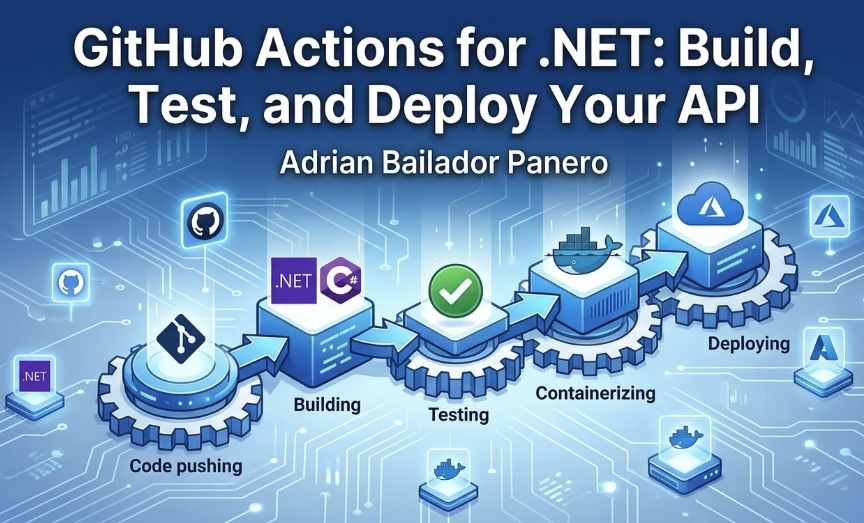

A complete guide to CI/CD for .NET developers — automated builds, test runs, Docker images, and deployments to Azure using GitHub Actions from scratch.

---

## Introduction: Why CI/CD Is Not Optional

Every time you push code manually, run tests by hand, or deploy by copying files to a server, you're introducing risk. Human steps fail. They get skipped under pressure. They're not reproducible.

CI/CD (Continuous Integration / Continuous Deployment) solves this by automating the entire path from a git push to a running application. Every commit is built. Every build is tested. Every successful build on main can be deployed automatically.

GitHub Actions is the most natural CI/CD tool for .NET developers on GitHub. It's free for public repositories, deeply integrated with the GitHub ecosystem, and has a growing marketplace of pre-built actions. You write workflows in YAML, they run on Microsoft-hosted runners with .NET pre-installed, and you pay nothing for most use cases.

In this article I'll walk you through building a complete pipeline: automated builds, test runs with coverage, Docker image creation, NuGet caching, and deployment to Azure App Service.

---

## GitHub Actions Core Concepts

Before writing any YAML, understand the four building blocks:

**Workflow** — a YAML file in `.github/workflows/` that defines your automation. You can have multiple workflows per repository.

**Event** — what triggers the workflow. A push, a pull request, a schedule, or a manual trigger.

**Job** — a unit of work that runs on a runner (a virtual machine). Jobs run in parallel by default; you can make them sequential with `needs`.

**Step** — a single command or action within a job. Steps run sequentially within a job.

```
Workflow
  └── Job A (runs on ubuntu-latest)
        ├── Step 1: Checkout code
        ├── Step 2: Setup .NET
        ├── Step 3: Restore packages
        ├── Step 4: Build
        └── Step 5: Test
  └── Job B (runs after Job A)
        ├── Step 1: Build Docker image
        └── Step 2: Deploy to Azure
```

---

## Your First .NET Workflow: Build + Test on Every Push

Create `.github/workflows/ci.yml` in your repository:

```yaml
name: CI

on:
  push:
    branches: [ main, develop ]
  pull_request:
    branches: [ main ]

jobs:
  build-and-test:
    runs-on: ubuntu-latest

    steps:
      - name: Checkout code
        uses: actions/checkout@v4

      - name: Setup .NET
        uses: actions/setup-dotnet@v4
        with:
          dotnet-version: '8.0.x'

      - name: Restore dependencies
        run: dotnet restore

      - name: Build
        run: dotnet build --no-restore --configuration Release

      - name: Test
        run: dotnet test --no-build --configuration Release --verbosity normal
```

This workflow runs on every push to `main` or `develop`, and on every pull request targeting `main`. It checks out your code, sets up .NET 8, restores NuGet packages, builds in Release mode, and runs all tests.

Push this file to your repository and you'll see it appear under the **Actions** tab immediately.

---

## Caching NuGet Packages for Faster Builds

By default, NuGet packages are downloaded fresh on every run. For a project with many dependencies, this adds 30–90 seconds per build. Caching fixes this:

```yaml
    steps:
      - name: Checkout code
        uses: actions/checkout@v4

      - name: Setup .NET
        uses: actions/setup-dotnet@v4
        with:
          dotnet-version: '8.0.x'

      - name: Cache NuGet packages
        uses: actions/cache@v4
        with:
          path: ~/.nuget/packages
          key: ${{ runner.os }}-nuget-${{ hashFiles('**/*.csproj') }}
          restore-keys: |
            ${{ runner.os }}-nuget-

      - name: Restore dependencies
        run: dotnet restore

      - name: Build
        run: dotnet build --no-restore --configuration Release

      - name: Test
        run: dotnet test --no-build --configuration Release
```

The cache key is based on the hash of all `.csproj` files. When you add or update a package, the hash changes, the cache misses, and packages are downloaded fresh. Otherwise, the cached packages are used immediately.

---

## Running Tests and Publishing Coverage Reports

Knowing tests pass is good. Knowing coverage isn't dropping is better. Add coverage reporting with Coverlet:

First, add the package to your test project:

```bash
dotnet add package coverlet.collector
```

Then update your test step:

```yaml
      - name: Test with coverage
        run: |
          dotnet test --no-build --configuration Release \
            --collect:"XPlat Code Coverage" \
            --results-directory ./coverage

      - name: Upload coverage report
        uses: actions/upload-artifact@v4
        with:
          name: coverage-report
          path: ./coverage
```

For a richer experience, use Codecov or the built-in GitHub summary:

```yaml
      - name: Test with coverage summary
        run: |
          dotnet test --no-build --configuration Release \
            --logger "trx;LogFileName=test-results.trx" \
            --collect:"XPlat Code Coverage"

      - name: Publish test results
        uses: dorny/test-reporter@v1
        if: always()
        with:
          name: .NET Test Results
          path: '**/*.trx'
          reporter: dotnet-trx
```

The `if: always()` ensures test results are published even when tests fail — so you can see which tests broke.

---

## Matrix Builds: Testing on Multiple .NET Versions

If your library or API needs to support multiple .NET versions, matrix builds test all of them in parallel:

```yaml
jobs:
  build-and-test:
    runs-on: ubuntu-latest

    strategy:
      matrix:
        dotnet-version: [ '8.0.x', '9.0.x' ]

    steps:
      - name: Checkout code
        uses: actions/checkout@v4

      - name: Setup .NET ${{ matrix.dotnet-version }}
        uses: actions/setup-dotnet@v4
        with:
          dotnet-version: ${{ matrix.dotnet-version }}

      - name: Restore, Build, Test
        run: |
          dotnet restore
          dotnet build --no-restore --configuration Release
          dotnet test --no-build --configuration Release
```

This runs two parallel jobs — one for .NET 8, one for .NET 9 — and reports results for each independently.

---

## Building and Pushing a Docker Image

Once tests pass, build a Docker image and push it to a container registry. First, make sure you have a `Dockerfile` in your project:

```dockerfile
FROM mcr.microsoft.com/dotnet/aspnet:8.0 AS base
WORKDIR /app
EXPOSE 8080

FROM mcr.microsoft.com/dotnet/sdk:8.0 AS build
WORKDIR /src
COPY ["MyApi/MyApi.csproj", "MyApi/"]
RUN dotnet restore "MyApi/MyApi.csproj"
COPY . .
WORKDIR "/src/MyApi"
RUN dotnet build --configuration Release --output /app/build

FROM build AS publish
RUN dotnet publish --configuration Release --output /app/publish /p:UseAppHost=false

FROM base AS final
WORKDIR /app
COPY --from=publish /app/publish .
ENTRYPOINT ["dotnet", "MyApi.dll"]
```

Now add a Docker job to your workflow that runs after the tests pass:

```yaml
  docker:
    runs-on: ubuntu-latest
    needs: build-and-test
    if: github.ref == 'refs/heads/main'

    steps:
      - name: Checkout code
        uses: actions/checkout@v4

      - name: Log in to Docker Hub
        uses: docker/login-action@v3
        with:
          username: ${{ secrets.DOCKER_USERNAME }}
          password: ${{ secrets.DOCKER_PASSWORD }}

      - name: Build and push Docker image
        uses: docker/build-push-action@v5
        with:
          context: .
          push: true
          tags: |
            yourusername/myapi:latest
            yourusername/myapi:${{ github.sha }}
```

The `needs: build-and-test` ensures Docker only runs if tests pass. The `if: github.ref == 'refs/heads/main'` ensures we only push images from the main branch, not from every feature branch.

Add your Docker Hub credentials as **repository secrets** under Settings → Secrets and variables → Actions.

---

## Deploying to Azure App Service

For deploying to Azure App Service, use the official Azure action. You'll need an Azure publish profile stored as a secret:

```yaml
  deploy:
    runs-on: ubuntu-latest
    needs: docker
    if: github.ref == 'refs/heads/main'
    environment: production

    steps:
      - name: Deploy to Azure App Service
        uses: azure/webapps-deploy@v3
        with:
          app-name: 'my-dotnet-api'
          publish-profile: ${{ secrets.AZURE_WEBAPP_PUBLISH_PROFILE }}
          images: 'yourusername/myapi:${{ github.sha }}'
```

The `environment: production` adds a manual approval gate — someone must approve the deployment in the GitHub UI before it proceeds. Essential for production deployments.

To get the publish profile, go to your App Service in the Azure Portal → **Get Publish Profile** → download the file → paste the contents into a GitHub secret named `AZURE_WEBAPP_PUBLISH_PROFILE`.

---

## Using Secrets and Environment Variables Safely

Never hardcode connection strings, API keys, or credentials in your workflow files. Use GitHub secrets for sensitive values and environment variables for non-sensitive configuration:

```yaml
    steps:
      - name: Run integration tests
        env:
          # Non-sensitive — fine in the workflow file
          ASPNETCORE_ENVIRONMENT: Testing
          # Sensitive — always use secrets
          ConnectionStrings__DefaultConnection: ${{ secrets.TEST_DB_CONNECTION }}
          ExternalApi__ApiKey: ${{ secrets.EXTERNAL_API_KEY }}
        run: dotnet test --filter Category=Integration
```

For environment-specific configuration across multiple jobs, use workflow-level environment variables:

```yaml
env:
  DOTNET_VERSION: '8.0.x'
  BUILD_CONFIGURATION: Release
  AZURE_APP_NAME: 'my-dotnet-api'

jobs:
  build-and-test:
    runs-on: ubuntu-latest
    steps:
      - name: Setup .NET
        uses: actions/setup-dotnet@v4
        with:
          dotnet-version: ${{ env.DOTNET_VERSION }}

      - name: Build
        run: dotnet build --configuration ${{ env.BUILD_CONFIGURATION }}
```

---

## Complete Pipeline: Putting It All Together

Here's the full production-ready workflow combining everything above:

```yaml
name: CI/CD Pipeline

on:
  push:
    branches: [ main, develop ]
  pull_request:
    branches: [ main ]

env:
  DOTNET_VERSION: '8.0.x'
  BUILD_CONFIGURATION: Release
  DOCKER_IMAGE: yourusername/myapi

jobs:
  build-and-test:
    runs-on: ubuntu-latest

    steps:
      - uses: actions/checkout@v4

      - name: Setup .NET
        uses: actions/setup-dotnet@v4
        with:
          dotnet-version: ${{ env.DOTNET_VERSION }}

      - name: Cache NuGet packages
        uses: actions/cache@v4
        with:
          path: ~/.nuget/packages
          key: ${{ runner.os }}-nuget-${{ hashFiles('**/*.csproj') }}
          restore-keys: ${{ runner.os }}-nuget-

      - name: Restore
        run: dotnet restore

      - name: Build
        run: dotnet build --no-restore --configuration ${{ env.BUILD_CONFIGURATION }}

      - name: Test
        run: |
          dotnet test --no-build \
            --configuration ${{ env.BUILD_CONFIGURATION }} \
            --collect:"XPlat Code Coverage" \
            --logger "trx;LogFileName=test-results.trx"

      - name: Upload test results
        uses: actions/upload-artifact@v4
        if: always()
        with:
          name: test-results
          path: '**/*.trx'

  docker:
    runs-on: ubuntu-latest
    needs: build-and-test
    if: github.ref == 'refs/heads/main'

    steps:
      - uses: actions/checkout@v4

      - name: Login to Docker Hub
        uses: docker/login-action@v3
        with:
          username: ${{ secrets.DOCKER_USERNAME }}
          password: ${{ secrets.DOCKER_PASSWORD }}

      - name: Build and push
        uses: docker/build-push-action@v5
        with:
          context: .
          push: true
          tags: |
            ${{ env.DOCKER_IMAGE }}:latest
            ${{ env.DOCKER_IMAGE }}:${{ github.sha }}

  deploy:
    runs-on: ubuntu-latest
    needs: docker
    if: github.ref == 'refs/heads/main'
    environment: production

    steps:
      - name: Deploy to Azure App Service
        uses: azure/webapps-deploy@v3
        with:
          app-name: 'my-dotnet-api'
          publish-profile: ${{ secrets.AZURE_WEBAPP_PUBLISH_PROFILE }}
          images: '${{ env.DOCKER_IMAGE }}:${{ github.sha }}'
```

This gives you three jobs in sequence: build and test → build Docker image → deploy to Azure, with manual approval on the final step.

---

## Common Errors and How to Avoid Them

**`Error: Process completed with exit code 1` on dotnet test**
This usually means a test failed, not a configuration problem. Check the test output in the Actions log. If tests pass locally but fail in CI, the most common cause is a missing environment variable or a test that depends on local state (file system, local database). Use `--verbosity normal` to see detailed output.

---

**Docker build fails with `COPY failed: file not found`**
The Docker build context in GitHub Actions is the repository root by default. If your `Dockerfile` references files with relative paths, make sure those paths are relative to the root, not to the Dockerfile's location. Set `context: .` explicitly in the `docker/build-push-action` step.

---

**Secrets not available in pull requests from forks**
For security, GitHub doesn't expose secrets to workflows triggered by pull requests from forks. This is intentional. Run integration tests that need secrets only on `push` events, not on `pull_request` from external contributors.

---

**NuGet cache never hits**
If the cache key changes on every run, check whether any `.csproj` file is being modified during the build (e.g. by a code generator). Use `restore-keys` as a fallback to get a partial cache hit even when the primary key misses.

---

**Deployment runs even when tests fail**
Always use `needs: build-and-test` on your deployment job. Without it, jobs run in parallel and a failing test won't stop a deployment. Add `if: success()` for extra safety.

---

**`azure/webapps-deploy` fails with 403**
The publish profile may be expired or from the wrong slot. Re-download it from the Azure Portal and update the secret. Also verify the `app-name` matches exactly — it's case-sensitive.

---

## Best Practices

- **Never skip tests in CI.** If tests are slow, fix the tests — don't disable them.
- **Pin action versions with a full SHA** for security-critical workflows. `actions/checkout@v4` is convenient; `actions/checkout@11bd71901bbe5b1630ceea73d27597364c9af683` is safer.
- **Use environments with required reviewers** for production deployments. A manual approval gate prevents accidents.
- **Tag Docker images with the git SHA**, not just `latest`. `latest` is a moving target that makes rollbacks painful.
- **Keep secrets minimal.** Each secret should have the minimum permissions needed. Rotate them regularly.
- **Add a status badge to your README.** It signals professionalism and shows the current build status at a glance.
- **Use concurrency groups** to cancel in-progress runs when a new push arrives on the same branch:

```yaml
concurrency:
  group: ${{ github.workflow }}-${{ github.ref }}
  cancel-in-progress: true
```

---

## Conclusion

A CI/CD pipeline is one of the highest-ROI investments you can make in a .NET project. The first time it catches a broken build before it reaches production, or saves you from a failed manual deployment at 6pm on a Friday, it pays for itself.

The workflow in this article gives you everything you need for a real project: fast builds with NuGet caching, test results with coverage, Docker images tagged by commit SHA, and a deployment to Azure with a manual approval gate.

Start with just the build and test job. Add Docker and deployment once that's stable. Complexity can always be added later — the habit of always having CI running is what matters from day one.

In the next article in this series, we'll look at deploying .NET applications to Azure in depth — App Service, Container Apps, managed identity, and Application Insights for production monitoring.

---