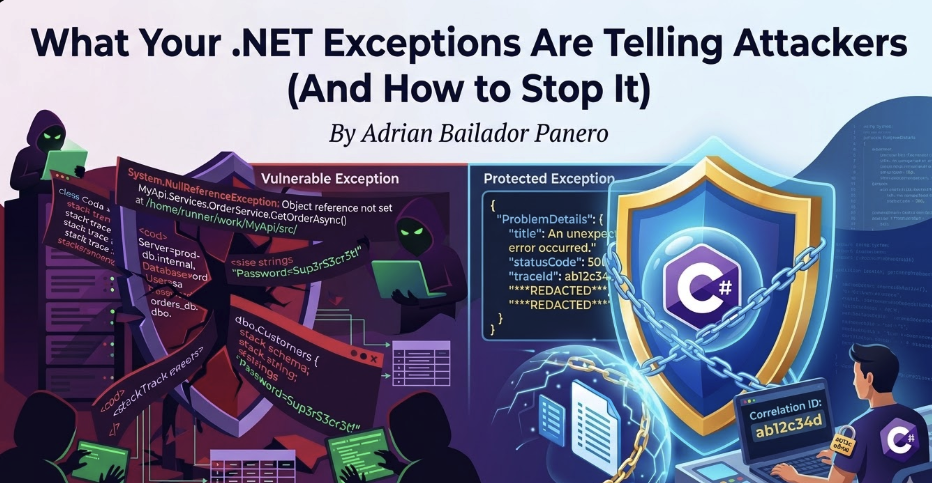

How unhandled exceptions leak stack traces, connection strings, and internal architecture — and how to fix it properly in ASP.NET Core.

---

## Introduction: The Exception That Becomes a Roadmap

Imagine you're building an API. A developer forgets to handle an edge case, and a request triggers an unhandled exception. What does the caller see?

In a default ASP.NET Core project in development mode, they see something like this:

```
System.NullReferenceException: Object reference not set to an instance of an object.
   at MyApi.Services.OrderService.GetOrderAsync(Int32 id)
      in /home/runner/work/MyApi/src/Services/OrderService.cs:line 47
   at MyApi.Controllers.OrdersController.GetOrder(Int32 id)
      in /home/runner/work/MyApi/src/Controllers/OrdersController.cs:line 23
   at Microsoft.AspNetCore.Mvc.Infrastructure.ActionMethodExecutor...

ConnectionString: Server=prod-db.internal;Database=orders;User=sa;Password=Sup3rS3cr3t!
```

That response just told an attacker:
- Your internal folder structure and project layout
- The exact class and method where the error occurred
- Your database server hostname
- Your database credentials

This isn't hypothetical. Error responses are one of the most common sources of information disclosure in web APIs — and one of the easiest to fix.

---

## What Attackers Learn from Your Exceptions

Different types of exceptions leak different types of information. Understanding what gets exposed helps prioritise what to fix first.

### Stack Traces — Your Internal Architecture

A stack trace reveals the exact call chain inside your application. Attackers use this to understand how your code is structured, what libraries you use, and where to look for known vulnerabilities.

```
System.Data.SqlClient.SqlException: Invalid column name 'user_id'.
   at System.Data.SqlClient.SqlConnection.OnError(...)
   at MyApi.Repositories.UserRepository.FindByEmailAsync(String email)
   at MyApi.Services.AuthService.LoginAsync(LoginRequest request)
```

From this single exception, an attacker now knows:
- You're using SQL Server (`SqlClient`)
- A column is named `user_id` — useful for SQL injection attempts
- Your authentication flow goes through `AuthService.LoginAsync`

### Database Errors — Your Schema

Database exceptions are particularly dangerous because they expose table names, column names, and sometimes the exact query that failed.

```
Microsoft.EntityFrameworkCore.DbUpdateException:
An error occurred while saving the entity changes.
Table 'orders_db.dbo.CustomerPayments' doesn't exist.
```

Table names and database names are handed to the attacker on a silver platter.

### Validation Errors — Your Business Rules

Even seemingly harmless validation errors can expose internal logic:

```
FluentValidation.ValidationException:
  -- OrderId: Order ID must be between 100000 and 999999. Severity: Error
  -- CustomerId: Customer must have a verified account with status 'Premium' or 'Enterprise'.
```

Now the attacker knows your ID ranges, your account tiers, and the status values your system uses internally.

---

## The Fix: Global Exception Handling Middleware

The most important step is ensuring that no raw exception ever reaches the client in production. ASP.NET Core provides two clean ways to do this.

### Option 1: UseExceptionHandler (Built-in)

For most APIs, the built-in `UseExceptionHandler` is the right starting point:

```csharp
// Program.cs
if (app.Environment.IsDevelopment())
{
    app.UseDeveloperExceptionPage(); // Full details in development only
}
else
{
    app.UseExceptionHandler("/error"); // Safe response in production
}
```

Add a dedicated error endpoint:

```csharp
[ApiController]
public class ErrorController : ControllerBase
{
    [Route("/error")]
    [ApiExplorerSettings(IgnoreApi = true)]
    public IActionResult HandleError()
    {
        return Problem(
            title: "An unexpected error occurred.",
            statusCode: StatusCodes.Status500InternalServerError
        );
    }
}
```

This returns a standardised RFC 7807 Problem Details response with no internal information:

```json
{
  "type": "https://tools.ietf.org/html/rfc7807",
  "title": "An unexpected error occurred.",
  "status": 500
}
```

### Option 2: Custom Middleware (More Control)

For more control over logging, correlation IDs, and response shaping, write your own middleware:

```csharp
public class ExceptionHandlingMiddleware
{
    private readonly RequestDelegate _next;
    private readonly ILogger<ExceptionHandlingMiddleware> _logger;

    public ExceptionHandlingMiddleware(
        RequestDelegate next,
        ILogger<ExceptionHandlingMiddleware> logger)
    {
        _next = next;
        _logger = logger;
    }

    public async Task InvokeAsync(HttpContext context)
    {
        try
        {
            await _next(context);
        }
        catch (Exception ex)
        {
            await HandleExceptionAsync(context, ex);
        }
    }

    private async Task HandleExceptionAsync(HttpContext context, Exception exception)
    {
        var correlationId = context.TraceIdentifier;

        // Log the full exception internally — never lose observability
        _logger.LogError(exception,
            "Unhandled exception. CorrelationId: {CorrelationId}, Path: {Path}",
            correlationId,
            context.Request.Path);

        var (statusCode, title) = exception switch
        {
            UnauthorizedAccessException => (401, "Unauthorised."),
            KeyNotFoundException        => (404, "Resource not found."),
            ArgumentException           => (400, "Invalid request."),
            _                           => (500, "An unexpected error occurred.")
        };

        context.Response.StatusCode = statusCode;
        context.Response.ContentType = "application/problem+json";

        // Return safe response — correlation ID allows support to look up the real error
        var problem = new
        {
            type    = "https://httpstatuses.com/" + statusCode,
            title   = title,
            status  = statusCode,
            traceId = correlationId   // Safe: links to logs without exposing details
        };

        await context.Response.WriteAsJsonAsync(problem);
    }
}
```

Register it in `Program.cs` — before all other middleware:

```csharp
app.UseMiddleware<ExceptionHandlingMiddleware>();
```

The `correlationId` in the response is the key insight here: the client gets a reference they can provide to support, while you can look up the full exception in your logs. No information leakage, full observability.

### Option 3: IExceptionHandler (ASP.NET Core 8+ — The Modern Approach)

If you're on .NET 8 or later, skip writing middleware from scratch. The `IExceptionHandler` interface is the clean, officially supported way to handle exceptions globally:

```csharp
public class GlobalExceptionHandler : IExceptionHandler
{
    private readonly ILogger<GlobalExceptionHandler> _logger;

    public GlobalExceptionHandler(ILogger<GlobalExceptionHandler> logger)
    {
        _logger = logger;
    }

    public async ValueTask<bool> TryHandleAsync(
        HttpContext httpContext,
        Exception exception,
        CancellationToken cancellationToken)
    {
        var correlationId = httpContext.TraceIdentifier;

        _logger.LogError(exception,
            "Unhandled exception. CorrelationId: {CorrelationId}, Path: {Path}",
            correlationId,
            httpContext.Request.Path);

        var (statusCode, title) = exception switch
        {
            UnauthorizedAccessException => (401, "Unauthorised."),
            KeyNotFoundException        => (404, "Resource not found."),
            ArgumentException           => (400, "Invalid request."),
            _                           => (500, "An unexpected error occurred.")
        };

        httpContext.Response.StatusCode = statusCode;

        var problem = new ProblemDetails
        {
            Title  = title,
            Status = statusCode,
            Extensions = { ["traceId"] = correlationId }
        };

        await httpContext.Response.WriteAsJsonAsync(problem, cancellationToken);

        // Return true = exception is handled, pipeline stops here
        // Return false = pass to the next handler in the chain
        return true;
    }
}
```

Register it in `Program.cs`:

```csharp
builder.Services.AddExceptionHandler<GlobalExceptionHandler>();
builder.Services.AddProblemDetails();

// ...

app.UseExceptionHandler();
```

You can register **multiple handlers** in order — useful when you want different handlers for domain exceptions vs unexpected errors:

```csharp
builder.Services.AddExceptionHandler<DomainExceptionHandler>();   // handles first
builder.Services.AddExceptionHandler<GlobalExceptionHandler>();   // fallback
```

If a handler returns `false` from `TryHandleAsync`, the next registered handler gets a chance. This gives you a clean chain of responsibility without messy if/else trees in a single middleware class. For new projects on .NET 8+, this is the approach to use.

---

## Problem Details: The Standard Way to Return Errors

ASP.NET Core 7+ has built-in support for RFC 7807 Problem Details. Use it instead of rolling your own error response format:

```csharp
builder.Services.AddProblemDetails(options =>
{
    options.CustomizeProblemDetails = context =>
    {
        // Add correlation ID to every problem response
        context.ProblemDetails.Extensions["traceId"] =
            context.HttpContext.TraceIdentifier;

        // Never include exception details in production
        context.ProblemDetails.Extensions.Remove("exception");
    };
});

// In Program.cs
app.UseExceptionHandler();
app.UseStatusCodePages();
```

For custom domain exceptions, create specific Problem Details responses:

```csharp
public class OrderNotFoundException : Exception
{
    public int OrderId { get; }
    public OrderNotFoundException(int orderId)
        : base($"Order {orderId} was not found.")
    {
        OrderId = orderId;
    }
}
```

```csharp
// In your exception handler
if (exception is OrderNotFoundException notFound)
{
    return TypedResults.Problem(
        title: "Order not found.",
        detail: $"No order with ID {notFound.OrderId} exists.",  // Safe — no internal details
        statusCode: 404
    );
}
```

---

## Logging Exceptions Safely

Fixing the response is half the job. The other half is making sure you're not accidentally logging sensitive data.

### What NOT to Log

```csharp
// ❌ Logs the full request body — may contain passwords, card numbers, PII
_logger.LogError("Request failed: {Request}", JsonSerializer.Serialize(request));

// ❌ Logs the connection string from the exception message
_logger.LogError("DB error: {Message}", exception.Message);

// ❌ Logs authentication tokens
_logger.LogInformation("User authenticated with token: {Token}", token);

// ❌ String interpolation bypasses structured logging — if user.ToString()
//    accidentally includes a password hash or sensitive field, it leaks to your logs
_logger.LogError($"Error processing user {user}");
```

### What to Log Instead

```csharp
// ✅ Log the exception object — structured logging handles it safely
_logger.LogError(exception, "Order processing failed for OrderId: {OrderId}", orderId);

// ✅ Always use message templates, never string interpolation
//    This logs the UserId value, not the entire object
_logger.LogWarning("Authentication failed for UserId: {UserId}", user.Id);

// ✅ Log that sensitive data was present, not its value
_logger.LogInformation("Payment processed. CardLastFour: {Last4}", card.LastFour);
```

> **Why string interpolation is dangerous in logs:** When you write `_logger.LogError($"Error for {user}")`, the entire `user` object is serialised via `ToString()` before the logger ever sees it. If your model's `ToString()` override (or a default JSON serialiser) includes a password hash, an API key, or a session token, that value ends up in your log store in plain text. Structured logging with message templates (`{UserId}`) passes the value as a typed parameter — you control exactly what gets captured.

### Filtering Sensitive Properties in Serilog

If you're using Serilog, use destructuring policies to automatically redact sensitive fields:

```csharp
Log.Logger = new LoggerConfiguration()
    .Destructure.ByTransforming<LoginRequest>(r => new
    {
        r.Email,
        Password = "***REDACTED***"
    })
    .WriteTo.Console()
    .CreateLogger();
```

---

## Validating Input Before It Throws

Many exception-based information leaks start with unvalidated input. If you validate properly at the boundary, the dangerous exceptions never get thrown.

```csharp
// ❌ Throws SqlException with schema details if input is malicious
public async Task<Order> GetOrderAsync(string rawId)
{
    var id = int.Parse(rawId); // throws FormatException with the raw input
    return await _db.Orders.FindAsync(id);
}

// ✅ Validate at the boundary — exception never reaches the DB layer
public async Task<IActionResult> GetOrder([FromRoute] int id)
{
    if (id <= 0)
        return BadRequest(new { error = "Invalid order ID." });

    var order = await _orderService.GetOrderAsync(id);
    return order is null ? NotFound() : Ok(order);
}
```

For complex validation, use FluentValidation and return structured errors without exposing internal rules:

```csharp
public class CreateOrderValidator : AbstractValidator<CreateOrderRequest>
{
    public CreateOrderValidator()
    {
        RuleFor(x => x.ProductId)
            .GreaterThan(0)
            .WithMessage("Invalid product.");   // Generic — doesn't reveal ID ranges

        RuleFor(x => x.Quantity)
            .InclusiveBetween(1, 100)
            .WithMessage("Quantity must be between 1 and 100.");
    }
}
```

---

## Hiding Server and Technology Information

Beyond exceptions, ASP.NET Core leaks information through HTTP response headers by default. Remove them:

```csharp
// Program.cs — remove the Server header
builder.WebHost.ConfigureKestrel(options =>
{
    options.AddServerHeader = false;
});
```

Also remove the `X-Powered-By` header if you're behind IIS:

```xml
<!-- web.config -->
<system.webServer>
  <httpProtocol>
    <customHeaders>
      <remove name="X-Powered-By" />
    </customHeaders>
  </httpProtocol>
</system.webServer>
```

And never expose the ASP.NET Core version in error responses. Verify this with your production error handler:

```csharp
// ❌ Reveals framework version
context.Response.Headers["X-AspNet-Version"] = Environment.Version.ToString();

// ✅ Remove it entirely
context.Response.Headers.Remove("X-AspNet-Version");
```

---

## Environment-Specific Configuration

The most common mistake is accidentally deploying with `ASPNETCORE_ENVIRONMENT=Development` in production. This enables the developer exception page, which shows full stack traces.

Lock this down explicitly:

```csharp
// Program.cs — explicit check, not implicit trust
if (!app.Environment.IsProduction())
{
    app.UseDeveloperExceptionPage();
}
else
{
    app.UseExceptionHandler();
    app.UseHsts();
}
```

And verify it in your CI/CD pipeline. In GitHub Actions:

```yaml
- name: Verify production environment
  run: |
    if [ "$ASPNETCORE_ENVIRONMENT" = "Development" ]; then
      echo "ERROR: Cannot deploy with Development environment"
      exit 1
    fi
  env:
    ASPNETCORE_ENVIRONMENT: ${{ vars.ASPNETCORE_ENVIRONMENT }}
```

---

## Common Errors and How to Avoid Them

**Showing stack traces in production**
This is the most critical issue. Always configure `UseExceptionHandler` or custom middleware for production. Use `IHostEnvironment.IsProduction()` — never rely on `#if DEBUG` for security decisions.

---

**Returning exception messages directly to clients**
Never do `return BadRequest(exception.Message)`. Exception messages are written for developers, not clients. They frequently contain internal paths, SQL fragments, or configuration values. Always return a message you explicitly wrote.

```csharp
// ❌
return BadRequest(ex.Message);

// ✅
return BadRequest("The request could not be processed. Please check your input.");
```

---

**Catching and swallowing exceptions silently**
Hiding exceptions without logging them destroys your ability to debug production issues.

```csharp
// ❌ Exception disappears — you'll never know this happened
try { await ProcessOrderAsync(order); }
catch (Exception) { }

// ✅ Log it, then decide how to respond
try { await ProcessOrderAsync(order); }
catch (Exception ex)
{
    _logger.LogError(ex, "Failed to process order {OrderId}", order.Id);
    throw; // or return a safe error response
}
```

---

**Leaking internal IDs in error messages**
Avoid returning internal identifiers (auto-increment IDs, GUIDs from internal systems) in error messages. They help attackers enumerate resources.

```csharp
// ❌ Confirms the resource exists and reveals the internal ID format
return NotFound($"Order with ID {id} not found in database.");

// ✅ Generic — reveals nothing
return NotFound();
```

---

**Using `Environment.StackTrace` in responses or logs**
Developers sometimes manually include `Environment.StackTrace` in log messages or error responses when debugging a tricky issue — and forget to remove it. This is just as dangerous as an unhandled exception reaching the client: it exposes the full call stack, file paths, and line numbers.

```csharp
// ❌ Never include Environment.StackTrace in HTTP responses
return StatusCode(500, new {
    error = "Something went wrong",
    stack = Environment.StackTrace  // Full stack trace sent to the client
});

// ❌ Logging it is safer but still leaks internal structure to your log store
_logger.LogError("Error occurred. Stack: {Stack}", Environment.StackTrace);

// ✅ Log the exception object instead — it includes the stack trace
//    in a structured way, scoped to the actual exception that was thrown
_logger.LogError(exception, "Unhandled error processing order {OrderId}", orderId);
```

The exception object passed to `_logger.LogError(exception, ...)` captures the stack trace as a structured field in your log store. You get full context without manually concatenating strings — and it never accidentally ends up in an HTTP response.

---

**Different error responses for valid vs invalid users**
If your API returns different error messages for "user not found" vs "wrong password", attackers can enumerate valid usernames. Use identical responses:

```csharp
// ❌ Reveals whether the email exists
if (user is null) return Unauthorized("Email address not registered.");
if (!VerifyPassword(user, request.Password)) return Unauthorized("Incorrect password.");

// ✅ Same message either way
if (user is null || !VerifyPassword(user, request.Password))
    return Unauthorized("Invalid credentials.");
```

> **Don't forget timing attacks.** Identical messages aren't enough on their own. If validating a non-existent user takes 2ms (a quick null check) and validating a wrong password takes 200ms (a bcrypt hash comparison), an attacker can still enumerate valid emails by measuring response times — even without reading the message body. Use a constant-time dummy verification to equalise the response time regardless of whether the user exists:
>
> ```csharp
> var user = await _db.Users.FirstOrDefaultAsync(u => u.Email == request.Email);
>
> // Always run the hash comparison — even for non-existent users
> // This ensures the response time is the same whether the user exists or not
> var passwordValid = user is not null
>     ? VerifyPassword(user.PasswordHash, request.Password)
>     : BCrypt.Verify(request.Password, _dummyHash); // constant-time dummy check
>
> if (user is null || !passwordValid)
>     return Unauthorized("Invalid credentials.");
> ```
>
> This is a more advanced technique, but it closes the gap between "secure messages" and "truly secure authentication."

---

## Best Practices

- **Never expose stack traces in production.** Configure `UseExceptionHandler` before deploying — it's off by default in non-Development environments only if you set it up.
- **Return Problem Details (RFC 7807)** for all error responses. It's a standard format that clients can handle generically.
- **Always include a correlation/trace ID** in error responses. It lets clients report errors to support without exposing internal details.
- **Log the full exception internally** — never sacrifice observability for security. The goal is to hide details from clients, not from your own monitoring.
- **Validate all input at the boundary.** Most information leaks start with unvalidated data reaching layers that weren't designed to handle it.
- **Use identical error messages** for authentication failures to prevent username enumeration.
- **Remove server headers** (`Server`, `X-Powered-By`, `X-AspNet-Version`) from all responses.
- **Audit your error responses in staging** before every release. Run your API against a tool like OWASP ZAP and check what error details leak.

---

## Conclusion

Exceptions are not just a reliability concern — they're a security boundary. Every unhandled exception that reaches a client is a potential information disclosure vulnerability. Stack traces, database schemas, internal paths, and connection strings all become attacker intelligence when they leak through error responses.

The fixes are straightforward: global exception middleware, Problem Details responses, structured logging with redaction, and environment-specific configuration. None of this requires a security specialist — it's standard ASP.NET Core development practice that every team should have in place before going to production.

The goal is simple: your logs should have everything, your clients should have nothing they didn't need to know.
