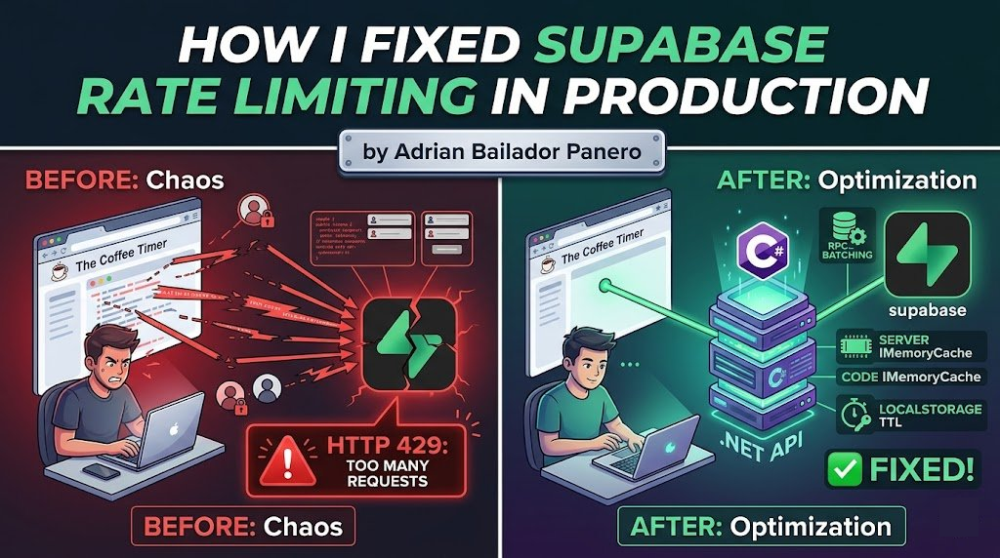

The Coffee Timer was hitting Supabase's rate limits in production. Here's the exact problem, why it happened, and the four-part fix that solved it.

---

## The Problem: Frontend Calling Supabase Directly

The Coffee Timer is a subscription-based web app. The original architecture was straightforward — the frontend called Supabase directly for everything: authentication, subscription checks, feature flags, and data reads. It worked fine in development and in early production with a small user base.

Then it didn't.

Under real load, the frontend was making multiple Supabase calls per page render. A logged-in user opening the app would trigger:

1. A call to fetch the user profile
2. A call to check subscription status
3. A call to load their saved timers
4. A call to fetch feature flags

That's four Supabase requests for a single page load. Multiply that by concurrent users refreshing the app, and you hit HTTP 429 — Too Many Requests — fast.

```
POST https://[project].supabase.co/rest/v1/rpc/check_subscription
→ 429 Too Many Requests
Retry-After: 60
```

The UI would hang, subscriptions appeared as expired, and users were getting locked out of features they had paid for. Not great.

---

## Understanding Supabase Rate Limits

Supabase rate limits operate at several levels. The ones that matter most for this problem are:

- **REST API requests per second** — per project, across all clients
- **Auth requests per hour** — per IP and per user
- **Realtime connections** — concurrent subscriptions

The key insight is that Supabase is designed for moderate, server-side usage — not to act as a direct database connection from thousands of browser tabs. When you call Supabase directly from the frontend, every user's browser is a separate client hammering the same rate limit pool.

The fix is architectural: **the browser should not be the one talking to Supabase for anything critical.**

---

## Fix 1 — Move Critical Operations to the .NET Backend

The most impactful change was moving subscription checks and write operations off the frontend and behind a .NET API. The browser now calls my API, and the API calls Supabase with a service-level key. One server-to-server connection, not hundreds of browser-to-Supabase connections.

```csharp
// SubscriptionService.cs
public class SubscriptionService
{
    private readonly SupabaseClient _supabase;
    private readonly ILogger<SubscriptionService> _logger;

    public SubscriptionService(SupabaseClient supabase, ILogger<SubscriptionService> logger)
    {
        _supabase = supabase;
        _logger = logger;
    }

    public async Task<SubscriptionStatus> GetSubscriptionStatusAsync(string userId)
    {
        var response = await _supabase
            .From<Subscription>()
            .Where(s => s.UserId == userId && s.IsActive)
            .Single();

        if (response is null)
            return SubscriptionStatus.Free;

        return response.Plan switch
        {
            "pro"        => SubscriptionStatus.Pro,
            "enterprise" => SubscriptionStatus.Enterprise,
            _            => SubscriptionStatus.Free
        };
    }
}
```

The API endpoint the frontend calls:

```csharp
[ApiController]
[Route("api/[controller]")]
[Authorize]
public class SubscriptionController : ControllerBase
{
    private readonly SubscriptionService _subscriptionService;

    public SubscriptionController(SubscriptionService subscriptionService)
    {
        _subscriptionService = subscriptionService;
    }

    [HttpGet("status")]
    public async Task<IActionResult> GetStatus()
    {
        var userId = User.FindFirstValue(ClaimTypes.NameIdentifier);
        if (userId is null) return Unauthorized();

        var status = await _subscriptionService.GetSubscriptionStatusAsync(userId);
        return Ok(new { status = status.ToString().ToLower() });
    }
}
```

The frontend now makes one call to `GET /api/subscription/status`, which returns a clean response. Supabase never sees the browser again for subscription checks.

> **A note on the Supabase .NET SDK:** The official `supabase-csharp` SDK works, but it is not as actively maintained as the JavaScript client, and its fluent query API has known edge cases around complex filters and RPC deserialization. For production backends, you may want to fall back to a raw `HttpClient` against Supabase's REST endpoint — it is more explicit, easier to debug, and not subject to SDK-level bugs. I use the SDK for simple CRUD operations but switch to `HttpClient` for anything involving RPCs or custom headers.

---

## Fix 2 — Use Supabase RPCs for Batched Operations

Even with the backend in place, there were still cases where a single operation needed to read and write across multiple tables. Doing that as separate sequential calls from the backend still generates N requests to Supabase.

The solution is Supabase RPCs — PostgreSQL functions exposed as a single HTTP call. Instead of three reads and a write, one function call handles the entire operation atomically.

```sql
-- Supabase SQL editor: create the function
CREATE OR REPLACE FUNCTION get_user_dashboard(p_user_id UUID)
RETURNS JSON
LANGUAGE plpgsql
SECURITY DEFINER
AS $$
DECLARE
    result JSON;
BEGIN
    SELECT json_build_object(
        'subscription', (
            SELECT row_to_json(s)
            FROM subscriptions s
            WHERE s.user_id = p_user_id AND s.is_active = true
            LIMIT 1
        ),
        'timers', (
            SELECT json_agg(t)
            FROM timers t
            WHERE t.user_id = p_user_id
            ORDER BY t.updated_at DESC
            LIMIT 20
        ),
        'feature_flags', (
            SELECT json_agg(f)
            FROM feature_flags f
            WHERE f.user_id = p_user_id OR f.is_global = true
        )
    ) INTO result;

    RETURN result;
END;
$$;
```

Calling the RPC from the .NET backend:

```csharp
public async Task<DashboardData> GetDashboardAsync(string userId)
{
    var response = await _supabase
        .Rpc("get_user_dashboard", new { p_user_id = userId });

    if (response.ResponseMessage?.IsSuccessStatusCode != true)
    {
        _logger.LogError("RPC get_user_dashboard failed for user {UserId}", userId);
        throw new InvalidOperationException("Failed to load dashboard data.");
    }

    return JsonSerializer.Deserialize<DashboardData>(response.Content!)
        ?? throw new InvalidOperationException("Empty response from dashboard RPC.");
}
```

One HTTP call to Supabase replaces three. The function runs inside the database — no network round-trips between tables.

> **Security note:** `SECURITY DEFINER` means the function runs with the privileges of the function creator, not the caller. This is appropriate here because the backend uses a service-level key and the call never reaches the frontend. However, if you ever expose an RPC directly from the frontend, `SECURITY DEFINER` bypasses Row Level Security — validate `p_user_id` against `auth.uid()` explicitly inside the function body in that case, or switch to `SECURITY INVOKER` and rely on RLS policies instead.

> **When not to use RPCs:** RPCs are great for batching reads or encapsulating complex transactional logic. They're not ideal for operations that need to be easily unit-tested or debugged in isolation. Use them selectively — one RPC for the dashboard load makes sense; one RPC for every operation in your app creates a maintenance burden.

---

## Fix 3 — Add Server-Side Caching with IMemoryCache

A client-side cache eliminates redundant calls *per user*. But it doesn't help when many users are doing their first load simultaneously — each of their requests still hits Supabase independently from the backend.

The missing layer is a server-side cache using `IMemoryCache`. Subscription status is the same answer for a given user regardless of which request fetches it. Caching it on the backend means that 50 concurrent logins don't generate 50 Supabase calls — they generate one, and the rest are served from memory.

```csharp
// Program.cs
builder.Services.AddMemoryCache();
```

```csharp
// SubscriptionService.cs
public class SubscriptionService
{
    private readonly SupabaseClient _supabase;
    private readonly IMemoryCache _cache;
    private readonly ILogger<SubscriptionService> _logger;

    private static readonly TimeSpan CacheTtl = TimeSpan.FromMinutes(1);

    public SubscriptionService(
        SupabaseClient supabase,
        IMemoryCache cache,
        ILogger<SubscriptionService> logger)
    {
        _supabase = supabase;
        _cache = cache;
        _logger = logger;
    }

    public async Task<SubscriptionStatus> GetSubscriptionStatusAsync(string userId)
    {
        var cacheKey = $"subscription:{userId}";

        if (_cache.TryGetValue(cacheKey, out SubscriptionStatus cached))
            return cached;

        var response = await _supabase
            .From<Subscription>()
            .Where(s => s.UserId == userId && s.IsActive)
            .Single();

        var status = response?.Plan switch
        {
            "pro"        => SubscriptionStatus.Pro,
            "enterprise" => SubscriptionStatus.Enterprise,
            _            => SubscriptionStatus.Free
        };

        _cache.Set(cacheKey, status, CacheTtl);
        return status;
    }

    public void InvalidateCache(string userId)
    {
        _cache.Remove($"subscription:{userId}");
    }
}
```

Always get the `userId` from the authenticated JWT claim — never from the request body — when invalidating the cache. Accepting a `userId` from the client would allow one user to invalidate another user's cache entry:

```csharp
// ✅ userId comes from the JWT, not from the request body
[HttpPost("checkout/complete")]
public async Task<IActionResult> CompleteCheckout([FromBody] CheckoutRequest request)
{
    var userId = User.FindFirstValue(ClaimTypes.NameIdentifier);
    if (userId is null) return Unauthorized();

    await _checkoutService.ProcessAsync(request.SessionId);
    _subscriptionService.InvalidateCache(userId);
    return Ok();
}
```

> **IMemoryCache vs IDistributedCache:** `IMemoryCache` is process-local — if you run multiple backend instances behind a load balancer, each instance has its own cache and a user might hit a stale entry on a different node. For single-instance deployments (like Render's free/starter tier), `IMemoryCache` is fine. If you scale horizontally, switch to `IDistributedCache` backed by Redis to share cache state across instances.

---

## Fix 4 — Cache Subscription State in localStorage with a TTL

Even with server-side caching, the browser still makes one API call per page load per user. For a subscription status that doesn't change often, that's unnecessary. A client-side cache in `localStorage` eliminates redundant calls for users navigating within the app.

```typescript
// subscriptionCache.ts
const CACHE_KEY = "subscription_status";
const TTL_MS = 60 * 1000; // 1 minute

interface CachedSubscription {
  status: string;
  cachedAt: number;
}

export function getCachedSubscription(): string | null {
  try {
    const raw = localStorage.getItem(CACHE_KEY);
    if (!raw) return null;

    const cached: CachedSubscription = JSON.parse(raw);
    const age = Date.now() - cached.cachedAt;

    if (age > TTL_MS) {
      localStorage.removeItem(CACHE_KEY);
      return null;
    }

    return cached.status;
  } catch {
    localStorage.removeItem(CACHE_KEY);
    return null;
  }
}

export function setCachedSubscription(status: string): void {
  const entry: CachedSubscription = {
    status,
    cachedAt: Date.now(),
  };
  localStorage.setItem(CACHE_KEY, JSON.stringify(entry));
}

export function invalidateSubscriptionCache(): void {
  localStorage.removeItem(CACHE_KEY);
}
```

Using it when loading the app:

```typescript
// useSubscription.ts
export async function getSubscriptionStatus(): Promise<string> {
  // Return cached value if still fresh
  const cached = getCachedSubscription();
  if (cached) return cached;

  // Fetch from backend, not Supabase directly
  const response = await fetch("/api/subscription/status", {
    headers: { Authorization: `Bearer ${await getAuthToken()}` },
  });

  if (!response.ok) throw new Error("Failed to fetch subscription status.");

  const { status } = await response.json();
  setCachedSubscription(status);
  return status;
}
```

Invalidate the cache whenever the subscription actually changes — on checkout completion, on plan upgrade, on logout:

```typescript
// After a successful checkout
await completeCheckout(sessionId);
invalidateSubscriptionCache(); // Force fresh fetch on next load
```

> **Why 1 minute?** The TTL is a balance between freshness and request volume. Too short (< 30s) and you still trigger frequent fetches for users navigating quickly. Too long (> 5min) and a user who just upgraded won't see their new features without a manual refresh. One minute means a subscription change feels near-instant while eliminating redundant calls under normal usage. If your use case needs faster propagation, consider pushing subscription changes to the client via a WebSocket and invalidating the cache explicitly — rather than shortening the TTL.

> **Important caveat:** The localStorage cache means a user who *cancels* their subscription may continue to see Pro features for up to 1 minute on the client, until the TTL expires. This is an acceptable trade-off for most SaaS apps — the backend enforces the real access control, and client-side UI state catching up within 60 seconds is not a meaningful security gap. However, if you need stricter enforcement (e.g. metered API access or high-value feature gating), shorten the TTL or push subscription changes via WebSocket rather than relying on TTL expiry.

---

## The Result: Before and After

**Before:**
- 4 direct Supabase REST calls per page load, from every browser tab
- ~120 Supabase requests/minute at peak with ~30 concurrent active users
- 429 errors appearing consistently above ~25 concurrent users
- Subscription checks failing 8–12% of requests during busy periods
- Median time-to-interactive: ~1,400ms (waiting on sequential Supabase calls)

**After:**
- 0 direct Supabase calls from the browser
- Backend makes 1 RPC call to Supabase per cache miss — most page loads served from IMemoryCache
- Supabase request volume dropped ~85% at equivalent user load
- 429 errors: eliminated
- Median time-to-interactive: ~310ms (single backend call, mostly cache hits)

The Supabase dashboard's API usage graph made the change visible immediately — the spike pattern on every deployment flattened out the same day the caching layers went live.

---

## Common Mistakes to Avoid

**Calling Supabase directly from the frontend for subscription or billing checks**
Subscription status is both critical and sensitive. It should never be computed or fetched client-side. A user can intercept and modify the response from a direct Supabase call. Route it through your backend where you control validation.

---

**Not invalidating the cache after state changes**
If you cache subscription status but forget to invalidate it after checkout, users will complete a payment and still see themselves on the free plan until the TTL expires. Always call `invalidateSubscriptionCache()` on any action that changes subscription state.

```typescript
// ❌ Forgot to invalidate — user sees stale Free status after upgrading
await processUpgrade(userId);

// ✅ Invalidate immediately after the state change
await processUpgrade(userId);
invalidateSubscriptionCache();
```

---

**Caching on the frontend but not on the backend**
A localStorage cache eliminates redundant calls per user. It does nothing for simultaneous first-time loads. Without `IMemoryCache` on the backend, 50 users logging in at the same time still generate 50 Supabase calls. Both layers are necessary.

---

**Using a short TTL as a substitute for proper cache invalidation**
A 5-second TTL is not a caching strategy — it's a polling strategy with extra steps. Either cache with a meaningful TTL and invalidate on change, or don't cache at all.

```typescript
// ❌ 5-second TTL — you're just polling Supabase every 5 seconds
const TTL_MS = 5 * 1000;

// ✅ 1-minute TTL + explicit invalidation on subscription change
const TTL_MS = 60 * 1000;
```

---

**Sharing a service-level Supabase key in the frontend**
The backend uses a service role key that bypasses Row Level Security. This key must never be exposed to the browser. Keep it server-side in environment variables.

```csharp
// appsettings.json (server-side only)
{
  "Supabase": {
    "Url": "https://[project].supabase.co",
    "ServiceKey": "eyJ..."  // Never expose this in frontend code
  }
}
```

---

## Best Practices

- **Never call Supabase directly from the browser for subscription, billing, or access control.** These operations belong in your backend.
- **Use RPCs to batch related reads into a single HTTP call.** Fewer calls = fewer chances to hit rate limits.
- **Add server-side caching with `IMemoryCache`** for any data that is expensive to fetch and doesn't change per-request. It protects against burst load, not just steady-state traffic.
- **Cache on the client too**, but only for non-sensitive UI state like subscription tier. Always enforce real access control on the backend.
- **Always invalidate both caches on state changes** — the server-side cache and the localStorage cache — not just let the TTL expire.
- **Always derive `userId` from the JWT claim on the server**, never from the request body, when performing sensitive operations like cache invalidation.
- **Use the Supabase service role key only on the backend.** The frontend should use the anonymous key scoped to RLS policies.
- **Monitor your Supabase project's rate limit usage** in the dashboard. Set up alerts before you hit limits, not after.
- **If you scale horizontally, switch `IMemoryCache` to `IDistributedCache` backed by Redis** to avoid stale cache entries across instances.

---

## Conclusion

Rate limiting is not a Supabase problem — it's an architecture problem. Supabase is a hosted service with usage boundaries, and calling it directly from every browser tab treats it like a local database. It isn't.

The fix for The Coffee Timer came down to four things: move critical operations to the backend, reduce the number of calls using RPCs, cache aggressively on the server with `IMemoryCache`, and add a client-side TTL cache as a last-mile optimization. None of these are complex changes, but together they eliminated 429 errors entirely, cut Supabase request volume by ~85%, and reduced time-to-interactive by more than 4x.

If your frontend is calling Supabase directly for anything that matters — subscription status, access control, billing — move it to your backend. Then cache it. The sooner, the better.
