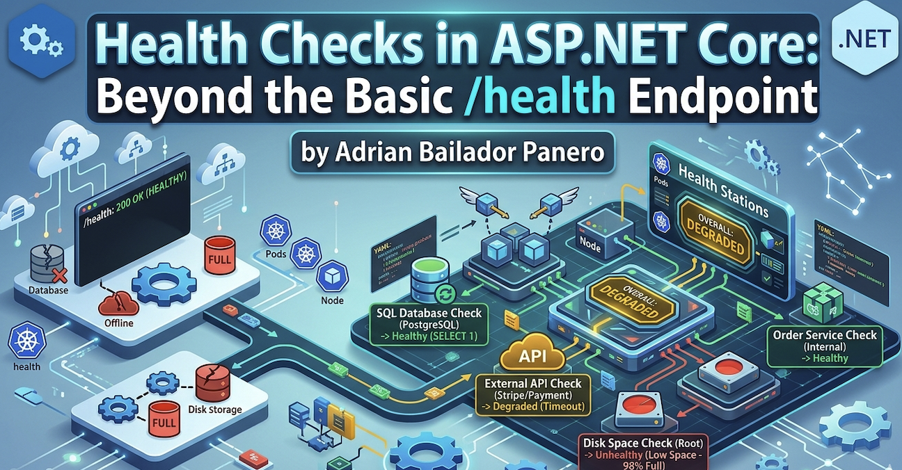

A service returning `200 OK` on `/health` doesn't mean it's healthy. It means the process is alive and the route handler executed. Your database could be unreachable, your message broker offline, your disk at 99% capacity — and `/health` would still return green.

I've seen this exact situation cause a silent outage. The load balancer was happy, Kubernetes wasn't restarting anything, and the monitoring dashboard showed all services up. Meanwhile, every request that touched the database was failing. The health check was lying.

Here's how to make it tell the truth.

## The Setup Everyone Has

```csharp
// Program.cs — the version that gives you false confidence
app.MapGet("/health", () => "Healthy");
```

Or slightly better, using the built-in middleware:

```csharp
builder.Services.AddHealthChecks();
app.MapHealthChecks("/health");
```

Both return `200 OK` as long as the process is running. Neither checks anything meaningful.

## What ASP.NET Core Health Checks Actually Give You

The `Microsoft.AspNetCore.Diagnostics.HealthChecks` package (included in the ASP.NET Core metapackage) provides an extensible pipeline where each check implements `IHealthCheck`:

```csharp
public interface IHealthCheck
{
    Task<HealthCheckResult> CheckHealthAsync(
        HealthCheckContext context,
        CancellationToken cancellationToken = default);
}
```

A `HealthCheckResult` is one of three states:

- `HealthCheckResult.Healthy()` — everything is fine
- `HealthCheckResult.Degraded()` — working but not at full capacity
- `HealthCheckResult.Unhealthy()` — something is broken

The overall status of the endpoint is the worst status across all registered checks. One `Unhealthy` check makes the whole endpoint return `503 Service Unavailable`.

## Checking What Actually Matters

### Database Connectivity

The most critical check for most APIs. Install the NuGet package for your database:

```bash
dotnet add package AspNetCore.HealthChecks.SqlServer
dotnet add package AspNetCore.HealthChecks.NpgSql       # PostgreSQL
dotnet add package AspNetCore.HealthChecks.MySql         # MySQL
```

```csharp
builder.Services.AddHealthChecks()
    .AddSqlServer(
        connectionString: builder.Configuration.GetConnectionString("DefaultConnection")!,
        healthQuery: "SELECT 1",
        name: "sql-server",
        failureStatus: HealthStatus.Unhealthy,
        tags: ["database", "sql"])
    .AddNpgSql(
        connectionString: builder.Configuration.GetConnectionString("Postgres")!,
        name: "postgresql",
        tags: ["database", "postgres"]);
```

> **A note on `SELECT 1`:** It's the industry standard for this check — fast, universally supported, and harmless. Some purists argue it only verifies the connection, not whether the database is locked or whether the application user has write permissions. They're right. For most services, connectivity is enough. If you need deeper assurance, replace it with a lightweight query against a known table: `SELECT TOP 1 1 FROM Orders WITH (NOLOCK)`. Just don't go overboard — a health check query that takes 500ms under load is worse than `SELECT 1`.

### Redis Cache

```bash
dotnet add package AspNetCore.HealthChecks.Redis
```

```csharp
builder.Services.AddHealthChecks()
    .AddRedis(
        redisConnectionString: builder.Configuration.GetConnectionString("Redis")!,
        name: "redis",
        failureStatus: HealthStatus.Degraded, // degraded, not unhealthy — cache miss is survivable
        tags: ["cache"]);
```

Notice I'm using `Degraded` here. If Redis is down, my app still works — it'll be slower, but it won't fail. This distinction matters for Kubernetes probes, as we'll see later.

### External HTTP Dependencies

```bash
dotnet add package AspNetCore.HealthChecks.Uris
```

```csharp
builder.Services.AddHealthChecks()
    .AddUrlGroup(
        uri: new Uri("https://api.stripe.com/v1/"),
        name: "stripe-api",
        failureStatus: HealthStatus.Degraded,
        tags: ["external"]);
```

### Writing a Custom Health Check

When a package doesn't exist for your dependency, write your own. It's straightforward:

```csharp
public class OrderServiceHealthCheck : IHealthCheck
{
    private readonly IOrderRepository _orderRepository;

    public OrderServiceHealthCheck(IOrderRepository orderRepository)
    {
        _orderRepository = orderRepository;
    }

    public async Task<HealthCheckResult> CheckHealthAsync(
        HealthCheckContext context,
        CancellationToken cancellationToken = default)
    {
        try
        {
            var canConnect = await _orderRepository.CanConnectAsync(cancellationToken);

            if (!canConnect)
            {
                return HealthCheckResult.Unhealthy("Order repository is unreachable.");
            }

            var pendingOrders = await _orderRepository.GetPendingCountAsync(cancellationToken);

            // Degraded if queue is building up — not broken, but worth knowing
            if (pendingOrders > 10_000)
            {
                return HealthCheckResult.Degraded(
                    $"Order queue is growing: {pendingOrders} pending orders.",
                    data: new Dictionary<string, object> { ["pending_orders"] = pendingOrders });
            }

            return HealthCheckResult.Healthy(
                data: new Dictionary<string, object> { ["pending_orders"] = pendingOrders });
        }
        catch (Exception ex)
        {
            return HealthCheckResult.Unhealthy(
                "Order service check threw an exception.",
                exception: ex);
        }
    }
}
```

Register it:

```csharp
builder.Services.AddHealthChecks()
    .AddCheck<OrderServiceHealthCheck>(
        name: "order-service",
        failureStatus: HealthStatus.Unhealthy,
        tags: ["orders", "database"]);
```

### Disk Space

A check that's almost always missing — and that bites you at the worst moment:

```csharp
public class DiskSpaceHealthCheck : IHealthCheck
{
    private readonly long _minimumFreeBytesThreshold;

    public DiskSpaceHealthCheck(long minimumFreeMegabytes = 500)
    {
        _minimumFreeBytesThreshold = minimumFreeMegabytes * 1024 * 1024;
    }

    public Task<HealthCheckResult> CheckHealthAsync(
        HealthCheckContext context,
        CancellationToken cancellationToken = default)
    {
        var drive = DriveInfo.GetDrives()
            .FirstOrDefault(d => d.IsReady && d.Name == "/");

        if (drive is null)
        {
            return Task.FromResult(HealthCheckResult.Unhealthy("Root drive not found."));
        }

        var freeBytes = drive.AvailableFreeSpace;
        var freeMb = freeBytes / (1024 * 1024);

        var data = new Dictionary<string, object>
        {
            ["free_mb"] = freeMb,
            ["total_mb"] = drive.TotalSize / (1024 * 1024)
        };

        if (freeBytes < _minimumFreeBytesThreshold)
        {
            return Task.FromResult(
                HealthCheckResult.Unhealthy($"Low disk space: {freeMb} MB free.", data: data));
        }

        if (freeBytes < _minimumFreeBytesThreshold * 2)
        {
            return Task.FromResult(
                HealthCheckResult.Degraded($"Disk space getting low: {freeMb} MB free.", data: data));
        }

        return Task.FromResult(HealthCheckResult.Healthy(data: data));
    }
}
```

## Tagging Checks for Kubernetes Probes

This is where health checks go from useful to essential. Kubernetes uses three probes:

| Probe | Purpose | Consequence if failing |
|---|---|---|
| **Liveness** | Is the process alive? | Restart the container |
| **Readiness** | Can it serve traffic? | Remove from load balancer |
| **Startup** | Has it finished starting up? | Don't check liveness/readiness yet |

You don't want a slow Redis to restart your pod. You want it to stop receiving traffic until Redis recovers. Tags let you route different checks to different endpoints:

```csharp
builder.Services.AddHealthChecks()
    .AddSqlServer(
        connectionString: connectionString,
        name: "sql-server",
        tags: ["ready"])                        // readiness only
    .AddRedis(
        redisConnectionString: redisConnection,
        name: "redis",
        failureStatus: HealthStatus.Degraded,
        tags: ["ready"])                        // readiness only
    .AddCheck<DiskSpaceHealthCheck>(
        name: "disk-space",
        tags: ["live", "ready"])                // both
    .AddCheck<OrderServiceHealthCheck>(
        name: "order-service",
        tags: ["ready"]);                       // readiness only
```

Map separate endpoints filtered by tag:

```csharp
// Liveness — only checks the process is alive and has disk space
app.MapHealthChecks("/health/live", new HealthCheckOptions
{
    Predicate = check => check.Tags.Contains("live"),
    ResultStatusCodes =
    {
        [HealthStatus.Healthy] = StatusCodes.Status200OK,
        [HealthStatus.Degraded] = StatusCodes.Status200OK,    // degraded still alive
        [HealthStatus.Unhealthy] = StatusCodes.Status503ServiceUnavailable
    }
});

// Readiness — checks everything needed to serve requests
app.MapHealthChecks("/health/ready", new HealthCheckOptions
{
    Predicate = check => check.Tags.Contains("ready"),
    ResultStatusCodes =
    {
        [HealthStatus.Healthy] = StatusCodes.Status200OK,
        [HealthStatus.Degraded] = StatusCodes.Status200OK,    // degraded can still serve
        [HealthStatus.Unhealthy] = StatusCodes.Status503ServiceUnavailable
    }
});
```

Kubernetes configuration:

```yaml
livenessProbe:
  httpGet:
    path: /health/live
    port: 8080
  initialDelaySeconds: 10
  periodSeconds: 15
  failureThreshold: 3

readinessProbe:
  httpGet:
    path: /health/ready
    port: 8080
  initialDelaySeconds: 5
  periodSeconds: 10
  failureThreshold: 3

startupProbe:
  httpGet:
    path: /health/live
    port: 8080
  initialDelaySeconds: 0
  periodSeconds: 5
  failureThreshold: 30   # 30 * 5s = 150 seconds to start up
```

## Rich JSON Responses

By default, the health endpoint returns plain text (`Healthy`, `Degraded`, `Unhealthy`). For monitoring dashboards and debugging, you want JSON:

```csharp
app.MapHealthChecks("/health", new HealthCheckOptions
{
    ResponseWriter = WriteHealthCheckResponse
});

static Task WriteHealthCheckResponse(HttpContext context, HealthReport report)
{
    context.Response.ContentType = "application/json";

    var response = new
    {
        status = report.Status.ToString(),
        duration = report.TotalDuration.TotalMilliseconds,
        checks = report.Entries.Select(e => new
        {
            name = e.Key,
            status = e.Value.Status.ToString(),
            description = e.Value.Description,
            duration = e.Value.Duration.TotalMilliseconds,
            data = e.Value.Data,
            exception = e.Value.Exception?.Message
        })
    };

    return context.Response.WriteAsync(
        JsonSerializer.Serialize(response, new JsonSerializerOptions
        {
            WriteIndented = true,
            PropertyNamingPolicy = JsonNamingPolicy.SnakeCaseLower
        }));
}
```

Output:

```json
{
  "status": "Degraded",
  "duration": 142.5,
  "checks": [
    {
      "name": "sql-server",
      "status": "Healthy",
      "duration": 12.3,
      "data": {}
    },
    {
      "name": "redis",
      "status": "Degraded",
      "description": "Redis connection timeout after 5000ms",
      "duration": 5001.2,
      "data": {}
    },
    {
      "name": "disk-space",
      "status": "Healthy",
      "duration": 0.8,
      "data": {
        "free_mb": 42301,
        "total_mb": 102400
      }
    }
  ]
}
```

## Adding a Timeout per Check

A health check that hangs is worse than one that fails fast. Add a timeout so a slow dependency doesn't block the entire health endpoint:

```csharp
public class ExternalPaymentApiHealthCheck : IHealthCheck
{
    private readonly HttpClient _httpClient;

    public ExternalPaymentApiHealthCheck(IHttpClientFactory factory)
    {
        _httpClient = factory.CreateClient("payment-api");
    }

    public async Task<HealthCheckResult> CheckHealthAsync(
        HealthCheckContext context,
        CancellationToken cancellationToken = default)
    {
        using var cts = CancellationTokenSource.CreateLinkedTokenSource(cancellationToken);
        cts.CancelAfter(TimeSpan.FromSeconds(3)); // never wait more than 3 seconds

        try
        {
            var response = await _httpClient.GetAsync("/ping", cts.Token);

            return response.IsSuccessStatusCode
                ? HealthCheckResult.Healthy()
                : HealthCheckResult.Degraded($"Payment API returned {(int)response.StatusCode}");
        }
        catch (OperationCanceledException)
        {
            return HealthCheckResult.Degraded("Payment API timed out after 3 seconds.");
        }
        catch (Exception ex)
        {
            return HealthCheckResult.Unhealthy("Payment API unreachable.", ex);
        }
    }
}
```

## Common Mistakes

### Mistake 1: Exposing health check details publicly

The JSON response with database names, connection info hints, and exception messages shouldn't be public. I've seen exception stack traces leak connection strings through a public `/health/detail` endpoint. Restrict it.

The simplest option is filtering by host:

```csharp
// Public endpoint — minimal response
app.MapHealthChecks("/health", new HealthCheckOptions
{
    ResponseWriter = (ctx, report) =>
    {
        ctx.Response.ContentType = "text/plain";
        return ctx.Response.WriteAsync(report.Status.ToString());
    }
});

// Internal endpoint — full details, restricted by host
app.MapHealthChecks("/health/detail", new HealthCheckOptions
{
    ResponseWriter = WriteHealthCheckResponse
}).RequireHost("*.internal.mycompany.com");
```

But in corporate environments with a Service Mesh like Istio, filtering by host can be unreliable — the mesh rewrites headers and internal routing makes `RequireHost` unpredictable. In those cases, a simple API key middleware is more robust:

```csharp
app.MapHealthChecks("/health/detail", new HealthCheckOptions
{
    ResponseWriter = WriteHealthCheckResponse
}).AddEndpointFilter(async (context, next) =>
{
    var config = context.HttpContext.RequestServices.GetRequiredService<IConfiguration>();
    var expectedKey = config["HealthChecks:ApiKey"];
    var providedKey = context.HttpContext.Request.Headers["X-Health-Key"].FirstOrDefault();

    if (string.IsNullOrEmpty(expectedKey) || providedKey != expectedKey)
    {
        context.HttpContext.Response.StatusCode = StatusCodes.Status401Unauthorized;
        return Results.Unauthorized();
    }

    return await next(context);
});
```

Store the key in your secrets manager, not in `appsettings.json`. Your monitoring tool sends it as a header. No network topology assumptions needed.

### Mistake 2: Running expensive checks too frequently

Kubernetes probes can run every 5-10 seconds. A check that runs a full database query on every probe request adds load you don't need. Cache the result:

```csharp
public class CachedDatabaseHealthCheck : IHealthCheck
{
    private readonly IDbConnectionFactory _factory;
    private HealthCheckResult _cachedResult = HealthCheckResult.Healthy();
    private DateTime _lastCheck = DateTime.MinValue;
    private static readonly TimeSpan CacheDuration = TimeSpan.FromSeconds(30);

    public CachedDatabaseHealthCheck(IDbConnectionFactory factory)
    {
        _factory = factory;
    }

    public async Task<HealthCheckResult> CheckHealthAsync(
        HealthCheckContext context,
        CancellationToken cancellationToken = default)
    {
        if (DateTime.UtcNow - _lastCheck < CacheDuration)
            return _cachedResult;

        try
        {
            await using var conn = await _factory.CreateConnectionAsync(cancellationToken);
            await conn.ExecuteAsync("SELECT 1");
            _cachedResult = HealthCheckResult.Healthy();
        }
        catch (Exception ex)
        {
            _cachedResult = HealthCheckResult.Unhealthy("Database check failed.", ex);
        }

        _lastCheck = DateTime.UtcNow;
        return _cachedResult;
    }
}
```

### Mistake 3: Using the same endpoint for liveness and readiness

If your database is down and readiness returns `503`, Kubernetes will also restart your pod if that same endpoint is used for liveness. You end up in a restart loop for a problem that has nothing to do with your process health. Always separate them.

### Mistake 4: Not checking the things that actually fail

A health check that only verifies the process is running adds zero observability. Check the things that have actually caused incidents: the database, the message broker, the external APIs your service depends on, the file system if you write logs or uploads.

## Best Practices

**Name your checks clearly.** `sql-server`, `redis-cache`, `stripe-api` — names that appear in logs and dashboards should be immediately recognizable.

**Use `Degraded` generously.** Not every problem is `Unhealthy`. A slow cache, a high queue depth, a non-critical external service being down — these deserve `Degraded`, not a pod restart.

**Always include data in your results.** Queue depth, free disk space, response times — the data dictionary in `HealthCheckResult` is your debugging surface when something goes wrong at 2am.

**Test your health checks in staging.** Deliberately take down your database and verify the readiness probe returns `503` and pods stop receiving traffic. Don't discover your health check doesn't work during an actual incident.

**Register health checks as singletons or transient carefully.** If your check holds state (like the cached result above), register it as a singleton. If it takes a scoped dependency like `DbContext`, register it as transient and resolve dependencies per-check execution.

## Bonus: HealthCheck UI in Two Lines

If you want to impress a client or a manager with minimal effort, install the UI package:

```bash
dotnet add package AspNetCore.HealthChecks.UI
dotnet add package AspNetCore.HealthChecks.UI.InMemory.Storage
```

Configure it:

```csharp
builder.Services.AddHealthChecksUI(options =>
{
    options.SetEvaluationTimeInSeconds(30); // poll every 30 seconds
    options.AddHealthCheckEndpoint("API", "/health/detail");
}).AddInMemoryStorage();

// After app.MapHealthChecks(...)
app.MapHealthChecksUI(options => options.UIPath = "/health-ui");
```

Navigate to `/health-ui` and you get a live dashboard showing the status of every check, historical trend, and response times — all generated from the JSON your endpoint already returns.

It's not something you'd expose publicly, but for internal dashboards, staging environments, or a demo to stakeholders it's genuinely useful. One caveat: `AddInMemoryStorage` resets history on restart. For persistent history use `AspNetCore.HealthChecks.UI.SqlServer.Storage` or the PostgreSQL equivalent.

## Conclusion

A health endpoint that always returns `200 OK` isn't a health check — it's a heartbeat. The difference matters at 2am when your database connection pool is exhausted, your Redis cluster is split-brained, or your disk is 98% full and nobody noticed.

The silent outage I described at the start? It cost us two hours of debugging because every signal said "healthy". Once we had real health checks in place, the next incident took ten minutes to diagnose — the Redis check was `Degraded`, the readiness probe had already removed that pod from rotation, and the logs had the exact connection timeout.

The setup takes an hour. The payoff is every incident after that.

- One liveness endpoint — is the process worth keeping alive?
- One readiness endpoint — is it ready to serve traffic right now?
- Custom checks for every dependency that has caused an incident before
- Rich JSON so you know *why*, not just *that*
- And if you want bonus points with your team, the UI takes five minutes

---

*Questions? Found an issue with the examples? Open an issue on [GitHub](https://github.com/adrianbailador/adrianbailador.github.io).*
