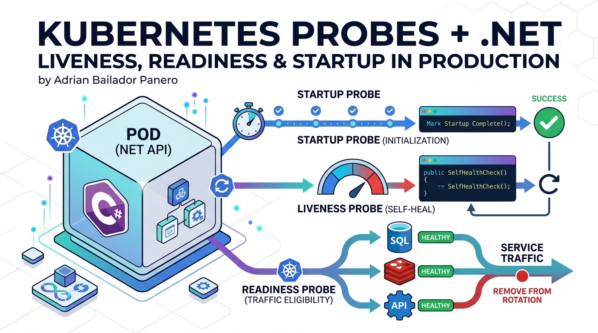

I once watched a .NET service restart in a loop for twenty minutes while every other signal said it was fine. The readiness probe was passing. The liveness probe was passing. The pod was being killed anyway.

The problem was that both probes pointed to the same `/health` endpoint — one that checked the database. The database was slow during a migration. The pod failed liveness, got killed, restarted, tried to connect to the database again, failed liveness again. A perfectly healthy process was being murdered by its own health check.

Here's what I wish someone had explained before I deployed that.

## Why One `/health` Endpoint Is Not Enough

The instinct is understandable. You add a `/health` endpoint, map it to Kubernetes probes, and feel responsible. But a single endpoint can't serve three fundamentally different questions:

- **Is this process alive and worth keeping?** (Liveness)
- **Is this process ready to serve user traffic right now?** (Readiness)
- **Has this process finished its startup sequence?** (Startup)

Using the same endpoint for all three is like having one traffic light that controls both the pedestrian crossing and the highway on-ramp. The signals mean different things and the consequences of getting them wrong are different.

The consequences of mixing probes:

| What goes wrong | What Kubernetes does | What actually happens |
|---|---|---|
| Database is slow | Liveness fails | Pod restarts — making the problem worse |
| Redis is unreachable | Liveness fails | Pod restarts — Redis is still unreachable |
| App is starting up | Liveness fires too early | Pod killed before it's even ready |
| Pod is overwhelmed | Readiness fails | Pod stops receiving traffic — correct behaviour |

The right mental model: liveness is about the process, readiness is about the dependencies.

## The Three Probes, Explained

### Liveness Probe

**Question it answers:** Is this container alive enough to keep running?

**Action on failure:** Kubernetes restarts the container.

**What to check:** Only things that indicate the process itself is broken — a deadlock, an unrecoverable panic, a corrupted internal state. Not external dependencies. If your database is down, that's not a reason to restart your process. Restarting won't fix the database.

A liveness check that fails should answer yes to: "Would restarting this process fix the problem?"

### Readiness Probe

**Question it answers:** Should this container receive traffic right now?

**Action on failure:** Kubernetes removes the pod from the Service endpoints. No traffic is routed to it. The pod keeps running.

**What to check:** Everything the pod needs to serve a request successfully — database connectivity, dependent services, cache availability. When readiness fails, traffic stops flowing to this pod until it recovers.

### Startup Probe

**Question it answers:** Has this container finished starting up?

**Action on failure:** Kubernetes kills the container (same as liveness).

**What it replaces:** `initialDelaySeconds` on liveness/readiness probes.

The startup probe runs until it succeeds, then hands control to liveness and readiness. While the startup probe is running, liveness and readiness are suspended. This means your slow-starting container won't be killed before it's ready, without having to set dangerously long `initialDelaySeconds` values on all other probes.

A .NET service that runs EF Core migrations, warms up caches, and establishes connection pools at startup might need 30–90 seconds. The startup probe handles this cleanly.

## Setting Up Health Checks in .NET

The foundation is tagging. Each health check gets one or more tags, and each Kubernetes probe maps to an endpoint that only runs checks with matching tags.

### Installing the Packages

```bash
dotnet add package AspNetCore.HealthChecks.SqlServer
dotnet add package AspNetCore.HealthChecks.NpgSql
dotnet add package AspNetCore.HealthChecks.Redis
dotnet add package AspNetCore.HealthChecks.Uris
```

### Registering Checks with Tags

```csharp
builder.Services.AddHealthChecks()
    // Liveness: only checks the process itself
    .AddCheck<SelfHealthCheck>(
        name: "self",
        tags: ["live"])

    // Readiness + Liveness: disk space affects both
    .AddCheck<DiskSpaceHealthCheck>(
        name: "disk-space",
        tags: ["live", "ready"])

    // Readiness only: external dependencies
    .AddSqlServer(
        connectionString: builder.Configuration.GetConnectionString("DefaultConnection")!,
        name: "sql-server",
        failureStatus: HealthStatus.Unhealthy,
        tags: ["ready"])

    .AddNpgSql(
        connectionString: builder.Configuration.GetConnectionString("Postgres")!,
        name: "postgresql",
        failureStatus: HealthStatus.Unhealthy,
        tags: ["ready"])

    .AddRedis(
        redisConnectionString: builder.Configuration.GetConnectionString("Redis")!,
        name: "redis",
        failureStatus: HealthStatus.Degraded, // cache miss is survivable
        tags: ["ready"])

    .AddUrlGroup(
        uri: new Uri("https://api.stripe.com/v1/"),
        name: "stripe-api",
        failureStatus: HealthStatus.Degraded,
        tags: ["ready"])

    // Startup: checks that migrations have run and caches are warm
    .AddCheck<StartupHealthCheck>(
        name: "startup-complete",
        tags: ["startup"]);
```

### The SelfHealthCheck

The liveness check for the process itself. It should almost always return healthy — if it doesn't, the container will be restarted.

```csharp
public class SelfHealthCheck : IHealthCheck
{
    public Task<HealthCheckResult> CheckHealthAsync(
        HealthCheckContext context,
        CancellationToken cancellationToken = default)
    {
        // Check for conditions that indicate the process is fundamentally broken.
        // Most of the time, this is just: I'm running, therefore I'm alive.
        var allocatedMemoryMb = GC.GetTotalMemory(forceFullCollection: false) / 1_048_576;

        if (allocatedMemoryMb > 2048)
        {
            return Task.FromResult(HealthCheckResult.Unhealthy(
                $"Memory usage critical: {allocatedMemoryMb} MB allocated. Possible memory leak.",
                data: new Dictionary<string, object> { ["allocated_mb"] = allocatedMemoryMb }));
        }

        return Task.FromResult(HealthCheckResult.Healthy(
            data: new Dictionary<string, object> { ["allocated_mb"] = allocatedMemoryMb }));
    }
}
```

### The StartupHealthCheck

Tracks whether the application has completed its initialisation sequence. You set a flag when startup is done; the probe checks the flag.

```csharp
public class StartupHealthCheck : IHealthCheck
{
    private static bool _startupComplete = false;

    // Call this from your startup logic when everything is ready
    public static void MarkStartupComplete() => _startupComplete = true;

    public Task<HealthCheckResult> CheckHealthAsync(
        HealthCheckContext context,
        CancellationToken cancellationToken = default)
    {
        if (!_startupComplete)
        {
            return Task.FromResult(HealthCheckResult.Unhealthy(
                "Application has not completed startup sequence yet."));
        }

        return Task.FromResult(HealthCheckResult.Healthy("Startup complete."));
    }
}
```

Mark it done in `Program.cs` after migrations, cache warm-up, or whatever your startup sequence involves:

```csharp
var app = builder.Build();

// Run migrations
using (var scope = app.Services.CreateScope())
{
    var db = scope.ServiceProvider.GetRequiredService<AppDbContext>();
    await db.Database.MigrateAsync();
}

// Warm up caches, establish connection pools, etc.
await WarmUpCachesAsync(app.Services);

// Signal that startup is complete
StartupHealthCheck.MarkStartupComplete();

app.Run();
```

### Mapping the Three Endpoints

```csharp
// Liveness — is the process alive?
app.MapHealthChecks("/health/live", new HealthCheckOptions
{
    Predicate = check => check.Tags.Contains("live"),
    ResultStatusCodes =
    {
        [HealthStatus.Healthy] = StatusCodes.Status200OK,
        [HealthStatus.Degraded] = StatusCodes.Status200OK,  // degraded = still alive
        [HealthStatus.Unhealthy] = StatusCodes.Status503ServiceUnavailable
    }
});

// Readiness — can it serve traffic?
app.MapHealthChecks("/health/ready", new HealthCheckOptions
{
    Predicate = check => check.Tags.Contains("ready"),
    ResultStatusCodes =
    {
        [HealthStatus.Healthy] = StatusCodes.Status200OK,
        [HealthStatus.Degraded] = StatusCodes.Status200OK,  // degraded can still serve
        [HealthStatus.Unhealthy] = StatusCodes.Status503ServiceUnavailable
    }
});

// Startup — has initialisation finished?
app.MapHealthChecks("/health/startup", new HealthCheckOptions
{
    Predicate = check => check.Tags.Contains("startup"),
    ResultStatusCodes =
    {
        [HealthStatus.Healthy] = StatusCodes.Status200OK,
        [HealthStatus.Degraded] = StatusCodes.Status503ServiceUnavailable, // not ready yet
        [HealthStatus.Unhealthy] = StatusCodes.Status503ServiceUnavailable
    }
});
```

## Kubernetes YAML

Here's a complete Deployment spec with all three probes configured for a typical .NET API.

```yaml
apiVersion: apps/v1
kind: Deployment
metadata:
  name: my-dotnet-api
  namespace: production
spec:
  replicas: 3
  selector:
    matchLabels:
      app: my-dotnet-api
  template:
    metadata:
      labels:
        app: my-dotnet-api
    spec:
      containers:
        - name: api
          image: myregistry/my-dotnet-api:latest
          ports:
            - containerPort: 8080

          # Startup probe: runs until the app finishes initialising.
          # Liveness and readiness are suspended while this is running.
          # 30 attempts × 5s interval = up to 150 seconds to start.
          startupProbe:
            httpGet:
              path: /health/startup
              port: 8080
            initialDelaySeconds: 0   # start checking immediately
            periodSeconds: 5         # check every 5 seconds
            failureThreshold: 30     # allow up to 150 seconds to start
            successThreshold: 1
            timeoutSeconds: 3

          # Liveness probe: runs after startup succeeds.
          # Failure → container restart.
          # Only check what a restart would actually fix.
          livenessProbe:
            httpGet:
              path: /health/live
              port: 8080
            initialDelaySeconds: 0   # startup probe already handled the delay
            periodSeconds: 15        # don't hammer it — 15s is usually enough
            failureThreshold: 3      # 3 consecutive failures → restart
            successThreshold: 1
            timeoutSeconds: 5

          # Readiness probe: runs after startup succeeds.
          # Failure → pod removed from Service, no traffic routed.
          # Check all dependencies needed to serve a request.
          readinessProbe:
            httpGet:
              path: /health/ready
              port: 8080
            initialDelaySeconds: 0
            periodSeconds: 10        # check more frequently than liveness
            failureThreshold: 3      # 3 failures → stop sending traffic
            successThreshold: 2      # 2 successes to re-add to rotation
            timeoutSeconds: 5

          resources:
            requests:
              memory: "256Mi"
              cpu: "250m"
            limits:
              memory: "512Mi"
              cpu: "500m"

          env:
            - name: ASPNETCORE_URLS
              value: "http://+:8080"
            - name: ConnectionStrings__DefaultConnection
              valueFrom:
                secretKeyRef:
                  name: my-dotnet-api-secrets
                  key: db-connection-string
```

### Understanding the Numbers

**`periodSeconds`** — how often Kubernetes checks. Too low and you add unnecessary load; too high and you react slowly to failures.

- Liveness: 15–30 seconds. A stuck process doesn't need sub-second detection.
- Readiness: 5–10 seconds. You want traffic to re-route quickly when a pod recovers.
- Startup: 5 seconds. You want to know as soon as the app is ready.

**`failureThreshold`** — how many consecutive failures before action is taken.

- Set this to 3 minimum. A transient network hiccup or a momentary slow query shouldn't kill your pod. `failureThreshold: 1` is almost always wrong in production.
- For startup: set it to `maxStartupSeconds / periodSeconds`. If your app might take 90 seconds to start: `90 / 5 = 18` failures.

**`successThreshold`** — how many consecutive successes to consider the probe passing.

- For readiness: setting this to 2 prevents a pod that's still recovering from being re-added to rotation after one fluke success. Default is 1.
- For liveness: must be 1 (Kubernetes enforces this).

**`timeoutSeconds`** — how long Kubernetes waits for the probe to respond.

- Your health check must complete within this time or it counts as a failure. Make sure your checks have timeouts shorter than this value.

## Common Mistakes

### Mistake 1: Checking external dependencies in the liveness probe

```yaml
# ❌ This will cause restart loops
livenessProbe:
  httpGet:
    path: /health  # checks database
    port: 8080
```

If the database is down or slow, the liveness probe fails, the pod restarts, reconnects to the same database, fails again. You've created a restart loop that makes the incident worse.

```yaml
# ✅ Liveness only checks the process
livenessProbe:
  httpGet:
    path: /health/live  # only checks self and disk
    port: 8080
```

### Mistake 2: Using `initialDelaySeconds` instead of a startup probe

```yaml
# ❌ Guessing how long startup takes
livenessProbe:
  initialDelaySeconds: 60  # hope it's enough
```

This creates two problems. If startup takes 61 seconds, the pod gets killed. If startup usually takes 10 seconds but you set 60, every pod is unavailable for 60 seconds unnecessarily — this matters during rolling updates.

```yaml
# ✅ Let the startup probe determine when the app is ready
startupProbe:
  httpGet:
    path: /health/startup
    port: 8080
  periodSeconds: 5
  failureThreshold: 30  # up to 150 seconds, no guessing
```

### Mistake 3: Setting `failureThreshold: 1`

```yaml
# ❌ Any single timeout kills the pod
livenessProbe:
  failureThreshold: 1
```

A single slow response, a momentary GC pause, a brief network hiccup — all of these become pod restarts. In a high-traffic system, this creates cascades: one pod restarts, more traffic hits the remaining pods, they slow down, they restart, and so on.

```yaml
# ✅ Require consecutive failures before action
livenessProbe:
  failureThreshold: 3  # three consecutive failures required
```

### Mistake 4: The probe timeout is longer than the check timeout

```yaml
livenessProbe:
  timeoutSeconds: 10
```

```csharp
// ❌ The health check has no timeout — it can block for 30+ seconds
public async Task<HealthCheckResult> CheckHealthAsync(
    HealthCheckContext context,
    CancellationToken cancellationToken = default)
{
    var response = await _httpClient.GetAsync("/ping"); // no timeout
    // ...
}
```

If the check takes 15 seconds, Kubernetes considers it a timeout failure at 10 seconds — but the check is still running in the background, consuming resources and holding connections.

```csharp
// ✅ Always add an explicit timeout inside your health check
public async Task<HealthCheckResult> CheckHealthAsync(
    HealthCheckContext context,
    CancellationToken cancellationToken = default)
{
    using var cts = CancellationTokenSource.CreateLinkedTokenSource(cancellationToken);
    cts.CancelAfter(TimeSpan.FromSeconds(3)); // well under the probe's timeoutSeconds

    try
    {
        var response = await _httpClient.GetAsync("/ping", cts.Token);
        return response.IsSuccessStatusCode
            ? HealthCheckResult.Healthy()
            : HealthCheckResult.Degraded($"Returned {(int)response.StatusCode}");
    }
    catch (OperationCanceledException)
    {
        return HealthCheckResult.Degraded("Timed out after 3 seconds.");
    }
}
```

### Mistake 5: Not setting `successThreshold` on readiness

When a pod recovers from a readiness failure, Kubernetes re-adds it to the Service after the first successful probe. That pod might be in the middle of warming up caches or draining a backlog. Setting `successThreshold: 2` gives you an extra check before traffic returns.

```yaml
readinessProbe:
  successThreshold: 2  # two consecutive successes before re-adding to rotation
```

### Mistake 6: Exposing health check internals to the internet

The `/health/ready` endpoint can return database names, connection strings fragments in exception messages, and internal IP addresses. Don't expose it publicly.

```csharp
// Route it through an internal ingress only
app.MapHealthChecks("/health/live").RequireHost("*.internal");
app.MapHealthChecks("/health/ready").RequireHost("*.internal");
app.MapHealthChecks("/health/startup").RequireHost("*.internal");
```

Or, if your service mesh makes `RequireHost` unreliable, use network policies at the Kubernetes level to restrict access to the health endpoints from outside the cluster.

## Best Practices

**One responsibility per probe.** Liveness = process health. Readiness = traffic eligibility. Startup = initialisation complete. Never mix these concerns in a single endpoint.

**Make liveness checks trivial.** The liveness probe should fail only when a restart would actually help. That's a small set: deadlocks, unrecoverable panics, memory leaks, corrupted internal state. If you're unsure whether a condition should trigger a restart, it probably shouldn't.

**Make readiness checks comprehensive.** The readiness probe should reflect whether the pod can actually serve a request end-to-end. If a request needs the database and the database is down, readiness should fail. That's the correct behaviour — stop sending traffic to that pod.

**Always set `Degraded` for non-critical dependencies.** Redis down → `Degraded`, not `Unhealthy`. If readiness maps `Degraded` to `200 OK` (which it should for most services), the pod stays in rotation and serves requests without caching. The alternative — taking the pod out of rotation because Redis is down — is usually worse.

**Cache expensive checks.** Probes run every 5–15 seconds. A health check that runs a database query on every call adds measurable load. Cache results for 15–30 seconds:

```csharp
public class CachedDatabaseHealthCheck : IHealthCheck
{
    private readonly IDbConnectionFactory _factory;
    private HealthCheckResult _cached = HealthCheckResult.Healthy();
    private DateTimeOffset _lastRun = DateTimeOffset.MinValue;
    private static readonly TimeSpan CacheDuration = TimeSpan.FromSeconds(20);

    public CachedDatabaseHealthCheck(IDbConnectionFactory factory)
    {
        _factory = factory;
    }

    public async Task<HealthCheckResult> CheckHealthAsync(
        HealthCheckContext context,
        CancellationToken cancellationToken = default)
    {
        if (DateTimeOffset.UtcNow - _lastRun < CacheDuration)
            return _cached;

        try
        {
            await using var conn = await _factory.CreateConnectionAsync(cancellationToken);
            await conn.ExecuteAsync("SELECT 1");
            _cached = HealthCheckResult.Healthy();
        }
        catch (Exception ex)
        {
            _cached = HealthCheckResult.Unhealthy("Database unreachable.", ex);
        }

        _lastRun = DateTimeOffset.UtcNow;
        return _cached;
    }
}
```

**Log probe failures.** Kubernetes logs probe failures in pod events, but they don't always surface well. Add structured logging inside your health checks so you get context when things go wrong:

```csharp
public async Task<HealthCheckResult> CheckHealthAsync(
    HealthCheckContext context,
    CancellationToken cancellationToken = default)
{
    try
    {
        await _connection.ExecuteAsync("SELECT 1");
        return HealthCheckResult.Healthy();
    }
    catch (Exception ex)
    {
        _logger.LogError(ex, "Database health check failed for {CheckName}", context.Registration.Name);
        return HealthCheckResult.Unhealthy("Database check failed.", ex);
    }
}
```

**Test your probes in staging.** Kill your database, take down Redis, fill up the disk. Verify that:
- Readiness fails and pods stop receiving traffic
- Liveness does not fail (and therefore pods are not restarted)
- The service degrades gracefully instead of crashing
- Traffic re-routes to healthy pods automatically

Don't discover that your probe configuration is wrong during a real incident.

## Putting It All Together

Here's the complete `Program.cs` with everything wired up:

```csharp
var builder = WebApplication.CreateBuilder(args);

builder.Services.AddHealthChecks()
    .AddCheck<SelfHealthCheck>(
        name: "self",
        tags: ["live"])
    .AddCheck<DiskSpaceHealthCheck>(
        name: "disk-space",
        tags: ["live", "ready"])
    .AddSqlServer(
        connectionString: builder.Configuration.GetConnectionString("DefaultConnection")!,
        name: "sql-server",
        failureStatus: HealthStatus.Unhealthy,
        tags: ["ready"])
    .AddRedis(
        redisConnectionString: builder.Configuration.GetConnectionString("Redis")!,
        name: "redis",
        failureStatus: HealthStatus.Degraded,
        tags: ["ready"])
    .AddCheck<StartupHealthCheck>(
        name: "startup-complete",
        tags: ["startup"]);

var app = builder.Build();

// Run startup sequence
using (var scope = app.Services.CreateScope())
{
    var db = scope.ServiceProvider.GetRequiredService<AppDbContext>();
    await db.Database.MigrateAsync();
}

StartupHealthCheck.MarkStartupComplete();

// Map probe endpoints
app.MapHealthChecks("/health/live", new HealthCheckOptions
{
    Predicate = check => check.Tags.Contains("live"),
    ResultStatusCodes =
    {
        [HealthStatus.Healthy] = StatusCodes.Status200OK,
        [HealthStatus.Degraded] = StatusCodes.Status200OK,
        [HealthStatus.Unhealthy] = StatusCodes.Status503ServiceUnavailable
    }
});

app.MapHealthChecks("/health/ready", new HealthCheckOptions
{
    Predicate = check => check.Tags.Contains("ready"),
    ResultStatusCodes =
    {
        [HealthStatus.Healthy] = StatusCodes.Status200OK,
        [HealthStatus.Degraded] = StatusCodes.Status200OK,
        [HealthStatus.Unhealthy] = StatusCodes.Status503ServiceUnavailable
    }
});

app.MapHealthChecks("/health/startup", new HealthCheckOptions
{
    Predicate = check => check.Tags.Contains("startup"),
    ResultStatusCodes =
    {
        [HealthStatus.Healthy] = StatusCodes.Status200OK,
        [HealthStatus.Degraded] = StatusCodes.Status503ServiceUnavailable,
        [HealthStatus.Unhealthy] = StatusCodes.Status503ServiceUnavailable
    }
});

app.Run();
```

## Conclusion

The restart loop I described at the start was caused by a single wrong decision: using one endpoint for three different questions. The fix was twenty lines of code and ten minutes of work.

The mental model to take away:

- **Liveness** asks: "Is this process broken beyond repair?" Only restart if the answer is yes.
- **Readiness** asks: "Is this process ready to handle a request right now?" Remove from rotation if the answer is no.
- **Startup** asks: "Has this process finished initialising?" Don't send liveness or readiness probes until the answer is yes.

Three questions. Three endpoints. Three probes. Each one doing exactly one job, with consequences matched to the answer.

Once you have this in place, Kubernetes becomes a genuine safety net — not something that makes incidents worse by restarting healthy pods in the middle of a database outage.

---

*Have questions or found an issue with the examples? Open an issue on [GitHub](https://github.com/AdrianBailador/kubernetes-probes-dotnet).*
