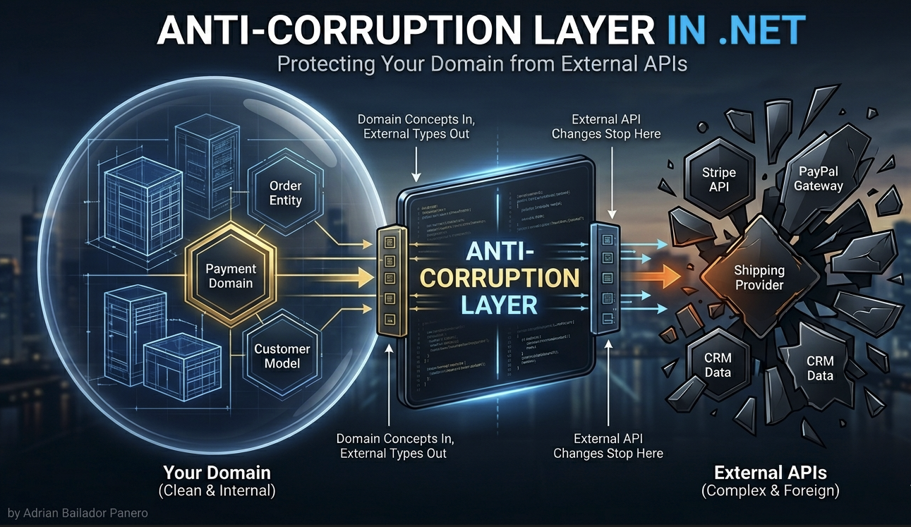
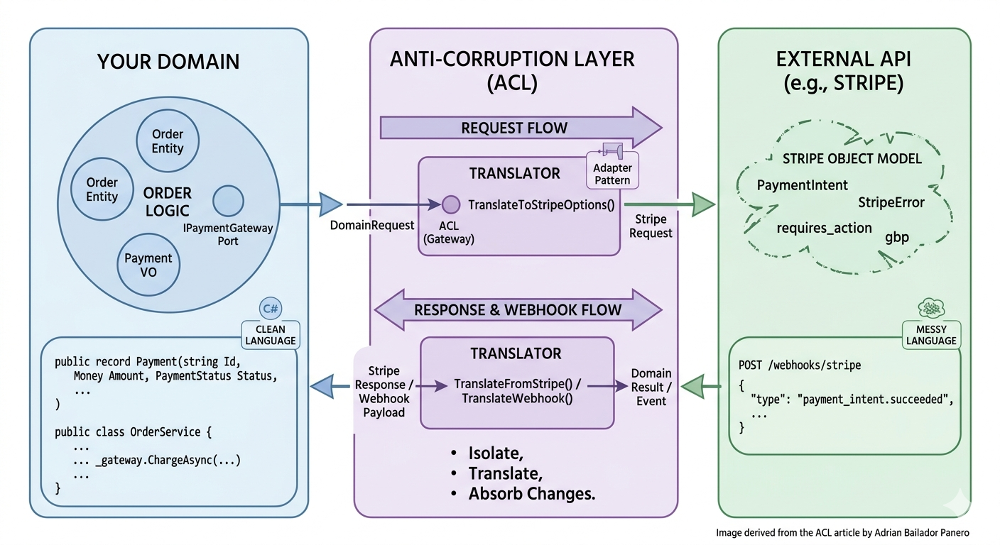

We had a clean domain. Orders, customers, payments — all modelled carefully, all speaking the same language. Then we integrated with a payment provider.

Six months later, the `PaymentStatus` enum had values like `PSPCONFIRMED`, `PSPREJECTED_RETRY`, and `AUTHORISED_3DS`. Our `Order` entity had a `StripeChargeId` field. Our service layer was calling `MapFromStripeWebhookPayload()`. And every developer who touched payments had to understand Stripe's object model before they could understand ours.

The domain hadn't changed. But it had been contaminated.

The Anti-Corruption Layer is the pattern that prevents this. Here's how it works and how to implement it in .NET.

## What Is the Anti-Corruption Layer?

The term comes from Eric Evans' *Domain-Driven Design*. When two systems need to communicate, the boundary between them is dangerous. The external system has its own model, its own vocabulary, its own assumptions about the world — and if you let those concepts bleed into your domain, you end up modelling *their* world instead of yours.

The Anti-Corruption Layer (ACL) is a translation boundary. It sits between your domain and the external system, converting the external model into your domain model — and vice versa. Your domain never sees the external types. The external system never sees your domain types.



It's not just a mapper. It's an architectural boundary that says: *everything on this side speaks our language, everything on that side speaks theirs, and this layer translates between the two.*

## The Difference Between ACL and Adapter Pattern

You already know the Adapter Pattern — it wraps an incompatible interface to make it compatible. The ACL does something deeper: it translates between two different *conceptual models*, not just two different interfaces.

An Adapter changes the shape of a call. An ACL changes the meaning.

| | Adapter Pattern | Anti-Corruption Layer |
|---|---|---|
| **Purpose** | Interface compatibility | Conceptual model translation |
| **Operates at** | Infrastructure level | Domain boundary |
| **Handles** | Method signatures | Domain concepts and language |
| **Complexity** | Low | Medium-high |

In practice, an ACL often uses adapters internally — but its intent is model translation, not interface adaptation.

## The Problem Without an ACL

Let's start with the contamination. You're building an e-commerce platform and integrating with a payment provider. Without an ACL, this is what happens:

```csharp
// ❌ Domain entity contaminated by external concepts
public class Order
{
    public Guid Id { get; private set; }
    public decimal Total { get; private set; }

    // Stripe concepts leaking into the domain
    public string? StripePaymentIntentId { get; set; }
    public string? StripeCustomerId { get; set; }
    public string? StripeStatus { get; set; }  // "requires_payment_method", "succeeded", etc.
}
```

```csharp
// ❌ Service layer that understands Stripe better than your own domain
public class OrderService
{
    private readonly StripeClient _stripe;

    public async Task ProcessPaymentAsync(Guid orderId, string paymentMethodId)
    {
        var order = await _repository.GetByIdAsync(orderId);

        // Stripe-specific logic inside domain service
        var paymentIntent = await _stripe.PaymentIntents.CreateAsync(new PaymentIntentCreateOptions
        {
            Amount = (long)(order.Total * 100), // Stripe uses cents
            Currency = "gbp",
            PaymentMethod = paymentMethodId,
            Confirm = true,
        });

        // Mapping Stripe statuses directly in domain logic
        order.StripePaymentIntentId = paymentIntent.Id;
        order.StripeStatus = paymentIntent.Status;

        if (paymentIntent.Status == "succeeded")
            order.MarkAsPaid();
        else if (paymentIntent.Status == "requires_action")
            order.MarkAsAwaitingAction();
    }
}
```

The problems:

- Your domain knows what a `PaymentIntent` is. It shouldn't.
- Every developer needs to know Stripe's status strings to understand your order logic.
- If you switch payment providers, you rewrite the domain.
- If Stripe renames a status, you hunt through domain code to find the references.

## Building the Anti-Corruption Layer

The ACL has three responsibilities:

1. **Translate** external models into domain models
2. **Isolate** domain code from external API contracts
3. **Absorb** changes — when the external API changes, only the ACL changes

### Step 1: Define Your Domain Model

First, define what *your* domain needs, in your language:

```csharp
// Your domain concepts — no external dependencies
public record Payment
{
    public PaymentId Id { get; init; }
    public Money Amount { get; init; }
    public PaymentStatus Status { get; init; }
    public PaymentProvider Provider { get; init; }
    public string ExternalReference { get; init; } = string.Empty;
    public DateTimeOffset ProcessedAt { get; init; }
}

public enum PaymentStatus
{
    Pending,
    Authorised,
    Captured,
    Declined,
    RequiresAction,
    Refunded
}

public enum PaymentProvider
{
    Stripe,
    PayPal
}

public record Money(decimal Amount, string Currency)
{
    public static Money GBP(decimal amount) => new(amount, "GBP");
    public static Money USD(decimal amount) => new(amount, "USD");
}

public record PaymentId(string Value)
{
    public static PaymentId New() => new(Guid.NewGuid().ToString());
}
```

### Step 2: Define the Domain Port

The domain declares what it needs through an interface — it doesn't care how it's implemented:

```csharp
// The domain's view of payment processing — no external types
public interface IPaymentGateway
{
    Task<PaymentResult> ChargeAsync(PaymentRequest request, CancellationToken ct = default);
    Task<PaymentResult> RefundAsync(string externalReference, Money amount, CancellationToken ct = default);
    Task<Payment?> GetPaymentAsync(string externalReference, CancellationToken ct = default);
}

public record PaymentRequest(
    Money Amount,
    string PaymentMethodToken,
    string OrderReference,
    string CustomerEmail);

public record PaymentResult(
    bool Success,
    Payment? Payment,
    string? ErrorMessage,
    bool RequiresAction,
    string? ActionUrl);
```

### Step 3: Implement the ACL Translator

This is the heart of the pattern. The ACL implementation knows about Stripe — but your domain never will:

```csharp
// Infrastructure layer — the only place that knows about Stripe
public class StripePaymentGateway : IPaymentGateway
{
    private readonly PaymentIntentService _paymentIntentService;
    private readonly RefundService _refundService;
    private readonly ILogger<StripePaymentGateway> _logger;

    public StripePaymentGateway(
        PaymentIntentService paymentIntentService,
        RefundService refundService,
        ILogger<StripePaymentGateway> logger)
    {
        _paymentIntentService = paymentIntentService;
        _refundService = refundService;
        _logger = logger;
    }

    public async Task<PaymentResult> ChargeAsync(
        PaymentRequest request,
        CancellationToken ct = default)
    {
        try
        {
            // Translate domain request → Stripe request
            var options = TranslateToStripeOptions(request);
            var intent = await _paymentIntentService.CreateAsync(options, cancellationToken: ct);

            // Translate Stripe response → domain Payment
            var payment = TranslateFromStripe(intent);
            var requiresAction = intent.Status == "requires_action";

            return new PaymentResult(
                Success: intent.Status is "succeeded" or "requires_action",
                Payment: payment,
                ErrorMessage: null,
                RequiresAction: requiresAction,
                ActionUrl: intent.NextAction?.RedirectToUrl?.Url);
        }
        catch (StripeException ex)
        {
            _logger.LogWarning(ex, "Stripe charge failed for order {OrderReference}", request.OrderReference);

            // Translate Stripe error → domain result
            return new PaymentResult(
                Success: false,
                Payment: null,
                ErrorMessage: TranslateStripeError(ex.StripeError),
                RequiresAction: false,
                ActionUrl: null);
        }
    }

    public async Task<PaymentResult> RefundAsync(
        string externalReference,
        Money amount,
        CancellationToken ct = default)
    {
        try
        {
            var refund = await _refundService.CreateAsync(new RefundCreateOptions
            {
                PaymentIntent = externalReference,
                Amount = ToStripeCents(amount),
            }, cancellationToken: ct);

            return new PaymentResult(
                Success: refund.Status == "succeeded",
                Payment: null,
                ErrorMessage: null,
                RequiresAction: false,
                ActionUrl: null);
        }
        catch (StripeException ex)
        {
            _logger.LogError(ex, "Stripe refund failed for {ExternalReference}", externalReference);
            return new PaymentResult(false, null, TranslateStripeError(ex.StripeError), false, null);
        }
    }

    public async Task<Payment?> GetPaymentAsync(
        string externalReference,
        CancellationToken ct = default)
    {
        try
        {
            var intent = await _paymentIntentService.GetAsync(externalReference, cancellationToken: ct);
            return TranslateFromStripe(intent);
        }
        catch (StripeException ex) when (ex.HttpStatusCode == System.Net.HttpStatusCode.NotFound)
        {
            return null;
        }
    }

    // ── Translation methods ───────────────────────────────────────────────────
    // These are the core of the ACL. All Stripe-specific knowledge lives here.

    private static PaymentIntentCreateOptions TranslateToStripeOptions(PaymentRequest request) =>
        new()
        {
            Amount = ToStripeCents(request.Amount),
            Currency = request.Amount.Currency.ToLowerInvariant(),
            PaymentMethod = request.PaymentMethodToken,
            Confirm = true,
            ReceiptEmail = request.CustomerEmail,
            Metadata = new Dictionary<string, string>
            {
                ["order_reference"] = request.OrderReference
            }
        };

    private static Payment TranslateFromStripe(PaymentIntent intent) =>
        new()
        {
            Id = new PaymentId(intent.Id),
            Amount = new Money(intent.Amount / 100m, intent.Currency.ToUpperInvariant()),
            Status = TranslateStripeStatus(intent.Status),
            Provider = PaymentProvider.Stripe,
            ExternalReference = intent.Id,
            ProcessedAt = intent.Created
        };

    private static PaymentStatus TranslateStripeStatus(string stripeStatus) =>
        stripeStatus switch
        {
            "requires_payment_method" => PaymentStatus.Pending,
            "requires_confirmation"   => PaymentStatus.Pending,
            "requires_action"         => PaymentStatus.RequiresAction,
            "processing"              => PaymentStatus.Pending,
            "succeeded"               => PaymentStatus.Captured,
            "canceled"                => PaymentStatus.Declined,
            _ => PaymentStatus.Pending
        };

    private static string TranslateStripeError(StripeError? error) =>
        error?.Code switch
        {
            "card_declined"           => "Your card was declined.",
            "insufficient_funds"      => "Insufficient funds on your card.",
            "incorrect_cvc"           => "The security code is incorrect.",
            "expired_card"            => "Your card has expired.",
            "processing_error"        => "A processing error occurred. Please try again.",
            _ => "Payment could not be processed. Please try again."
        };

    private static long ToStripeCents(Money money) => (long)(money.Amount * 100);
}
```

### Step 4: The Clean Domain Service

Now look at how clean your domain service becomes:

```csharp
// ✅ Domain service that knows nothing about Stripe
public class OrderPaymentService
{
    private readonly IOrderRepository _orders;
    private readonly IPaymentGateway _paymentGateway;  // domain interface, not Stripe
    private readonly ILogger<OrderPaymentService> _logger;

    public OrderPaymentService(
        IOrderRepository orders,
        IPaymentGateway paymentGateway,
        ILogger<OrderPaymentService> logger)
    {
        _orders = orders;
        _paymentGateway = paymentGateway;
        _logger = logger;
    }

    public async Task<PaymentOutcome> ProcessPaymentAsync(
        Guid orderId,
        string paymentMethodToken,
        CancellationToken ct = default)
    {
        var order = await _orders.GetByIdAsync(orderId, ct)
            ?? throw new OrderNotFoundException(orderId);

        var request = new PaymentRequest(
            Amount: Money.GBP(order.Total),
            PaymentMethodToken: paymentMethodToken,
            OrderReference: order.Reference,
            CustomerEmail: order.CustomerEmail);

        var result = await _paymentGateway.ChargeAsync(request, ct);

        if (!result.Success)
        {
            _logger.LogWarning("Payment failed for order {OrderId}: {Error}", orderId, result.ErrorMessage);
            return PaymentOutcome.Failed(result.ErrorMessage!);
        }

        if (result.RequiresAction)
        {
            order.AwaitCustomerAction(result.Payment!);
            await _orders.SaveAsync(order, ct);
            return PaymentOutcome.RequiresAction(result.ActionUrl!);
        }

        order.MarkAsPaid(result.Payment!);
        await _orders.SaveAsync(order, ct);

        return PaymentOutcome.Succeeded(result.Payment!);
    }
}

public record PaymentOutcome
{
    public bool IsSuccess { get; init; }
    public bool NeedsAction { get; init; }
    public string? ActionUrl { get; init; }
    public string? Error { get; init; }
    public Payment? Payment { get; init; }

    public static PaymentOutcome Succeeded(Payment payment) =>
        new() { IsSuccess = true, Payment = payment };

    public static PaymentOutcome RequiresAction(string actionUrl) =>
        new() { IsSuccess = true, NeedsAction = true, ActionUrl = actionUrl };

    public static PaymentOutcome Failed(string error) =>
        new() { IsSuccess = false, Error = error };
}
```

No `PaymentIntent`. No `StripeException`. No `requires_payment_method`. The domain service is readable by anyone who understands the business, not just developers who know Stripe.

### Step 5: Wiring It Up

```csharp
// Program.cs
builder.Services.AddScoped<IPaymentGateway, StripePaymentGateway>();

// If you want to swap providers without touching the domain:
// builder.Services.AddScoped<IPaymentGateway, PayPalPaymentGateway>();

builder.Services.AddScoped<OrderPaymentService>();

// Stripe SDK services
builder.Services.AddSingleton<PaymentIntentService>();
builder.Services.AddSingleton<RefundService>();

StripeConfiguration.ApiKey = builder.Configuration["Stripe:SecretKey"];
```

## Handling Webhooks Through the ACL

Webhooks are where contamination is most dangerous — you receive a raw external payload and have to decide what it means for your domain.

```csharp
// ❌ Without ACL — Stripe webhook logic inside domain
[HttpPost("webhooks/stripe")]
public async Task<IActionResult> StripeWebhook()
{
    var payload = await new StreamReader(Request.Body).ReadToEndAsync();
    var stripeEvent = EventUtility.ConstructEvent(payload, Request.Headers["Stripe-Signature"], _secret);

    if (stripeEvent.Type == "payment_intent.succeeded")
    {
        var intent = stripeEvent.Data.Object as PaymentIntent;
        // Now you're writing domain logic inside a Stripe webhook handler
    }
}
```

```csharp
// ✅ With ACL — the domain sees a domain event
public interface IPaymentWebhookTranslator
{
    Task<DomainPaymentEvent?> TranslateAsync(string payload, string signature, CancellationToken ct = default);
}

public record DomainPaymentEvent(
    DomainPaymentEventType Type,
    string ExternalReference,
    Money? Amount);

public enum DomainPaymentEventType
{
    PaymentSucceeded,
    PaymentFailed,
    PaymentRefunded,
    DisputeOpened
}

// ACL implementation — knows about Stripe
public class StripeWebhookTranslator : IPaymentWebhookTranslator
{
    private readonly string _webhookSecret;

    public StripeWebhookTranslator(IConfiguration config)
    {
        _webhookSecret = config["Stripe:WebhookSecret"]!;
    }

    public Task<DomainPaymentEvent?> TranslateAsync(
        string payload,
        string signature,
        CancellationToken ct = default)
    {
        Event stripeEvent;

        try
        {
            stripeEvent = EventUtility.ConstructEvent(payload, signature, _webhookSecret);
        }
        catch (StripeException)
        {
            return Task.FromResult<DomainPaymentEvent?>(null);
        }

        var domainEvent = stripeEvent.Type switch
        {
            "payment_intent.succeeded" => TranslateSucceeded(stripeEvent),
            "payment_intent.payment_failed" => TranslateFailed(stripeEvent),
            "charge.refunded" => TranslateRefunded(stripeEvent),
            "charge.dispute.created" => TranslateDispute(stripeEvent),
            _ => null
        };

        return Task.FromResult(domainEvent);
    }

    private static DomainPaymentEvent? TranslateSucceeded(Event e)
    {
        if (e.Data.Object is not PaymentIntent intent) return null;

        return new DomainPaymentEvent(
            Type: DomainPaymentEventType.PaymentSucceeded,
            ExternalReference: intent.Id,
            Amount: new Money(intent.Amount / 100m, intent.Currency.ToUpperInvariant()));
    }

    private static DomainPaymentEvent? TranslateFailed(Event e)
    {
        if (e.Data.Object is not PaymentIntent intent) return null;

        return new DomainPaymentEvent(
            Type: DomainPaymentEventType.PaymentFailed,
            ExternalReference: intent.Id,
            Amount: null);
    }

    private static DomainPaymentEvent? TranslateRefunded(Event e)
    {
        if (e.Data.Object is not Charge charge) return null;

        return new DomainPaymentEvent(
            Type: DomainPaymentEventType.PaymentRefunded,
            ExternalReference: charge.PaymentIntentId,
            Amount: new Money(charge.AmountRefunded / 100m, charge.Currency.ToUpperInvariant()));
    }

    private static DomainPaymentEvent? TranslateDispute(Event e)
    {
        if (e.Data.Object is not Dispute dispute) return null;

        return new DomainPaymentEvent(
            Type: DomainPaymentEventType.DisputeOpened,
            ExternalReference: dispute.ChargeId,
            Amount: new Money(dispute.Amount / 100m, dispute.Currency.ToUpperInvariant()));
    }
}

// Clean controller — receives domain events, not Stripe events
[HttpPost("webhooks/payments")]
public async Task<IActionResult> PaymentWebhook()
{
    var payload = await new StreamReader(Request.Body).ReadToEndAsync();
    var signature = Request.Headers["Stripe-Signature"].ToString();

    var domainEvent = await _webhookTranslator.TranslateAsync(payload, signature);

    if (domainEvent is null)
        return BadRequest();

    await _paymentEventHandler.HandleAsync(domainEvent);
    return Ok();
}
```

## Switching Providers Without Touching the Domain

This is where the investment pays off. If you need to switch from Stripe to PayPal:

```csharp
// New ACL implementation — everything Stripe is gone from this file
public class PayPalPaymentGateway : IPaymentGateway
{
    private readonly PayPalHttpClient _client;

    public async Task<PaymentResult> ChargeAsync(
        PaymentRequest request,
        CancellationToken ct = default)
    {
        // Translate domain request → PayPal request
        var paypalOrder = TranslateToPayPalOrder(request);
        var response = await _client.Execute(new OrdersCreateRequest().RequestBody(paypalOrder));

        // Translate PayPal response → domain result
        return TranslateFromPayPal(response.Result<Order>());
    }

    private static PaymentResult TranslateFromPayPal(Order order) =>
        new(
            Success: order.Status == "COMPLETED",
            Payment: new Payment
            {
                Id = new PaymentId(order.Id),
                Status: TranslatePayPalStatus(order.Status),
                Provider = PaymentProvider.PayPal,
                ExternalReference = order.Id,
                // ...
            },
            ErrorMessage: null,
            RequiresAction: order.Status == "PAYER_ACTION_REQUIRED",
            ActionUrl: order.Links?.FirstOrDefault(l => l.Rel == "payer-action")?.Href);

    private static PaymentStatus TranslatePayPalStatus(string status) =>
        status switch
        {
            "CREATED"  => PaymentStatus.Pending,
            "SAVED"    => PaymentStatus.Pending,
            "APPROVED" => PaymentStatus.Authorised,
            "COMPLETED" => PaymentStatus.Captured,
            "VOIDED"   => PaymentStatus.Declined,
            _ => PaymentStatus.Pending
        };
}
```

Change one line in `Program.cs`:

```csharp
// Before
builder.Services.AddScoped<IPaymentGateway, StripePaymentGateway>();

// After
builder.Services.AddScoped<IPaymentGateway, PayPalPaymentGateway>();
```

The domain, the service layer, the controllers — unchanged. The ACL absorbed the migration.

## Common Mistakes

### Mistake 1: Putting translation logic in the domain

```csharp
// ❌ Domain entity knows how to parse Stripe responses
public class Order
{
    public void ApplyStripeWebhook(StripeEvent e)
    {
        if (e.Type == "payment_intent.succeeded")
            Status = OrderStatus.Paid;
    }
}
```

The domain should never import external SDK types. If you see `using Stripe;` in a domain class, the ACL is missing.

### Mistake 2: Leaking IDs across the boundary

```csharp
// ❌ External ID stored as a first-class domain concept
public class Order
{
    public string StripePaymentIntentId { get; set; }  // Stripe concept in domain
}

// ✅ Store as an opaque external reference
public class Order
{
    public string? ExternalPaymentReference { get; private set; }  // domain concept
}
```

The domain doesn't know or care that `ExternalPaymentReference` is a Stripe PaymentIntent ID. It's just a reference to something external.

### Mistake 3: Making the ACL a thin pass-through

```csharp
// ❌ No translation — just wrapping the call
public class StripePaymentGateway : IPaymentGateway
{
    public async Task<PaymentIntent> ChargeAsync(PaymentIntentCreateOptions options)
    {
        return await _stripe.PaymentIntents.CreateAsync(options);
    }
}
```

If your ACL exposes external types in its return values or parameters, it's not an ACL. It's just a facade that provides a false sense of protection.

### Mistake 4: One ACL for everything

If your system integrates with a payment provider, a shipping API, a CRM, and an email service, each deserves its own ACL. Mixing them creates the same coupling problem you were trying to solve.

```
Domain
├── Payments/
│   ├── IPaymentGateway.cs           ← domain port
│   └── Infrastructure/
│       └── StripePaymentGateway.cs  ← ACL for Stripe
├── Shipping/
│   ├── IShippingProvider.cs         ← domain port
│   └── Infrastructure/
│       └── DhlShippingProvider.cs   ← ACL for DHL
└── Notifications/
    ├── IEmailSender.cs              ← domain port
    └── Infrastructure/
        └── SendGridEmailSender.cs   ← ACL for SendGrid
```

## Best Practices

**Keep external types out of domain interfaces.** If `IPaymentGateway` has a method that accepts or returns a Stripe type, the ACL has failed. Domain interfaces use only domain types.

**Put all translation in one place.** The mapping from Stripe statuses to `PaymentStatus` should live in exactly one method. When Stripe adds a new status, you change one switch expression.

**Name the ACL after what it provides, not what it wraps.** `IPaymentGateway` is better than `IStripeAdapter`. Your domain doesn't know it's talking to Stripe.

**Write tests for the translation logic.** The ACL is where subtle bugs hide — a missing status mapping, a wrong currency conversion, a misinterpreted error code. Unit test the translation methods directly.

```csharp
[Theory]
[InlineData("succeeded", PaymentStatus.Captured)]
[InlineData("requires_action", PaymentStatus.RequiresAction)]
[InlineData("canceled", PaymentStatus.Declined)]
[InlineData("processing", PaymentStatus.Pending)]
public void TranslateStripeStatus_MapsCorrectly(string stripeStatus, PaymentStatus expected)
{
    var result = StripeStatusTranslator.Translate(stripeStatus);
    Assert.Equal(expected, result);
}
```

**Let the ACL absorb errors too.** Don't let `StripeException` propagate into the domain. Catch it in the ACL and translate it into a domain result. The domain should never handle payment provider exceptions.

## Conclusion

The contamination I described at the start — `StripeChargeId` on `Order`, `PSPCONFIRMED` in the status enum, `MapFromStripeWebhookPayload()` in the service layer — wasn't inevitable. It happened gradually, one shortcut at a time, each one reasonable in isolation.

The Anti-Corruption Layer is the structural decision that makes those shortcuts impossible. It says: *this is the boundary. On this side, we speak our language. On that side, they speak theirs. Here is where the translation happens.*

The benefits accumulate slowly and then pay off all at once: when Stripe deprecates an endpoint, only the ACL changes. When you add a second payment provider, you add a second ACL. When a new developer joins the team, they can understand the payment flow without knowing Stripe's object model.

The domain stays clean. The external system stays external. The translation layer absorbs the chaos so everything else doesn't have to.

---

*Full source code: [github.com/AdrianBailador/anti-corruption-layer-dotnet](https://github.com/AdrianBailador/anti-corruption-layer-dotnet)*

*Questions or suggestions? Open an issue on [GitHub](https://github.com/AdrianBailador/anti-corruption-layer-dotnet/issues).*
