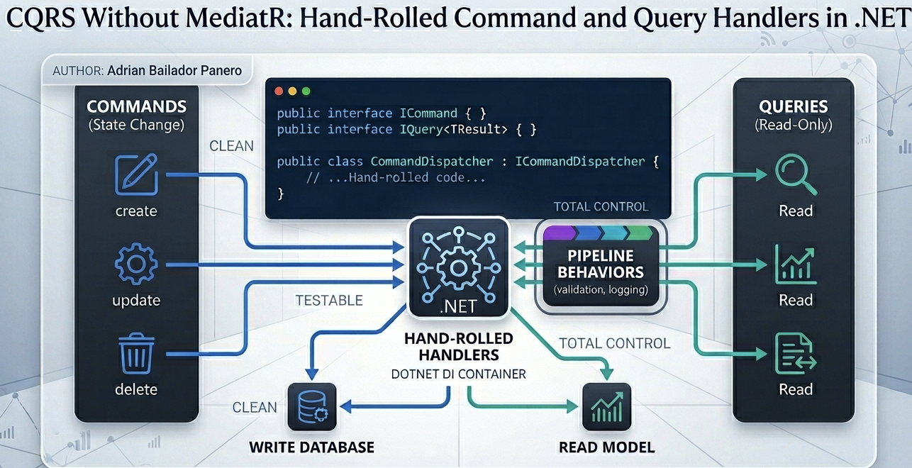

For years, opening a new .NET project meant the same opening ritual: `dotnet add package MediatR`. The library became so synonymous with CQRS in the .NET community that many developers couldn't tell where the pattern ended and the package began.

Then MediatR moved to a commercial license. Suddenly, every team that had built their architecture around it was asking the same question: *do we actually need this?*

This isn't a criticism of MediatR or of Jimmy Bogard — the library shaped how a generation of .NET developers think about handlers, pipelines, and clean separation of concerns, and the community owes him a real debt. The licensing change is just an opportunity to look at what's underneath, and to notice how little of it actually needs to be a library at all.

Most teams don't need MediatR. CQRS is a pattern, not a library — and the .NET DI container has everything you need to implement it cleanly. This article shows how.

## What CQRS Actually Is

Command Query Responsibility Segregation has two parts:

1. **Commands** change state. They have side effects. They might return a result, but their primary purpose is to modify the system.
2. **Queries** read state. They have no side effects. They return data and nothing else.

That's it. Everything else — the dispatcher, the handlers, the pipeline behaviors — is implementation detail. None of it requires a library.

The reason MediatR became the default is convenience: it gave you handler discovery, a dispatcher, and a behavior pipeline in three lines of `Program.cs`. But all of those things are about ten lines of code each, and writing them yourself gives you something MediatR never could: full control over the abstraction.

## The Minimal Abstraction

Start with two interface families. One for commands, one for queries.

```csharp
// Marker interfaces — they exist only for the type system
public interface ICommand { }
public interface ICommand<TResult> { }

public interface IQuery<TResult> { }

// Handlers
public interface ICommandHandler<TCommand>
    where TCommand : ICommand
{
    Task HandleAsync(TCommand command, CancellationToken ct = default);
}

public interface ICommandHandler<TCommand, TResult>
    where TCommand : ICommand<TResult>
{
    Task<TResult> HandleAsync(TCommand command, CancellationToken ct = default);
}

public interface IQueryHandler<TQuery, TResult>
    where TQuery : IQuery<TResult>
{
    Task<TResult> HandleAsync(TQuery query, CancellationToken ct = default);
}
```

Five interfaces. No external dependencies. No reflection magic. The compiler enforces the relationship between commands, queries, and their handlers.

A note on the empty `ICommand` and `IQuery` interfaces: some developers consider marker interfaces an anti-pattern, and in many cases they're right — an attribute or a naming convention is usually enough. Here, they earn their keep. They give the assembly scanner an unambiguous anchor (`AssignableTo(typeof(ICommand<>))` is impossible without them), and they let the dispatcher constrain its generic parameters so misuse is a compile error instead of a runtime one. They're not decoration — they're the type-system contract that makes everything else type-safe.

A concrete command and handler look like this:

```csharp
public record CreateOrder(string CustomerEmail, List<OrderLine> Lines) : ICommand<OrderId>;

public class CreateOrderHandler : ICommandHandler<CreateOrder, OrderId>
{
    private readonly IOrderRepository _orders;
    private readonly IEventBus _events;

    public CreateOrderHandler(IOrderRepository orders, IEventBus events)
    {
        _orders = orders;
        _events = events;
    }

    public async Task<OrderId> HandleAsync(CreateOrder command, CancellationToken ct = default)
    {
        var order = Order.Create(command.CustomerEmail, command.Lines);

        await _orders.SaveAsync(order, ct);
        await _events.PublishAsync(new OrderCreated(order.Id), ct);

        return order.Id;
    }
}
```

And a query:

```csharp
public record GetOrderById(Guid OrderId) : IQuery<OrderDto?>;

public class GetOrderByIdHandler : IQueryHandler<GetOrderById, OrderDto?>
{
    private readonly IOrderReadModel _reads;

    public GetOrderByIdHandler(IOrderReadModel reads)
    {
        _reads = reads;
    }

    public Task<OrderDto?> HandleAsync(GetOrderById query, CancellationToken ct = default)
        => _reads.GetByIdAsync(query.OrderId, ct);
}
```

That's the entire pattern. Everything from here on is plumbing.

## The Dispatcher

The dispatcher resolves the handler for a given command or query and invokes it. It exists so callers don't have to inject every handler they want to use — they inject one dispatcher and send messages through it.

```csharp
public interface ICommandDispatcher
{
    Task SendAsync(ICommand command, CancellationToken ct = default);
    Task<TResult> SendAsync<TResult>(ICommand<TResult> command, CancellationToken ct = default);
}

public interface IQueryDispatcher
{
    Task<TResult> SendAsync<TResult>(IQuery<TResult> query, CancellationToken ct = default);
}
```

The implementation is short. It uses the runtime type of the message to find the right handler in the DI container.

```csharp
public class CommandDispatcher : ICommandDispatcher
{
    private readonly IServiceProvider _provider;

    public CommandDispatcher(IServiceProvider provider)
    {
        _provider = provider;
    }

    public Task SendAsync(ICommand command, CancellationToken ct = default)
    {
        var handlerType = typeof(ICommandHandler<>).MakeGenericType(command.GetType());
        dynamic handler = _provider.GetRequiredService(handlerType);
        return handler.HandleAsync((dynamic)command, ct);
    }

    public Task<TResult> SendAsync<TResult>(ICommand<TResult> command, CancellationToken ct = default)
    {
        var handlerType = typeof(ICommandHandler<,>)
            .MakeGenericType(command.GetType(), typeof(TResult));
        dynamic handler = _provider.GetRequiredService(handlerType);
        return handler.HandleAsync((dynamic)command, ct);
    }
}

public class QueryDispatcher : IQueryDispatcher
{
    private readonly IServiceProvider _provider;

    public QueryDispatcher(IServiceProvider provider)
    {
        _provider = provider;
    }

    public Task<TResult> SendAsync<TResult>(IQuery<TResult> query, CancellationToken ct = default)
    {
        var handlerType = typeof(IQueryHandler<,>)
            .MakeGenericType(query.GetType(), typeof(TResult));
        dynamic handler = _provider.GetRequiredService(handlerType);
        return handler.HandleAsync((dynamic)query, ct);
    }
}
```

The `dynamic` calls are the trick. Without them you'd need reflection (`MethodInfo.Invoke`) and the cost is similar — but `dynamic` keeps the code readable and the call site cached after the first invocation.

If you want to avoid `dynamic` entirely, the alternative is one extra method per generic arity using `MethodInfo.Invoke`. The performance difference is negligible for everything except hot loops, and CQRS handlers are not a hot loop. From .NET 8 onwards, the JIT compiler is remarkably good at devirtualising and inlining generic dispatch — the "hand-rolled" version performs identically to MediatR for the vast majority of applications, which is one more reason not to be intimidated by writing this yourself.

One subtlety worth flagging in the dispatcher code: `command.GetType()` returns the *runtime* type of the command instance. If you build a command hierarchy where a derived class is sent through the pipeline but only a handler for the base type is registered, the resolution will fail at runtime — the container looks for a handler of the concrete type. In practice this is rarely a problem because commands are usually sealed `record` types, but it's worth knowing if you ever consider sharing handlers across command variants.

## Wiring Everything Up

You need three things in `Program.cs`:

1. Register the dispatchers
2. Register all handlers
3. (Optionally) register pipeline behaviors

Manual registration works for small projects:

```csharp
builder.Services.AddScoped<ICommandDispatcher, CommandDispatcher>();
builder.Services.AddScoped<IQueryDispatcher, QueryDispatcher>();

builder.Services.AddScoped<ICommandHandler<CreateOrder, OrderId>, CreateOrderHandler>();
builder.Services.AddScoped<IQueryHandler<GetOrderById, OrderDto?>, GetOrderByIdHandler>();
// ...one line per handler
```

This works, but for a real codebase you want auto-registration. The cleanest way is [Scrutor](https://github.com/khellang/Scrutor), which adds assembly scanning to the standard DI container.

```csharp
builder.Services.AddScoped<ICommandDispatcher, CommandDispatcher>();
builder.Services.AddScoped<IQueryDispatcher, QueryDispatcher>();

builder.Services.Scan(scan => scan
    .FromAssemblyOf<CreateOrder>()
    .AddClasses(c => c.AssignableTo(typeof(ICommandHandler<>)))
        .AsImplementedInterfaces()
        .WithScopedLifetime()
    .AddClasses(c => c.AssignableTo(typeof(ICommandHandler<,>)))
        .AsImplementedInterfaces()
        .WithScopedLifetime()
    .AddClasses(c => c.AssignableTo(typeof(IQueryHandler<,>)))
        .AsImplementedInterfaces()
        .WithScopedLifetime());
```

Three blocks of scanning, and every handler in your project is registered. Adding a new handler means writing the class — no `Program.cs` change required.

If you don't want a Scrutor dependency, you can scan manually with reflection:

```csharp
public static IServiceCollection AddCqrsHandlers(this IServiceCollection services, Assembly assembly)
{
    var handlerInterfaces = new[]
    {
        typeof(ICommandHandler<>),
        typeof(ICommandHandler<,>),
        typeof(IQueryHandler<,>)
    };

    var handlerTypes = assembly.GetTypes()
        .Where(t => !t.IsAbstract && !t.IsInterface)
        .SelectMany(t => t.GetInterfaces()
            .Where(i => i.IsGenericType && handlerInterfaces.Contains(i.GetGenericTypeDefinition()))
            .Select(i => new { Implementation = t, Service = i }));

    foreach (var handler in handlerTypes)
        services.AddScoped(handler.Service, handler.Implementation);

    return services;
}
```

Call it once: `builder.Services.AddCqrsHandlers(typeof(CreateOrder).Assembly);`. About thirty lines of code that replaces an entire dependency.

## Pipeline Behaviors Without Magic

This is where most people assume they need MediatR. They don't. The decorator pattern + Scrutor gives you the same thing with no surprises.

Suppose you want every command to be logged and validated. Define behaviors as decorators of `ICommandHandler<,>`:

```csharp
public class LoggingCommandHandler<TCommand, TResult> : ICommandHandler<TCommand, TResult>
    where TCommand : ICommand<TResult>
{
    private readonly ICommandHandler<TCommand, TResult> _inner;
    private readonly ILogger<TCommand> _logger;

    public LoggingCommandHandler(ICommandHandler<TCommand, TResult> inner, ILogger<TCommand> logger)
    {
        _inner = inner;
        _logger = logger;
    }

    public async Task<TResult> HandleAsync(TCommand command, CancellationToken ct = default)
    {
        var sw = Stopwatch.StartNew();
        _logger.LogInformation("Handling {Command}", typeof(TCommand).Name);

        try
        {
            var result = await _inner.HandleAsync(command, ct);
            _logger.LogInformation("Handled {Command} in {Elapsed}ms", typeof(TCommand).Name, sw.ElapsedMilliseconds);
            return result;
        }
        catch (Exception ex)
        {
            _logger.LogError(ex, "Failed handling {Command} after {Elapsed}ms", typeof(TCommand).Name, sw.ElapsedMilliseconds);
            throw;
        }
    }
}

public class ValidationCommandHandler<TCommand, TResult> : ICommandHandler<TCommand, TResult>
    where TCommand : ICommand<TResult>
{
    private readonly ICommandHandler<TCommand, TResult> _inner;
    private readonly IEnumerable<IValidator<TCommand>> _validators;

    public ValidationCommandHandler(
        ICommandHandler<TCommand, TResult> inner,
        IEnumerable<IValidator<TCommand>> validators)
    {
        _inner = inner;
        _validators = validators;
    }

    public async Task<TResult> HandleAsync(TCommand command, CancellationToken ct = default)
    {
        var failures = _validators
            .Select(v => v.Validate(command))
            .SelectMany(r => r.Errors)
            .Where(e => e is not null)
            .ToList();

        if (failures.Count != 0)
            throw new ValidationException(failures);

        return await _inner.HandleAsync(command, ct);
    }
}
```

Wire them with `Scrutor.Decorate`:

```csharp
builder.Services.Decorate(typeof(ICommandHandler<,>), typeof(ValidationCommandHandler<,>));
builder.Services.Decorate(typeof(ICommandHandler<,>), typeof(LoggingCommandHandler<,>));
```

Order matters: the last `Decorate` call is the outermost layer. With the configuration above, every command flows through `Logging → Validation → actual handler`.

The benefit over MediatR's `IPipelineBehavior` is that you can see exactly what's happening. There's no `next()` delegate hiding behind a generic type — just plain decorators with their dependencies visible at the constructor.

## Skipping the Dispatcher in Minimal APIs

Here's a question worth asking: do you even need the dispatcher?

If you're using Minimal APIs, the endpoint handler is already a function with access to DI. You can inject the command handler directly:

```csharp
app.MapPost("/orders", async (
    CreateOrder command,
    ICommandHandler<CreateOrder, OrderId> handler,
    CancellationToken ct) =>
{
    var orderId = await handler.HandleAsync(command, ct);
    return Results.Created($"/orders/{orderId.Value}", new { orderId });
});

app.MapGet("/orders/{id:guid}", async (
    Guid id,
    IQueryHandler<GetOrderById, OrderDto?> handler,
    CancellationToken ct) =>
{
    var dto = await handler.HandleAsync(new GetOrderById(id), ct);
    return dto is null ? Results.NotFound() : Results.Ok(dto);
});
```

No dispatcher, no `dynamic`, no runtime type resolution. The compiler knows exactly which handler is being injected. Decorators still apply because they wrap the registered handler interface.

When does the dispatcher earn its keep? When you have callers that don't know the concrete command type at compile time — background workers reading from a queue, retry pipelines, or generic API endpoints that map a JSON envelope to a command. For typed endpoints, direct injection is simpler and faster.

A reasonable default: skip the dispatcher in your web layer, keep it for infrastructure code that handles message envelopes.

## What You Lose Without MediatR

It's worth being honest about this:

**Notification publishing.** MediatR's `IPublisher` lets one event fan out to multiple handlers. If you need this, write it — it's about twenty lines.

```csharp
public interface IDomainEventPublisher
{
    Task PublishAsync<TEvent>(TEvent @event, CancellationToken ct = default)
        where TEvent : IDomainEvent;
}

public class DomainEventPublisher : IDomainEventPublisher
{
    private readonly IServiceProvider _provider;

    public DomainEventPublisher(IServiceProvider provider) => _provider = provider;

    public async Task PublishAsync<TEvent>(TEvent @event, CancellationToken ct = default)
        where TEvent : IDomainEvent
    {
        var handlers = _provider.GetServices<IDomainEventHandler<TEvent>>();
        foreach (var handler in handlers)
            await handler.HandleAsync(@event, ct);
    }
}
```

**Streaming requests.** `IStreamRequestHandler` returns `IAsyncEnumerable`. If you need streaming, define an interface for it. Most apps don't.

**Community familiarity.** New developers will recognise MediatR. A custom abstraction means a paragraph in the README.

What you gain: no third-party dependency, no licensing concerns, no upgrade treadmill, total transparency about how messages get from sender to handler. For most projects, that's a fair trade.

## Common Mistakes

### Mistake 1: Treating CQRS as Two Databases

CQRS doesn't require separate read and write models, separate databases, or eventual consistency. Those are choices that *can* be made on top of CQRS, but the pattern itself is just about separating commands from queries at the code level.

You can have one database, one ORM, one set of tables, and still benefit from the separation. `CreateOrderHandler` writes through EF Core; `GetOrderByIdHandler` reads through Dapper. Same database, different optimisation strategies.

### Mistake 2: Putting Logic in Commands or Queries

```csharp
// ❌ Command with logic
public record CreateOrder(...)
{
    public bool IsValid() => Lines.Count > 0 && CustomerEmail.Contains("@");
    public decimal CalculateTotal() => Lines.Sum(l => l.Price * l.Quantity);
}
```

Commands and queries are messages. They carry data; they don't process it. All logic belongs in the handler or the domain. If a `record` starts growing methods, you've created a hidden service.

### Mistake 3: Handlers That Call Other Handlers

```csharp
// ❌ Handler invoking another handler
public class CreateOrderHandler : ICommandHandler<CreateOrder, OrderId>
{
    private readonly ICommandDispatcher _dispatcher;

    public async Task<OrderId> HandleAsync(CreateOrder command, CancellationToken ct = default)
    {
        var customerId = await _dispatcher.SendAsync(new EnsureCustomerExists(command.CustomerEmail), ct);
        // ...
    }
}
```

This is how you end up with implicit dependency graphs nobody can trace. If `CreateOrderHandler` needs to ensure a customer exists, inject `ICustomerService` and call a method. Handlers should be leaves of the call tree, not branches.

### Mistake 4: Reusing Commands as DTOs

The shape that arrives from the API is rarely the shape your handler should accept. Validate, transform, and *then* construct the command:

```csharp
// ❌ Treating the request body as a command
app.MapPost("/orders", (CreateOrderRequest req, ICommandDispatcher d) =>
    d.SendAsync(new CreateOrder(req.Email, req.Lines)));
```

If `CreateOrderRequest` and `CreateOrder` end up identical, that's fine — but they're allowed to diverge, and that ability is what makes the pattern useful.

## Best Practices

**Keep commands and queries flat.** A command should be a `record` with primitive or value-object fields. If you're nesting domain entities inside, you're sending state through a command bus instead of identifiers.

**One handler per command.** Multiple handlers per command create ordering and ownership questions that don't have good answers. If you need fan-out, that's an event, not a command.

**Make handlers thin.** A handler orchestrates: load aggregate, call domain method, save, publish events. The domain method does the work. If your handler is 80 lines of logic, the logic belongs in the domain.

**Test handlers as units.** Handlers are easy to test — they're just classes with constructor dependencies. Mock the repository, call `HandleAsync`, assert the result and the side effects.

```csharp
[Fact]
public async Task CreateOrderHandler_PersistsOrder_AndPublishesEvent()
{
    var orders = Substitute.For<IOrderRepository>();
    var events = Substitute.For<IEventBus>();
    var handler = new CreateOrderHandler(orders, events);

    var result = await handler.HandleAsync(new CreateOrder("a@b.com", [new OrderLine("SKU1", 1, 10)]));

    await orders.Received(1).SaveAsync(Arg.Any<Order>(), Arg.Any<CancellationToken>());
    await events.Received(1).PublishAsync(Arg.Any<OrderCreated>(), Arg.Any<CancellationToken>());
}
```

**Keep your dispatcher dumb.** Resist the urge to add caching, retries, or "smart" routing inside the dispatcher. Those are decorators, registered as such. The dispatcher's job is to find a handler and invoke it.

## When MediatR Still Makes Sense

The licensing change is real, but if your team already pays for the commercial license and has years of code built around it, ripping it out is rarely the right call. The pattern doesn't change — just the package.

There are also legitimate alternatives if you want a maintained library: [Wolverine](https://wolverine.netlify.app/), [Brighter](https://www.goparamore.io/), and [MassTransit](https://masstransit.io/) all do CQRS with extras (durable messaging, sagas, transports). They're worth a look if you're crossing process boundaries.

But for the vast majority of monoliths and modular monoliths, the code in this article is the entire toolkit. Five interfaces, two dispatchers, decorator-based pipeline. No third-party dependency, no breaking changes to track, no surprises about how messages reach their handlers.

## Conclusion

CQRS was always a pattern about separating writes from reads, not a library about routing messages. MediatR's commercial pivot was a useful forcing function — it made teams ask whether they actually needed the indirection, and a lot of them realised they didn't.

The hand-rolled version isn't a downgrade. It's the same pattern with the implementation visible. You can read every line of how a command reaches its handler. You can step through it in the debugger. You can change it when your needs change. The DI container does the heavy lifting; the rest is interfaces and a decorator or two.

If your codebase already has MediatR and works well, leave it. If you're starting fresh, or if licensing is a problem, this is a clean alternative — and you'll probably find that explicit handlers are easier to reason about than a generic mediator anyway.

The pattern was never the package. The package was just the convenience.

---

*Full source code: [github.com/AdrianBailador/cqrs-without-mediatr-dotnet](https://github.com/AdrianBailador/cqrs-without-mediatr-dotnet)*

*Questions or suggestions? Open an issue on [GitHub](https://github.com/AdrianBailador/cqrs-without-mediatr-dotnet/issues).*
