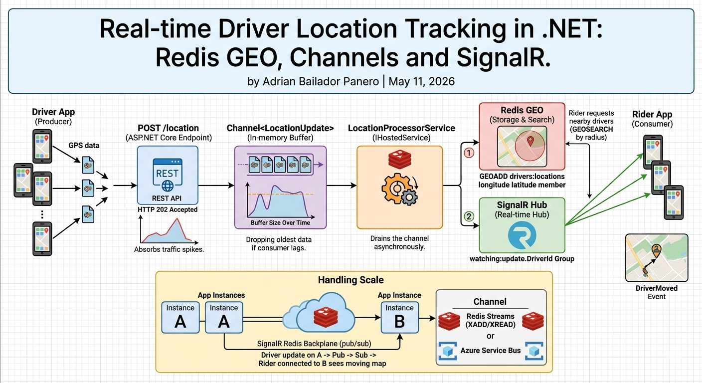
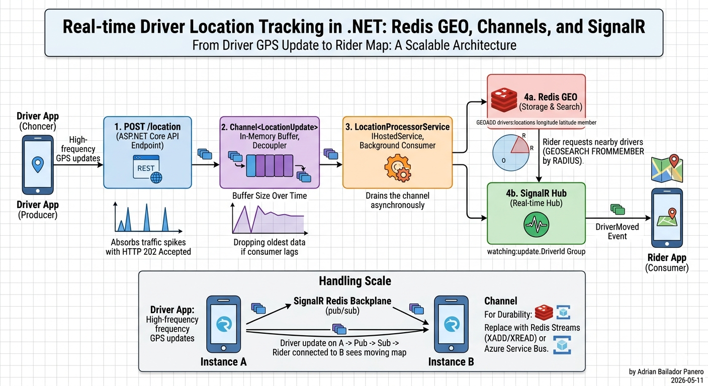

Every four seconds, every active Uber driver sends their GPS coordinates to a server.

At peak, that's roughly 5 million updates per minute — before you even count the riders watching their driver move on a map in real time. The location pipeline is the heartbeat of the entire platform. If it slows down, drivers and riders fall out of sync. If it falls over, the app is effectively useless.

Building something like this in .NET is a good exercise in knowing when *not* to reach for a database. Location data is high-frequency, short-lived, and geospatial. A relational database would collapse under the write load. What you need is Redis.

This is the first article in a mini-series on designing an Uber-like system in .NET. Here we build the location tracking pipeline. In the next two articles we'll cover the trip state machine and the full system design.

## The Problem in Concrete Terms

Before writing any code, it helps to make the numbers real:

- **5 million active drivers** at peak, each sending a GPS update every 4 seconds
- **~1.25 million writes per second** at the Redis layer
- **Riders** watching a moving dot on a map — updates should feel instant (under 1 second latency)
- **Driver matching** — when a rider requests a trip, the system needs to find available drivers within a radius in milliseconds

A naive implementation stores each update in a SQL table. After two minutes of load it becomes a 150-million-row table with a write queue backed up to the horizon. That's not the bottleneck you want to debug at 11pm.

The architecture we'll build instead:




## Step 1: Modelling the Location Update

Keep it simple. A location update is a thin message:

```csharp
public record LocationUpdate(
    string DriverId,
    double Latitude,
    double Longitude,
    DateTimeOffset Timestamp);
```

The driver sends this every four seconds. We don't store history here — that's a separate concern for analytics. What we store is *current position*.

## Step 2: The Channel Buffer

The first thing the incoming request touches is not Redis. It's a `Channel<LocationUpdate>`.

`Channel<T>` is the .NET way to decouple producers from consumers without introducing a message broker. The driver endpoint writes to the channel and returns `202 Accepted` immediately — no waiting for Redis, no back-pressure on the HTTP layer. The consumer drains the channel asynchronously.

```csharp
// Register a bounded channel — reject or block if the consumer falls behind
builder.Services.AddSingleton(_ =>
    Channel.CreateBounded<LocationUpdate>(new BoundedChannelOptions(10_000)
    {
        FullMode = BoundedChannelFullMode.DropOldest,
        SingleWriter = false,
        SingleReader = true
    }));
```

`DropOldest` is intentional: if the consumer is overwhelmed, the oldest unprocessed updates are the least valuable anyway. A slightly stale position is better than a backed-up queue.

The endpoint:

```csharp
app.MapPost("/drivers/{driverId}/location", async (
    string driverId,
    LocationUpdateRequest request,
    ChannelWriter<LocationUpdate> writer,
    CancellationToken ct) =>
{
    var update = new LocationUpdate(driverId, request.Latitude, request.Longitude, DateTimeOffset.UtcNow);

    // Non-blocking write — if channel is full, DropOldest handles it
    writer.TryWrite(update);

    return Results.Accepted();
});

public record LocationUpdateRequest(double Latitude, double Longitude);
```

`TryWrite` never blocks. The driver client gets a `202` in microseconds regardless of what Redis is doing.

## Step 3: Redis GEO

Redis has a native geospatial data type backed by sorted sets. The key commands:

- `GEOADD key longitude latitude member` — store or update a position
- `GEOSEARCH key FROMMEMBER member BYRADIUS radius unit` — find all members within a radius
- `GEOPOS key member` — get the current position of a member

In StackExchange.Redis:

```csharp
public class RedisLocationStore
{
    private readonly IDatabase _db;
    private const string DriversKey = "drivers:locations";

    public RedisLocationStore(IConnectionMultiplexer redis)
    {
        _db = redis.GetDatabase();
    }

    public async Task UpdateAsync(LocationUpdate update)
    {
        await _db.GeoAddAsync(DriversKey, new GeoEntry(
            longitude: update.Longitude,
            latitude: update.Latitude,
            member: update.DriverId));
    }

    public async Task<IEnumerable<NearbyDriver>> FindNearbyAsync(
        double latitude,
        double longitude,
        double radiusKm)
    {
        var results = await _db.GeoSearchAsync(
            DriversKey,
            longitude, latitude,
            radiusKm, GeoUnit.Kilometers,
            order: Order.Ascending,
            options: GeoRadiusOptions.WithDistance | GeoRadiusOptions.WithCoordinates);

        return results.Select(r => new NearbyDriver(
            DriverId: r.Member.ToString(),
            DistanceKm: r.Distance ?? 0,
            Latitude: r.Position?.Latitude ?? 0,
            Longitude: r.Position?.Longitude ?? 0));
    }
}

public record NearbyDriver(string DriverId, double DistanceKm, double Latitude, double Longitude);
```

`GEOSEARCH` returns drivers sorted by distance and is fast enough to query on every rider request — it runs in O(N+log(M)) where N is the result set size, not the total driver count.

One important note: Redis GEO stores positions as compressed floats, so there's a small precision loss (~0.6mm error). For navigation that's irrelevant. What matters is that a `GEOSEARCH` returning the 10 nearest drivers within 5km finishes in under a millisecond even with millions of stored positions.

## Step 4: The Background Processor

The `IHostedService` that drains the channel and writes to Redis:

```csharp
public class LocationProcessorService : BackgroundService
{
    private readonly ChannelReader<LocationUpdate> _reader;
    private readonly RedisLocationStore _store;
    private readonly IHubContext<DriverLocationHub> _hub;
    private readonly ILogger<LocationProcessorService> _logger;

    public LocationProcessorService(
        ChannelReader<LocationUpdate> reader,
        RedisLocationStore store,
        IHubContext<DriverLocationHub> hub,
        ILogger<LocationProcessorService> logger)
    {
        _reader = reader;
        _store = store;
        _hub = hub;
        _logger = logger;
    }

    protected override async Task ExecuteAsync(CancellationToken stoppingToken)
    {
        await foreach (var update in _reader.ReadAllAsync(stoppingToken))
        {
            try
            {
                // 1. Persist to Redis GEO
                await _store.UpdateAsync(update);

                // 2. Push to the rider watching this driver (if any)
                await _hub.Clients
                    .Group($"watching:{update.DriverId}")
                    .SendAsync("DriverMoved", new
                    {
                        update.DriverId,
                        update.Latitude,
                        update.Longitude,
                        update.Timestamp
                    }, stoppingToken);
            }
            catch (Exception ex)
            {
                _logger.LogError(ex, "Failed processing location update for driver {DriverId}", update.DriverId);
            }
        }
    }
}
```

`ReadAllAsync` is the idiomatic way to drain a channel in a hosted service — it blocks efficiently until an item is available and respects cancellation automatically when the app shuts down.

The two operations inside the loop (Redis write + SignalR push) are independent. If the SignalR push fails, the Redis position is already updated — the rider UI recovers on the next update. If Redis fails, we log and continue — a single lost update is invisible to the user.

## Step 5: SignalR Hub

The rider opens a WebSocket connection when they're watching a trip. They join a group named after the driver they're tracking:

```csharp
public class DriverLocationHub : Hub
{
    public async Task WatchDriver(string driverId)
    {
        // Leave any previous group first
        var previousDriver = Context.Items["watchingDriver"] as string;
        if (previousDriver is not null)
            await Groups.RemoveFromGroupAsync(Context.ConnectionId, $"watching:{previousDriver}");

        await Groups.AddToGroupAsync(Context.ConnectionId, $"watching:{driverId}");
        Context.Items["watchingDriver"] = driverId;
    }

    public async Task StopWatching()
    {
        var driverId = Context.Items["watchingDriver"] as string;
        if (driverId is not null)
            await Groups.RemoveFromGroupAsync(Context.ConnectionId, $"watching:{driverId}");
    }
}
```

On the client side (minimal TypeScript):

```typescript
const connection = new signalR.HubConnectionBuilder()
    .withUrl("/hubs/driver-location")
    .withAutomaticReconnect()
    .build();

connection.on("DriverMoved", (data) => {
    updateDriverMarker(data.driverId, data.latitude, data.longitude);
});

await connection.start();
await connection.invoke("WatchDriver", driverId);
```

The `withAutomaticReconnect()` is critical: mobile connections drop constantly. Without it, a brief network hiccup leaves the rider with a frozen map and no indication anything is wrong.

## Step 6: Wiring It Up

```csharp
var builder = WebApplication.CreateBuilder(args);

// Redis
var redis = ConnectionMultiplexer.Connect(builder.Configuration["Redis:ConnectionString"]!);
builder.Services.AddSingleton<IConnectionMultiplexer>(redis);
builder.Services.AddSingleton<RedisLocationStore>();

// Channel
builder.Services.AddSingleton(_ =>
    Channel.CreateBounded<LocationUpdate>(new BoundedChannelOptions(10_000)
    {
        FullMode = BoundedChannelFullMode.DropOldest,
        SingleWriter = false,
        SingleReader = true
    }));
builder.Services.AddSingleton(sp => sp.GetRequiredService<Channel<LocationUpdate>>().Writer);
builder.Services.AddSingleton(sp => sp.GetRequiredService<Channel<LocationUpdate>>().Reader);

// SignalR
builder.Services.AddSignalR();

// Background processor
builder.Services.AddHostedService<LocationProcessorService>();

var app = builder.Build();

app.MapPost("/drivers/{driverId}/location", async (
    string driverId,
    LocationUpdateRequest request,
    ChannelWriter<LocationUpdate> writer) =>
{
    writer.TryWrite(new LocationUpdate(driverId, request.Latitude, request.Longitude, DateTimeOffset.UtcNow));
    return Results.Accepted();
});

app.MapHub<DriverLocationHub>("/hubs/driver-location");

app.MapGet("/drivers/nearby", async (
    double lat, double lon, double radius,
    RedisLocationStore store) =>
{
    var drivers = await store.FindNearbyAsync(lat, lon, radius);
    return Results.Ok(drivers);
});

app.Run();
```

## Handling Scale

The single-instance version above works fine up to a few thousand concurrent drivers. When you need to scale horizontally, two things change:

**SignalR backplane.** By default SignalR only pushes to connections on the same server instance. With multiple instances, a driver update arriving at instance A won't reach a rider connected to instance B. The fix is a Redis backplane:

```csharp
builder.Services.AddSignalR()
    .AddStackExchangeRedis(builder.Configuration["Redis:ConnectionString"]!);
```

One line, and SignalR uses Redis pub/sub to fan out messages across all instances.

**Channel becomes per-instance.** `Channel<T>` is in-memory — it doesn't survive restarts and doesn't span instances. For durability under restarts, replace the channel with Azure Service Bus or a Redis Stream. For most use cases the in-memory channel is fine: a few seconds of location updates lost during a deployment is not a user-visible problem.

```csharp
// Redis Streams alternative — survives restarts, supports consumer groups
await _db.StreamAddAsync("driver:location:stream",
    new NameValueEntry[]
    {
        new("driverId", update.DriverId),
        new("lat", update.Latitude.ToString()),
        new("lon", update.Longitude.ToString()),
        new("ts", update.Timestamp.ToUnixTimeMilliseconds().ToString())
    });
```

## What Uber Actually Does

Uber's real architecture is more complex — they use a custom geospatial sharding system called H3 (hexagonal hierarchical geospatial indexing), partition driver updates by city and region, and process location data through a streaming pipeline (Apache Kafka → Flink). Their dispatch system is a separate service with its own matching algorithm.

What we've built captures the essential shape: a fast write path that doesn't block on persistence, a Redis geospatial index that answers "who's nearby?" in milliseconds, and a WebSocket channel that keeps the rider map live.

The differences are scale and operational complexity, not architectural direction. The building blocks are the same.

## Common Mistakes

### Mistake 1: Writing location directly to SQL

```csharp
// ❌ Every GPS update hits the database
await _dbContext.DriverLocations.AddAsync(new DriverLocation
{
    DriverId = update.DriverId,
    Latitude = update.Latitude,
    Longitude = update.Longitude,
    Timestamp = update.Timestamp
});
await _dbContext.SaveChangesAsync();
```

This works in development and collapses in production. Location is ephemeral data — you only need the current position, not every position. If you need history for analytics, write to a time-series store or an append-only stream asynchronously, not inline in the request path.

### Mistake 2: Blocking the HTTP thread on Redis

```csharp
// ❌ Driver request blocks until Redis confirms the write
await _redis.GeoAddAsync(DriversKey, new GeoEntry(lon, lat, driverId));
return Results.Ok();
```

Redis is fast, but adding network I/O to every driver request serialises your throughput. The Channel pattern decouples the HTTP response time from the Redis write time — the driver gets `202` in microseconds and Redis catches up asynchronously.

### Mistake 3: One SignalR group per trip instead of per driver

```csharp
// ❌ Naming the group after the trip
await Groups.AddToGroupAsync(connectionId, $"trip:{tripId}");
```

Trip IDs change across retries and reassignments. Driver IDs don't. Name the group after the driver and the rider joins/leaves as the assignment changes.

### Mistake 4: Forgetting the backplane when scaling SignalR

```csharp
// ❌ Multiple instances, no backplane
// Driver updates arrive at instance A, rider is connected to instance B
// → rider map freezes
builder.Services.AddSignalR(); // missing .AddStackExchangeRedis(...)
```

This is the most common production bug in SignalR deployments. Everything works on a single instance in development and silently breaks when you scale to two.

## Conclusion

The location tracking pipeline is a good example of matching the data store to the access pattern. GPS updates are high-frequency, short-lived, and geospatial — Redis GEO handles all three properties natively. The Channel buffer absorbs spikes without back-pressuring the HTTP layer. SignalR delivers the update to the right rider in real time.

None of this required a heavy framework or a distributed systems PhD. It's a bounded channel, a Redis sorted set, and a WebSocket group — standard .NET primitives composed to handle a genuinely hard scale problem.

In the next article we'll build the trip state machine: how a ride moves from `Requested` to `Completed`, how to handle concurrent state transitions, and how to persist the lifecycle with EF Core.

---

*Part 1 of the [Uber-like System Design in .NET](#) series.*

*Full source code: [github.com/AdrianBailador/realtime-driver-location-dotnet](https://github.com/AdrianBailador/realtime-driver-location-dotnet)*

*Questions or suggestions? Open an issue on [GitHub](https://github.com/AdrianBailador/realtime-driver-location-dotnet/issues).*
