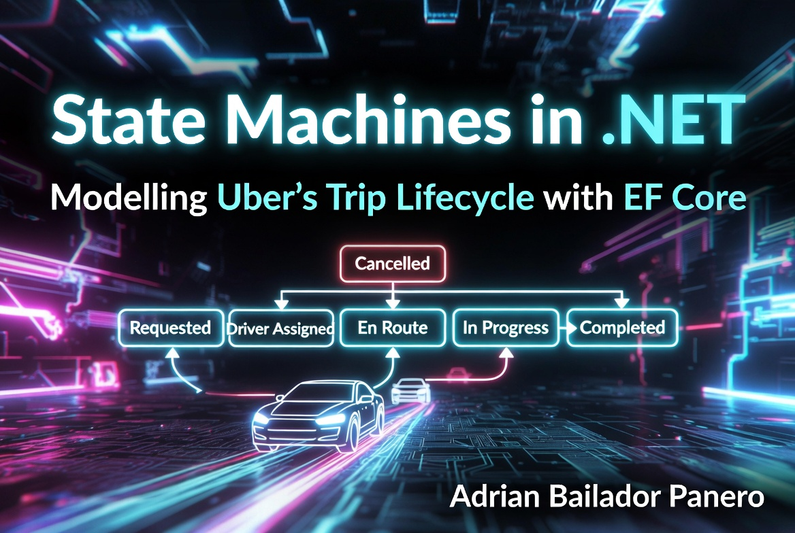
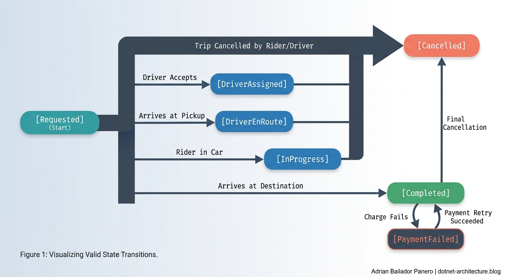

A rider opens the app and requests a trip. A driver accepts. The driver is already moving toward the pickup when a bug in the assignment service fires a second time — and assigns a different driver to the same trip.

Now two drivers are heading to the same address, both thinking they have a fare. One of them will arrive, wait, and leave confused. The other will complete the trip. Depending on which one gets marked as completed first, the rider might be charged twice — or not at all.

This is what happens when you store trip data as a plain row in a database without enforcing valid state transitions. It's not a theoretical problem. It's the kind of bug that appears in production at 2am on a Friday, after months of working fine in development.

State machines solve this. Not because they're elegant (though they are) — because they make illegal transitions impossible, not just unlikely.

This is Part 2 of the Uber-like System Design in .NET series. In [Part 1](/blog/58-realtime-driver-location-dotnet) we built the real-time location pipeline. Here we model the trip lifecycle: the states, the transitions, the persistence, and the race conditions.

## The Trip Lifecycle

A trip moves through a defined sequence of states. Each state has a limited set of valid transitions — and any other transition is a bug.



The transitions that matter most are the ones that *aren't* allowed. A trip cannot go from `Completed` back to `InProgress`. A `Cancelled` trip cannot be assigned a driver. A payment cannot fire on a `Requested` trip. These aren't edge cases — they're the boundaries that define what a trip *is*.

## Step 1: Modelling the States

Start with an enum that expresses the full lifecycle:

```csharp
public enum TripStatus
{
    Requested,
    DriverAssigned,
    DriverEnRoute,
    InProgress,
    Completed,
    Cancelled,
    PaymentFailed
}
```

And a record for the transitions you want to raise as domain events:

```csharp
public abstract record TripEvent
{
    public Guid TripId { get; init; }
    public DateTimeOffset OccurredAt { get; init; } = DateTimeOffset.UtcNow;
}

public record DriverAssigned(Guid TripId, string DriverId) : TripEvent;
public record TripStarted(Guid TripId) : TripEvent;
public record TripCompleted(Guid TripId, decimal FareAmount) : TripEvent;
public record TripCancelled(Guid TripId, string Reason, string CancelledBy) : TripEvent;
public record PaymentFailed(Guid TripId, string Reason) : TripEvent;
```

## Step 2: The Transition Rules

The state machine is just a set of rules: given the current state, which transitions are valid?

```csharp
public static class TripTransitions
{
    private static readonly Dictionary<TripStatus, HashSet<TripStatus>> _allowed = new()
    {
        [TripStatus.Requested]      = [TripStatus.DriverAssigned, TripStatus.Cancelled],
        [TripStatus.DriverAssigned] = [TripStatus.DriverEnRoute, TripStatus.Cancelled],
        [TripStatus.DriverEnRoute]  = [TripStatus.InProgress, TripStatus.Cancelled],
        [TripStatus.InProgress]     = [TripStatus.Completed, TripStatus.Cancelled],
        [TripStatus.Completed]      = [TripStatus.PaymentFailed],
        [TripStatus.PaymentFailed]  = [TripStatus.Completed, TripStatus.Cancelled],
        [TripStatus.Cancelled]      = [],
    };

    public static bool IsAllowed(TripStatus from, TripStatus to)
        => _allowed.TryGetValue(from, out var targets) && targets.Contains(to);

    public static void Validate(TripStatus from, TripStatus to)
    {
        if (!IsAllowed(from, to))
            throw new InvalidTripTransitionException(from, to);
    }
}

public class InvalidTripTransitionException : Exception
{
    public InvalidTripTransitionException(TripStatus from, TripStatus to)
        : base($"Cannot transition trip from {from} to {to}.") { }
}
```

This is the entire state machine. A dictionary. When you add a new state or a new transition, you change one line. When someone tries an illegal transition, they get an exception immediately — not a silent data corruption.

One design note: `Validate` throws an exception, which means under high concurrent load the stack trace generation has a small but measurable cost. If illegal transitions are genuinely *expected* at volume (e.g., a retry storm hitting an already-cancelled trip), consider replacing the exception with a `Result` type — the same pattern used in the service layer below. The `IsAllowed` method already exists for exactly that check without allocating an exception. For most systems the exception path is fine; for very high-throughput services it's worth considering.

## Step 3: The Trip Aggregate

The `Trip` class owns the state transitions and raises domain events. Nothing outside it can change its status directly. The `private set` on every property isn't just about encapsulation — it's a guarantee of invariant consistency. `DriverId` is only ever set during `AssignDriver`, `FareAmount` only during `Complete`, `CompletedAt` only when the trip actually finishes. There is no way to create a `Trip` in a state where `Status` is `Completed` but `FareAmount` is null, or `DriverId` is set on a `Cancelled` trip. The class makes those combinations structurally impossible:

```csharp
public class Trip
{
    public Guid Id { get; private set; }
    public string RiderId { get; private set; }
    public string? DriverId { get; private set; }
    public TripStatus Status { get; private set; }
    public decimal? FareAmount { get; private set; }
    public DateTimeOffset RequestedAt { get; private set; }
    public DateTimeOffset? CompletedAt { get; private set; }
    public byte[] RowVersion { get; private set; } = [];

    private readonly List<TripEvent> _events = [];
    public IReadOnlyList<TripEvent> Events => _events.AsReadOnly();

    private Trip() { }

    public static Trip Create(Guid riderId)
    {
        return new Trip
        {
            Id = Guid.NewGuid(),
            RiderId = riderId.ToString(),
            Status = TripStatus.Requested,
            RequestedAt = DateTimeOffset.UtcNow
        };
    }

    public void AssignDriver(string driverId)
    {
        TripTransitions.Validate(Status, TripStatus.DriverAssigned);
        DriverId = driverId;
        Status = TripStatus.DriverAssigned;
        _events.Add(new DriverAssigned(Id, driverId));
    }

    public void DriverEnRoute()
    {
        TripTransitions.Validate(Status, TripStatus.DriverEnRoute);
        Status = TripStatus.DriverEnRoute;
    }

    public void Start()
    {
        TripTransitions.Validate(Status, TripStatus.InProgress);
        Status = TripStatus.InProgress;
        _events.Add(new TripStarted(Id));
    }

    public void Complete(decimal fareAmount)
    {
        TripTransitions.Validate(Status, TripStatus.Completed);
        Status = TripStatus.Completed;
        FareAmount = fareAmount;
        CompletedAt = DateTimeOffset.UtcNow;
        _events.Add(new TripCompleted(Id, fareAmount));
    }

    public void FailPayment(string reason)
    {
        TripTransitions.Validate(Status, TripStatus.PaymentFailed);
        Status = TripStatus.PaymentFailed;
        _events.Add(new PaymentFailed(Id, reason));
    }

    public void Cancel(string reason, string cancelledBy)
    {
        TripTransitions.Validate(Status, TripStatus.Cancelled);
        Status = TripStatus.Cancelled;
        _events.Add(new TripCancelled(Id, reason, cancelledBy));
    }
}
```

The `RowVersion` property is not just metadata — it's the key to preventing the race condition we opened with. We'll use it in a moment.

## Step 4: Persisting State with EF Core

The trip needs a table. The `RowVersion` column is what makes concurrent updates safe:

```csharp
public class TripConfiguration : IEntityTypeConfiguration<Trip>
{
    public void Configure(EntityTypeBuilder<Trip> builder)
    {
        builder.HasKey(t => t.Id);

        builder.Property(t => t.Status)
            .HasConversion<string>();

        builder.Property(t => t.RowVersion)
            .IsRowVersion();

        builder.Property(t => t.RiderId).IsRequired();
        builder.Property(t => t.FareAmount).HasColumnType("decimal(10,2)");
    }
}
```

`IsRowVersion()` tells EF Core to include this column in every `UPDATE` statement's `WHERE` clause. SQL Server uses `rowversion`; PostgreSQL uses `xmin`. Either way, if the row has been modified since you read it, the update will affect 0 rows and EF Core throws `DbUpdateConcurrencyException`.

For the domain events, add a separate table that acts as an audit trail:

```csharp
public class TripEventLog
{
    public long Id { get; set; }
    public Guid TripId { get; set; }
    public string EventType { get; set; } = string.Empty;
    public string Payload { get; set; } = string.Empty;
    public DateTimeOffset OccurredAt { get; set; }
}
```

## Step 5: Handling the Race Condition

This is where most implementations fall apart. Two requests arrive at the same millisecond — one from the rider cancelling, one from the assignment service assigning a driver. Both read the trip as `Requested`. Both attempt a transition. Without protection, both succeed, leaving the trip in an undefined state.

The service that assigns a driver:

```csharp
public class TripService
{
    private readonly AppDbContext _db;
    private readonly IEventBus _events;

    public TripService(AppDbContext db, IEventBus events)
    {
        _db = db;
        _events = events;
    }

    public async Task<Result> AssignDriverAsync(
        Guid tripId,
        string driverId,
        CancellationToken ct = default)
    {
        const int maxRetries = 3;

        for (var attempt = 0; attempt < maxRetries; attempt++)
        {
            var trip = await _db.Trips.FindAsync([tripId], ct);

            if (trip is null)
                return Result.Fail("Trip not found.");

            if (trip.Status == TripStatus.Cancelled)
                return Result.Fail("Trip was already cancelled.");

            try
            {
                trip.AssignDriver(driverId);
                await _db.SaveChangesAsync(ct);

                // Publish domain events after successful save
                foreach (var evt in trip.Events)
                    await _events.PublishAsync(evt, ct);

                return Result.Ok();
            }
            catch (InvalidTripTransitionException ex)
            {
                return Result.Fail(ex.Message);
            }
            catch (DbUpdateConcurrencyException)
            {
                // Another process modified this trip between our read and write.
                // Refresh and retry — the state we read is stale.
                if (attempt == maxRetries - 1)
                    return Result.Fail("Trip is being modified concurrently. Please retry.");

                await Task.Delay(TimeSpan.FromMilliseconds(50 * (attempt + 1)), ct);
            }
        }

        return Result.Fail("Failed to assign driver after retries.");
    }
}
```

The retry loop is important. `DbUpdateConcurrencyException` means *someone else got there first* — the trip was modified between when we read it and when we tried to write it. We don't give up: we reload the current state and retry, up to three times. If the trip was cancelled while we were retrying, the `InvalidTripTransitionException` will stop us cleanly.

This pattern — read, modify, save, catch concurrency exception, retry — is optimistic concurrency. It assumes conflicts are rare and handles them when they happen, rather than locking the row for the duration of the operation.

## Step 6: Domain Events Driving Side Effects

When a trip completes, several things need to happen: charge the payment method, send the receipt, update the driver's stats, release the driver back to the available pool. None of these belong in `TripService`. They're separate concerns, triggered by the `TripCompleted` event.

```csharp
public class TripCompletedHandler
{
    private readonly IPaymentService _payments;
    private readonly INotificationService _notifications;
    private readonly IDriverAvailabilityService _availability;

    public async Task HandleAsync(TripCompleted evt, CancellationToken ct = default)
    {
        // Each of these is independent — one failure shouldn't block the others
        var paymentResult = await _payments.ChargeAsync(evt.TripId, evt.FareAmount, ct);

        if (!paymentResult.Success)
        {
            // Publish PaymentFailed — TripService will handle the state transition
            await PublishPaymentFailedAsync(evt.TripId, paymentResult.Error, ct);
            return;
        }

        await Task.WhenAll(
            _notifications.SendReceiptAsync(evt.TripId, evt.FareAmount, ct),
            _availability.ReleaseDriverAsync(evt.TripId, ct));
    }
}
```

The `TripCompletedHandler` doesn't know how trips work. It knows what to do when one completes. This separation means you can add a new reaction to `TripCompleted` — a loyalty points award, a surge pricing adjustment, a data pipeline event — without touching any trip logic.

**The gap you should know about.** Dispatching events after `SaveChangesAsync` is the right order — you never want to publish an event for a write that didn't commit. But it leaves a window: if the process crashes after the database write succeeds but before `IEventBus.PublishAsync` completes, the trip is `Completed` in the database and the payment event was never dispatched. The rider won't be charged.

For 100% reliability, use the **Outbox Pattern**: instead of publishing to the event bus directly, save the event payload to an `OutboxMessages` table *in the same database transaction as the state change*. A background worker then reads and dispatches those events, marking each as processed. If the process crashes mid-dispatch, the worker retries. The event is never lost because it was committed atomically with the state.

The implementation in this article is correct for most systems. If missed payments or missed notifications are genuinely unacceptable, the Outbox Pattern is the next step.

## Step 7: Handling Timeouts

A `Requested` trip that doesn't get a driver within 60 seconds should be automatically cancelled. This is a background concern, not part of the trip's own logic:

```csharp
public class TripTimeoutService : BackgroundService
{
    private readonly IServiceScopeFactory _scopeFactory;
    private readonly ILogger<TripTimeoutService> _logger;
    private static readonly TimeSpan CheckInterval = TimeSpan.FromSeconds(15);
    private static readonly TimeSpan RequestTimeout = TimeSpan.FromSeconds(60);

    protected override async Task ExecuteAsync(CancellationToken stoppingToken)
    {
        using var timer = new PeriodicTimer(CheckInterval);

        while (await timer.WaitForNextTickAsync(stoppingToken))
        {
            using var scope = _scopeFactory.CreateScope();
            var db = scope.ServiceProvider.GetRequiredService<AppDbContext>();
            var events = scope.ServiceProvider.GetRequiredService<IEventBus>();

            var cutoff = DateTimeOffset.UtcNow - RequestTimeout;

            var timedOut = await db.Trips
                .Where(t => t.Status == TripStatus.Requested && t.RequestedAt < cutoff)
                .ToListAsync(stoppingToken);

            foreach (var trip in timedOut)
            {
                try
                {
                    trip.Cancel("No driver found within timeout.", "system");
                    await db.SaveChangesAsync(stoppingToken);

                    foreach (var evt in trip.Events)
                        await events.PublishAsync(evt, stoppingToken);
                }
                catch (DbUpdateConcurrencyException)
                {
                    // A driver was assigned at the same moment we tried to cancel.
                    // The driver won — that's the right outcome. Skip.
                    _logger.LogInformation("Trip {TripId} was assigned during timeout window, skipping cancel.", trip.Id);
                }
                catch (InvalidTripTransitionException)
                {
                    // Trip was already transitioned by another process. Skip.
                }
            }
        }
    }
}
```

Note how `DbUpdateConcurrencyException` here is not an error — it means the trip was assigned just as we were about to cancel it. The driver won the race. That's exactly the right outcome, and we log it and move on.

## Step 8: Wiring It Up

```csharp
var builder = WebApplication.CreateBuilder(args);

builder.Services.AddDbContext<AppDbContext>(options =>
    options.UseNpgsql(builder.Configuration.GetConnectionString("Postgres")));

builder.Services.AddScoped<TripService>();
builder.Services.AddHostedService<TripTimeoutService>();

var app = builder.Build();

// Request a trip
app.MapPost("/trips", async (
    RequestTripDto request,
    TripService service,
    AppDbContext db,
    CancellationToken ct) =>
{
    var trip = Trip.Create(request.RiderId);
    db.Trips.Add(trip);
    await db.SaveChangesAsync(ct);
    return Results.Created($"/trips/{trip.Id}", new { tripId = trip.Id });
});

// Assign a driver
app.MapPost("/trips/{tripId:guid}/assign", async (
    Guid tripId,
    AssignDriverDto request,
    TripService service,
    CancellationToken ct) =>
{
    var result = await service.AssignDriverAsync(tripId, request.DriverId, ct);
    return result.Success ? Results.Ok() : Results.Conflict(new { error = result.Error });
});

// Start the trip
app.MapPost("/trips/{tripId:guid}/start", async (
    Guid tripId,
    AppDbContext db,
    IEventBus events,
    CancellationToken ct) =>
{
    var trip = await db.Trips.FindAsync([tripId], ct);
    if (trip is null) return Results.NotFound();

    try
    {
        trip.Start();
        await db.SaveChangesAsync(ct);
        foreach (var evt in trip.Events)
            await events.PublishAsync(evt, ct);
        return Results.Ok();
    }
    catch (InvalidTripTransitionException ex)
    {
        return Results.Conflict(new { error = ex.Message });
    }
});

// Complete the trip
app.MapPost("/trips/{tripId:guid}/complete", async (
    Guid tripId,
    CompleteTripDto request,
    AppDbContext db,
    IEventBus events,
    CancellationToken ct) =>
{
    var trip = await db.Trips.FindAsync([tripId], ct);
    if (trip is null) return Results.NotFound();

    try
    {
        trip.Complete(request.FareAmount);
        await db.SaveChangesAsync(ct);
        foreach (var evt in trip.Events)
            await events.PublishAsync(evt, ct);
        return Results.Ok();
    }
    catch (InvalidTripTransitionException ex)
    {
        return Results.Conflict(new { error = ex.Message });
    }
});

app.Run();
```

## What Uber Actually Does

Uber's trip state machine is significantly more complex. They have intermediate states for driver arrival confirmation, route deviation handling, stop requests, and partial ride cancellations. Their concurrency is handled not with database row versions but with distributed locks and event sourcing — every state change is an immutable event appended to a stream, and the current state is derived by replaying those events.

Their timeout system is part of a broader orchestration layer (they've written publicly about using Cadence/Temporal for this) that handles retries, compensating transactions, and saga-style distributed coordination.

What we've built is the correct structural shape: explicit states, validated transitions, optimistic concurrency, domain events as the integration mechanism. At Uber's scale, the same concepts apply with more moving parts and higher fault-tolerance requirements.

## Common Mistakes

### Mistake 1: Status as a raw string with no transition enforcement

```csharp
// ❌ Nothing prevents any value being set
public class Trip
{
    public string Status { get; set; } = "Requested";
}

// Anywhere in the codebase...
trip.Status = "Completed"; // No validation. No events. Silent corruption.
```

If the status field is publicly settable, you don't have a state machine — you have a string column. Any code anywhere can put the trip into any state, bypassing every rule you thought you had.

### Mistake 2: Checking status in the service instead of the aggregate

```csharp
// ❌ Business rule leaking out of the domain
public async Task AssignDriverAsync(Guid tripId, string driverId)
{
    var trip = await _db.Trips.FindAsync(tripId);

    if (trip.Status != "Requested") // magic string
        throw new Exception("Cannot assign driver");

    trip.DriverId = driverId;
    trip.Status = "DriverAssigned"; // still a raw string
}
```

When transition logic lives in the service, it will be duplicated. The second endpoint that assigns a driver will either copy the check or forget it. The aggregate owns the rules.

### Mistake 3: Dispatching events before SaveChangesAsync succeeds

```csharp
// ❌ Event published before state is confirmed committed
await _events.PublishAsync(new TripCompleted(trip.Id, fare));
await db.SaveChangesAsync(); // if this fails, the event is already out
```

If the database write fails, the event is already in the bus. A payment handler somewhere has received `TripCompleted` for a trip the database doesn't recognise as completed. The rider gets charged for a trip that didn't finish.

Always save state first, publish after. But be honest with yourself: dispatching after `SaveChangesAsync` still leaves a gap — if the process dies after the DB write but before the publish, the event is lost. That gap is acceptable in many systems. When it isn't — when a missed payment or a missed notification is genuinely unacceptable — the fix is the Outbox Pattern described in Step 6.

### Mistake 4: Ignoring DbUpdateConcurrencyException

```csharp
// ❌ The exception propagates as a 500 error
trip.AssignDriver(driverId);
await db.SaveChangesAsync(); // throws DbUpdateConcurrencyException under load
```

Under load, concurrent modifications are expected, not exceptional. Handle them explicitly: retry with fresh state, or return a meaningful conflict response to the caller.

### Mistake 5: No timeout for stuck trips

A trip stuck in `Requested` forever because no driver accepted is invisible without active monitoring. Add the background service. Add an alert if the timeout queue grows beyond a threshold.

## Conclusion

A trip's lifecycle is a contract. It makes promises: a `Completed` trip was once `InProgress`, a `Cancelled` trip will never become `Completed`, a driver will only be assigned once. Enforcing those promises at the code level — through the aggregate's transition rules, the RowVersion concurrency token, and domain events as the integration point — is what turns a status column into a proper state machine.

The race condition from the opening isn't patched by adding more checks. It's solved structurally: the database rejects the second write at the data layer, and the retry logic handles it gracefully. No locks. No distributed coordination. Just a `WHERE RowVersion = @expected` clause doing its job.

In the next article we'll bring everything together: the full Uber-like system design, combining the location pipeline from Part 1 and the trip lifecycle from this article into a complete architecture with driver matching, surge pricing, and the full request flow.

---

*Part 2 of the [Uber-like System Design in .NET](/series) series.*

*Full source code: [github.com/AdrianBailador/trip-state-machine-dotnet](https://github.com/AdrianBailador/trip-state-machine-dotnet)*

*Questions or suggestions? Open an issue on [GitHub](https://github.com/AdrianBailador/trip-state-machine-dotnet/issues).*
