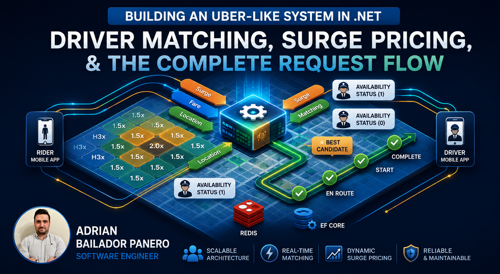
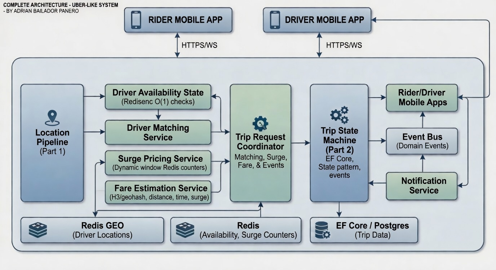

A rider opens the app and taps "Request". In the next two seconds, the system has to find which of the hundreds of nearby drivers to offer the trip to, calculate a price that reflects current demand, and send the offer — all before the rider's patience runs out.

Most of what makes that hard isn't the individual pieces. It's connecting them. The location pipeline doesn't know about trips. The trip state machine doesn't know about drivers. Surge pricing doesn't know about either. Making them work together, under load, without races or stale data — that's the engineering problem.

This is Part 3 of the Uber-like System Design in .NET series. In [Part 1](/blog/58-realtime-driver-location-dotnet) we built real-time location tracking with Redis GEO and SignalR. In [Part 2](/blog/59-trip-state-machine-dotnet) we modelled the trip lifecycle with state machines and EF Core. Here we build driver matching, surge pricing, and trace the full request flow end to end.

## The Full Architecture

Before the code, the picture:



The request flow at a high level:
1. Rider requests a trip → fare estimate with surge applied
2. System queries Redis GEO for nearby available drivers
3. Drivers are scored and ranked; top candidate receives the offer
4. Driver accepts → trip transitions through its state machine
5. Trip completes → payment fires, driver releases back to the pool

Each step is independent enough to test and deploy separately. The state machine from Part 2 is the spine — everything else connects to it through domain events or direct calls.

## Step 1: Driver Availability State

The location pipeline from Part 1 knows *where* drivers are. Driver matching needs to know *which* drivers are available. These are separate concerns that share Redis.

```csharp
public enum DriverStatus
{
    Offline,
    Available,
    OnTrip,
    Busy
}

public class DriverAvailabilityService
{
    private readonly IDatabase _redis;
    private const string StatusKeyPrefix = "driver:status:";
    private const string AvailableSet = "drivers:available";

    public DriverAvailabilityService(IConnectionMultiplexer redis)
        => _redis = redis.GetDatabase();

    public async Task SetAvailableAsync(string driverId)
    {
        await _redis.StringSetAsync($"{StatusKeyPrefix}{driverId}", "Available");
        await _redis.SetAddAsync(AvailableSet, driverId);
    }

    public async Task SetOnTripAsync(string driverId)
    {
        await _redis.StringSetAsync($"{StatusKeyPrefix}{driverId}", "OnTrip");
        await _redis.SetRemoveAsync(AvailableSet, driverId);
    }

    public async Task SetOfflineAsync(string driverId)
    {
        await _redis.StringSetAsync($"{StatusKeyPrefix}{driverId}", "Offline");
        await _redis.SetRemoveAsync(AvailableSet, driverId);
    }

    public async Task<bool> IsAvailableAsync(string driverId)
    {
        var status = await _redis.StringGetAsync($"{StatusKeyPrefix}{driverId}");
        return status == "Available";
    }
}
```

`drivers:available` is a Redis Set of driver IDs. When a driver goes online, their ID is added; when they accept a trip or go offline, it's removed. The availability check is O(1). The set intersection with the GEO query result is the core of matching.

## Step 2: Finding Nearby Available Drivers

Redis GEO stores driver positions. `GEOSEARCH` returns drivers within a radius ordered by distance. The matching query intersects that result with the availability set:

```csharp
public class DriverMatchingService
{
    private readonly IDatabase _redis;
    private readonly DriverAvailabilityService _availability;
    private const string GeoKey = "drivers:geo";

    public DriverMatchingService(
        IConnectionMultiplexer redis,
        DriverAvailabilityService availability)
    {
        _redis = redis.GetDatabase();
        _availability = availability;
    }

    public async Task<IReadOnlyList<DriverCandidate>> FindNearbyAsync(
        double pickupLat,
        double pickupLon,
        double radiusKm,
        int maxResults = 10)
    {
        var geoResults = await _redis.GeoSearchAsync(
            GeoKey,
            new GeoSearchCircle(pickupLon, pickupLat, radiusKm, GeoUnit.Kilometers),
            order: Order.Ascending,
            count: maxResults * 3); // fetch more than needed to account for unavailable ones

        var candidates = new List<DriverCandidate>();

        foreach (var result in geoResults)
        {
            var driverId = result.Member.ToString();

            if (!await _availability.IsAvailableAsync(driverId))
                continue;

            candidates.Add(new DriverCandidate(
                DriverId: driverId,
                DistanceKm: result.Distance ?? double.MaxValue));

            if (candidates.Count >= maxResults)
                break;
        }

        return candidates;
    }
}

public record DriverCandidate(string DriverId, double DistanceKm);
```

Fetching `maxResults * 3` from Redis and filtering client-side avoids a round-trip per driver for the availability check. The trade-off: if most nearby drivers are unavailable (surge scenario), you might miss candidates at the edge of the radius. For a production system, you'd expand the search radius dynamically rather than fetching a fixed multiplier.

**Production note — back-off radius:** The `* 3` multiplier is fragile under peak demand. On a Friday night after a concert, 95% of nearby drivers may be `OnTrip`. Redis returns 30 results, all unavailable, and the method returns an empty list even though free drivers exist 6 km out. The production fix is an expanding search loop: if the first query returns fewer candidates than needed, widen the radius and query again — stopping when you have enough candidates or reach a maximum radius threshold.

## Step 3: Scoring and Ranking Drivers

Distance alone is a poor signal. A driver 500 metres away with a 3.2 rating is a worse match than a driver 800 metres away with a 4.8. The scoring function weights the factors that matter:

```csharp
public class DriverScoringService
{
    public IReadOnlyList<ScoredDriver> Rank(
        IReadOnlyList<DriverCandidate> candidates,
        IReadOnlyDictionary<string, DriverProfile> profiles)
    {
        return candidates
            .Where(c => profiles.ContainsKey(c.DriverId))
            .Select(c =>
            {
                var profile = profiles[c.DriverId];
                var score = CalculateScore(c.DistanceKm, profile);
                return new ScoredDriver(c.DriverId, c.DistanceKm, profile.Rating, score);
            })
            .OrderByDescending(d => d.Score)
            .ToList();
    }

    private static double CalculateScore(double distanceKm, DriverProfile profile)
    {
        // Distance: closer is better, capped at 5 km; diminishing penalty past that
        var distanceFactor = Math.Max(0, 1 - (distanceKm / 5.0));

        // Rating: normalised 0–1 from 1–5 scale
        var ratingFactor = (profile.Rating - 1.0) / 4.0;

        // Acceptance rate: drivers who decline frequently get penalised
        var acceptanceFactor = profile.AcceptanceRate;

        // Weighted sum — adjust weights per product requirements
        return (distanceFactor * 0.5) + (ratingFactor * 0.35) + (acceptanceFactor * 0.15);
    }
}

public record ScoredDriver(string DriverId, double DistanceKm, double Rating, double Score);

public record DriverProfile(string DriverId, double Rating, double AcceptanceRate);
```

The weights are tunable. In a real system they'd be configured per city and time of day. During morning commutes, distance weight goes up — riders want the fastest pickup. Late at night, rating weight goes up — safety matters more than speed.

## Step 4: Surge Pricing

Surge pricing is a supply/demand signal. When many riders are requesting and few drivers are available, the price rises to attract more drivers and reduce demand.

The simplest model uses a ratio:

```csharp
public class SurgePricingService
{
    private readonly IDatabase _redis;
    private const string DemandKeyPrefix = "surge:demand:";
    private const string SupplyKeyPrefix = "surge:supply:";
    private static readonly TimeSpan Window = TimeSpan.FromMinutes(5);

    public SurgePricingService(IConnectionMultiplexer redis)
        => _redis = redis.GetDatabase();

    public async Task RecordRequestAsync(string gridCell)
    {
        var key = $"{DemandKeyPrefix}{gridCell}";
        var pipe = _redis.CreateBatch();
        _ = pipe.StringIncrementAsync(key);
        _ = pipe.KeyExpireAsync(key, Window);
        pipe.Execute();
    }

    public async Task RecordDriverAvailableAsync(string gridCell)
    {
        var key = $"{SupplyKeyPrefix}{gridCell}";
        var pipe = _redis.CreateBatch();
        _ = pipe.StringIncrementAsync(key);
        _ = pipe.KeyExpireAsync(key, Window);
        pipe.Execute();
    }

    public async Task<decimal> GetSurgeMultiplierAsync(string gridCell)
    {
        var demandTask = _redis.StringGetAsync($"{DemandKeyPrefix}{gridCell}");
        var supplyTask = _redis.StringGetAsync($"{SupplyKeyPrefix}{gridCell}");

        await Task.WhenAll(demandTask, supplyTask);

        var demand = (double)(long)(demandTask.Result.IsNullOrEmpty ? 1 : demandTask.Result);
        var supply = (double)(long)(supplyTask.Result.IsNullOrEmpty ? 1 : supplyTask.Result);

        if (supply == 0) return 3.0m; // no drivers → maximum surge

        var ratio = demand / supply;

        return ratio switch
        {
            <= 1.0 => 1.0m,
            <= 1.5 => 1.2m,
            <= 2.0 => 1.5m,
            <= 3.0 => 2.0m,
            <= 4.0 => 2.5m,
            _ => 3.0m  // cap at 3x
        };
    }
}
```

`gridCell` is an H3 or geohash cell identifier — a string that encodes a geographic area. You derive it from the rider's pickup coordinates. All riders and drivers in the same cell share the same demand/supply counters.

The 5-minute rolling window keeps surge responsive. Counters expire naturally; there's no cleanup job needed. The cap at 3x is a business decision — uncapped surge generates bad press and rider churn faster than it attracts drivers.

## Step 5: Fare Estimation

Before confirming the request, the rider sees an estimated fare. The estimate uses the surge multiplier from Step 4 and a simple per-km/per-minute rate:

```csharp
public class FareEstimationService
{
    private const decimal BaseRate = 1.50m;
    private const decimal PerKm = 1.20m;
    private const decimal PerMinute = 0.20m;

    public async Task<FareEstimate> EstimateAsync(
        double pickupLat, double pickupLon,
        double dropoffLat, double dropoffLon,
        string gridCell,
        SurgePricingService surge)
    {
        var distanceKm = HaversineDistance(pickupLat, pickupLon, dropoffLat, dropoffLon);
        var estimatedMinutes = distanceKm / 0.5; // rough 30 km/h average
        var surgeMultiplier = await surge.GetSurgeMultiplierAsync(gridCell);

        var baseFare = BaseRate + (PerKm * (decimal)distanceKm) + (PerMinute * (decimal)estimatedMinutes);
        var totalFare = Math.Round(baseFare * surgeMultiplier, 2);

        return new FareEstimate(totalFare, surgeMultiplier, distanceKm);
    }

    private static double HaversineDistance(
        double lat1, double lon1, double lat2, double lon2)
    {
        const double R = 6371;
        var dLat = ToRad(lat2 - lat1);
        var dLon = ToRad(lon2 - lon1);
        var a = Math.Sin(dLat / 2) * Math.Sin(dLat / 2)
              + Math.Cos(ToRad(lat1)) * Math.Cos(ToRad(lat2))
              * Math.Sin(dLon / 2) * Math.Sin(dLon / 2);
        return R * 2 * Math.Atan2(Math.Sqrt(a), Math.Sqrt(1 - a));
    }

    private static double ToRad(double deg) => deg * Math.PI / 180;
}

public record FareEstimate(decimal Total, decimal SurgeMultiplier, double DistanceKm);
```

The estimate is a range, not a commitment. The actual fare is calculated on trip completion based on real distance and time. What matters at request time is that the rider understands they're in a surge zone.

## Step 6: The Trip Request Coordinator

This is where the pieces connect. The coordinator runs when a rider taps "Request". It's a service, not a controller — it orchestrates the other services and has no HTTP knowledge:

```csharp
public class TripRequestCoordinator
{
    private readonly AppDbContext _db;
    private readonly DriverMatchingService _matching;
    private readonly DriverAvailabilityService _availability;
    private readonly SurgePricingService _surge;
    private readonly FareEstimationService _fares;
    private readonly IEventBus _events;
    private readonly ILogger<TripRequestCoordinator> _logger;

    public TripRequestCoordinator(
        AppDbContext db,
        DriverMatchingService matching,
        DriverAvailabilityService availability,
        SurgePricingService surge,
        FareEstimationService fares,
        IEventBus events,
        ILogger<TripRequestCoordinator> logger)
    {
        _db = db;
        _matching = matching;
        _availability = availability;
        _surge = surge;
        _fares = fares;
        _events = events;
        _logger = logger;
    }

    public async Task<TripRequestResult> RequestTripAsync(
        RequestTripCommand command,
        CancellationToken ct = default)
    {
        var gridCell = GeohashEncoder.Encode(command.PickupLat, command.PickupLon, precision: 5);

        // Estimate fare with surge before creating the trip
        var fareEstimate = await _fares.EstimateAsync(
            command.PickupLat, command.PickupLon,
            command.DropoffLat, command.DropoffLon,
            gridCell, _surge);

        // Find available drivers
        var candidates = await _matching.FindNearbyAsync(
            command.PickupLat, command.PickupLon,
            radiusKm: 5);

        if (candidates.Count == 0)
        {
            _logger.LogInformation("No drivers available near {Lat},{Lon}", 
                command.PickupLat, command.PickupLon);
            return TripRequestResult.NoDriversAvailable(fareEstimate);
        }

        // Create the trip in Requested state
        var trip = Trip.Create(command.RiderId);
        _db.Trips.Add(trip);
        await _db.SaveChangesAsync(ct);

        // Record demand for surge calculation
        await _surge.RecordRequestAsync(gridCell);

        // Offer to the best candidate
        var best = candidates[0];
        await _events.PublishAsync(new DriverOfferSent(trip.Id, best.DriverId, fareEstimate), ct);

        return TripRequestResult.Offered(trip.Id, fareEstimate, best.DriverId);
    }
}

public record RequestTripCommand(
    Guid RiderId,
    double PickupLat, double PickupLon,
    double DropoffLat, double DropoffLon);

public abstract record TripRequestResult
{
    public static TripRequestResult Offered(Guid tripId, FareEstimate fare, string driverId)
        => new TripOffered(tripId, fare, driverId);

    public static TripRequestResult NoDriversAvailable(FareEstimate fare)
        => new NoDrivers(fare);
}

public record TripOffered(Guid TripId, FareEstimate FareEstimate, string DriverId) : TripRequestResult;
public record NoDrivers(FareEstimate FareEstimate) : TripRequestResult;
```

The coordinator doesn't call `AssignDriver` directly — it publishes a `DriverOfferSent` event. The driver receives a push notification, taps "Accept", and *that* triggers `AssignDriver` through the `TripService` from Part 2. This matters: the driver might decline, the offer might time out, or the driver might go offline before responding. The trip stays in `Requested` until the driver actively accepts.

## Step 7: The Driver Acceptance Flow

When the driver taps "Accept", we need to atomically check they're still available and assign the trip:

```csharp
public class DriverAcceptanceService
{
    private readonly TripService _trips;
    private readonly DriverAvailabilityService _availability;

    public DriverAcceptanceService(TripService trips, DriverAvailabilityService availability)
    {
        _trips = trips;
        _availability = availability;
    }

    public async Task<Result> AcceptTripAsync(
        Guid tripId,
        string driverId,
        CancellationToken ct = default)
    {
        // Check availability before committing to the assignment
        if (!await _availability.IsAvailableAsync(driverId))
            return Result.Fail("Driver is no longer available.");

        // AssignDriver handles the concurrency case: if two drivers
        // somehow both try to accept the same trip, the second will
        // get DbUpdateConcurrencyException and fail cleanly.
        var result = await _trips.AssignDriverAsync(tripId, driverId, ct);

        if (result.Success)
            await _availability.SetOnTripAsync(driverId);

        return result;
    }
}
```

The `TripService.AssignDriverAsync` from Part 2 uses optimistic concurrency. Even if two drivers somehow both tap "Accept" at the same millisecond, only one write succeeds. The second gets a `DbUpdateConcurrencyException`, retries, finds the trip is already `DriverAssigned`, and fails cleanly with a meaningful error.

## Step 8: The Complete Request Flow in Minimal API

Wiring the full flow into endpoints:

```csharp
var builder = WebApplication.CreateBuilder(args);

builder.Services.AddStackExchangeRedisCache(o =>
    o.Configuration = builder.Configuration["Redis:ConnectionString"]);
builder.Services.AddSingleton<IConnectionMultiplexer>(sp =>
    ConnectionMultiplexer.Connect(builder.Configuration["Redis:ConnectionString"]!));
builder.Services.AddDbContext<AppDbContext>(o =>
    o.UseNpgsql(builder.Configuration.GetConnectionString("Postgres")));

builder.Services.AddScoped<TripRequestCoordinator>();
builder.Services.AddScoped<TripService>();
builder.Services.AddScoped<DriverAcceptanceService>();
builder.Services.AddScoped<DriverAvailabilityService>();
builder.Services.AddScoped<DriverMatchingService>();
builder.Services.AddScoped<SurgePricingService>();
builder.Services.AddScoped<FareEstimationService>();
builder.Services.AddHostedService<TripTimeoutService>();

var app = builder.Build();

// 1. Rider requests a trip
app.MapPost("/trips/request", async (
    RequestTripCommand command,
    TripRequestCoordinator coordinator,
    CancellationToken ct) =>
{
    var result = await coordinator.RequestTripAsync(command, ct);

    return result switch
    {
        TripOffered offered => Results.Accepted($"/trips/{offered.TripId}", offered),
        NoDrivers noDrivers => Results.Ok(new { message = "No drivers nearby", fare = noDrivers.FareEstimate }),
        _ => Results.Problem("Unexpected state")
    };
});

// 2. Driver accepts the trip
app.MapPost("/trips/{tripId:guid}/accept", async (
    Guid tripId,
    AcceptTripDto dto,
    DriverAcceptanceService acceptance,
    CancellationToken ct) =>
{
    var result = await acceptance.AcceptTripAsync(tripId, dto.DriverId, ct);
    return result.Success ? Results.Ok() : Results.Conflict(new { error = result.Error });
});

// 3. Driver en route to pickup
app.MapPost("/trips/{tripId:guid}/en-route", async (
    Guid tripId,
    AppDbContext db,
    CancellationToken ct) =>
{
    var trip = await db.Trips.FindAsync([tripId], ct);
    if (trip is null) return Results.NotFound();
    try { trip.DriverEnRoute(); await db.SaveChangesAsync(ct); return Results.Ok(); }
    catch (InvalidTripTransitionException ex) { return Results.Conflict(new { error = ex.Message }); }
});

// 4. Trip starts (driver and rider both at pickup)
app.MapPost("/trips/{tripId:guid}/start", async (
    Guid tripId,
    AppDbContext db,
    IEventBus events,
    CancellationToken ct) =>
{
    var trip = await db.Trips.FindAsync([tripId], ct);
    if (trip is null) return Results.NotFound();
    try
    {
        trip.Start();
        await db.SaveChangesAsync(ct);
        foreach (var evt in trip.Events) await events.PublishAsync(evt, ct);
        return Results.Ok();
    }
    catch (InvalidTripTransitionException ex) { return Results.Conflict(new { error = ex.Message }); }
});

// 5. Trip completes
app.MapPost("/trips/{tripId:guid}/complete", async (
    Guid tripId,
    CompleteTripDto dto,
    AppDbContext db,
    IEventBus events,
    CancellationToken ct) =>
{
    var trip = await db.Trips.FindAsync([tripId], ct);
    if (trip is null) return Results.NotFound();
    try
    {
        trip.Complete(dto.FareAmount);
        await db.SaveChangesAsync(ct);
        foreach (var evt in trip.Events) await events.PublishAsync(evt, ct);
        // Driver release happens in the TripCompleted event handler — not inline.
        // This keeps cancels and completes consistent: both paths release the driver
        // through the same event subscriber, never through the API layer.
        return Results.Ok();
    }
    catch (InvalidTripTransitionException ex) { return Results.Conflict(new { error = ex.Message }); }
});

// 6. Get surge multiplier for an area (shown to rider before confirming)
app.MapGet("/surge", async (
    double lat,
    double lon,
    SurgePricingService surge) =>
{
    var gridCell = GeohashEncoder.Encode(lat, lon, precision: 5);
    var multiplier = await surge.GetSurgeMultiplierAsync(gridCell);
    return Results.Ok(new { multiplier });
});

// 7. Driver goes online
app.MapPost("/drivers/{driverId}/online", async (
    string driverId,
    DriverAvailabilityService availability,
    SurgePricingService surge,
    GoOnlineDto dto) =>
{
    await availability.SetAvailableAsync(driverId);
    var gridCell = GeohashEncoder.Encode(dto.Lat, dto.Lon, precision: 5);
    await surge.RecordDriverAvailableAsync(gridCell);
    return Results.Ok();
});

app.Run();
```

## Step 9: The Offer Timeout

When we send a `DriverOfferSent` event, the driver has a limited window to accept. If they don't respond, we need to offer the trip to the next candidate. This is the same background pattern as trip timeouts, but at the offer level:

```csharp
public class DriverOfferTimeoutService : BackgroundService
{
    private readonly IServiceScopeFactory _scopeFactory;
    private static readonly TimeSpan OfferTimeout = TimeSpan.FromSeconds(15);
    private static readonly TimeSpan CheckInterval = TimeSpan.FromSeconds(5);

    protected override async Task ExecuteAsync(CancellationToken stoppingToken)
    {
        using var timer = new PeriodicTimer(CheckInterval);

        while (await timer.WaitForNextTickAsync(stoppingToken))
        {
            using var scope = _scopeFactory.CreateScope();
            var db = scope.ServiceProvider.GetRequiredService<AppDbContext>();
            var matching = scope.ServiceProvider.GetRequiredService<DriverMatchingService>();
            var events = scope.ServiceProvider.GetRequiredService<IEventBus>();

            var cutoff = DateTimeOffset.UtcNow - OfferTimeout;

            // Find trips still Requested (offer not accepted) past the timeout
            var stalled = await db.Trips
                .Where(t => t.Status == TripStatus.Requested && t.RequestedAt < cutoff)
                .ToListAsync(stoppingToken);

            foreach (var trip in stalled)
            {
                // Re-run matching — the original candidate may have gone offline
                var nextCandidates = await matching.FindNearbyAsync(
                    trip.PickupLat, trip.PickupLon, radiusKm: 7); // slightly wider radius

                if (nextCandidates.Count == 0)
                {
                    // Cancel trip — no drivers available
                    try
                    {
                        trip.Cancel("No drivers available after timeout.", "system");
                        await db.SaveChangesAsync(stoppingToken);
                    }
                    catch (Exception) { /* Already transitioned */ }
                    continue;
                }

                var next = nextCandidates[0];
                await events.PublishAsync(new DriverOfferSent(trip.Id, next.DriverId, null), stoppingToken);
            }
        }
    }
}
```

Each retry widens the search radius slightly. After a configurable number of retries with no acceptance, the trip cancels. The `TripTimeoutService` from Part 2 acts as the final backstop if this service somehow misses a trip.

## What Uber Actually Does

The architecture here is the right shape, but Uber's implementation at scale differs in important ways.

**Driver matching** uses their own geospatial index, not stock Redis GEO. Redis GEO uses a geohash-based sorted set — fast, but the precision is fixed. Uber uses H3, Uber's own hexagonal geospatial indexing system, which allows dynamic resolution changes and makes aggregations (like surge pricing per cell) much cleaner.

**Offer dispatch** in this article publishes one offer at a time. Uber uses **parallel dispatch** — the trip is offered to several candidates simultaneously, and the first to accept wins. This significantly reduces the time-to-assignment at the cost of occasionally "wasting" an offer when multiple drivers accept and all but one have to be rejected.

**Surge pricing** in production is a learned model, not a ratio table. Demand predictions are based on historical patterns, current events, and weather. The surge multiplier is calculated at fine-grained H3 cells and interpolated at boundaries to avoid the "why is 10 metres away cheaper?" problem.

**Trip assignment** uses a saga pattern, not the direct state machine calls here. The assignment orchestrator in Cadence/Temporal handles driver acceptance, timeouts, fallback sequences, and cancellation compensation as a durable workflow — if the service restarts mid-assignment, the workflow resumes from where it left off.

None of that changes the concepts: find drivers, score them, present a price, enforce valid transitions, handle failure cases. The scale changes the implementation, not the model.

## Common Mistakes

### Mistake 1: Querying the database for driver locations

```csharp
// ❌ SQL can't do this efficiently at volume
var nearbyDrivers = await db.Drivers
    .Where(d => d.Status == "Available"
             && HaversineDistance(d.Lat, d.Lon, pickupLat, pickupLon) < 5)
    .ToListAsync();
```

PostGIS makes this feasible, but you're still doing a disk read for every request. At high volume, Redis GEO handles millions of position updates per second and returns nearby entries in single-digit milliseconds.

### Mistake 2: Surge pricing with a global counter

```csharp
// ❌ One counter for the whole city
await _redis.StringIncrementAsync("total:requests");
```

Surge pricing is hyper-local. A city-wide surplus of drivers doesn't help a rider in a neighbourhood where every driver is on a trip. Granular grid cells (geohash or H3) are the primitive, not city-level aggregates.

### Mistake 3: Assigning a driver without checking availability in the same operation

```csharp
// ❌ Gap between availability check and state change
if (await _availability.IsAvailableAsync(driverId))
{
    // Another request comes in here and assigns this driver elsewhere
    await _trips.AssignDriverAsync(tripId, driverId);
}
```

The optimistic concurrency on the trip assignment (Part 2) protects against two trips racing for one driver only if the `AssignDriver` call is atomic with the database write. The Redis availability check is a separate system — there's always a gap. Handle it: the `TripService` retry loop will surface the stale state and fail cleanly.

### Mistake 4: Not handling the "no drivers" case in the UI

The no-drivers scenario is not an error. It's an expected outcome that should show the rider a useful message, the current surge level, and an estimated wait time if they want to retry. Returning a `500` or leaving the rider on a spinner for 30 seconds is a product failure, not just a technical one.

### Mistake 5: Forgetting to release the driver on cancellation

```csharp
// ❌ Driver is stuck OnTrip in Redis even after cancel
trip.Cancel("Rider cancelled.", "rider");
await db.SaveChangesAsync(ct);
// Driver never goes back to Available
```

Every `Cancel` — whether by the rider, the system timeout, or payment failure — must release the driver back to `Available`. Wire it through the `TripCancelled` domain event handler, not inline, so it happens consistently regardless of which code path triggers the cancel.

## Conclusion

Three articles, three layers. The location pipeline in Part 1 knows where drivers are. The state machine in Part 2 knows what a trip is. The matching and pricing logic in this article knows how to connect a rider to a driver with a price that reflects current supply and demand.

The pieces stay independent by design. Driver availability is Redis state, not a database flag. Surge pricing reads the same Redis cells without knowing about trips. The trip state machine doesn't know about Redis. Each service can be replaced or scaled independently.

What holds it together is the event bus. `DriverOfferSent`, `TripStarted`, `TripCompleted`, `TripCancelled` — these are the contracts between parts of the system. When a trip completes, the state machine doesn't call the payment service. It publishes `TripCompleted`, and every system that cares — payment, notifications, availability release, surge adjustment — responds independently.

That separation is what makes this architecture maintainable at scale. Add a new reaction to `TripCompleted` and nothing else changes. Add a new driver scoring factor and only `DriverScoringService` changes. The Uber-like system you've built in these three articles isn't a tutorial CRUD app — it's a structural approach that holds up when the requirements get complicated.

---

*Part 3 of the [Uber-like System Design in .NET](/series) series.*

*Parts 1 and 2: [Real-time Location Tracking](/blog/58-realtime-driver-location-dotnet) · [Trip State Machine](/blog/59-trip-state-machine-dotnet)*

*Full source code: [github.com/AdrianBailador/uber-driver-matching-dotnet](https://github.com/AdrianBailador/uber-driver-matching-dotnet)*

*Questions or suggestions? Open an issue on [GitHub](https://github.com/AdrianBailador/uber-driver-matching-dotnet/issues).*
