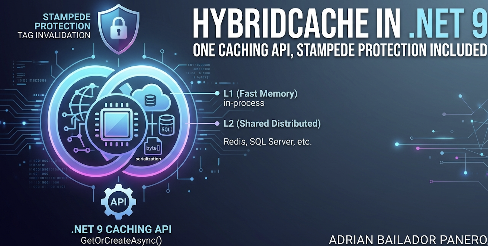

A product page gets 50,000 requests a minute. Behind it sits a database query that takes 200ms. You add `IMemoryCache` — one line — and latency drops to nothing. Ship it.

Then traffic grows and you scale to three servers behind a load balancer. The cache hit rate quietly collapses. Each server keeps its own copy, each misses independently, and your database is taking three times the load you thought you'd eliminated. So you reach for `IDistributedCache` and Redis — and now every cache read is a network round-trip, you're writing serialization code by hand, and the day a popular entry expires, a thousand concurrent requests all miss at the same millisecond and stampede your database into the ground.

Neither cache is wrong. They solve different halves of the same problem. The gap between them is exactly where `HybridCache` lives.

Introduced in .NET 9, `HybridCache` is a single API that sits on top of both: a fast in-process layer backed by a shared distributed layer, with stampede protection and serialization handled for you. This article is how to use it without the footguns.

## The Two Problems It Solves

Before the new API, you picked one of two tools, each with a known weakness.

**`IMemoryCache` is per-process.** It's extremely fast — objects live in the heap, no serialization, no network. But each server instance has its own copy. With three instances you have three independent caches, three independent miss rates, and no way to invalidate an entry across all of them. It also doesn't survive a restart.

**`IDistributedCache` is shared but raw.** Redis (or SQL Server, or Postgres) gives every instance the same view, surviving restarts and scaling horizontally. The cost: every read crosses the network, you serialize and deserialize `byte[]` yourself, and — critically — there's no stampede protection. The classic boilerplate looks like this:

```csharp
public async Task<Product?> GetProductAsync(int id, CancellationToken ct)
{
    var key = $"product:{id}";
    var cached = await _distributedCache.GetAsync(key, ct);

    if (cached is not null)
        return JsonSerializer.Deserialize<Product>(cached);

    // Cache miss. So does every other concurrent request right now.
    var product = await _db.Products.FindAsync([id], ct);
    if (product is null) return null;

    var bytes = JsonSerializer.SerializeToUtf8Bytes(product);
    await _distributedCache.SetAsync(key, bytes,
        new DistributedCacheEntryOptions { AbsoluteExpirationRelativeToNow = TimeSpan.FromMinutes(5) }, ct);

    return product;
}
```

It works. But every retrieval deserializes, you maintain the serialization yourself, and the "cache miss" branch has no coordination — when the entry expires under load, every concurrent caller runs the database query, serializes the result, and writes it back. That's a **cache stampede**, and it's the failure mode that takes a service down at exactly the moment it's busiest.

## What HybridCache Actually Is

`HybridCache` is a unified abstraction over both layers:

1. **Two-level caching (L1 + L2).** L1 is in-process memory — fast, no serialization. L2 is your configured `IDistributedCache` (Redis, SQL Server, Postgres). A read checks L1, then L2, then the source. A computed value is written to both.
2. **Stampede protection.** For a given key, only one concurrent caller runs the factory. Everyone else waits for that single result. The thundering herd becomes one query.
3. **Serialization handled for you.** `string` and `byte[]` are handled internally; everything else uses `System.Text.Json` by default, swappable for protobuf, XML, or anything else.
4. **Tag-based invalidation.** Group related entries under tags and invalidate them as a unit.

The most important detail up front: **L2 is optional.** With no `IDistributedCache` registered, `HybridCache` still gives you in-memory caching *and* stampede protection. That alone makes it a better default than raw `IMemoryCache` even on a single server.

## Step 1: Setup

Install the package:

```bash
dotnet add package Microsoft.Extensions.Caching.Hybrid
```

Register the service:

```csharp
var builder = WebApplication.CreateBuilder(args);

builder.Services.AddHybridCache();

var app = builder.Build();
```

That's the minimum. You can configure global defaults and limits at registration:

```csharp
builder.Services.AddHybridCache(options =>
{
    options.MaximumPayloadBytes = 1024 * 1024; // 1 MB — entries larger than this are not cached
    options.MaximumKeyLength = 1024;            // longer keys bypass the cache instead of saturating it

    options.DefaultEntryOptions = new HybridCacheEntryOptions
    {
        Expiration = TimeSpan.FromMinutes(5),       // L2 lifetime
        LocalCacheExpiration = TimeSpan.FromMinutes(2) // L1 lifetime
    };
});
```

`MaximumPayloadBytes` and `MaximumKeyLength` are guardrails, not suggestions. An oversized payload is logged and *not stored* — it won't throw, it just silently won't cache, which is a behaviour worth knowing before you debug a "why isn't this cached?" mystery in production.

## Step 2: Basic Usage

The whole API mostly reduces to one method: `GetOrCreateAsync`. It takes a key and a factory; if the key isn't cached, it runs the factory, stores the result, and returns it.

```csharp
public class ProductService(HybridCache cache, AppDbContext db)
{
    public async Task<Product?> GetProductAsync(int id, CancellationToken ct = default)
    {
        return await cache.GetOrCreateAsync(
            $"product:{id}", // unique key
            async token => await db.Products.FindAsync([id], token),
            cancellationToken: ct);
    }
}
```

Compare that to the `IDistributedCache` block earlier. No manual serialization, no miss branch, no `SetAsync`. The factory runs only on a genuine miss, and only once per key even under concurrent load.

A note on keys, straight from the design guidance: build them with interpolation *inline* in the call (`$"product:{id}"`), use a delimiter to avoid ambiguity (`order:42:123`, not `order42123`, which collides with `order:421:23`), and **never** put raw user input directly into a key. Untrusted keys are a denial-of-service vector — an attacker floods the cache with junk keys and evicts everything that matters.

## Step 3: Entry Options — Two Expirations, Not One

This is the part people get wrong. `HybridCacheEntryOptions` has two separate expirations because there are two tiers:

```csharp
var options = new HybridCacheEntryOptions
{
    Expiration = TimeSpan.FromMinutes(30),         // how long it lives in L2 (distributed)
    LocalCacheExpiration = TimeSpan.FromMinutes(5) // how long it lives in L1 (this server)
};

return await cache.GetOrCreateAsync(
    $"product:{id}",
    async token => await db.Products.FindAsync([id], token),
    options,
    cancellationToken: ct);
```

`LocalCacheExpiration` should usually be **shorter** than `Expiration`. The reasoning: L1 is per-server and can't be invalidated from another server (more on that below), so you want it to refresh from the shared L2 layer relatively often. A 5-minute L1 over a 30-minute L2 means each server trusts its local copy for 5 minutes, then re-checks the shared truth — bounding how stale any single instance can get without paying the database cost on every request.

Set both too long and a stale value sticks around per-server. Set L1 to zero and you've thrown away the fast path. The sweet spot is "L1 short enough that staleness is acceptable, L2 long enough that the source is rarely hit."

## Step 4: Stampede Protection, the Headline Feature

This is the reason to adopt `HybridCache` even if you never touch a distributed cache.

Imagine a hot key expires while 500 requests per second are hitting it. With raw `IMemoryCache` or `IDistributedCache`, all 500 requests in that window see a miss, all 500 run the factory (the database query), and all 500 write the result back. Your database gets 500 identical expensive queries in a burst.

`HybridCache` collapses that: for a given key, exactly one caller executes the factory. The other 499 await the *same* in-flight operation and receive its result. One database query, not 500.

```csharp
// 500 concurrent callers, same key, entry just expired.
// HybridCache runs the factory ONCE. The rest wait for it.
var product = await cache.GetOrCreateAsync(
    $"product:{id}",
    async token =>
    {
        // This body executes once, no matter how many callers raced in.
        return await db.Products.FindAsync([id], token);
    },
    cancellationToken: ct);
```

One subtlety: the `CancellationToken` your factory receives is the *combined* cancellation of all the callers waiting on that key. The factory is only cancelled if **every** waiting caller has cancelled. A single caller giving up doesn't abort the work that the other 499 still need — which is exactly the behaviour you want.

## Step 5: Adding the Distributed Layer (L2)

Everything above works in-memory with zero extra setup. To make the cache shared across servers, register an `IDistributedCache` — `HybridCache` picks it up automatically as L2. With Redis:

```bash
dotnet add package Microsoft.Extensions.Caching.StackExchangeRedis
```

```csharp
builder.Services.AddStackExchangeRedisCache(options =>
{
    options.Configuration = builder.Configuration.GetConnectionString("Redis");
});

builder.Services.AddHybridCache(options =>
{
    options.DefaultEntryOptions = new HybridCacheEntryOptions
    {
        Expiration = TimeSpan.FromMinutes(30),
        LocalCacheExpiration = TimeSpan.FromMinutes(5)
    };
});
```

No changes to your `GetProductAsync` code. The exact same `GetOrCreateAsync` call now reads L1 → L2 → source and writes through both tiers. That's the real win of the abstraction: you develop against in-memory caching and add Redis later by registering one service, with no churn in the call sites.

## Step 6: Invalidation — By Key and By Tag

When the underlying data changes, you evict explicitly. By key:

```csharp
public async Task UpdateProductAsync(Product product, CancellationToken ct = default)
{
    db.Products.Update(product);
    await db.SaveChangesAsync(ct);

    // Removes from BOTH L1 (this server) and L2 (shared).
    await cache.RemoveAsync($"product:{product.Id}", ct);
}
```

Tags let you invalidate a *group* of entries at once. You attach tags when caching, then evict by tag:

```csharp
public async Task<Product?> GetProductAsync(int id, int categoryId, CancellationToken ct = default)
{
    var tags = new[] { "products", $"category:{categoryId}" };

    return await cache.GetOrCreateAsync(
        $"product:{id}",
        async token => await db.Products.FindAsync([id], token),
        new HybridCacheEntryOptions { Expiration = TimeSpan.FromMinutes(30) },
        tags,
        cancellationToken: ct);
}

// Invalidate every product in a category in one call:
await cache.RemoveByTagAsync($"category:{categoryId}", ct);

// Or wipe everything (the reserved wildcard):
await cache.RemoveByTagAsync("*", ct);
```

Here's the crucial mental model, and it surprises people: **tag invalidation is *logical*, not physical.** Neither `IMemoryCache` nor `IDistributedCache` understands tags, so `RemoveByTagAsync` doesn't go and delete entries. It records that anything carrying that tag should now be *treated as a miss*. The bytes still sit in Redis and in memory until they expire naturally — but the next read for a tagged key sees a miss and re-runs the factory. Functionally it behaves like a delete; operationally nothing is actively purged. Don't expect your Redis memory usage to drop the instant you call it.

## Step 7: Serialization

For L2, values must be serialized. `string` and `byte[]` are handled internally; everything else is `System.Text.Json` by default. For most apps that's all you need. When you want something faster or more compact — protobuf, say — register a serializer, chained off `AddHybridCache`:

```csharp
// Type-specific serializer
builder.Services.AddHybridCache()
    .AddSerializer<ProductDto, ProductProtobufSerializer>();

// Or a general-purpose factory that handles many types
builder.Services.AddHybridCache()
    .AddSerializerFactory<ProtobufSerializerFactory>();
```

The serializer only matters for the distributed tier — L1 stores live objects. Which leads to the one performance nuance worth understanding.

## Performance: Object Reuse

By default, `HybridCache` deserializes a fresh instance for each caller, mirroring how `IDistributedCache` behaved. That's the safe default: separate instances can't accidentally share mutable state across concurrent callers.

But if your cached type is genuinely immutable, that per-call deserialization is pure waste. You can tell `HybridCache` it's safe to hand out the *same* instance by doing two things: mark the type `sealed`, and apply `[ImmutableObject(true)]`.

```csharp
using System.ComponentModel; // ImmutableObjectAttribute lives here

[ImmutableObject(true)]
public sealed record ProductDto(int Id, string Name, decimal Price);
```

Now `HybridCache` can skip the per-call copy and reuse one instance, cutting CPU and allocations for hot, large objects. This only works because you've promised the object is never mutated — break that promise and you've reintroduced a shared-mutable-state bug across concurrent requests. Use it for DTOs and value objects, not for anything you mutate after caching.

For very hot paths, there's also a `GetOrCreateAsync` overload that takes explicit *state* plus a `static` lambda, avoiding the closure allocation a normal lambda captures:

```csharp
return await cache.GetOrCreateAsync(
    $"product:{id}",
    (id, db),                              // state, passed in explicitly
    static async (state, token) =>         // static — captures nothing
        await state.db.Products.FindAsync([state.id], token),
    cancellationToken: ct);
```

It's more verbose and, for most code, the readability cost isn't worth it. Reach for it only when a profiler tells you that allocation matters on this path — not by default.

## The Gotcha Nobody Mentions

The two-tier design has one sharp edge that will eventually bite you. **Invalidation only reaches the current server and L2 — it does not touch L1 on other servers.**

When you call `RemoveAsync` (or `RemoveByTagAsync`) on instance A, it clears A's local memory and marks the entry stale in the shared distributed cache. But instances B and C still hold their own L1 copies, and they'll keep serving them until *their* `LocalCacheExpiration` elapses. So immediately after an update, different servers can return different values for a window bounded by `LocalCacheExpiration`.

This is the real reason to keep `LocalCacheExpiration` short. It's the maximum staleness any single server can exhibit after an invalidation elsewhere. If your domain genuinely can't tolerate that window — pricing during a flash sale, say — keep the volatile data out of L1 (lean on L2 only) or invalidate through a backplane that fans the eviction out to every instance. For the overwhelming majority of read-heavy data, a short L1 window is a fine trade.

This is a documented, deliberate limitation rather than an oversight — the official guidance states plainly that "the in-memory cache in other servers isn't affected" by an invalidation. The L1/L2 split is designed so that a sufficiently capable L2 backend *could* one day broadcast invalidation messages to every node's local cache — a backplane, the same idea SignalR uses to fan messages across instances. As of .NET 9 that propagation isn't wired in out of the box, so the short-`LocalCacheExpiration` rule is your practical safety net today. The shape of the API leaves the door open for transparent cross-node invalidation later.

## Common Mistakes

### Mistake 1: Putting user input straight into the cache key

```csharp
// ❌ Untrusted key — a DoS vector
var key = $"search:{userProvidedQuery}";
await cache.GetOrCreateAsync(key, ...);
```

An attacker sends thousands of unique junk queries, each creating a distinct entry, flooding the cache and evicting the entries that matter. Hash or constrain user-derived key parts, and only key on values you control or have validated against a known set.

### Mistake 2: Identical L1 and L2 expirations

```csharp
// ❌ No reason to have two tiers if they expire together
new HybridCacheEntryOptions
{
    Expiration = TimeSpan.FromMinutes(10),
    LocalCacheExpiration = TimeSpan.FromMinutes(10)
};
```

If L1 lives as long as L2, each server trusts its local copy for the full lifetime and never re-checks the shared layer — so cross-server staleness lasts the entire 10 minutes. Make `LocalCacheExpiration` meaningfully shorter than `Expiration`. That's the knob the whole design hinges on.

### Mistake 3: Expecting RemoveByTagAsync to free memory

```csharp
// ❌ Calling this and watching Redis memory, expecting it to drop
await cache.RemoveByTagAsync("products");
```

Tag invalidation is logical. Entries are *treated* as misses on the next read but aren't physically purged — they expire on their own schedule. It correctly stops stale data being served; it does not reclaim storage on the spot.

### Mistake 4: Reusing instances of a mutable type

```csharp
// ❌ Mutable type marked reusable — concurrent callers share one instance
[ImmutableObject(true)]
public sealed class CartDto
{
    public List<string> Items { get; set; } = []; // mutable!
}
```

`[ImmutableObject(true)]` is a promise you're making to the runtime, not something it verifies. If the "immutable" object is actually mutated, every concurrent caller is now sharing and racing on the same instance. Only apply it to types that truly can't change — records with init-only members, value objects, frozen collections.

### Mistake 5: Letting negative results inherit your long TTL

```csharp
// ❌ A null result is cached with the SAME long TTL as a real product
async token => await db.Products.FindAsync([id], token); // returns null for a missing id
```

This is the opposite of what most people assume. `HybridCache` caches whatever the factory returns — `null` included — using the *same* entry options as a valid hit. For repeated lookups of one missing id that's actually fine: it won't re-query the database. The danger is a *scan*. A client (or an attacker) requesting thousands of non-existent ids fills both tiers with `null` entries, each pinned for your full 30-minute TTL, evicting the entries that actually matter to make room for nothing.

The catch is that `GetOrCreateAsync` chooses its options *before* the factory runs, so you can't natively hand a `null` result a shorter TTL within the same call. Negative caching has to be a deliberate strategy, not a default you accept blindly:

- **Guard the input first** — validate the id against a known range or set before it ever reaches the cache, so junk never gets stored.
- **Manage empty results explicitly** — instead of caching a raw `null`, `RemoveAsync` the key when you know it's missing, or store a short-lived sentinel via `SetAsync` with its own brief expiration.

The point is to decide what happens to "not found" — not to let it silently inherit the lifetime you picked for real data.

## Conclusion

`HybridCache` isn't a small convenience over the old APIs — it closes the specific gap that made caching in distributed .NET apps error-prone. `IMemoryCache` gave you speed without sharing. `IDistributedCache` gave you sharing without speed, stampede protection, or ergonomics. `HybridCache` gives you a fast L1 backed by a shared L2, one query per key under load instead of a herd, serialization handled, and tags for group invalidation — behind a single `GetOrCreateAsync` call.

The adoption path is unusually clean. Start with `AddHybridCache()` and nothing else: even with no distributed cache, you get in-memory caching plus stampede protection, which is already a strict upgrade over reaching for `IMemoryCache`. When you scale out, register a Redis `IDistributedCache` and your call sites don't change. Tune `LocalCacheExpiration` to bound per-server staleness, mark immutable DTOs as reusable, and you have a caching layer that holds up under the kind of load that exposes the seams in everything else.

The features that used to be your job — the miss branch, the serialization, the coordination that stops a stampede — are now the library's job. That's the whole point.

---

*Full source code: [github.com/AdrianBailador/hybrid-cache-dotnet](https://github.com/AdrianBailador/hybrid-cache-dotnet)*

*Questions or suggestions? Open an issue on [GitHub](https://github.com/AdrianBailador/hybrid-cache-dotnet/issues).*
