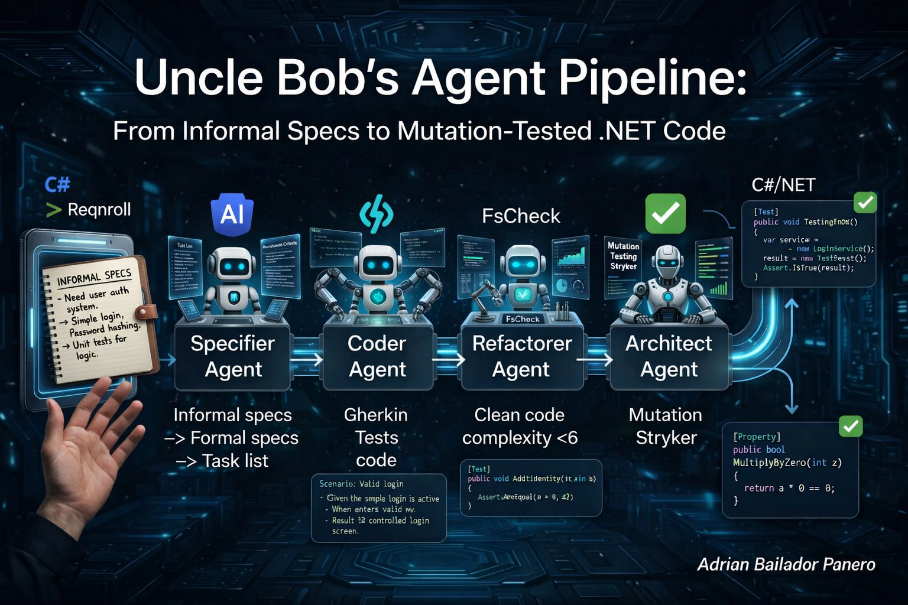
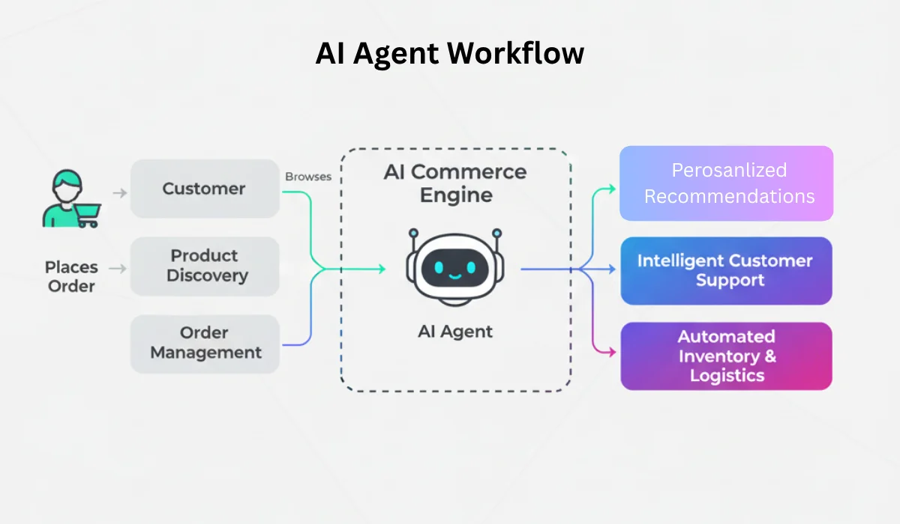

Robert C. Martin recently described an agent pipeline on X that cuts against the grain of how most developers use AI today. Instead of a single all-knowing agent that takes a vague request and produces code, his system is a sequence of disciplined transformations — each stage more formal than the last, each requiring less human oversight than the one before.

The goal is a codebase where the specifications are precise, the tests are meaningful, the complexity is controlled, and every line of production code is verified by mutation. Not because an agent promised it was correct, but because the system structurally cannot produce anything else.

Raw compute is the bottleneck, not intelligence. The mutation passes are CPU-intensive by design.

## The Pipeline at a Glance



It is a transformation pipeline from the informal to the formal. Human interaction is heaviest at the beginning — you review the hard specs and spot-check the Gherkin. By the time the Architect runs mutation tests, the system runs unattended. Your job is to review the output at the end, not supervise every step.

## Stage 1: You Write Informal Specs

This is the only stage that requires you. You write requirements the way you actually think — incomplete, conversational, ambiguous in places. A paragraph. A list of bullet points. A few handwritten notes.

```
We need a discount system for the product catalogue.
Products can have one active discount at a time.
Discounts can be percentage-based or fixed amount.
They expire after a configurable number of days.
No discount can reduce a price below zero.
```

The quality of everything downstream depends on the quality of this input — but you don't need to formalise it yourself. That's the Specifier's job.

## Stage 2: Specifier Agent — Informal to Hard Specs

The Specifier converts your free text into structured, unambiguous specifications and breaks them into discrete tasks. You review this output.

**Input:** your informal notes  
**Output:** a numbered task list with precise acceptance criteria  
**You:** review and correct before anything moves forward

For the discount example, the Specifier might produce:

```
Task 1: ProductDiscount value object
  - Represents either a PercentageDiscount (0–100) or FixedAmountDiscount (> 0)
  - Invalid values are rejected at construction
  - PercentageDiscount cannot exceed 100
  - FixedAmountDiscount must be positive

Task 2: Apply discount to a product
  - A product may hold at most one active discount
  - Applying a second discount replaces the first
  - The discounted price = base price minus discount amount
  - The discounted price is never below 0.00

Task 3: Discount expiry
  - A discount has a configurable expiry duration in days
  - An expired discount is treated as absent
  - Retrieving the effective price checks for expiry at call time
```

This is where you invest the most attention. A wrong task here propagates through every downstream stage. The Specifier saves you the work of formalisation; you provide the judgment that the machine cannot.

## Stage 3: Specifier Agent — Tasks to Gherkin

The Specifier takes each approved task and produces Gherkin feature files: `Given / When / Then` scenarios in plain language, one file per task. It also prunes Gherkin — removes redundant, overlapping, or impossible scenarios. You spot-check.

**Input:** approved task list  
**Output:** `.feature` files, one per task  
**You:** spot-check for missing scenarios, wrong edge cases

`discount-value-object.feature`:

```gherkin
Feature: ProductDiscount value object

  Scenario: Create a valid percentage discount
    Given a percentage discount of 20
    When the discount is created
    Then the discount type is Percentage
    And the value is 20

  Scenario: Reject a percentage discount above 100
    Given a percentage discount of 101
    When the discount is created
    Then a domain exception is thrown

  Scenario: Reject a fixed amount discount of zero
    Given a fixed amount discount of 0.00
    When the discount is created
    Then a domain exception is thrown

  Scenario: Create a valid fixed amount discount
    Given a fixed amount discount of 15.00
    When the discount is created
    Then the discount type is FixedAmount
    And the value is 15.00
```

`apply-discount.feature`:

```gherkin
Feature: Apply discount to a product

  Scenario: Apply a percentage discount
    Given a product with a base price of 100.00
    And a percentage discount of 20
    When the discount is applied
    Then the effective price is 80.00

  Scenario: Price cannot go below zero
    Given a product with a base price of 10.00
    And a fixed amount discount of 50.00
    When the discount is applied
    Then the effective price is 0.00

  Scenario: Applying a second discount replaces the first
    Given a product with an active 10% discount
    When a 25% discount is applied
    Then the active discount is 25%
    And the previous discount is no longer active
```

In .NET you run Gherkin through **Reqnroll** (the open-source successor to SpecFlow). Add the package to your test project:

```bash
dotnet add package Reqnroll.xUnit
dotnet add package Reqnroll
```

## Stage 4: Coder Agent — Acceptance Tests, Unit Tests, Code

The Coder never sees your informal notes. It sees only the Gherkin. This is the constraint that makes the pipeline trustworthy: the Coder cannot fill gaps from context it was never given. If the Gherkin is ambiguous, the Coder asks for clarification rather than guessing.

The sequence within this stage is fixed:

**1 — Acceptance tests from Gherkin**

The Coder writes Reqnroll step definitions that bind to each scenario. At this point they are empty method bodies — the bindings exist but the assertions are pending.

```csharp
[Binding]
public class ProductDiscountSteps
{
    private ProductDiscount? _discount;
    private Exception? _thrownException;

    [Given(@"a percentage discount of (.*)")]
    public void GivenAPercentageDiscountOf(decimal value)
    {
        try { _discount = ProductDiscount.Percentage(value); }
        catch (Exception ex) { _thrownException = ex; }
    }

    [Then(@"a domain exception is thrown")]
    public void ThenADomainExceptionIsThrown() =>
        _thrownException.Should().BeOfType<DomainException>();

    [Then(@"the discount type is Percentage")]
    public void ThenTheDiscountTypeIsPercentage() =>
        _discount!.Type.Should().Be(DiscountType.Percentage);
}
```

**2 — Unit tests**

With the acceptance boundaries defined, the Coder writes unit tests that cover internal logic the Gherkin doesn't reach: private calculations, boundary conditions, internal state transitions.

```csharp
public class ProductDiscountTests
{
    [Theory]
    [InlineData(-1)]
    [InlineData(101)]
    public void Percentage_OutOfRange_ThrowsDomainException(decimal value) =>
        FluentActions.Invoking(() => ProductDiscount.Percentage(value))
            .Should().Throw<DomainException>();

    [Fact]
    public void FixedAmount_Zero_ThrowsDomainException() =>
        FluentActions.Invoking(() => ProductDiscount.FixedAmount(0))
            .Should().Throw<DomainException>();
}
```

**3 — Implementation**

Only now does the Coder write production code. The acceptance tests and unit tests are already defined — they all fail. The Coder writes the minimum code to make them pass.

```csharp
public sealed record ProductDiscount
{
    public DiscountType Type { get; }
    public decimal Value { get; }

    private ProductDiscount(DiscountType type, decimal value)
    {
        Type = type;
        Value = value;
    }

    public static ProductDiscount Percentage(decimal value)
    {
        if (value <= 0 || value > 100)
            throw new DomainException($"Percentage discount must be between 1 and 100. Got: {value}");
        return new(DiscountType.Percentage, value);
    }

    public static ProductDiscount FixedAmount(decimal value)
    {
        if (value <= 0)
            throw new DomainException($"Fixed amount discount must be positive. Got: {value}");
        return new(DiscountType.FixedAmount, value);
    }
}
```

The Coder hands off only when `dotnet test` runs green — every acceptance test, every unit test.

## Stage 5: Refactorer Agent — Complexity, Duplication, Property Tests

The Refactorer has no knowledge of the original requirements. It works only with the code and the tests. Its mandate is structural quality, not correctness.

**Task 1: Reduce cyclomatic complexity to 6 or below.**

Uncle Bob uses the term "crap" (Change Risk Anti-Patterns) — a metric that combines complexity with test coverage. The Refactorer identifies methods where complexity is above the threshold and refactors until each method is clean.

In .NET you can enforce this with Roslyn analysers or with a dedicated tool:

```bash
dotnet tool install -g dotnet-crap
dotnet crap --threshold 6
```

A method like this:

```csharp
// complexity: 8
public decimal CalculateEffectivePrice(decimal basePrice, ProductDiscount? discount, DateTime now)
{
    if (discount is null) return basePrice;
    if (discount.ExpiresAt.HasValue && discount.ExpiresAt.Value < now) return basePrice;

    decimal amount = discount.Type switch
    {
        DiscountType.Percentage => basePrice * discount.Value / 100,
        DiscountType.FixedAmount => discount.Value,
        _ => throw new ArgumentOutOfRangeException()
    };

    decimal result = basePrice - amount;
    return result < 0 ? 0 : result;
}
```

becomes two methods, each under the threshold:

```csharp
// complexity: 3
public decimal CalculateEffectivePrice(decimal basePrice, ProductDiscount? discount, DateTime now)
{
    if (!IsDiscountActive(discount, now)) return basePrice;
    return ApplyDiscount(basePrice, discount!);
}

// complexity: 3
private static bool IsDiscountActive(ProductDiscount? discount, DateTime now) =>
    discount is not null &&
    (!discount.ExpiresAt.HasValue || discount.ExpiresAt.Value >= now);

// complexity: 3
private static decimal ApplyDiscount(decimal basePrice, ProductDiscount discount)
{
    var amount = discount.Type == DiscountType.Percentage
        ? basePrice * discount.Value / 100
        : discount.Value;
    return Math.Max(0, basePrice - amount);
}
```

**Task 2: Remove duplication.**

The Refactorer identifies and eliminates structural duplication — not just copy-paste, but patterns repeated across the codebase that should live in a single location.

**Task 3: Property tests.**

After the code is clean, the Refactorer adds property-based tests. Where unit tests verify specific examples, property tests verify invariants across arbitrary inputs.

Install **FsCheck** for .NET:

```bash
dotnet add package FsCheck.Xunit
```

```csharp
public class ProductDiscountPropertyTests
{
    [Property]
    public bool EffectivePrice_IsNeverNegative(decimal basePrice, decimal discountAmount)
    {
        if (basePrice < 0 || discountAmount <= 0) return true; // precondition

        var discount = ProductDiscount.FixedAmount(discountAmount);
        var product = Product.Create("Test", Math.Abs(basePrice));
        product.ApplyDiscount(discount);

        return product.EffectivePrice(DateTime.UtcNow) >= 0;
    }

    [Property]
    public bool PercentageDiscount_NeverExceedsBasePrice(PositiveDecimal basePrice)
    {
        var discount = ProductDiscount.Percentage(Arb.Generate<decimal>()
            .Where(v => v > 0 && v <= 100).Sample(0, 1).Head);
        var product = Product.Create("Test", basePrice.Get);
        product.ApplyDiscount(discount);

        return product.EffectivePrice(DateTime.UtcNow) <= basePrice.Get;
    }
}
```

Property tests pass when all the acceptance tests still pass on top of them.

## Stage 6: Architect Agent — Mutation Testing

This is the stage that cannot be rushed. The Architect runs mutation testing — it deliberately introduces small errors into the production code and verifies that the test suite catches every one of them. This pass is CPU-intensive. It runs unattended.

There are two mutation passes.

### Language Mutation

**Stryker.NET** mutates the C# source: flips `>` to `>=`, changes `+` to `-`, inverts boolean conditions, removes method calls. For each mutant it runs the full test suite. A mutant that survives — that passes the tests despite the introduced defect — indicates a gap in coverage.

```bash
dotnet tool install -g dotnet-stryker
dotnet stryker --project Domain/Domain.csproj --mutation-level Complete
```

The Architect covers any uncovered lines and kills all surviving mutants. When a mutant survives, the Architect writes the test that kills it — not arbitrarily, but by understanding what the surviving mutation implies about the missing behaviour.

A survivor like `return result < 0 ? 0 : result` → `return result` means no test verified that prices are floored at zero. The Architect writes exactly that test.

### Gherkin Mutation

With the code mutation clean, the Architect mutates the Gherkin scenarios themselves. It modifies values in `Given` and `Then` steps, removes scenarios, inverts conditions. For each mutation it re-runs the acceptance test suite.

A Gherkin mutation that survives means a scenario exists that no test actually exercises — either the step bindings are wrong, or the scenario was never wired to the implementation.

```bash
# Gherkin mutation via a custom Stryker plugin or purpose-built tooling
dotnet stryker --gherkin-mutation --feature-files tests/Features/**/*.feature
```

### Full Suite

When both mutation passes are clean, the Architect runs the complete test suite — unit tests, acceptance tests, property tests — one final time. When it passes, the result is handed back to the Specifier, Coder, and Refactorer for the next task.

```bash
dotnet test --logger "trx;LogFileName=results.trx" /p:CollectCoverage=true
```

## Human Interaction Across the Pipeline

This is the design principle that separates this system from ordinary agent-assisted coding.

| Stage | You do |
|-------|--------|
| Informal specs | Write them |
| Hard specs + tasks | Review and correct |
| Gherkin | Spot-check |
| Coder output | Nothing — it runs to completion |
| Refactorer output | Nothing — it runs to completion |
| Architect output | Spot-check the final code |

You are heaviest at the front, where judgment matters most: deciding what the system should do and whether the specification captures it correctly. You are absent at the back, where mechanical verification takes over.

The consequence is that your time scales independently of the codebase. The CPU-intensive mutation passes run without you. You review the Gherkin for five minutes and return when the Architect is done.

## The Shape of the Problem

The pipeline is a formalisation engine. Informal language is ambiguous by nature — words have multiple meanings, context is implicit, edge cases are invisible. Each transformation stage removes a layer of ambiguity:

- **Informal → hard specs:** removes vagueness
- **Hard specs → Gherkin:** removes implicit context
- **Gherkin → acceptance tests:** removes implementation assumptions
- **Acceptance tests → unit tests:** removes untested internals
- **Mutation tests:** removes false confidence

By the time the Architect hands the result back, the code has been verified at every layer. The tests are not there because an agent generated them. They are there because the pipeline structurally could not advance without them.

Raw compute is the price of that guarantee. A mutation suite on a non-trivial domain can take minutes on a single machine. That is an acceptable trade for code you can trust without re-reading every line yourself.

---

*Based on a description by Robert C. Martin ([@unclebobmartin](https://x.com/unclebobmartin))*

*Full source code — the discount domain built exactly as the pipeline would produce it, with acceptance tests, unit tests, property tests and a Stryker mutation config: [github.com/AdrianBailador/agent-pipeline-dotnet](https://github.com/AdrianBailador/agent-pipeline-dotnet)*

*Questions or suggestions? Open an issue on [GitHub](https://github.com/AdrianBailador/agent-pipeline-dotnet/issues).*
