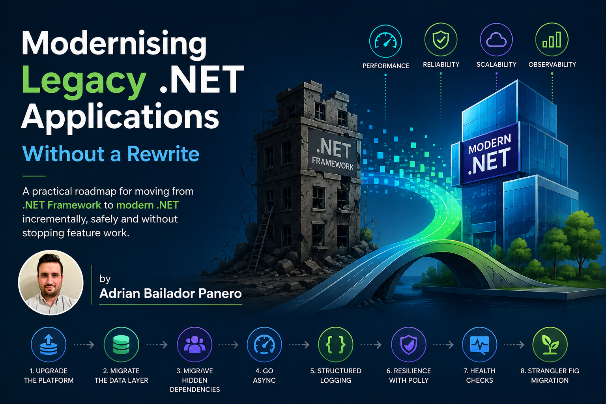
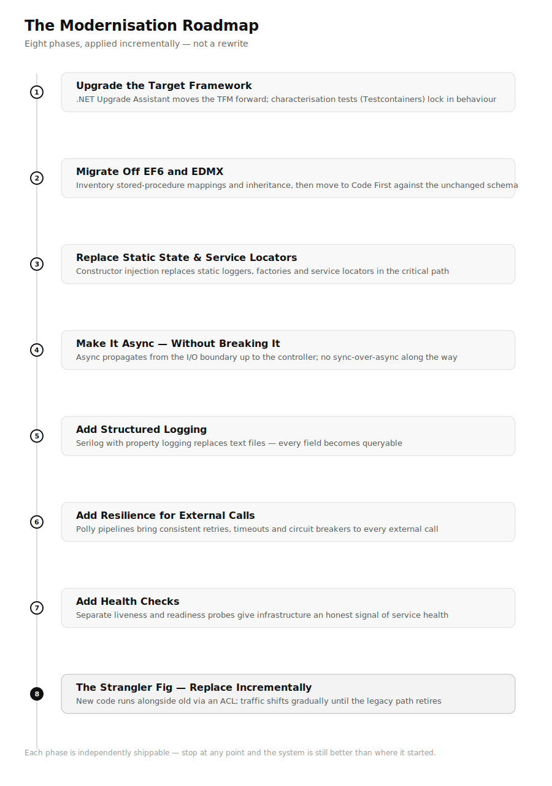
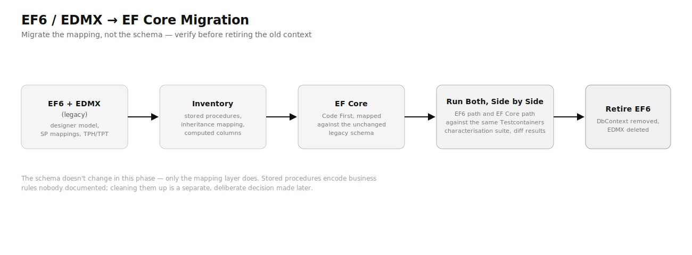
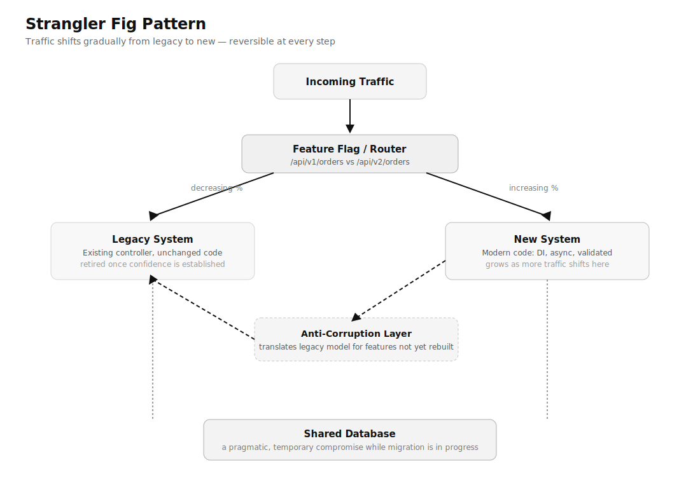

The codebase was twelve years old. It had started as a straightforward .NET Framework 4.5 Web API, grown through four acquisitions, and now powered a logistics platform processing six thousand orders a day. Nobody fully understood it. The team that built it had mostly left. The documentation was a 200-page Word document that described a system that no longer existed.

The business needed three things: a feature the existing architecture couldn't support, performance that was increasingly hard to explain to stakeholders, and developers who were willing to work on it — something that had become genuinely difficult to achieve when .NET Framework 4.x appeared in a job posting.

The answer that kept coming up in the architecture meetings was "rewrite it." Greenfield. Modern stack. Clean slate.

We didn't. And this is why, and what we did instead.

## Why Rewrites Fail

A rewrite feels like clarity. You escape the accumulated decisions, the workarounds layered on top of workarounds, the APIs that no longer make sense. You get to do it right.

The problem is that the old system contains twelve years of business logic that nobody fully documented. Edge cases that were discovered in production in 2016 and fixed in ways that aren't obvious from reading the code. Rules that come from contracts with specific customers. Behaviour that exists because a regulator asked for it in 2019 and the ticket was closed when someone committed a one-liner to a method nobody else touched.

A rewrite ships something that looks correct and fails in production in ways that take months to diagnose. The Joel Spolsky argument — that the old code contains bug fixes you don't know about — is not theoretical. It happens on almost every rewrite, and it's almost never budgeted for.

The alternative is incremental modernisation: make the system better without stopping, replacing pieces without rewriting the whole, and measuring progress against real outcomes rather than architectural ideals.

## Start with a Diagnosis, Not a Plan

Before you change anything, you need to understand what you actually have. This is the step teams skip because it feels like delay. It's the step that makes everything else work.

Run the following against the solution:

```bash
# .NET Upgrade Assistant — assesses upgrade readiness
dotnet tool install -g upgrade-assistant
upgrade-assistant analyze MySolution.sln

# See which projects still target Framework
grep -r "TargetFramework" **/*.csproj

# Find synchronous database calls (rough heuristic)
grep -rn "\.ExecuteNonQuery\(\)\|\.ExecuteReader\(\)\|\.Fill(" --include="*.cs" .
```

What you're looking for:

- **Target framework distribution** — are all projects on the same version, or is it a mix?
- **Synchronous I/O** — `ExecuteNonQuery()`, `SqlDataReader` without async, `Thread.Sleep` in request paths
- **Static state** — static service locators, static HttpClient instances, global mutable state
- **Unhandled exception patterns** — swallowed exceptions, empty catch blocks, exceptions used for control flow
- **External dependency calls** — HTTP calls, database calls, queue interactions that have no timeout or retry

This diagnosis produces a map. Not every item on that map needs to be fixed. The goal is knowing which ones are blocking the features the business needs, which ones are performance liabilities under load, and which ones are simply technical debt that can be paid down later.



## Phase 1: Upgrade the Target Framework

The first concrete step is moving projects from .NET Framework to a current LTS release. This unlocks every modern API, every performance improvement, and every tooling benefit. It's also the step with the highest perceived risk and the most predictable actual risk, because the .NET Upgrade Assistant exists precisely for this.

```bash
dotnet tool install -g upgrade-assistant
upgrade-assistant upgrade MySolution.sln --target-tfm net9.0
```

The assistant runs in interactive mode, shows you what it intends to change, and lets you confirm each step. For most projects it handles:

- Updating `<TargetFramework>` in `.csproj` files
- Migrating `packages.config` to `PackageReference`
- Updating package versions to .NET-compatible equivalents
- Flagging APIs that don't exist in modern .NET for manual review

The flagged items are the real work. Common ones:

```csharp
// ❌ .NET Framework — no equivalent in .NET 8
ConfigurationManager.AppSettings["key"]

// ✅ Modern .NET
IConfiguration config; // injected
config["key"]

// ❌ HttpContext.Current — ASP.NET Classic
var user = HttpContext.Current.User.Identity.Name;

// ✅ ASP.NET Core
// inject IHttpContextAccessor or receive HttpContext directly in controllers
```

Run the full test suite after each project upgrade. If you don't have a test suite, the upgrade is the moment to write characterisation tests — tests that capture the existing behaviour, right or wrong, so you know if you've changed it.

Characterisation tests against a legacy system are only trustworthy if they run against a real database, not a mocked one — mocks tend to agree with whatever assumption you already had about the old code, which defeats the point. [Testcontainers](https://dotnet.testcontainers.org/) solves this by spinning up an ephemeral, disposable database in Docker for the duration of the test run:

```bash
dotnet add package Testcontainers.MsSql
```

```csharp
public class OrderServiceCharacterisationTests : IAsyncLifetime
{
    private readonly MsSqlContainer _sqlContainer = new MsSqlBuilder().Build();

    public async Task InitializeAsync()
    {
        await _sqlContainer.StartAsync();
        // run existing migrations / restore a production-like schema dump here
    }

    public Task DisposeAsync() => _sqlContainer.DisposeAsync().AsTask();

    [Fact]
    public async Task ProcessOrder_AppliesLegacyDiscountRule_ForBulkCustomers()
    {
        using var connection = new SqlConnection(_sqlContainer.GetConnectionString());
        // exercise the legacy code path against a real, disposable SQL Server instance
    }
}
```

This matters more for legacy .NET than for new code: a twelve-year-old codebase often has business rules implemented as stored procedures, triggers, or computed columns that a mock can't replicate. Testcontainers lets the characterisation suite exercise the actual schema and the actual stored procedures, so a behaviour change in either the C# or the database layer gets caught.

## Phase 2: Migrate Off EF6 and EDMX

If the application predates EF Core, it's almost certainly using EF6 with an EDMX — a visual, designer-generated model with a `.tt` template that generates entity classes, a `DbContext`, and XML mapping in one tightly coupled bundle. EDMX doesn't exist in EF Core, and this is usually the single biggest bottleneck in the entire modernisation, bigger than the framework upgrade itself.

The honest version of this work has three parts, and skipping any of them is how migrations stall for months:

**1 — Inventory what the EDMX actually does.** Open it and look specifically for:
- **Stored procedure mappings** for inserts/updates/deletes (EF Core supports calling stored procedures, but the designer-generated mapping syntax doesn't carry over — they have to be re-wired through `ModelBuilder`)
- **Complex types and inheritance mapping** (TPH/TPT/TPC) — EF Core's support differs from EF6's in ways that change generated SQL
- **Database-generated computed columns and triggers** — these need explicit `[DatabaseGenerated]` or `HasComputedColumnSql` configuration in EF Core; EF6's EDMX inferred a lot of this from the designer

```bash
# EF Core has a community tool to reverse-engineer an EDMX into Code First
dotnet tool install -g ErikEJ.EFCorePowerTools
```

**2 — Move to Code First, against the existing database, before changing any schema.** The goal of this phase is a like-for-like model in EF Core, not an improved one. Resist the urge to "clean up" the schema at the same time — that turns a mechanical migration into a redesign with redesign-sized risk.

```csharp
// ✅ EF Core Code First, mapped against the unchanged legacy schema
public class AppDbContext : DbContext
{
    public DbSet<Order> Orders => Set<Order>();

    protected override void OnModelCreating(ModelBuilder modelBuilder)
    {
        modelBuilder.Entity<Order>(entity =>
        {
            entity.ToTable("tbl_Orders"); // legacy table name, kept as-is
            entity.Property(o => o.TotalAmount).HasColumnType("decimal(18,2)");
            // stored procedure mapping that EDMX used to generate visually
            entity.InsertUsingStoredProcedure("usp_InsertOrder", sp => sp
                .HasParameter(o => o.CustomerId)
                .HasParameter(o => o.TotalAmount)
                .HasResultColumn(o => o.OrderId));
        });
    }
}
```

**3 — Run the old and new data access side by side against the characterisation tests.** Before retiring the EF6 `DbContext`, run the same Testcontainers-backed test suite against both the EF6 path and the new EF Core path, and diff the results. EF Core's LINQ translation is not identical to EF6's — queries that relied on client-side evaluation in EF6 throw or silently change behaviour in EF Core. This diffing step is what catches that before production does.

Heavy stored-procedure-based EDMX models are the case where "rewrite the data layer cleanly" is tempting and usually wrong for the same reason a full rewrite is wrong: the stored procedures encode business rules nobody documented. Migrate the mapping, not the logic, and modernise the logic later as a separate, deliberate decision.



## Phase 3: Replace Static State and Service Locators

Legacy .NET applications are full of static state. It was idiomatic for its time.

```csharp
// ❌ Common pattern in .NET Framework apps
public class OrderService
{
    public void ProcessOrder(int orderId)
    {
        var logger = LogManager.GetLogger(typeof(OrderService)); // static lookup
        var db = DatabaseFactory.GetConnection();               // static factory
        var emailService = ServiceLocator.Get<IEmailService>(); // service locator

        // business logic
    }
}
```

The problem isn't aesthetic. Static dependencies are invisible to tests, make behaviour unpredictable under concurrent load, and prevent the DI container from managing lifetimes. Replace them with constructor injection:

```csharp
// ✅ Constructor injection — testable, explicit, container-managed
public class OrderService
{
    private readonly ILogger<OrderService> _logger;
    private readonly AppDbContext _db;
    private readonly IEmailService _emailService;

    public OrderService(
        ILogger<OrderService> logger,
        AppDbContext db,
        IEmailService emailService)
    {
        _logger = logger;
        _db = db;
        _emailService = emailService;
    }

    public async Task ProcessOrderAsync(int orderId, CancellationToken ct = default)
    {
        // business logic
    }
}
```

Register the services in `Program.cs`:

```csharp
builder.Services.AddScoped<OrderService>();
builder.Services.AddScoped<IEmailService, SmtpEmailService>();
builder.Services.AddDbContext<AppDbContext>(options =>
    options.UseNpgsql(builder.Configuration.GetConnectionString("Default")));
```

Don't try to convert everything at once. Pick the services in the critical path — the ones the business needs to change — and convert those first. The rest can wait.

## Phase 4: Make It Async — Without Breaking It

Synchronous I/O in a web application blocks threads. Under sustained load, a thread pool exhausts and requests queue. This is the performance problem that's hardest to diagnose from the outside (latency climbs steadily; error rate spikes when the queue fills) and easiest to fix from the inside.

The dangerous middle ground is sync-over-async: calling `.Result` or `.Wait()` on a Task from synchronous code. It doesn't help — it blocks a thread just as a synchronous call does, and it can deadlock on older synchronisation contexts.

```csharp
// ❌ Sync-over-async — blocks a thread, can deadlock
public Order GetOrder(int id)
{
    return _db.Orders.FindAsync(id).Result; // never do this
}

// ❌ Still wrong — same problem, different syntax
public Order GetOrder(int id)
{
    return _db.Orders.FindAsync(id).GetAwaiter().GetResult();
}

// ✅ Async all the way down
public async Task<Order?> GetOrderAsync(int id, CancellationToken ct = default)
{
    return await _db.Orders.FindAsync([id], ct);
}
```

The async conversion has to propagate up the call stack. You cannot make a method async and leave its callers synchronous — that just moves the sync-over-async problem one level up. Start at the I/O boundary (database call, HTTP call, file read) and work upward to the controller action.

Controller actions in ASP.NET Core support `async Task<IActionResult>` natively:

```csharp
// ✅ Async controller — ASP.NET Core handles the thread correctly
[HttpGet("{id}")]
public async Task<ActionResult<OrderDto>> GetOrder(int id, CancellationToken ct)
{
    var order = await _orderService.GetOrderAsync(id, ct);
    return order is null ? NotFound() : Ok(order.ToDto());
}
```

Pass `CancellationToken` through every async call. When a client disconnects mid-request, ASP.NET Core cancels the token — and every awaited operation that respects it will exit cleanly instead of running to completion for a result nobody is waiting for.

## Phase 5: Add Structured Logging

Legacy applications log with `Console.WriteLine`, `Debug.WriteLine`, or frameworks like log4net writing to text files. Text logs don't aggregate, don't filter, and don't support queries beyond grep.

Replace them with `Microsoft.Extensions.Logging` and a structured sink. The built-in logger works from day one; add a provider for wherever you ship logs:

```bash
dotnet add package Serilog.AspNetCore
dotnet add package Serilog.Sinks.Console
dotnet add package Serilog.Sinks.Seq  # or Elasticsearch, OpenTelemetry, etc.
```

```csharp
// Program.cs
builder.Host.UseSerilog((context, config) =>
{
    config
        .ReadFrom.Configuration(context.Configuration)
        .Enrich.FromLogContext()
        .WriteTo.Console(outputTemplate:
            "[{Timestamp:HH:mm:ss} {Level:u3}] {Message:lj} {Properties:j}{NewLine}{Exception}")
        .WriteTo.Seq("http://localhost:5341"); // or your log aggregator
});
```

The most important shift is from message formatting to property logging:

```csharp
// ❌ Text log — unsearchable, unstructured
_logger.LogInformation($"Order {orderId} processed in {elapsed}ms for customer {customerId}");

// ✅ Structured log — every property is queryable
_logger.LogInformation(
    "Order {OrderId} processed in {ElapsedMs}ms for customer {CustomerId}",
    orderId, elapsed, customerId);
```

The string looks the same in a terminal. In a log aggregator, `OrderId`, `ElapsedMs`, and `CustomerId` are indexed fields. You can query "all orders for customer 42 that took more than 500ms" without parsing text.

## Phase 6: Add Resilience for External Calls

Every call your application makes to an external system — a database, an HTTP API, a message broker — can fail. Most legacy applications handle this with try/catch and maybe a retry loop written by hand. The problems: the retry logic isn't consistent, the timeouts aren't set, and there's no circuit breaker to stop hammering a dependency that's genuinely down.

Polly v8 solves this with typed resilience pipelines:

```bash
dotnet add package Microsoft.Extensions.Http.Resilience
```

```csharp
// Program.cs — applies to every HttpClient registered with this name
builder.Services.AddHttpClient<PaymentGatewayClient>(client =>
{
    client.BaseAddress = new Uri(builder.Configuration["PaymentGateway:BaseUrl"]!);
    client.Timeout = TimeSpan.FromSeconds(30);
})
.AddStandardResilienceHandler(options =>
{
    // Retry: 3 attempts with exponential backoff + jitter
    options.Retry.MaxRetryAttempts = 3;
    options.Retry.Delay = TimeSpan.FromSeconds(1);
    options.Retry.UseJitter = true;

    // Circuit breaker: open after 5 failures in 30s, try again after 30s
    options.CircuitBreaker.FailureRatio = 0.5;
    options.CircuitBreaker.SamplingDuration = TimeSpan.FromSeconds(30);
    options.CircuitBreaker.BreakDuration = TimeSpan.FromSeconds(30);

    // Timeout per attempt
    options.AttemptTimeout.Timeout = TimeSpan.FromSeconds(10);
});
```

For database calls and other non-HTTP operations, use the generic `ResiliencePipelineBuilder`:

```csharp
var pipeline = new ResiliencePipelineBuilder()
    .AddRetry(new RetryStrategyOptions
    {
        MaxRetryAttempts = 3,
        Delay = TimeSpan.FromMilliseconds(500),
        BackoffType = DelayBackoffType.Exponential,
        ShouldHandle = new PredicateBuilder()
            .Handle<SqlException>(ex => ex.IsTransient)
    })
    .AddTimeout(TimeSpan.FromSeconds(5))
    .Build();

await pipeline.ExecuteAsync(async ct =>
{
    await _db.SaveChangesAsync(ct);
}, cancellationToken);
```

The key insight: resilience is a cross-cutting concern, not something individual services should implement in ad hoc ways. Define it once at the `HttpClient` registration or pipeline construction level. The calling code stays clean.

## Phase 7: Add Health Checks

A health check endpoint is the minimum observability contract between your service and its infrastructure. Kubernetes uses it for liveness and readiness probes. Load balancers use it to route traffic. Uptime monitors use it to send alerts.

```csharp
// Program.cs
builder.Services.AddHealthChecks()
    .AddDbContextCheck<AppDbContext>("database")
    .AddUrlGroup(new Uri(builder.Configuration["PaymentGateway:BaseUrl"] + "/health"),
        name: "payment-gateway",
        tags: ["external"])
    .AddCheck("memory", () =>
    {
        var allocated = GC.GetTotalMemory(forceFullCollection: false);
        var threshold = 1024L * 1024 * 512; // 512 MB
        return allocated < threshold
            ? HealthCheckResult.Healthy($"{allocated / 1024 / 1024}MB")
            : HealthCheckResult.Degraded($"{allocated / 1024 / 1024}MB — approaching limit");
    });

// Map two endpoints: one for liveness, one for readiness
app.MapHealthChecks("/health/live", new HealthCheckOptions
{
    Predicate = _ => false // liveness: just confirm the process is up
});

app.MapHealthChecks("/health/ready", new HealthCheckOptions
{
    Predicate = check => !check.Tags.Contains("external"), // readiness: internal deps only
    ResponseWriter = UIResponseWriter.WriteHealthCheckUIResponse
});
```

The split between liveness and readiness matters. A liveness probe that checks the database will restart the pod when the database is slow — killing a perfectly healthy process. Liveness should only verify the process is alive and not deadlocked. Readiness verifies that the service can handle traffic.

## Phase 8: The Strangler Fig — Replace Incrementally

The strangler fig is the architectural pattern for replacing a legacy system without a rewrite. You build new functionality alongside the old system and gradually route traffic from old to new, strangling the legacy code until nothing depends on it.



In .NET, this typically looks like:

**1 — New service, same database (initially)**

Build new endpoints alongside old ones. They can share the same database while the migration is in progress — this is a pragmatic compromise, not a permanent state.

```
/api/v1/orders  → Legacy controller (existing code, unchanged)
/api/v2/orders  → New controller (modern code, DI, async, validated)
```

**2 — Introduce the Anti-Corruption Layer**

When the new code needs to consume functionality from the old system (for features that haven't been rebuilt yet), wrap the old code in an ACL. The new system speaks the new model; the ACL translates.

```csharp
// New domain model
public record OrderSummary(int Id, Money Total, OrderStatus Status);

// ACL — translates from legacy model to new model
public class LegacyOrderAdapter : IOrderRepository
{
    private readonly LegacyOrderService _legacy; // old code

    public async Task<OrderSummary?> GetOrderAsync(int id, CancellationToken ct)
    {
        // Call legacy code, translate result
        var legacyOrder = _legacy.GetOrder(id); // synchronous, returns LegacyOrder
        if (legacyOrder is null) return null;

        return new OrderSummary(
            legacyOrder.OrderId,
            new Money(legacyOrder.TotalAmount, Currency.EUR),
            MapStatus(legacyOrder.StatusCode));
    }

    private static OrderStatus MapStatus(int code) => code switch
    {
        1 => OrderStatus.Pending,
        2 => OrderStatus.Processing,
        3 => OrderStatus.Completed,
        _ => OrderStatus.Unknown
    };
}
```

**3 — Route gradually, measure, retire**

Use feature flags or routing rules to send a percentage of traffic to the new implementation. Measure error rates, latency, and correctness against the old system. When confidence is high, route everything to the new code and delete the old.

```csharp
// Feature flag routing — coarse but effective
app.MapGet("/api/orders/{id}", async (int id, IFeatureManager features, ...) =>
{
    if (await features.IsEnabledAsync("UseNewOrderService"))
        return await newOrderService.GetOrderAsync(id, ct);

    return await legacyOrderAdapter.GetOrderAsync(id, ct);
});
```

The strangler fig works because it's reversible at every step. If the new code breaks, you route back to the old code. If the old code has a bug you didn't know about, you replicate it in the new code before retiring the old one. At no point are you committed to a rewrite that can't be partially rolled back.

## What Not to Modernise

Not everything should be touched. The goal is a system that serves the business better — not a system that satisfies architectural principles.

**Leave stable, tested code alone.** If a module works correctly, has no performance problems, and doesn't need to change for any upcoming features, the cost of modernising it is pure overhead. The business doesn't benefit from async versions of code that runs once a day on a schedule.

**Don't add abstractions for future flexibility.** Every abstraction layer you add to "make it easier to change later" has to be maintained by every developer who reads that code. Add it when the flexibility is needed, not before.

**Don't retrofit patterns onto code that doesn't need them.** CQRS in a service with three endpoints and twenty queries adds complexity without benefit. The patterns that appear throughout this article — structured logging, health checks, resilience pipelines — provide value independent of traffic and team size. Architectural patterns like CQRS, event sourcing, and domain-driven design are valuable when the problem demands them.

## Measuring Progress

Modernisation without measurement is renovation without a blueprint. Track these:

- **P99 latency** on endpoints that changed — async conversion and connection pooling produce visible improvements here.
- **Thread pool starvation events** — available in `EventCounters` or via `dotnet-counters monitor`. These drop to near-zero after async conversion.
- **Build time** — moving to modern .NET typically cuts build times significantly.
- **Deployment frequency** — if modernisation is working, the team moves faster, not slower.
- **Error rate in the critical path** — resilience pipelines and proper exception handling produce measurable drops here.

A modernisation that doesn't show up in metrics is either not working or fixing the wrong things.

## The Twelve-Year Application

We didn't rewrite the logistics platform. Over eighteen months, we moved it to .NET 9, converted the critical path to async, replaced the log files with structured logging in Seq, added Polly pipelines to every external call, split the health check into liveness and readiness, and rebuilt the order processing module using the strangler fig — new code alongside old, gradual traffic shift, old code retired when confidence was established.

The team is faster. The platform handles three times the daily order volume without adding infrastructure. Developers want to work on it now.

The twelve-year application is still running. It's just not the same twelve-year application it was.

---

*Full source code: [github.com/AdrianBailador/enterprise-dotnet-modernisation](https://github.com/AdrianBailador/enterprise-dotnet-modernisation)*

*Questions or suggestions? Open an issue on [GitHub](https://github.com/AdrianBailador/enterprise-dotnet-modernisation/issues).*
