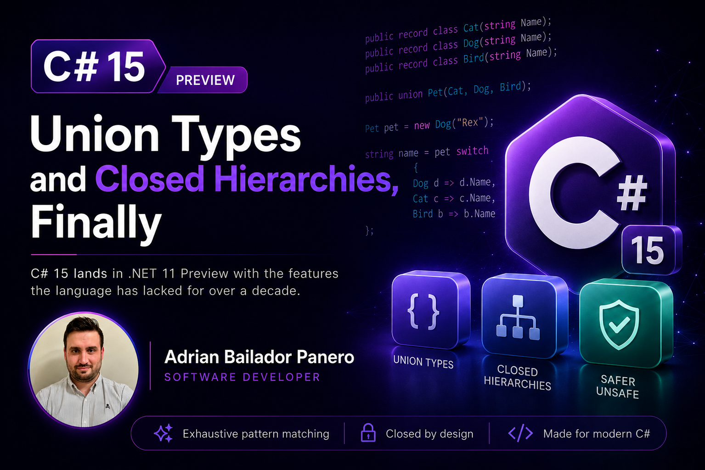

Last year I built a payment gateway integration that needed a result type with three shapes: `Approved(string TransactionId)`, `Declined(string Reason)`, and `RequiresReview(string CaseId)`. None of them share fields. None of them belong in an inheritance hierarchy — a declined payment isn't a kind of approved payment, no matter how hard you squint at the class diagram. What I actually wanted was simple to say and impossible to express: *exactly one of these three, and the compiler yells at me if I forget to handle one.*

C# didn't have that. So we did what every .NET team does. We argued for twenty minutes, then picked between the two usual workarounds: a `PaymentResult` base record with three subclasses and a `default` arm in every switch "just in case", or a dependency on the community `OneOf` package. We went with the base record. The `default` arm threw an `UnreachableException` that, of course, was reached eight months later when someone added a fourth case.

[C# 15](https://learn.microsoft.com/en-us/dotnet/csharp/whats-new/csharp-15), shipping in the .NET 11 previews, finally closes this gap. Real union types. Plus closed hierarchies, which solve a closely related but distinct problem, and the first step of a multi-release rethink of what `unsafe` means. None of it is final — .NET 11 goes GA in November 2026 and the design is still being argued in the open on GitHub — but the shape you learn today is close to what will ship, and it's worth learning now.

## Ten Years of Asking

Discriminated unions have been one of the most requested C# features for as long as the language design has happened in public. F# has had them since its first release. Rust and TypeScript treat them as table stakes. C# has spent a decade approximating them with sealed class hierarchies and pattern matching, which works — right up until you need to combine two types that have nothing to do with each other.

```csharp
// The old workaround: force unrelated shapes into a hierarchy
public abstract record PaymentResult;
public sealed record Approved(string TransactionId) : PaymentResult;
public sealed record Declined(string Reason) : PaymentResult;
public sealed record RequiresReview(string CaseId) : PaymentResult;
```

This is fine. Genuinely — I've shipped it many times, and it will keep being fine after C# 15 lands. But it has two failure modes that only show up later.

The first is the one that bit my team: someone adds a fourth subclass, possibly in a different assembly, and every "exhaustive" switch in the codebase silently stops being exhaustive. No warning. The compiler has no way of knowing the hierarchy was supposed to be complete, because C# has never had a way to say so.

The second is subtler: the workaround only works when the cases plausibly *are* a family. The moment you want a value that's either a `string` or an `Exception`, or an `int` or an `IEnumerable<T>`, inheritance has nothing to offer. You end up with `object` and runtime type checks, and the type system waves goodbye.

## Union Types: The Actual Syntax

A union declares a fixed, closed set of case types with the `union` keyword. The case types don't need to be related to each other in any way:

```csharp
public record class Cat(string Name);
public record class Dog(string Name);
public record class Bird(string Name);

public union Pet(Cat, Dog, Bird);
```

That last line is the whole feature. `Pet` is not a base class, and `Cat` doesn't know `Pet` exists. The union composes existing types into a closed set of alternatives, and the compiler provides implicit conversions from each case type, so assignment reads the way you'd hope:

```csharp
Pet pet = new Dog("Rex");
```

The payoff is in the `switch`. Expressions over a union are checked for exhaustiveness across all case types — no `_` discard, no `default` arm, no silent gap:

```csharp
string name = pet switch
{
    Dog d => d.Name,
    Cat c => c.Name,
    Bird b => b.Name,
    // Remove any one arm and the compiler flags the switch as non-exhaustive.
};
```

This is the behavioural difference that matters. With the hierarchy workaround, exhaustiveness was a convention you maintained by hand and hoped nobody broke. With a union, it's structural — the set of cases is part of the type, and the compiler enforces it on every switch, in every file, forever.

## The Payment Result, Done Properly

Back to my gateway. With union types, the three-shape result becomes:

```csharp
public record class Approved(string TransactionId);
public record class Declined(string Reason);
public record class RequiresReview(string CaseId);

public union PaymentResult(Approved, Declined, RequiresReview);
```

You can attach helper members directly in the union body — useful for logic that belongs with the type rather than being copy-pasted at every call site:

```csharp
public union PaymentResult(Approved, Declined, RequiresReview)
{
    public bool NeedsHumanAttention => Value switch
    {
        RequiresReview => true,
        _ => false
    };
}
```

And consuming it looks exactly like the pattern matching you already write, minus the arm you never trusted:

```csharp
PaymentResult result = ProcessPayment(order);

string message = result switch
{
    Approved a => $"Payment {a.TransactionId} confirmed.",
    Declined d => $"Payment declined: {d.Reason}",
    RequiresReview r => $"Case {r.CaseId} flagged for manual review.",
};
```

No base class. No shared members forced onto types that don't need them. No `default` arm quietly swallowing the case nobody wrote a handler for. When the inevitable fourth case arrives — `Refunded`, it's always `Refunded` — every switch in the codebase fails to compile until someone handles it. That's not an inconvenience. That's the feature.

## The Gotcha: How Unions Actually Store Data

Here's the part the announcement posts tend to bury. In the current preview, a union instance stores its contents as a single `object?` reference internally, and value types get boxed to fit into it. The [.NET Blog's own deep dive](https://devblogs.microsoft.com/dotnet/csharp-15-union-types/) is upfront about this. `Pet` above costs you nothing extra because `Cat`, `Dog`, and `Bird` are already reference types — but a union over `int` and `bool` boxes both, on every assignment.

That makes unions a poor fit for the hot paths where you'd reach for a `struct` specifically to avoid allocation — a tight loop classifying millions of numeric results, say. For request-scoped types like `PaymentResult`, one allocation per payment is noise and you should not think about it twice. Know which of the two situations you're in before you pick a union as a `readonly struct` replacement, because it isn't one.

There's also a null-shaped hole to be aware of: the default value of a union has a `null` `Value`, which won't match any of your case-type arms. If a union can sit uninitialised in a field or array, add an explicit `null` arm or guard against it — exhaustiveness checking can't cover a state that isn't one of the declared cases.

## Closed Hierarchies: The Other Half of the Answer

Unions are for combining unrelated types. Closed hierarchies solve the opposite case: types that *do* share a real inheritance relationship, where the missing piece was telling the compiler the family is complete.

```csharp
public closed record class GateState;
public record class Closed : GateState;
public record class Open(float Percent) : GateState;
```

The `closed` modifier means the class can only be derived from within its declaring assembly — the set of direct descendants is fixed at compile time. And once the compiler knows every subclass, it can do for hierarchies what it does for unions:

```csharp
string Describe(GateState state) => state switch
{
    Closed => "closed",
    Open(var percent) => $"{percent}% open",
    // No warning: every direct descendant of 'GateState' is handled.
};
```

This is the fix for the exact bug that bit my payment gateway. Had `PaymentResult` been a `closed` record, the fourth subclass would have broken the build instead of reaching the unreachable exception in production.

Two details worth knowing before you use it. First, `closed` is implicitly `abstract`, and can't be combined with `sealed`, `static`, or an explicit `abstract` modifier — you're declaring the *hierarchy* closed, not making the base type instantiable. Second, closure isn't transitive: a non-closed subclass of a closed class can still be derived from anywhere. If you want exhaustiveness to hold two levels deep, mark the intermediate classes `closed` too.

One preview wrinkle: as of Preview 5, the runtime doesn't yet ship `ClosedAttribute`, so every project using the modifier has to declare the attribute itself:

```csharp
namespace System.Runtime.CompilerServices;

[AttributeUsage(AttributeTargets.Class, AllowMultiple = false, Inherited = false)]
public sealed class ClosedAttribute : Attribute { }
```

That's not a bug you're working around — it's a language preview shipping slightly ahead of its own runtime support. Expect the workaround to disappear in a later preview.

## Which One Do You Reach For?

The distinction is about relationship, not preference:

- **Reach for a union** when the case types are unrelated, or you don't control all of them — `string | Exception`, or three DTOs that already exist for other reasons and shouldn't be bent into a common base class.
- **Reach for a closed hierarchy** when the cases genuinely are a family with shared behaviour, and you'd have written a base class anyway — `GateState`, an AST node hierarchy, a domain state machine.

My `PaymentResult` works as either, which turns out to be a useful test: if your would-be union cases keep growing shared members, you're actually modelling a closed hierarchy and should switch. If your closed hierarchy's base class stays empty forever, it wanted to be a union.

## The Quiet Third Feature: `unsafe` Gets Redefined

Away from the pattern-matching spotlight, C# 15 also starts a multi-release project to change what `unsafe` actually gates. Today, merely declaring a pointer *type* requires an unsafe context, even if you never dereference it. The new model ties the requirement to the operations that actually touch unmanaged memory — because those are where the vulnerabilities live, and those are what a security reviewer needs to find.

Compiling with `<LangVersion>preview</LangVersion>`, these no longer require `unsafe`:

- Declaring a pointer type and taking an address with `&`
- The `fixed` statement that pins a variable
- Converting a `stackalloc` expression to a pointer
- `sizeof` on any unmanaged type

```csharp
int number = 42;
int* pointer = &number;

int[] numbers = [10, 20, 30];
fixed (int* first = numbers)
{
    // Dereferencing the pointer still requires an unsafe context.
}
```

Dereferencing (`*p`), member access through a pointer (`p->member`), indexing (`p[i]`), and function pointer invocation all remain gated — the point of the redesign is precisely that these stand out while the harmless declarations don't. The full model goes further: `unsafe` on a member will eventually mean *requires-unsafe*, pushing the audit obligation onto callers, with a new `safe` keyword for `extern` members and explicit-layout fields that are provably fine. Both of those come in a later preview.

If you maintain a library with low-level buffer code, track this even before it's final. It changes where your `unsafe` blocks start and end in code that currently over-scopes them just to declare a pointer variable.

## Should You Touch Any of This Today?

In production? No. This needs the .NET 11 preview SDK or Visual Studio 2026 Insiders, `<LangVersion>preview</LangVersion>` in the `.csproj`, and a tolerance for syntax that can still change before GA. The `UnionAttribute` and `IUnion` runtime types only landed in Preview 5, the `ClosedAttribute` workaround is a stopgap by definition, and Microsoft's own docs note that parts of the [unions proposal](https://learn.microsoft.com/en-us/dotnet/csharp/language-reference/builtin-types/union) aren't implemented yet.

But if you're designing a result type, an event payload, or a state hierarchy *right now*, and you're about to write a `OneOf<A, B, C>` or yet another sealed-class-plus-default-arm — it changes the calculation. Keep the workaround thin. Isolate it behind a type you can swap out. The native answer is months away, not years.

## The Fourth Case

That payment gateway is still in production, still running the sealed-record hierarchy, still carrying the `default` arm that threw the "unreachable" exception the day `Refunded` was added. It got a proper handler and a post-mortem, and the arm went back to being unreachable — we think.

When .NET 11 goes GA in November, one of the first pull requests I want to open is the one that turns that hierarchy into a union and deletes that arm. Not because the code is broken today, but because I'd rather the compiler tell me about the fifth case than another post-mortem.

Ten years of asking. It was worth the wait.
