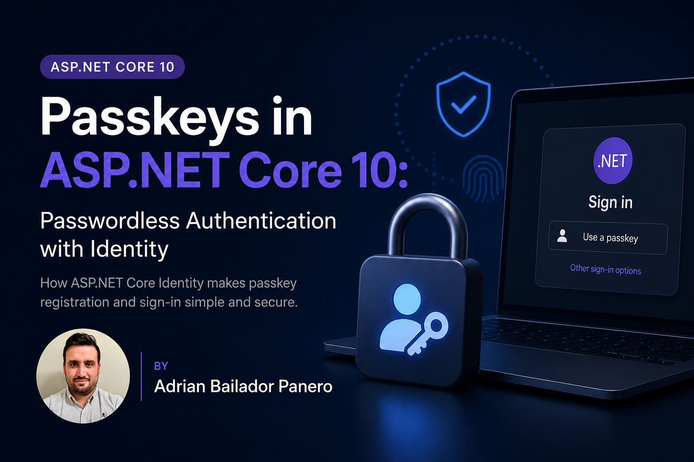

Every password reset flow you've ever built is a small admission of defeat. The user forgot a secret they were never supposed to be able to remember in the first place, so now you're emailing them a time-limited link and hoping nobody intercepts it. Multiply that by a database full of hashed passwords sitting there as a permanent breach liability, and it's no surprise "just get rid of passwords" has been the industry's stated goal for close to a decade.

.NET 10 is the first version where ASP.NET Core Identity can actually do it natively. No third-party WebAuthn package, no hand-rolled FIDO2 ceremony — `SignInManager` and `UserManager` grew new methods that handle passkey registration and authentication directly. It's scoped, it has sharp edges, and it is absolutely not a general-purpose WebAuthn library. But for the scenario most apps actually have — "let our users sign in with Windows Hello / Face ID / a security key instead of a password" — it's now built in.

## Attestation and Assertion, in Plain Terms

WebAuthn has its own vocabulary, and it's worth pinning down before looking at code:

- **Attestation** is registration. The browser asks an authenticator (a platform authenticator like Windows Hello, or a hardware key) to generate a new public/private key pair. The private key never leaves the device. The server gets the public key and stores it.
- **Assertion** is sign-in. The server sends a fresh challenge, the authenticator signs it with the private key it generated during attestation, and the server verifies that signature against the stored public key.

Nothing secret ever crosses the network. There's no password database to breach, because there's no shared secret at all — just public keys that are useless to an attacker without the matching private key locked inside the user's device.

## What ASP.NET Core Identity Actually Supports

The docs are explicit about scope: *"The passkey implementation in ASP.NET Core Identity is deliberately scoped to authentication scenarios. It isn't intended as a general-purpose WebAuthn library."* Concretely, that means three supported scenarios:

- **Adding a passkey to an existing account** — a user with a password-based account registers a passkey as an additional sign-in method.
- **Passwordless account creation** — a new account created with a passkey and no password at all.
- **Passwordless sign-in** — authenticating with only the passkey, no password prompt.

And a few things it deliberately doesn't do:

- No attestation statement validation by default (more on this below).
- No 2FA integration — a passkey is treated as a primary factor, not a second factor.
- Only the Blazor Web App template ships with the UI wired up; MVC/Razor Pages/minimal API projects need to build the client-side flow themselves.

If you need full WebAuthn/FIDO2 compliance — enterprise attestation policies, hardware allowlists, cross-platform ceremony beyond authentication — look at [`fido2-net-lib`](https://github.com/passwordless-lib/fido2-net-lib). What ships in Identity is meant for the 90% case: replacing or supplementing passwords for a normal web app.

## Configuring Passkey Behaviour

Everything is driven by `IdentityPasskeyOptions`:

```csharp
builder.Services.Configure<IdentityPasskeyOptions>(options =>
{
    options.ServerDomain = "contoso.com";                 // Relying Party ID
    options.AuthenticatorTimeout = TimeSpan.FromMinutes(3);
    options.ChallengeSize = 64;                            // bytes, default is 32
    options.UserVerificationRequirement = "required";       // force biometric/PIN
    options.ResidentKeyRequirement = "preferred";           // discoverable credential
});
```

`ServerDomain` matters more than it looks. If you leave it `null`, Identity infers the Relying Party ID from the request's `Host` header — which means your hosting environment (Kestrel, IIS, reverse proxy) *must* validate that header, or you've opened the door to credential-scoping attacks. Set it explicitly in production rather than trusting the default inference.

A passkey registered on `app.contoso.com` also works on any `*.app.contoso.com` subdomain — the browser enforces this, not your code. If you can't guarantee every subdomain under your `ServerDomain` is trustworthy, you need custom origin validation (see below).

## Registration Flow

Registration is a round trip: your server hands the browser a set of creation options, the browser hands those to the authenticator via `navigator.credentials.create()`, and the signed result comes back for your server to verify and persist.

**Server: generate creation options**

```csharp
app.MapPost("/account/passkey-options", async (
    HttpContext context,
    UserManager<ApplicationUser> userManager) =>
{
    var user = await userManager.GetUserAsync(context.User);
    if (user is null)
        return Results.NotFound();

    var userId = await userManager.GetUserIdAsync(user);
    var userName = await userManager.GetUserNameAsync(user) ?? "User";

    var optionsJson = await signInManager.MakePasskeyCreationOptionsAsync(new()
    {
        Id = userId,
        Name = userName,
        DisplayName = userName
    });

    return TypedResults.Content(optionsJson, contentType: "application/json");
});
```

`MakePasskeyCreationOptionsAsync` doesn't just build a JSON blob — it stashes temporary state in an authentication cookie so the server can later confirm the browser's response corresponds to *this specific* challenge, not a replayed one.

That cookie is why this flow assumes a same-origin, server-rendered relationship between the app issuing the challenge and the app completing it. If your frontend is a decoupled SPA (React, Vue, etc.) hosted on its own domain calling this as a separate API — `app.contoso.com` talking to `api.contoso.com`, or worse, a completely different domain — that cookie needs `SameSite=None; Secure` to survive the cross-site request, and your API needs a CORS policy that explicitly allows credentials (`AllowCredentials()`, no wildcard origin). Without both, the browser silently drops the cookie, `PerformPasskeyAttestationAsync` can't find the matching challenge state, and attestation fails with an error that has nothing to do with WebAuthn itself.

**Client: hand the options to the authenticator**

```javascript
async function createPasskey(headers, signal) {
  const response = await fetch('/account/passkey-options', {
    method: 'POST',
    headers,
    signal,
    credentials: 'include', // required whenever the API lives on a different origin
  });
  const optionsJson = await response.json();
  const options = PublicKeyCredential.parseCreationOptionsFromJSON(optionsJson);

  try {
    // Prompts Windows Hello / Touch ID / a security key — entirely browser-handled
    return await navigator.credentials.create({ publicKey: options, signal });
  } catch (err) {
    // NotAllowedError: user cancelled the OS/biometric prompt, or it timed out
    // InvalidStateError: an authenticator for this account already has a credential registered
    // SecurityError: origin doesn't match the configured ServerDomain / RP ID
    console.error('Passkey creation failed:', err.name, err.message);
    throw err;
  }
}
```

**Server: verify and store**

```csharp
app.MapPost("/account/passkey-register", async (
    HttpContext context,
    UserManager<ApplicationUser> userManager,
    [FromBody] string credentialJson) =>
{
    var user = await userManager.GetUserAsync(context.User);

    var attestationResult = await signInManager.PerformPasskeyAttestationAsync(credentialJson);
    if (!attestationResult.Succeeded)
        return Results.BadRequest(attestationResult.Failure.Message);

    var addResult = await userManager.AddOrUpdatePasskeyAsync(user!, attestationResult.Passkey);
    return addResult.Succeeded ? Results.Ok() : Results.BadRequest("Failed to store passkey");
});
```

`PerformPasskeyAttestationAsync` checks the credential type, validates the client data (origin, challenge), inspects the authenticator flags for user presence/verification, and extracts the public key. `AddOrUpdatePasskeyAsync` is also what you call later if you just want to rename a credential — set `passkey.Name` and pass it back through the same method.

Under the hood, this lands in a new `AspNetUserPasskeys` table: credential ID, the owning user, and a JSON blob with the public key material, signature counter, and backup-state flags. A migration against a fresh `IdentityDbContext` picks this up automatically.

## Sign-In Flow

Sign-in mirrors registration, but ends in an authenticated session instead of a stored credential.

```csharp
app.MapPost("/account/passkey-request-options", async (
    UserManager<ApplicationUser> userManager,
    string? username) =>
{
    var user = string.IsNullOrEmpty(username)
        ? null
        : await userManager.FindByNameAsync(username);

    // Pass null for username-less / conditional UI sign-in
    var optionsJson = await signInManager.MakePasskeyRequestOptionsAsync(user);
    return TypedResults.Content(optionsJson, contentType: "application/json");
});

app.MapPost("/account/passkey-signin", async ([FromBody] string credentialJson) =>
{
    var result = await signInManager.PasskeySignInAsync(credentialJson);
    return result.Succeeded ? Results.Ok() : Results.Unauthorized();
});
```

```javascript
async function signInWithPasskey(username, headers, signal) {
  const response = await fetch(`/account/passkey-request-options?username=${username}`, {
    method: 'POST', headers, signal, credentials: 'include'
  });
  const optionsJson = await response.json();
  const options = PublicKeyCredential.parseRequestOptionsFromJSON(optionsJson);

  try {
    return await navigator.credentials.get({
      publicKey: options,
      // 'conditional' shows saved passkeys as native autofill suggestions on the
      // username/email <input> instead of popping a dialog immediately — pair it
      // with autocomplete="username webauthn" on that input and call this on page
      // load with no username, before the user has typed anything
      mediation: 'conditional',
      signal,
    });
  } catch (err) {
    // NotAllowedError: user dismissed the prompt, or the request timed out
    // AbortError: the request was cancelled via the AbortSignal (e.g. a newer request superseded it)
    console.error('Passkey sign-in failed:', err.name, err.message);
    throw err;
  }
}
```

`mediation: 'conditional'` is specifically for the autofill case — call `signInWithPasskey` with an empty username as soon as the login page loads. For a regular "Sign in with a passkey" button that the user clicks explicitly, drop `mediation` (or set it to `'optional'`, the default) so the browser shows its normal picker dialog immediately instead of waiting for autofill.

`PasskeySignInAsync` is the one-call convenience method — it validates the signature against the stored public key, checks the challenge matches, updates the replay-protection counter, and signs the user in. If you need to inspect the result before committing to a sign-in (say, to run additional checks first), drop down to `PerformPasskeyAssertionAsync` directly — just remember to call `AddOrUpdatePasskeyAsync` afterwards yourself, since the updated signature counter isn't persisted automatically at that lower level.

## The Gaps You Need to Know About

**No attestation validation by default.** Identity accepts whatever attestation statement the authenticator provides without verifying it against a trust store. Fine for consumer scenarios; not fine if you need to say "only allow YubiKey 5 series" in an enterprise environment. You can hook in your own check:

```csharp
builder.Services.Configure<IdentityPasskeyOptions>(options =>
{
    options.VerifyAttestationStatement = async context =>
    {
        // Inspect context, compare AAGUID against an allowlist, etc.
        return true;
    };
});
```

**Account recovery is on you.** If a user's only authentication method is a passkey tied to a phone they lose, they're locked out unless you've planned for it. The Blazor Web App template sidesteps this by requiring a backup method (password or external login) at account creation. If you're building passkey-only auth, budget for recovery codes or an email-based recovery flow up front — don't bolt it on after the first support ticket.

**HTTPS is mandatory, not a recommendation.** Passkey ceremony state is stored in encrypted, signed cookies, but they're still cookies — over plain HTTP they're interceptable. There's no way to make this work correctly without TLS in production.

## When to Reach for Something Else

If your requirements are "let users sign in without a password, using their platform authenticator" — this is now the default answer for a new ASP.NET Core project, no extra dependency required. If your requirements include enterprise attestation policies, hardware model allowlisting, or WebAuthn scenarios that go beyond authenticating into your own app (signing documents, step-up auth for high-value transactions with custom ceremony), the built-in support will run out of road quickly, and `fido2-net-lib` or a dedicated identity provider is the better starting point.

## Conclusion

Passkeys in .NET 10 aren't a bolt-on library — they're `SignInManager` and `UserManager` methods sitting right next to the password APIs you already know, backed by a new table in the Identity schema. `MakePasskeyCreationOptionsAsync` / `PerformPasskeyAttestationAsync` handle registration, `MakePasskeyRequestOptionsAsync` / `PasskeySignInAsync` handle sign-in, and the browser's `navigator.credentials` API does the actual cryptographic ceremony without either side of the wire ever seeing a shared secret. The scope is intentionally narrow — no attestation validation, no 2FA role, no template support outside Blazor — but for the passwordless-login scenario most apps actually need, that narrow scope is exactly right.

*Full source code: [github.com/AdrianBailador/PasskeysAspNetCoreIdentityDotnet](https://github.com/AdrianBailador/PasskeysAspNetCoreIdentityDotnet)*

*Questions or suggestions? Open an issue on [GitHub](https://github.com/AdrianBailador/PasskeysAspNetCoreIdentityDotnet/issues).*
