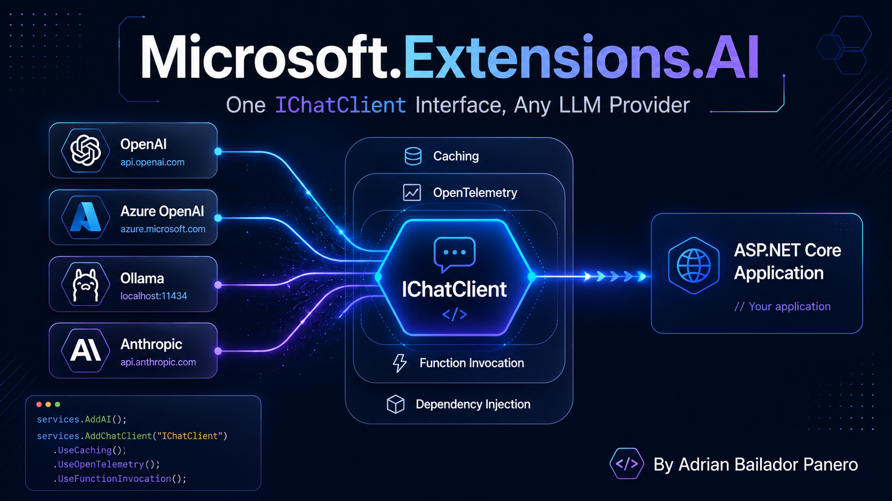

I built a semantic search API a while back on top of raw OpenAI embedding calls, and a local-first assistant on top of Ollama a few months after that. Both projects needed the same things — send messages, get a response, sometimes stream it, sometimes let the model call a function. Both projects ended up with completely different code to do it, because `OpenAIClient` and `OllamaApiClient` don't share a shape. Swapping the provider later — dev on Ollama, staging on Azure OpenAI, a fallback to Anthropic — meant rewriting the call sites, not changing a config value.

That's the exact problem `Microsoft.Extensions.AI` (MEAI) exists to close. It's not a new SDK competing with the provider SDKs — it's a thin, provider-agnostic interface that sits in front of them, plus a set of DI-friendly middleware components (caching, logging, telemetry, automatic tool invocation) that work identically regardless of which model answers on the other end.

## Two Packages, Three Interfaces

`Microsoft.Extensions.AI.Abstractions` defines the contracts and nothing else: `IChatClient`, `IEmbeddingGenerator<TInput,TEmbedding>`, and the experimental `IImageGenerator`. Library authors implement against this package — it's what a provider SDK depends on to plug into the ecosystem.

`Microsoft.Extensions.AI` is the package your application references. It pulls in the abstractions and adds the useful part: the middleware pipeline, DI registration extensions, and the automatic function-calling machinery.

```bash
dotnet add package Microsoft.Extensions.AI
dotnet add package Microsoft.Extensions.AI.Ollama    # or .OpenAI, or Azure's SDK extension
```

Every provider that plugs in — OpenAI, Azure OpenAI, Azure AI Inference, Ollama (via `OllamaSharp`) — exposes an `IChatClient` and/or `IEmbeddingGenerator` for the same abstraction. Swap the constructor, keep every call site.

## IChatClient: Send Messages, Get a Response

At its simplest, this is the whole surface:

```csharp
using Microsoft.Extensions.AI;
using OllamaSharp;

IChatClient client = new OllamaApiClient(new Uri("http://localhost:11434/"), "phi3:mini");

Console.WriteLine(await client.GetResponseAsync("What is AI?"));
```

Real conversations are a list of `ChatMessage`, and the response comes back with the messages the model generated appended to it — you feed those back in on the next turn:

```csharp
List<ChatMessage> history = [];
while (true)
{
    Console.Write("Q: ");
    history.Add(new(ChatRole.User, Console.ReadLine()!));

    ChatResponse response = await client.GetResponseAsync(history);
    Console.WriteLine(response);

    history.AddMessages(response); // appends the assistant's reply to history
}
```

Streaming is the same shape, just an `IAsyncEnumerable<ChatResponseUpdate>` instead of a single `ChatResponse` — the natural fit for `await foreach` that C# has had since `IAsyncEnumerable<T>` landed:

```csharp
await foreach (ChatResponseUpdate update in client.GetStreamingResponseAsync("What is AI?"))
{
    Console.Write(update);
}
```

Nothing here is provider-specific. Point `client` at `OllamaApiClient`, `AzureOpenAIClient.AsChatClient(...)`, or an Anthropic wrapper, and every line above is unchanged.

## The Actual Value: Middleware You Don't Have to Write

Any real app needs more than "call the model." It needs caching so identical prompts don't re-hit a paid API, telemetry so you can see latency and token counts in your observability stack, and often automatic tool invocation. MEAI ships all three as decorators over `IChatClient`, composed with a fluent builder:

```csharp
IChatClient client = new ChatClientBuilder(new OllamaApiClient(new Uri("http://localhost:11434"), "llama3.1"))
    .UseDistributedCache(new MemoryDistributedCache(Options.Create(new MemoryDistributedCacheOptions())))
    .UseFunctionInvocation()
    .UseOpenTelemetry(sourceName: "MyApp.Chat", configure: c => c.EnableSensitiveData = true)
    .Build();
```

Each `Use*` call wraps the previous client — `DistributedCachingChatClient` around `FunctionInvokingChatClient` around `OpenTelemetryChatClient` around your actual provider. Order matters: the outermost layer sees the request first. Put caching outside function invocation and a cached response skips re-running any tool calls entirely; put it inside and you'd cache before tools even execute. For most apps, cache outermost, telemetry innermost — you want to *see* every real call to the model, but you don't want to pay for or wait on ones a cache already answered.

This is precisely the pattern this blog has used for [HybridCache](/blog/61-hybrid-cache-dotnet) and [rate limiting](/blog/52-supabase-rate-limiting) — wrap a cross-cutting concern around a call you don't want to reimplement per call site, once, in a pipeline.

## Wiring It Into DI

For an ASP.NET Core app, register the pipeline once with `AddChatClient` and resolve `IChatClient` anywhere:

```csharp
builder.Services.AddDistributedMemoryCache();
builder.Services.AddChatClient(new OllamaApiClient(new Uri("http://localhost:11434"), "llama3.1"))
    .UseDistributedCache()
    .UseOpenTelemetry();

// Anywhere else in the app
public class SupportEndpoint(IChatClient chatClient)
{
    public Task<ChatResponse> Handle(string question) => chatClient.GetResponseAsync(question);
}
```

If you need more than one model in the same app — a cheap fast model for classification, a stronger one for generation — `AddKeyedChatClient` registers each under a key, resolved with `[FromKeyedServices("classifier")]` or `IServiceProvider.GetRequiredKeyedService<IChatClient>("classifier")`, the same keyed-DI pattern .NET 8 introduced everywhere else.

## Tool Calling Without Writing the Loop Yourself

Function/tool calling used to mean: describe your function's schema by hand, parse the model's function-call response, invoke the method, serialize the result back into the conversation, repeat until the model stops asking. `UseFunctionInvocation()` collapses that whole loop:

```csharp
string GetCurrentWeather() => Random.Shared.NextDouble() > 0.5 ? "It's sunny" : "It's raining";

IChatClient client = new OllamaApiClient(new Uri("http://localhost:11434"), "llama3.1")
    .AsBuilder()
    .UseFunctionInvocation()
    .Build();

ChatOptions options = new() { Tools = [AIFunctionFactory.Create(GetCurrentWeather)] };

await foreach (var update in client.GetStreamingResponseAsync("Should I wear a rain coat?", options))
{
    Console.Write(update);
}
```

`AIFunctionFactory.Create` reflects over the method — name, parameters, doc comments if present — and builds the schema description the model needs. When the model decides to call `GetCurrentWeather`, `FunctionInvokingChatClient` invokes it, feeds the result back, and only returns control to you once the model has produced its actual answer. You never see the intermediate function-call message unless you go looking for it.

This is also the entry point for [MCP tools](/blog/41-MCP) inside an `IChatClient` — an `McpClientTool` from a Model Context Protocol server implements the same `AIFunction` contract, so a tool exposed over MCP and a local C# method sit in the exact same `Tools` list.

> **A quick note on structured outputs.** Tool calling gets the model to invoke *your* code — structured output gets the model's *final answer* to come back as your type instead of prose you then have to regex apart. `Microsoft.Extensions.AI` ships this as `GetResponseAsync<T>`, an extension method that accepts a record or class and returns a `ChatResponse<T>`:
>
> ```csharp
> record TicketClassification(string Category, string Priority, string Summary);
>
> ChatResponse<TicketClassification> response =
>     await chatClient.GetResponseAsync<TicketClassification>(
>         $"Classify this support ticket: {ticketBody}");
>
> Console.WriteLine(response.Result.Category); // strongly typed, no manual JSON parsing
> ```
>
> Under the hood this builds a JSON schema from `T` and sets it on `ChatOptions.ResponseFormat` via `ChatResponseFormat.ForJsonSchema`, then deserializes the result for you. The optional `useJsonSchemaResponseFormat` parameter (default `true`) is what decides whether that schema is handed to the provider's native structured-output mode — the model is constrained to emit valid JSON for your shape — or whether MEAI falls back to asking nicely via the prompt for providers that don't support schema-constrained output. This is the piece that turns "parse the model's text and hope" into a normal typed C# call, and it's what most people reach for `Microsoft.Extensions.AI` for in production once the chat demo is working.

## Writing Your Own Middleware

The `Use*` methods aren't special-cased into the library — they're the same extensibility point you can use yourself, via `DelegatingChatClient`:

```csharp
public sealed class RateLimitingChatClient(IChatClient inner, RateLimiter limiter)
    : DelegatingChatClient(inner)
{
    public override async Task<ChatResponse> GetResponseAsync(
        IEnumerable<ChatMessage> messages, ChatOptions? options = null,
        CancellationToken cancellationToken = default)
    {
        using var lease = await limiter.AcquireAsync(1, cancellationToken);
        if (!lease.IsAcquired)
            throw new InvalidOperationException("Rate limit exceeded.");

        return await base.GetResponseAsync(messages, options, cancellationToken);
    }
}
```

`DelegatingChatClient` forwards everything by default; you override only what you need to change. Package it as a `Use*` extension on `ChatClientBuilder` and it composes with the built-in middleware exactly the same way `UseOpenTelemetry` does.

## Stateless History vs. Stateful Conversations

Not every provider works the same way underneath, and `IChatClient` is deliberately built to cover both. Stateless services (most self-hosted models) need the full message history resent every call — that's the `history.AddMessages(response)` pattern above. Stateful services (some hosted APIs support server-side thread/conversation state) let you pass a `ChatOptions.ConversationId` instead and skip resending history:

```csharp
ChatOptions options = new() { ConversationId = "conversation-123" };
var response = await client.GetResponseAsync(new(ChatRole.User, "Continue where we left off"), options);
```

If you don't know which kind of service you're talking to, check `ChatResponse.ConversationId` after the first call — if it's set, switch to the ID-based pattern and stop resending history; if it's null, keep accumulating messages yourself.

## What This Doesn't Replace

MEAI is an abstraction layer, not an orchestration framework. It doesn't give you agents, planning, or multi-step reasoning graphs — that's [Semantic Kernel](https://github.com/microsoft/semantic-kernel) or the Microsoft Agent Framework, both of which now build *on top of* `IChatClient` rather than defining their own client abstraction. If you already have an agent loop like the one in [the Uncle Bob pipeline post](/blog/62-unclebob-agent-pipeline-dotnet), MEAI is what you'd put underneath it so the loop doesn't care which model is answering.

It also doesn't stop at chat. `IEmbeddingGenerator<string, Embedding<float>>` is the same idea applied to the embedding calls from [the semantic search post](/blog/29-Embeddings-and-AI) — one interface, swappable between `OpenAIClient.AsEmbeddingGenerator("text-embedding-3-small")` and a local `OllamaEmbeddingGenerator`. And chat reduction — trimming or summarizing history once a conversation gets long, via `MessageCountingChatReducer` or `SummarizingChatReducer` — is available too, though still marked experimental as of this writing.

## Conclusion

The fragmentation problem was never really about missing features — every provider SDK could already do chat, streaming, and tool calling. The problem was that "swap providers" meant "rewrite call sites," which made every experiment expensive and every vendor decision permanent-feeling. `Microsoft.Extensions.AI` fixes that by doing what `Microsoft.Extensions.*` has always done for logging, caching, and DI: define the interface once, let the ecosystem implement it, and give you a middleware pipeline so cross-cutting concerns are configured once instead of copy-pasted into every call site. Start a project against `IChatClient` and Ollama on your laptop; ship it against Azure OpenAI without touching a single method that calls the model.
