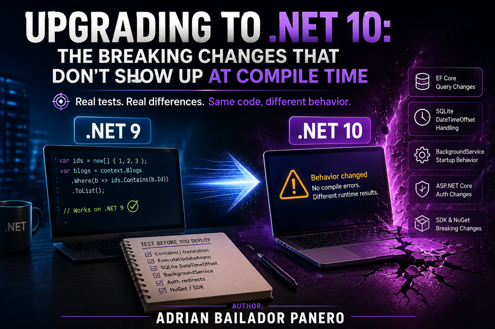

Both .NET 8 and .NET 9 hit end of support on **November 10, 2026**, which is a slightly odd coincidence given .NET 8 is LTS (36 months from its November 2023 release) and .NET 9 is only STS, even with that window stretched to 24 months instead of the usual 18. After that date Microsoft stops shipping security patches for either one — the apps don't stop working, they just quietly stop being anyone's problem to fix.

So if you're still on 8 or 9, that's under three months. The upgrade part is nothing, bump `TargetFramework` to `net10.0`, `dotnet restore`, done in thirty seconds. What actually takes work is everything that changes underneath it without a single line of your own code moving: how EF Core translates a `.Contains()` query, whether one `BackgroundService` failing at startup takes every other hosted service down with it, how `Microsoft.Data.Sqlite` parses a `DateTimeOffset` it's never seen before. I went through Microsoft's breaking-change docs for .NET 10, ASP.NET Core 10, and EF Core 10 and then, instead of just taking the changelog's word for any of it, ran every item myself on both SDKs.

Every SQL statement, `DateTimeOffset` value, and startup log line below came out of that — the same ASP.NET Core + EF Core project, run once on the .NET 9 SDK and once on .NET 10. The project itself, migrations and all, is a companion repo if you want to poke at it yourself: [DotNet10MigrationChecklist](https://github.com/AdrianBailador/DotNet10MigrationChecklist).

Most of the wider .NET 10 breaking-change list you can skip. It's either genuinely obscure (Arm64 SVE nonfaulting loads, LDAP `DirectoryControl` parsing) or a source-incompatible deprecation the compiler points straight at — `WebHostBuilder`, `IWebHost`, and `WebHost` are obsolete now, not that anyone's written `Program.cs` that way since minimal hosting shipped, and `IActionContextAccessor` too. If your project builds warning-free on .NET 9 already, most of this simply won't touch you. What follows is the stuff that doesn't announce itself at compile time.

## EF Core 10

Start with `Contains()`. A query like `context.Blogs.Where(b => ids.Contains(b.Id))` used to translate, in EF 9, to a single JSON array parameter fed through `OPENJSON`. In EF 10 it becomes multiple scalar parameters by default:

```csharp
// EF 9: single JSON parameter
// WHERE [b].[Id] IN (SELECT [value] FROM OPENJSON(@__ids_0))

// EF 10: multiple scalar parameters, same query, no code change
// WHERE [b].[Id] IN (@ids1, @ids2, @ids3)
```

Functionally identical, but the SQL text isn't, and SQL Server's plan cache is keyed on exact text. That means any cached plan for this query goes stale the moment you deploy and gets recompiled on next use — for most workloads that's a one-off cost, invisible past the first request. If the query runs constantly under load, or the collection sizes vary widely enough that you were counting on the old translation's plan-reuse characteristics, it's worth actually watching for rather than assuming away. Re-test if you were leaning on the old `OPENJSON` translation for a reason. On SQLite the same change shows up as `json_each(@__ids_0)` turning into `IN (@ids1, @ids2)`. I ran the identical LINQ query against the identical SQLite database on both EF Core versions in the companion repo, and [EFCORE.md](https://github.com/AdrianBailador/DotNet10MigrationChecklist/blob/main/EFCORE.md#contains) has both outputs pasted straight from the terminal. If a specific query regresses you can pin the old behavior:

```csharp
optionsBuilder.UseSqlServer(connectionString,
    o => o.UseParameterizedCollectionMode(ParameterTranslationMode.Parameter));
```

Parameter names changed shape for the same underlying reason. `@__city_0` is now just `@city`. Harmless for the database itself, but it'll break anything that snapshot-tests generated SQL, or an interceptor parsing `DbCommand.CommandText` for a specific name.

`ExecuteUpdateAsync` no longer takes an expression tree either. If your code was building the column-setters argument with `Expression.Lambda<Func<...>>` to make `SetProperty` calls conditional, that stops compiling now — the parameter's a plain `Func<...>`, which honestly is easier to write anyway. You don't even need the dynamic-expression case to see the difference. Drop a bare `if` inside an `ExecuteUpdateAsync` lambda on EF Core 9 and it fails outright:

```
error CS1643: Not all code paths return a value in lambda expression of type
'Func<SetPropertyCalls<Blog>, SetPropertyCalls<Blog>>'
```

The parameter type is an actual expression tree, and C# expression trees can't hold an `if` statement, full stop. Same code compiles clean on EF Core 10, where the parameter's a real delegate instead:

```csharp
// EF 10 — conditional setters, no expression-tree gymnastics
await context.Blogs.ExecuteUpdateAsync(s =>
{
    s.SetProperty(b => b.Views, 8);
    if (nameChanged)
        s.SetProperty(b => b.Name, "foo");
});
```

Complex type column names also got safer, another way of saying your next migration might not be empty. EF 10 uniquifies column names for complex types that used to collide, and nested complex-type properties now use the full path in the column name (`Complex_NestedComplex_Property` rather than just `NestedComplex_Property`). If you're using owned or complex types, run `dotnet ef migrations add` after upgrading and actually read the diff before applying it. It might rename columns nobody asked it to.

One more that's easy to miss because it only shows up in the terminal, not in code: `dotnet-ef` now requires `--framework` on any project that multi-targets (`<TargetFrameworks>`, plural, rather than `<TargetFramework>`). If you're straddling `net9.0` and `net10.0` during the migration itself — which is exactly when you'd want to keep running migrations — every `dotnet ef` command needs `--framework net10.0` tacked on, or it just refuses with "the project targets multiple frameworks."

The one I'd check first is `Microsoft.Data.Sqlite`. Microsoft marks it High impact, not Low, and for good reason: `GetDateTimeOffset` on a timestamp with no offset now assumes UTC instead of the machine's local time zone, writing a `DateTimeOffset` into a `REAL` column now converts to UTC before writing, and `GetDateTime` on a timestamp that *does* carry an offset now comes back as `DateTimeKind.Utc` instead of `DateTimeKind.Local`. Whether that actually bites you depends on how those values got written and where they get read back. A single-server app that's always written and read offset-less timestamps under the same machine's time zone stays internally consistent either way — nothing to reinterpret if the writer and reader always agreed. The real risk is rows written under one assumption and read back under the other: historical data from before the upgrade, or a fleet of machines in different time zones that previously each resolved "local" differently. That's the case worth going and looking for, not assuming.

I didn't want to take that on faith, so I checked it directly. Wrote the same offset-less timestamp string into the same SQLite database file, read it back once on .NET 9 and once on .NET 10 — same row, same file, only the SDK swapped out. On .NET 9 it came back `+01:00`, my machine's local offset at that exact moment. On .NET 10, `+00:00`. [SQLITE.md](https://github.com/AdrianBailador/DotNet10MigrationChecklist/blob/main/SQLITE.md) has the full walkthrough if you want to reproduce it yourself. While you're auditing what's actually sitting in your database, there's a temporary escape hatch:

```csharp
AppContext.SetSwitch("Microsoft.Data.Sqlite.Pre10TimeZoneHandling", isEnabled: true);
```

## ASP.NET Core 10

Same pattern here as EF Core: most of it is a clean deprecation the compiler will tell you about — `WithOpenApi`, Razor runtime compilation, the `Microsoft.Extensions.ApiDescription.Client` package — except one thing that changes behavior at runtime with no build-time signal at all. Cookie login redirects are now disabled for known API endpoints. Mix cookie auth with minimal API endpoints in the same app and ASP.NET Core 9 would redirect an unauthenticated call to a login page, which is almost never what you actually want from something returning JSON. .NET 10 returns 401 instead. Correct behavior, genuinely, but if anything downstream — a frontend, a test — was quietly depending on that redirect, it just shows up as a different status code with nothing throwing to flag it.

## BackgroundService and configuration

Two more that fall in the same bucket — nothing to compile, nothing that fails a build, just different behavior at runtime once the app is already live. `BackgroundService` now runs the whole of `ExecuteAsync` on a background thread, which it didn't used to. The synchronous portion — everything before the first `await` — ran on the main thread as part of host startup and blocked every other `IHostedService` from starting until it returned. Nobody noticed most of the time because that portion is usually two field assignments. But if one service does anything slow, or throws, before its first `await`, whatever's registered after it just sits there. Or never starts at all.

I checked this one properly: registered two hosted services, made the first throw synchronously before any `await`. On .NET 9 the second service's `ExecuteAsync` never runs — the host fails before it gets a turn. Same code on .NET 10, and the second service starts and logs like nothing happened, because the whole method body now runs on a background thread from the start and the synchronous throw in the first one doesn't block it anymore. The host still stops shortly after either way (`BackgroundServiceExceptionBehavior.StopHost` is still the default), but the other services get a fair shot at starting first now instead of never getting one.

Worth a separate grep: null values are preserved in configuration now. Code checking `IConfiguration["Key"] is null` to tell "not present" apart from "explicitly set to null" in a JSON file gets a real distinction instead of both cases collapsing into the same thing. Check anything reading `appsettings.json` if a config key is legitimately nullable.

## SDK and CI

A `PackageReference` without a version now raises `NU1015` instead of silently resolving to whatever floats, so a bare `<PackageReference Include="SomePackage" />` quietly leaning on central package management you never actually wired up will fail restore outright now rather than picking a version and hoping for the best. NuGet audit sources also stop allowing insecure HTTP by default, so if CI pulls from an internal feed over plain HTTP, `dotnet restore` fails there specifically — and reads like a flaky network for a while before you realize it's the feed URL.

## Migration order

1. Bump `TargetFramework` to `net10.0` on a branch, restore, and read every warning. Most of the "just works" list turns into a compiler warning pointing exactly at the fix.
2. Run `dotnet ef migrations add CheckNet10` on anything using complex or owned types, and read the diff before applying it — if the project still multi-targets `net9.0` and `net10.0` while you're mid-migration, add `--framework net10.0` or the command just refuses to run.
3. Grep for `Microsoft.Data.Sqlite` next to `DateTimeOffset` or `DateTime` if you touch SQLite anywhere. It's the one item on this list that can silently move data underneath you.
4. Deploy to staging and watch how your busiest `Contains()`-based queries behave under load — that's where the plan-cache recompilation would show up, and for most workloads it's a one-off, not a sustained regression, but "most workloads" isn't "yours" until you've actually looked.
5. If you mix cookie auth and API endpoints in the same app, hit an unauthenticated API route by hand and confirm you get a 401, not a redirect.

None of it's exotic. It's just the gap between "the app compiles" and "the app behaves the way it did on .NET 9," and three months is plenty of time to close that gap properly — as long as you go looking for it now instead of the week before November 10.
