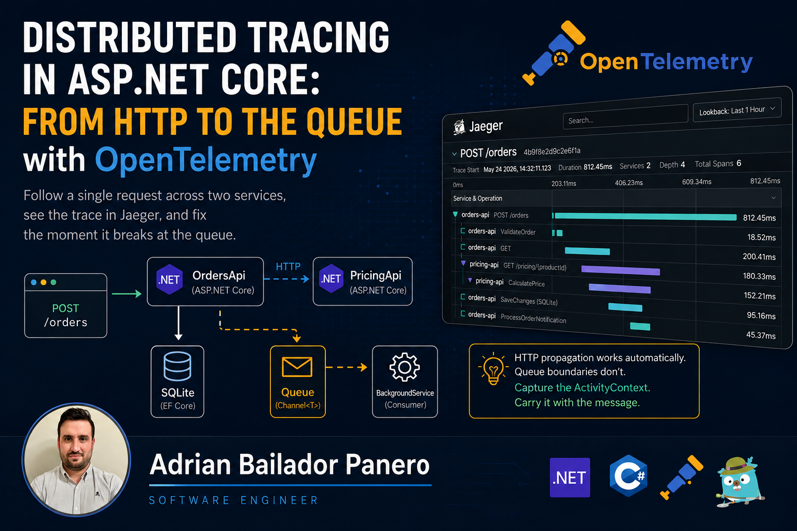
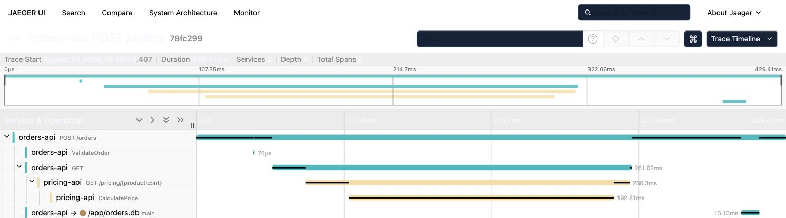

Every health check I've written [answers one question well](/blog/54-health-checks-aspnetcore): is this dependency reachable right now. Every [Kubernetes probe](/blog/55-kubernetes-probes-dotnet) answers a narrower one: should this pod keep receiving traffic. Neither one answers the question that actually pages someone at 2am: *this specific request took 900ms, and which of the four services it touched spent that time doing what?*

This post has one goal: follow a single request across an HTTP call between two real services, then find the exact point where that tracking stops working. It isn't the HTTP call. OpenTelemetry gets that right for free, and I'll show it. It's one hop further, the moment the same request hands off work through a queue. That boundary is where most tracing setups go blind in production, and it's the part no getting-started guide covers, because those guides only ever call one service from another over HTTP.

Everything below comes from running it for real: two ASP.NET Core APIs and Jaeger, wired together with `docker compose up`, no cloud account or agent involved. The repo is linked at the bottom.

## What a trace is actually made of

A **trace** is a tree of **spans**. Each span is one unit of work (an HTTP request, a database call, a block of business logic), with a start time, a duration, and a parent. The thing that makes it a *distributed* trace instead of a pile of unrelated logs is the **W3C Trace Context** standard: a `traceparent` HTTP header carrying the trace ID and the calling span's ID, attached to every outbound request and read by the receiving server to attach its own spans to the same tree.

You don't write that header by hand. `OpenTelemetry.Instrumentation.AspNetCore` reads it on the way in, `OpenTelemetry.Instrumentation.Http` writes it on the way out, and the two packages agree on the format because it's a spec, not a vendor convention. Wire both into two services and the trace crosses the process boundary for free.

## The setup: two services, one trace

The demo is deliberately small: `OrdersApi` receives a request, calls `PricingApi` over HTTP, saves the result to SQLite via EF Core, and queues a notification. `PricingApi` does one thing: compute a price, slowly enough that it shows up as a real span. Here's `OrdersApi`'s OpenTelemetry registration in full:

```csharp
const string ServiceName = "orders-api";
var activitySource = new ActivitySource(ServiceName);

builder.Services.AddOpenTelemetry()
    .ConfigureResource(resource => resource.AddService(
        serviceName: ServiceName,
        serviceVersion: "1.0.0"))
    .WithTracing(tracing => tracing
        .AddSource(ServiceName)
        .AddAspNetCoreInstrumentation()
        .AddHttpClientInstrumentation()
        .AddEntityFrameworkCoreInstrumentation()
        .AddOtlpExporter(otlp =>
        {
            otlp.Endpoint = new Uri(builder.Configuration["Otlp:Endpoint"] ?? "http://localhost:4317");
        }));
```

`AddAspNetCoreInstrumentation` and `AddHttpClientInstrumentation` are the pair that makes cross-process propagation automatic, and `AddEntityFrameworkCoreInstrumentation` (still on a beta version of the package as of this writing) turns `SaveChangesAsync` into its own span without touching a line of the `DbContext`. `AddOtlpExporter` ships everything to Jaeger over gRPC on port 4317, the same OTLP endpoint any other backend (Tempo, Application Insights, Honeycomb) would also accept. Nothing here is Jaeger-specific.

Auto-instrumentation covers "a request happened." It has no idea what your code was actually *doing*, and that's what `ActivitySource` is for. The failure mode when you get this wrong is silent, which is exactly why it pays to be careful. `new ActivitySource(ServiceName)` creates a source your code calls `StartActivity` on; `.AddSource(ServiceName)` is what subscribes the OpenTelemetry SDK to that specific source, by name. Get the two strings out of sync, a typo, a copy-paste from a different service, and `StartActivity` won't throw, won't log anything, it will just return `null`. `ActivitySource.StartActivity` in the base class library checks whether any listener is subscribed before creating anything, and if none is, there's nothing to create. Every `activity?.SetTag(...)` call after that becomes a silent no-op, and the span simply never existed as far as Jaeger is concerned. Using the same `ServiceName` constant for both calls, like the snippet above does, isn't a style choice. It's the whole fix for that class of bug.

With the source wired up, a manual span looks like this:

```csharp
using var activity = activitySource.StartActivity("CalculatePrice");
activity?.SetTag("product.id", productId);
activity?.SetTag("order.quantity", quantity);

var delayMs = Random.Shared.Next(80, 260);
await Task.Delay(delayMs);

activity?.SetTag("pricing.total", (double)total);
```

`PricingApi`'s manual span wraps the actual pricing logic, tagged with the business data that made this particular call take however long it took. `OrdersApi` does the same around its validation step. `SetStatus(ActivityStatusCode.Error, ...)` marks a span as failed when validation rejects the request; that status is what makes a bad request visibly red in the trace waterfall instead of just another green box.

## Reading the actual trace

```bash
docker compose up --build
curl -X POST http://localhost:5080/orders \
  -H "Content-Type: application/json" \
  -d '{"productId": 42, "quantity": 3}'
```

Open `http://localhost:16686`, pick `orders-api` from the service dropdown, and open the `POST /orders` trace. This is a real capture from that exact request, not a mockup:



As a labeled tree, with the durations Jaeger actually reported:

```
POST /orders (429.41ms)
├── ValidateOrder (76µs)
├── GET (261.62ms)                          — orders-api, HttpClient instrumentation
│   └── GET /pricing/{productId:int} (236.3ms)  — pricing-api
│       └── CalculatePrice (192.81ms)           — pricing-api
└── main → /app/orders.db (13.13ms)          — orders-api, EF Core SaveChangesAsync
```

Two things here are easy to get wrong.

The `GET` span (261.62ms) belongs to `orders-api`: it's `HttpClient`'s view of the call, timed from just before the request goes out to just after the response comes back. The `GET /pricing/{productId:int}` span nested inside it (236.3ms) belongs to `pricing-api`: it's the server's view, timed from request received to response sent. The ~25ms difference between them is the two network hops there and back, and in the waterfall it shows up exactly as that: a small gap before the inner bar starts and another after it ends, not a separately labeled span of its own. W3C Trace Context guarantees the two spans link into one trace; it doesn't guarantee the wire time gets its own box.

The other one is that name, `main`. Jaeger's peer label spells out why: `orders-api → /app/orders.db main`. I checked this rather than assumed it: `new SqliteConnection("Data Source=orders.db").Database` returns the literal string `"main"`, always, regardless of what the file is called. That's SQLite's own name for the primary database attached to a connection, and the EF Core instrumentation package reads that `Database` property verbatim as the span name. The actual file path lives in the peer annotation next to it. Yours will say `main` too, on any SQLite database, until the day you `ATTACH` a second one. Small detail, but exactly the kind that trips people up if they've never checked.

## Where it actually breaks

Real systems don't only call one service from another over HTTP; they also hand work off through a queue: publish now, a different process consumes it later. That boundary does not propagate trace context automatically, and the reason is simple: there's no shared execution context between "the request that wrote the message" and "the background loop that reads it," even when both happen to run inside the same process.

I built exactly that boundary into `OrdersApi`. After saving the order, the handler writes a notification onto an in-memory `Channel<T>`, and a `BackgroundService` reads from it separately, a deliberately minimal stand-in for a real message broker, chosen specifically because it makes the failure reproducible without RabbitMQ or Service Bus in the loop:

```csharp
// in the POST /orders handler
var parentContext = propagateTraceContext ? Activity.Current?.Context : null;
await notifications.Writer.WriteAsync(new OrderNotification(order.Id, parentContext));
```

```csharp
// in NotificationBackgroundService
using var activity = activitySource.StartActivity(
    "ProcessOrderNotification",
    ActivityKind.Consumer,
    parentContext: notification.ParentContext ?? default);
```

`OrdersApi__PropagateTraceContext` defaults to `false` in `docker-compose.yml`. With it off, `parentContext` is always `null`, `StartActivity` receives `default(ActivityContext)`, and OpenTelemetry treats that as "no parent": a brand-new root trace. Same order, two disconnected traces in Jaeger:

```
WITHOUT PROPAGATION (default)

  POST /orders ─────────────────────────  Trace A
  ├── ValidateOrder
  ├── GET → CalculatePrice
  └── main

  ProcessOrderNotification ──────────────  Trace B — no parent, no link back


WITH PROPAGATION (OrdersApi__PropagateTraceContext=true)

  POST /orders ─────────────────────────  Trace A
  ├── ValidateOrder
  ├── GET → CalculatePrice
  ├── main
  └── ProcessOrderNotification            — same trace, linked
```

I ran it both ways and confirmed both trees in the Jaeger UI. Flipping the flag doesn't change anything about `Channel<T>` or the `BackgroundService`. The only thing that changes is whether `Activity.Current?.Context`, captured *while still inside the request*, gets carried across the boundary as data instead of being dropped on the floor.

Capture the `ActivityContext` before you hand off, carry it alongside the message (a header, in a real broker), and pass it explicitly to `StartActivity` on the consuming side: that's the honest version of "propagate trace context across a queue." A Service Bus message or a Kafka record needs exactly the same treatment as this in-memory channel, because the underlying problem is identical either way. The consumer's execution context was never connected to the producer's in the first place, and nothing about messaging infrastructure fixes that on its own.

## Correlating logs with the trace

Once `Activity.Current` exists, using it in a log line costs nothing:

```csharp
logger.LogInformation(
    "Created order {OrderId} for product {ProductId} (traceId={TraceId})",
    order.Id, order.ProductId, Activity.Current?.TraceId);
```

One field, and you can go from "I found a slow log line" to "here's the exact trace in Jaeger" without a second observability backend. Paste the trace ID into the search box and you're looking at the same request.

## What I didn't cover

This is instrumentation and propagation: what a trace actually contains and where it breaks. It isn't sampling strategy for production volume, exemplars linking metrics back to traces, or a real message-broker integration instead of the in-memory stand-in. Those are the next layer once the basic shape is solid, and the `ActivityContext`-capture pattern above is the same one you'd reach for in each case.

Full working code (both services, the Dockerfiles, `docker-compose.yml`, and the toggle to flip between the broken and fixed trace) is in the companion repo: [opentelemetry-tracing-dotnet](https://github.com/AdrianBailador/opentelemetry-tracing-dotnet).
