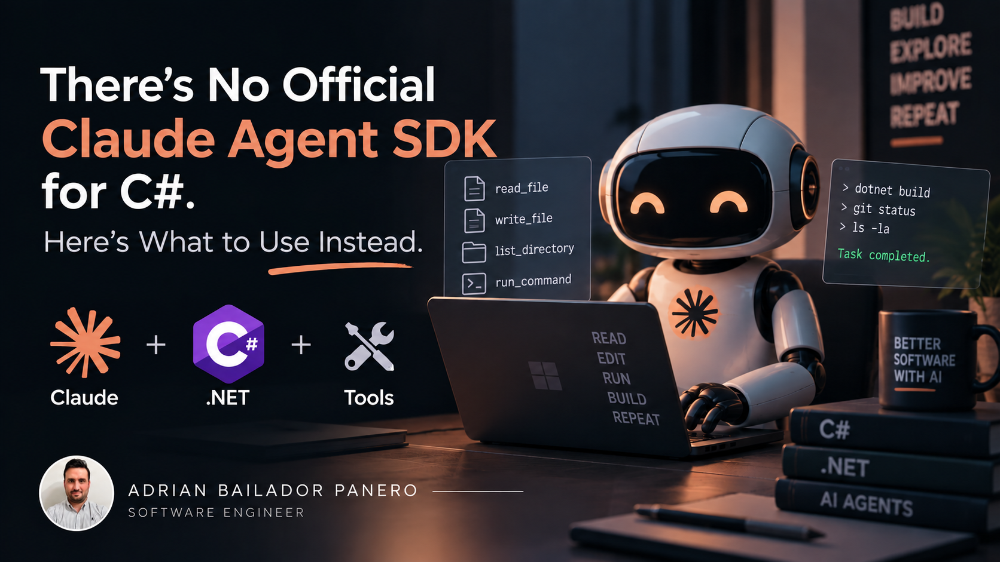
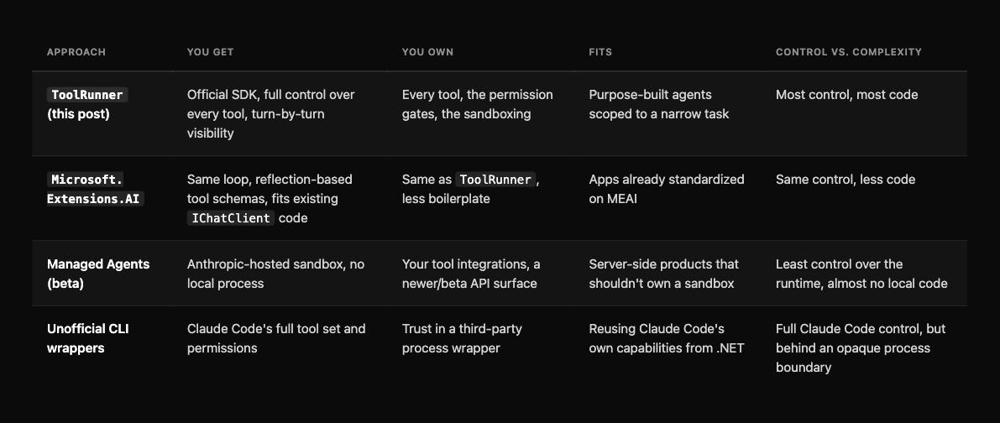

I went looking for the C# equivalent of the [Claude Agent SDK](https://code.claude.com/docs/en/agent-sdk/overview): the package Anthropic ships for Python and TypeScript that wraps Claude Code's tool-use loop, permission system, and subagents into something you can embed in your own app. There isn't one, and Anthropic's own docs say so without hedging: "The SDK is available as a library for Python and TypeScript only. To drive the same agent loop from another language, run the CLI as a subprocess." C# doesn't get a smaller version of the Agent SDK. It gets something else entirely: Anthropic's [SDK comparison page](https://platform.claude.com/docs/en/cli-sdks-libraries/overview) files the `Anthropic` NuGet package under "Client SDK", the same category as Python, TypeScript, Go, Java, PHP, and Ruby, a general-purpose Messages API client, not an agent runtime.

That distinction is the reason this post exists. What I didn't expect is that the Client SDK for C# already contains the piece that matters. Buried in `anthropic-sdk-csharp`'s own examples is `client.Beta.Messages.ToolRunner`: a helper that runs the full agentic loop (send messages → model asks for a tool → you run it → feed the result back → repeat) for you, against tools you define. It shipped in the SDK back in April 2026 (v12.16.0) and it's still getting feature work in the latest release as of this writing (v12.49.0, from the day before this post), so it isn't some abandoned corner of the beta namespace it lives in. The thesis here isn't "here's a workaround for a missing SDK." It's that you don't need an Agent SDK to build an agent in C#, because the Client SDK you'd install anyway already exposes the loop.

This post builds a small but real coding agent on top of it (one that can read files, list a directory, write files, and run shell commands against a workspace), then compares that path against the other two options that exist today: wrapping the same loop in `Microsoft.Extensions.AI`, and the unofficial .NET ports of the Claude Code CLI itself.

## Code

Both versions built below are runnable end to end in a companion repo: [claude-agent-csharp](https://github.com/AdrianBailador/claude-agent-csharp). It has `ToolRunnerAgent` for the raw SDK loop and `MeaiAgent` for the `Microsoft.Extensions.AI` version, same four tools, same scoped workspace, same confirmation gates. Both build clean against .NET 10, pinned to `Anthropic` 12.49.0 and `Microsoft.Extensions.AI` 10.10.0, whatever `dotnet add package` resolves to today; you only need an `ANTHROPIC_API_KEY` to run them.

## What "agent" means here

A chat client answers questions. An agent decides which of *your* functions to call, in what order, based on what previous calls returned, until it thinks the task is done, without you writing the branching logic for that decision yourself.

The mechanics behind every implementation of that idea are the same three steps, repeated:

1. Send the conversation to the model, along with a list of tools it's allowed to use.
2. If the model's response contains a `tool_use` block instead of (or alongside) text, run the tool locally and send the result back as a `tool_result` block.
3. Repeat until the model responds with `stop_reason: "end_turn"` (no more tools requested).

`ToolRunner` implements exactly that loop. You give it the initial request and a list of tools; it hands you back one message per turn as an `IAsyncEnumerable`, running your tool code in between.

## Defining a tool

A tool for `ToolRunner` is a `BetaRunnableTool`: a JSON Schema description the model reads, plus a `Run` delegate that executes when the model asks for it. Here's `read_file`, scoped to a workspace directory so the agent can't read arbitrary paths on the host:

```csharp
using System.Text.Json;
using Anthropic;
using Anthropic.Helpers.Beta;
using Anthropic.Models.Beta.Messages;

var client = new AnthropicClient();
var workspaceRoot = Path.GetFullPath("./workspace");

string ResolveInWorkspace(string relativePath)
{
    var fullPath = Path.GetFullPath(Path.Combine(workspaceRoot, relativePath));
    if (!fullPath.StartsWith(workspaceRoot, StringComparison.Ordinal))
        throw new UnauthorizedAccessException($"'{relativePath}' escapes the workspace.");
    return fullPath;
}

var readFileTool = new BetaRunnableTool
{
    Name = "read_file",
    Definition = new BetaTool
    {
        Name = "read_file",
        Description = "Reads a UTF-8 text file from the workspace and returns its contents.",
        InputSchema = new InputSchema
        {
            Properties = new Dictionary<string, JsonElement>
            {
                ["path"] = JsonSerializer.SerializeToElement(
                    new { type = "string", description = "Path relative to the workspace root" }),
            },
            Required = ["path"],
        },
    },
    Run = (toolUse, _) =>
    {
        var path = toolUse.Input["path"].GetString()!;
        var content = File.ReadAllText(ResolveInWorkspace(path));
        return Task.FromResult<BetaToolResultBlockParamContent>(content);
    },
};
```

`list_directory` follows the same shape (one string input, one string result):

```csharp
var listDirectoryTool = new BetaRunnableTool
{
    Name = "list_directory",
    Definition = new BetaTool
    {
        Name = "list_directory",
        Description = "Lists files and subdirectories at a path inside the workspace.",
        InputSchema = new InputSchema
        {
            Properties = new Dictionary<string, JsonElement>
            {
                ["path"] = JsonSerializer.SerializeToElement(
                    new { type = "string", description = "Path relative to the workspace root, or \".\" for the root" }),
            },
            Required = ["path"],
        },
    },
    Run = (toolUse, _) =>
    {
        var path = toolUse.Input["path"].GetString()!;
        var entries = Directory.GetFileSystemEntries(ResolveInWorkspace(path))
            .Select(Path.GetFileName);
        return Task.FromResult<BetaToolResultBlockParamContent>(string.Join("\n", entries));
    },
};
```

The two tools that matter more are the ones that change something.

## The tools that touch the filesystem and the shell need a gate

Anything that reads is safe to auto-run. Anything that writes a file or executes a command isn't. Not because the model is untrustworthy, but because a wrong guess (a bad path, a destructive one-liner) is exactly the kind of thing that shouldn't happen without a human in the loop, the same principle behind [failing safe on exceptions](/blog/51-Exception-Security) rather than trusting input by default.

`write_file` asks before it writes:

```csharp
var writeFileTool = new BetaRunnableTool
{
    Name = "write_file",
    Definition = new BetaTool
    {
        Name = "write_file",
        Description = "Writes UTF-8 text to a file in the workspace, creating directories as needed.",
        InputSchema = new InputSchema
        {
            Properties = new Dictionary<string, JsonElement>
            {
                ["path"] = JsonSerializer.SerializeToElement(new { type = "string" }),
                ["content"] = JsonSerializer.SerializeToElement(new { type = "string" }),
            },
            Required = ["path", "content"],
        },
    },
    Run = async (toolUse, ct) =>
    {
        var path = toolUse.Input["path"].GetString()!;
        var content = toolUse.Input["content"].GetString()!;
        var fullPath = ResolveInWorkspace(path);

        Console.WriteLine($"\n  [confirm] write {content.Length} chars to '{path}'? (y/n)");
        if (Console.ReadLine()?.Trim().ToLowerInvariant() != "y")
            return "The user declined this write.";

        Directory.CreateDirectory(Path.GetDirectoryName(fullPath)!);
        await File.WriteAllTextAsync(fullPath, content, ct);
        return $"Wrote {content.Length} characters to {path}.";
    },
};
```

`run_command` adds a second gate on top of confirmation: an allowlist, so the model can't even propose something outside a known set of programs.

```csharp
using System.Diagnostics;

var allowedPrograms = new HashSet<string> { "dotnet", "git", "ls" };

var runCommandTool = new BetaRunnableTool
{
    Name = "run_command",
    Definition = new BetaTool
    {
        Name = "run_command",
        Description = "Runs an allowlisted shell command inside the workspace and returns its output.",
        InputSchema = new InputSchema
        {
            Properties = new Dictionary<string, JsonElement>
            {
                ["command"] = JsonSerializer.SerializeToElement(new { type = "string" }),
            },
            Required = ["command"],
        },
    },
    Run = async (toolUse, ct) =>
    {
        var command = toolUse.Input["command"].GetString()!;
        var program = command.Split(' ', 2)[0];
        if (!allowedPrograms.Contains(program))
            return $"Blocked: '{program}' is not on the allowlist.";

        Console.WriteLine($"\n  [confirm] run '{command}' in {workspaceRoot}? (y/n)");
        if (Console.ReadLine()?.Trim().ToLowerInvariant() != "y")
            return "The user declined this command.";

        var psi = new ProcessStartInfo(OperatingSystem.IsWindows() ? "cmd.exe" : "/bin/sh")
        {
            ArgumentList = { OperatingSystem.IsWindows() ? "/c" : "-c", command },
            WorkingDirectory = workspaceRoot,
            RedirectStandardOutput = true,
            RedirectStandardError = true,
        };

        using var process = Process.Start(psi)!;
        var stdout = await process.StandardOutput.ReadToEndAsync(ct);
        var stderr = await process.StandardError.ReadToEndAsync(ct);
        await process.WaitForExitAsync(ct);
        return $"{stdout}\n{stderr}".Trim();
    },
};
```

Neither gate is optional in practice. The allowlist stops the model from ever proposing `rm -rf` in the first place; the confirmation stops a legitimate-looking `git` or `dotnet` command from running unattended before you've read it. This is also the exact gap the CLI-wrapper SDKs in the last section fill for you automatically: Claude Code's own permission system already does this, with hooks and an `allowedTools` config, so you don't hand-roll it. Building on `ToolRunner` directly means you own this layer yourself.

## Wiring it into the loop

With the tools defined, running the agent is the part `ToolRunner` was built for:

```csharp
var runner = client.Beta.Messages.ToolRunner(
    new MessageCreateParams
    {
        Model = Anthropic.Models.Messages.Model.ClaudeSonnet5,
        MaxTokens = 4096,
        Messages =
        [
            new()
            {
                Role = Role.User,
                Content = "Add a .gitignore for a .NET project to the workspace, then run `git status`.",
            },
        ],
    },
    [readFileTool, listDirectoryTool, writeFileTool, runCommandTool]
);

await foreach (var message in runner)
{
    foreach (var block in message.Content)
    {
        if (block.TryPickText(out var text))
            Console.WriteLine(text.Text);
    }
}
```

Each iteration of `await foreach` is one full model turn. Behind the scenes, every `tool_use` block in that turn gets matched to the tool by name, run, and its result appended as a `tool_result` before the next request goes out. The loop keeps advancing on its own until the model has nothing left to ask for.

## The same loop through Microsoft.Extensions.AI

If you're already on the `IChatClient` abstraction from [the MEAI post](/blog/66-microsoft-extensions-ai-ichatclient), you don't need `ToolRunner` at all. `UseFunctionInvocation()` gives you the same loop, driven off C# methods instead of hand-written JSON Schema:

```csharp
using System.ComponentModel;
using Anthropic;
using Microsoft.Extensions.AI;

[Description("Reads a UTF-8 text file from the workspace and returns its contents.")]
string ReadFile([Description("Path relative to the workspace root")] string path) =>
    File.ReadAllText(ResolveInWorkspace(path));

[Description("Writes UTF-8 text to a file in the workspace, after confirmation.")]
string WriteFile(string path, string content)
{
    Console.WriteLine($"\n  [confirm] write {content.Length} chars to '{path}'? (y/n)");
    if (Console.ReadLine()?.Trim().ToLowerInvariant() != "y")
        return "The user declined this write.";

    var fullPath = ResolveInWorkspace(path);
    Directory.CreateDirectory(Path.GetDirectoryName(fullPath)!);
    File.WriteAllText(fullPath, content);
    return $"Wrote {content.Length} characters to {path}.";
}

IChatClient chatClient = new AnthropicClient()
    .AsIChatClient("claude-sonnet-5")
    .AsBuilder()
    .UseFunctionInvocation()
    .Build();

ChatOptions options = new() { Tools = [AIFunctionFactory.Create(ReadFile), AIFunctionFactory.Create(WriteFile)] };

var response = await chatClient.GetResponseAsync(
    "Add a .gitignore for a .NET project to the workspace, then show me its contents.", options);

Console.WriteLine(response);
```

`AIFunctionFactory.Create` reflects over the method signature and `[Description]` attributes to build the schema `ToolRunner` needed you to write by hand. The trade-off is visibility: `ToolRunner` hands you every intermediate turn as you iterate; `FunctionInvokingChatClient` runs the whole loop internally and gives you the final answer, with the intermediate tool-call and tool-result messages available on the response afterward rather than streamed to you as they happen. Pick `ToolRunner` when you want to observe or interrupt the loop turn by turn; pick MEAI when you already have the abstraction in place and just want the result.

## Where this doesn't reach: Managed Agents and the CLI wrappers

Two other options exist, worth knowing about even though this post doesn't use them.

### Managed Agents

This is Anthropic's own hosted alternative, also in the C# SDK's beta namespace (`Anthropic.Models.Beta.Agents`, `.Environments`, `.Sessions`). You create an `Environment`, an `Agent`, and a `Session`, then stream session events until the agent goes idle. Anthropic runs the sandbox; you don't manage a local process or a workspace directory at all. It's a heavier commitment: server-side state, a different mental model (sessions and events, not messages and tool calls), and still a beta surface, so I haven't put it in front of a real workload yet.

### The unofficial CLI wrappers

These take a different approach entirely: they shell out to the actual Claude Code CLI and expose its output as a .NET API. There are at least three separate projects along these lines, `claude-agent-sdk-dotnet` (variations of that name from `gunpal5`, `0xeb`, and `AJGit`) and `claude-code-sdk-csharp` (from `zxyao145` and `VeyDlin`). That gets you Claude Code's full tool set (file edits, bash, web fetch, subagents) and its permission system for free, at the cost of a CLI dependency and trusting a third-party wrapper around it. I haven't run any of them against a real task, so treat that as a lead to evaluate rather than a recommendation: check activity and issue history before depending on one.



## Conclusion

The absence of an official "Claude Agent SDK" package for C# isn't the gap it first looks like. The loop that package exists to hide is a few dozen lines against `ToolRunner`, and the primitive is already in the SDK you'd install anyway. What C# doesn't have yet is the higher-level layer Python and TypeScript get for free: built-in permission modes, hooks, and subagents, the parts that turn a tool-use loop into something like Claude Code itself. Until Anthropic decides to ship that, the honest answer is that you're the one who builds it, and now you know exactly how much of it you'd have to build yourself.
