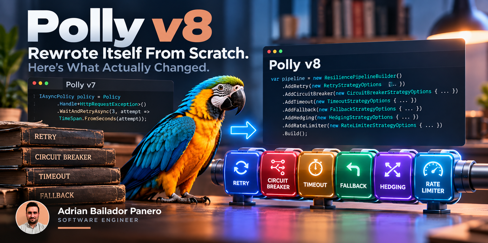

Polly showed up briefly in [an earlier post on modernising a legacy enterprise codebase](/blog/63-modernising-enterprise-dotnet) on this blog, wiring resilience into a set of external calls that used to fail with nothing but a bare try/catch. It deserved more room than a section of a bigger post, because v8 wasn't an incremental update to v7. It didn't just add features to the fluent `Policy` API: it introduced a different resilience model, built around one pipeline of composable strategies instead of one policy object per concern.

If you learned Polly on `Policy.Handle<SomeException>().WaitAndRetryAsync(...)`, returning an `IAsyncPolicy` you awaited directly, none of that exists in current Polly. Every strategy (retry, circuit breaker, timeout, fallback, hedging, rate limiting) now composes through a single `ResiliencePipelineBuilder`, producing one `ResiliencePipeline` you execute once. This post covers what changed, the strategies you get, and how to test the two trickiest ones (retry and circuit breaker) without a test suite that waits out real delays.

## Code

Three pipelines, each with its own tests, are runnable in a companion repo: [polly-v8-dotnet](https://github.com/AdrianBailador/polly-v8-dotnet). All 6 tests pass; run five times in a row while writing this post, the suite finished in 206-210ms every time. Pinned to `Polly.Core` 8.8.0.

## What actually changed

Polly v7's model built a policy object through a fluent chain rooted in a static `Policy` factory, and that object was the thing you executed:

```csharp
// v7 - no longer how current Polly works
IAsyncPolicy policy = Policy
    .Handle<HttpRequestException>()
    .WaitAndRetryAsync(3, attempt => TimeSpan.FromSeconds(attempt));

var result = await policy.ExecuteAsync(() => CallServiceAsync());
```

v8 replaces the policy object with a pipeline built from named strategies, each configured through its own options type:

```csharp
ResiliencePipeline pipeline = new ResiliencePipelineBuilder()
    .AddRetry(new RetryStrategyOptions
    {
        MaxRetryAttempts = 3,
        Delay = TimeSpan.FromSeconds(1),
        BackoffType = DelayBackoffType.Exponential,
    })
    .Build();

var result = await pipeline.ExecuteAsync(ct => CallServiceAsync(ct));
```

The difference is more than syntax. A `ResiliencePipeline` is built once and reused; strategies compose by adding them to the same builder instead of nesting policy-wrap calls; and every strategy shares the same `ExecuteAsync` shape instead of each policy type having its own execution quirks. The vocabulary maps over, but not one-to-one: `Policy` becomes `ResiliencePipelineBuilder`, `IAsyncPolicy` becomes `ResiliencePipeline`, and `Policy.Handle<T>()` becomes a `ShouldHandle` predicate (built with `new PredicateBuilder().Handle<T>()`) set on each strategy's own options. Code written against the v7 `Policy` API won't compile unchanged against the v8 `Polly.Core` API; the pipeline has to be rebuilt around strategies, not just renamed.

## The six strategies

Per [Polly's own strategy reference](https://www.pollydocs.org/strategies/index.html), the six built-in strategies split into two groups. Reactive strategies respond to a failure that already happened: [Retry](https://www.pollydocs.org/strategies/retry.html) re-runs the operation after a delay, [Circuit Breaker](https://www.pollydocs.org/strategies/circuit-breaker.html) stops calling a dependency for a period once failures cross a threshold, [Fallback](https://www.pollydocs.org/strategies/fallback.html) returns an alternative value or runs an alternative action on failure, and [Hedging](https://www.pollydocs.org/strategies/hedging.html) runs parallel attempts and takes whichever finishes first. Proactive strategies prevent a failure from taking too long or too much: [Timeout](https://www.pollydocs.org/strategies/timeout.html) guarantees the caller doesn't wait past a limit, and [Rate Limiter](https://www.pollydocs.org/strategies/rate-limiter.html) caps how many executions run at once. Rate Limiter is the odd one out in the list: its `RateLimiterStrategyOptions` (namespace `Polly.RateLimiting`) is a thin wrapper over the separate `System.Threading.RateLimiting` package rather than a Polly-native implementation.

Any number of these compose into one pipeline via repeated `.Add*()` calls on the same builder.

## Retry, tested without waiting

The pipeline builder lets you provide a `TimeProvider`, which Polly's time-based strategies (retry delays, circuit breaker durations, timeouts) read instead of the real clock. Strategies that don't deal in time ignore it entirely.

```csharp
public sealed class RetryDemo
{
    private readonly ResiliencePipeline _pipeline;

    public RetryDemo(TimeProvider timeProvider)
    {
        _pipeline = new ResiliencePipelineBuilder
        {
            TimeProvider = timeProvider,
        }
        .AddRetry(new RetryStrategyOptions
        {
            MaxRetryAttempts = 2,
            Delay = TimeSpan.FromSeconds(1),
            BackoffType = DelayBackoffType.Constant,
        })
        .Build();
    }

    public Task<string> CallAsync(Func<CancellationToken, ValueTask<string>> operation, CancellationToken cancellationToken = default) =>
        _pipeline.ExecuteAsync(operation, cancellationToken).AsTask();
}
```

Coming from v7's `Policy.Handle<HttpRequestException>()`, the obvious question is where the equivalent goes here. `RetryStrategyOptions` has a `ShouldHandle` predicate for exactly that, and `RetryDemo` above doesn't set it on purpose: left unset, it defaults to handling any exception except `OperationCanceledException`. Narrowing it to specific exception types is a `ShouldHandle = new PredicateBuilder().Handle<HttpRequestException>()` away, the same predicate shape used for the circuit breaker below.

In tests, that `TimeProvider` is a `FakeTimeProvider` from `Microsoft.Extensions.TimeProvider.Testing`:

```csharp
var timeProvider = new FakeTimeProvider();
var demo = new RetryDemo(timeProvider);
var attempts = 0;

var callTask = demo.CallAsync(_ =>
{
    attempts++;
    if (attempts < 3) throw new InvalidOperationException("flaky");
    return ValueTask.FromResult("ok");
});

for (var i = 0; i < 2; i++)
{
    await Task.Delay(10); // let the pipeline's continuation register its delay timer
    timeProvider.Advance(TimeSpan.FromSeconds(1));
}

var result = await callTask;
```

Two full one-second delays, compressed into a test that runs in 63ms. The `Task.Delay(10)` is a real, small wait: the retry continuation needs an actual turn of the async scheduler to register its delay timer before `Advance()` has anything to fast-forward past. Skip it and the advance can race ahead of the pipeline and do nothing. The 10ms itself isn't the point, and isn't a number to copy verbatim into every test; what matters is yielding long enough for the pipeline to schedule its timer before advancing past it, and the smallest reliable yield can differ by scenario.

## Circuit breaker, asserted by state instead of by exception

A circuit breaker over an unreliable dependency, with its state provider exposed directly rather than inferred from catching the right exception:

```csharp
public sealed class CircuitBreakerDemo
{
    private readonly ResiliencePipeline _pipeline;

    public CircuitBreakerStateProvider StateProvider { get; } = new();

    public CircuitBreakerDemo(TimeProvider timeProvider)
    {
        _pipeline = new ResiliencePipelineBuilder
        {
            TimeProvider = timeProvider,
        }
        .AddCircuitBreaker(new CircuitBreakerStrategyOptions
        {
            FailureRatio = 0.5,
            MinimumThroughput = 4,
            SamplingDuration = TimeSpan.FromSeconds(10),
            BreakDuration = TimeSpan.FromSeconds(5),
            ShouldHandle = new PredicateBuilder().Handle<InvalidOperationException>(),
            StateProvider = StateProvider,
        })
        .Build();
    }

    public Task<string> CallAsync(Func<CancellationToken, ValueTask<string>> operation, CancellationToken cancellationToken = default) =>
        _pipeline.ExecuteAsync(operation, cancellationToken).AsTask();
}
```

The test sends enough failures to cross `MinimumThroughput` at a 100% failure rate, confirms the circuit opened, confirms an open circuit refuses to even invoke the delegate, then fast-forwards straight past `BreakDuration` to confirm recovery:

```csharp
for (var i = 0; i < 4; i++)
{
    await Assert.ThrowsAsync<InvalidOperationException>(() =>
        demo.CallAsync(_ => throw new InvalidOperationException("down")));
}

Assert.Equal(CircuitState.Open, demo.StateProvider.CircuitState);

timeProvider.Advance(TimeSpan.FromSeconds(5)); // BreakDuration, no real waiting

var result = await demo.CallAsync(_ => ValueTask.FromResult("ok"));
Assert.Equal(CircuitState.Closed, demo.StateProvider.CircuitState);
```

Five simulated seconds of recovery, asserted by reading `CircuitState.Closed` directly, in 20ms.

## Where FakeTimeProvider stops being practical

Not every timing interaction is worth faking. A `Timeout` strategy races an in-flight operation against a timer built from the same `TimeProvider`; to test that race deterministically, the operation itself would also need to be driven by the fake clock, which means the exact interleaving the test controls stops looking anything like the code under test.

The companion repo's ordering demo tests this honestly instead: small *real* delays, tens of milliseconds, rather than a fake clock. It's the one place in the repo where `FakeTimeProvider` isn't used, and the reason is worth stating plainly rather than glossing over: some timing interactions are genuinely harder to fake than to just run fast for real.

That demo exists to prove a specific, verified point about strategy order. Building the same two strategies, Retry and Timeout, in opposite order produces different behavior:

```csharp
// Retry outside, Timeout inside: each attempt gets its own budget
new ResiliencePipelineBuilder { TimeProvider = timeProvider }
    .AddRetry(retryOptions)
    .AddTimeout(perAttemptTimeout)
    .Build();

// Timeout outside, Retry inside: one deadline covers every attempt and delay combined
new ResiliencePipelineBuilder { TimeProvider = timeProvider }
    .AddTimeout(overallTimeout)
    .AddRetry(retryOptions)
    .Build();
```

| Pipeline | Timeout applies to | Result |
|---|---|---|
| Retry outside, Timeout inside | Each attempt individually | Every retry gets a fresh timeout window |
| Timeout outside, Retry inside | The whole pipeline | One deadline covers every attempt and delay combined |

Per [Polly's pipeline documentation](https://www.pollydocs.org/pipelines/index.html), the first shape gives each retry attempt its own timeout window; if an attempt times out, the retry strategy catches it and the next attempt starts with a fresh clock. The second shape puts one overarching deadline across the whole sequence; if that deadline elapses mid-retry, the entire pipeline is cancelled, even if the retry strategy still had attempts left. The companion repo's tests prove both directions with real numbers: an inner 30ms timeout lets all 3 attempts run to individual completion (215ms total, including two real delays), while an outer 70ms deadline cuts a 5-retry sequence off after 2-3 attempts instead of the roughly 150ms it would take to exhaust naturally.

This is the same lesson [Microsoft.Extensions.AI's middleware ordering](/blog/66-microsoft-extensions-ai-ichatclient) already taught on this blog, applied to a different pipeline: what you compose matters less than the order you compose it in.

## The version most people actually use

Most .NET code doesn't hand-build a `ResiliencePipeline` for every `HttpClient` call. `Microsoft.Extensions.Http.Resilience`'s `AddStandardResilienceHandler()` wires a pre-composed pipeline (rate limiter, an overall timeout, retry, circuit breaker, and a per-attempt timeout) directly onto `IHttpClientBuilder`:

```csharp
services.AddHttpClient("my-client")
    .AddStandardResilienceHandler();
```

Five of the six strategies from this post, combined into one line. The naming alone, a "total" timeout alongside a separate "attempt" timeout, is the same outer/inner distinction the ordering demo above proves with real numbers.

## Conclusion

The fluent `Policy` API most Polly tutorials still show isn't how current Polly works: code written against the v7 `Policy` API won't compile unchanged against the v8 `Polly.Core` API, because the pipeline it builds is a different shape, not just a renamed one. What that shape buys you: six composable strategies with one execution shape, a `TimeProvider` hook that turns retry and circuit breaker tests from multi-second waits into single-digit or low double-digit milliseconds, and a pipeline model precise enough that changing two lines of ordering is the entire difference between a per-attempt timeout and a deadline over your whole retry sequence.
