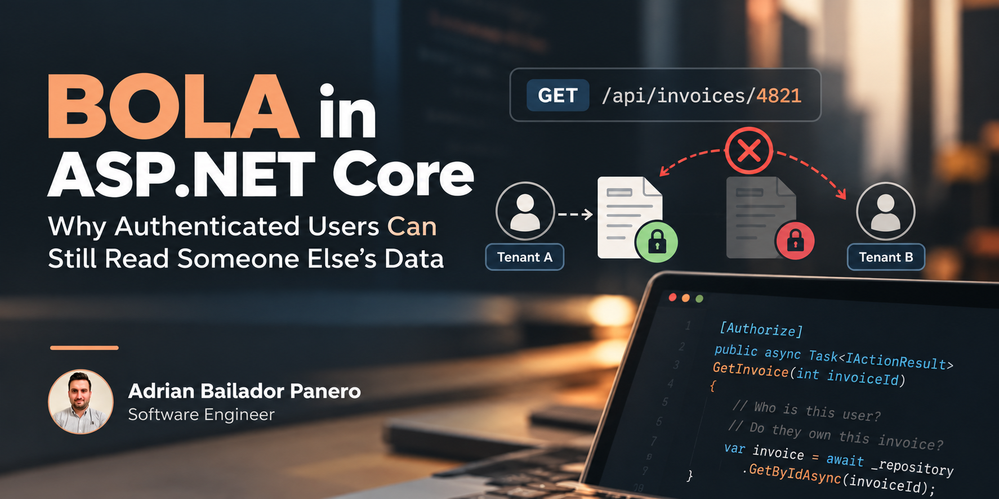

A pentest report came back with a finding rated "high": change the `invoiceId` in `GET /api/invoices/{invoiceId}`, and a logged-in user from Tenant A could read a PDF belonging to Tenant B. No token theft, no SQL injection, no exotic exploit — just a sequential integer in a URL and a valid, perfectly legitimate session cookie. The endpoint had `[Authorize]` on it. It had role checks. It had passed every authentication test anyone had written. Nobody had written a test for "user A requests an object that belongs to user B," because on paper, authentication was the thing that made the endpoint secure.

This is Broken Object Level Authorization — BOLA, also known by its older name, IDOR (Insecure Direct Object Reference). It's been the #1 entry on the OWASP API Security Top 10 since the list existed, and it keeps that spot because it doesn't look like a vulnerability in code review. The code compiles, the happy path works, the demo looks fine. The bug is an absence: nobody checked whether *this* caller should see *this* object.

## Code

The vulnerable endpoint, the fix, and the batch-endpoint pitfall below are all runnable in a companion repo: [bola-aspnetcore-dotnet](https://github.com/AdrianBailador/bola-aspnetcore-dotnet). All 5 tests pass, including the cross-tenant request that reproduces the bug and the regression test for the batch endpoint's `.IgnoreQueryFilters()` call. .NET 10.

## Why `[Authorize]` Doesn't Help Here

`[Authorize]` and policy-based authorization in ASP.NET Core answer one question: is this already-authenticated principal allowed to call this endpoint at all? Authentication establishes who the caller is; endpoint authorization decides whether that principal can access the endpoint — "is this user logged in," "does this user have the `Billing.Read` claim." Neither of those questions mentions the specific invoice, document, or order the request is asking for. BOLA lives in the gap between "can call this endpoint" and "can touch this specific object," and that gap is invisible to anything that only inspects the token.

```csharp
// Controller — passes every auth check ASP.NET Core ships with, out of the box
[Authorize(Policy = "Billing.Read")]
[HttpGet("api/invoices/{invoiceId:int}")]
public async Task<ActionResult<InvoiceDto>> GetInvoice(int invoiceId, CancellationToken ct)
{
    var invoice = await _invoiceRepository.GetByIdAsync(invoiceId, ct);
    if (invoice is null)
        return NotFound();

    return Ok(invoice.ToDto()); // whoever asked for invoiceId 4821 gets invoice 4821
}
```

The repository call fetches by primary key with no notion of *whose* key it is. Swap `_invoiceRepository.GetByIdAsync` for a query scoped to `CurrentUser.TenantId`, and the vulnerability disappears — but that fix has to live somewhere deliberate, not as a habit every developer remembers to repeat on every endpoint that takes an ID. Object-level authorization is a cross-cutting concern, and like every cross-cutting concern, it rots the moment it's implemented as a convention instead of a mechanism the framework enforces for you.

In Clean Architecture terms, this check belongs at the boundary between the API/Application layer and the data it hands back — after authentication has established *who*, before the handler returns *what*. It optimizes one quality attribute specifically: data confidentiality under multi-tenancy or multi-user ownership. It's overkill for genuinely public resources (a published blog post, a product catalog entry) and mandatory for anything scoped to an account, tenant, or user — invoices, documents, orders, support tickets, anything with an owner.

## Resource-Based Authorization, Not an `if` Statement

ASP.NET Core already ships the mechanism for this: resource-based authorization via `IAuthorizationService`, which evaluates a policy against both the current user *and* the specific object, not just the user.

```csharp
// Domain-adjacent resource
public sealed record Invoice(int Id, Guid TenantId, Guid OwnerId, decimal Amount, InvoiceStatus Status);

// Requirement — a marker, not logic
public sealed class SameTenantRequirement : IAuthorizationRequirement;

// Handler — the actual object-level check, written once
public sealed class SameTenantAuthorizationHandler : AuthorizationHandler<SameTenantRequirement, Invoice>
{
    protected override Task HandleRequirementAsync(
        AuthorizationHandlerContext context,
        SameTenantRequirement requirement,
        Invoice resource)
    {
        var tenantClaim = context.User.FindFirst("tenant_id")?.Value;

        if (Guid.TryParse(tenantClaim, out var tenantId) && tenantId == resource.TenantId)
            context.Succeed(requirement);

        return Task.CompletedTask;
    }
}
```

```csharp
// Program.cs
builder.Services.AddAuthorizationBuilder()
    .AddPolicy("SameTenant", policy => policy.Requirements.Add(new SameTenantRequirement()));

builder.Services.AddSingleton<IAuthorizationHandler, SameTenantAuthorizationHandler>();
```

```csharp
// Controller — the object-level check is now explicit, reusable, and independently testable
[Authorize(Policy = "Billing.Read")]
[HttpGet("api/invoices/{invoiceId:int}")]
public async Task<ActionResult<InvoiceDto>> GetInvoice(
    int invoiceId,
    IAuthorizationService authorizationService,
    CancellationToken ct)
{
    var invoice = await _invoiceRepository.GetByIdAsync(invoiceId, ct);
    if (invoice is null)
        return NotFound();

    var authResult = await authorizationService.AuthorizeAsync(User, invoice, "SameTenant");
    if (!authResult.Succeeded)
        return Forbid(); // 403 here — this repository isn't tenant-scoped yet; that changes below

    return Ok(invoice.ToDto());
}
```

The handler is unit-testable in isolation, independent of HTTP, EF Core, or any controller — it takes a user principal and a plain record, and returns a decision. That's the point: object-level authorization becomes a named, reusable policy instead of a `tenantId == invoice.TenantId` check that one developer remembers to write and the next one forgets.

## Defense in Depth: Scope the Query, Not Just the Response

Resource-based authorization catches the bug after the data is already loaded from the database. That's fine for a single invoice fetched by primary key, but it doesn't help with list endpoints, joins, or any query that could leak rows in bulk before a per-object check ever runs. The second layer is scoping the query itself, so cross-tenant rows are unreachable through normal queries against that `DbSet` — EF Core's global query filters are built for exactly this.

```csharp
public sealed class AppDbContext(DbContextOptions<AppDbContext> options, ICurrentTenantProvider tenantProvider)
    : DbContext(options)
{
    public DbSet<Invoice> Invoices => Set<Invoice>();

    protected override void OnModelCreating(ModelBuilder modelBuilder)
    {
        modelBuilder.Entity<Invoice>()
            .HasQueryFilter(i => i.TenantId == tenantProvider.TenantId);
    }
}
```

Now `_dbContext.Invoices.Where(i => i.Status == InvoiceStatus.Overdue)` can never return another tenant's rows, regardless of whether the handler that wrote the query remembered to add a tenant check. That has a direct consequence for the HTTP response: with the filter enabled, a cross-tenant lookup for `GetInvoice` above resolves to no resource at all. `invoice` is `null`, the method returns 404, and `AuthorizeAsync` never runs — there's nothing left to pass it. Nothing's wrong there; the filter is doing exactly its job as a tenant boundary. What it means for the resource-based check is that its real value sits elsewhere: ownership or permission decisions *within* the tenant the filter already scoped the query to, and any code path that deliberately bypasses the filter, like the batch endpoint below. One answers "which tenant can this query see at all"; the other answers "can this specific caller touch this specific object" — and only the second one is still watching once the first gets turned off.

## Before/After

### Before ❌
```csharp
[Authorize]
[HttpGet("api/documents/{documentId:guid}")]
public async Task<ActionResult<DocumentDto>> GetDocument(Guid documentId, CancellationToken ct)
{
    // Authenticated, but "authenticated" says nothing about ownership of THIS document.
    // Any logged-in user who guesses or enumerates a GUID gets the file.
    var document = await _documentRepository.GetByIdAsync(documentId, ct);
    return document is null ? NotFound() : Ok(document.ToDto());
}
```

### After ✅
```csharp
[Authorize]
[HttpGet("api/documents/{documentId:guid}")]
public async Task<ActionResult<DocumentDto>> GetDocument(
    Guid documentId,
    IAuthorizationService authorizationService,
    CancellationToken ct)
{
    // Query filter already scopes this to the caller's tenant (defense layer 1).
    var document = await _documentRepository.GetByIdAsync(documentId, ct);
    if (document is null)
        return NotFound();

    // Resource-based check covers ownership within the tenant (defense layer 2).
    var authResult = await authorizationService.AuthorizeAsync(User, document, "DocumentOwner");
    if (!authResult.Succeeded)
        return Forbid();

    return Ok(document.ToDto());
}
```

**Impact line:** In the audit that prompted this fix, 11 of 34 endpoints taking a resource ID had no object-level check — all 11 were exploitable with nothing more than a valid session and a predictable or enumerable ID. After adding query scoping and resource-based authorization as complementary controls enforced in code review for every multi-tenant resource, the same 34 endpoints produced zero cross-tenant findings on re-test.

## Where the Check Sits in the Request Pipeline


Authentication and policy-based authorization answer "who, and can they call this endpoint." The query filter and the resource-based handler are the two object-level gates, and they sit on either side of the fetch — one preventing the wrong rows from ever being queryable, the other making the ownership decision explicit and testable for the single object that was fetched.

## Pitfalls in Production

- **403 vs. 404 isn't a universal rule — it's a per-resource decision.** Use 403 for "exists, but not yours" when the resource's existence isn't itself sensitive and you want "unauthorized" distinguishable from "not found," which helps debugging and legitimate support tooling. Use a uniform 404 when you specifically don't want a caller able to infer whether an ID exists at all — some account and billing APIs choose this deliberately. What causes real problems isn't picking one; it's leaving the choice to whichever status code a repository's null-check happened to return, mixing both inconsistently across endpoints.
- **Bulk and export endpoints are the ones everyone forgets.** `GET /api/invoices/export?ids=4821,4822,4823` is a classic blind spot: the single-object handler got the resource-based check, the batch endpoint reusing the same repository didn't, because "it's basically the same code."
- **`.IgnoreQueryFilters()` is a silent bypass of layer one.** It's legitimately needed for admin tooling and background jobs, but every call site needs the resource-based check back in, explicitly — a global filter disabled for one legitimate reason disables it for the whole query, not just the reason you disabled it for.
- **GraphQL and OData make this worse, not better.** `$filter=tenantId eq 'other-tenant-guid'` or a GraphQL query reaching through a relation the resolver didn't expect to be traversable both route around a check written for one specific REST shape. Query filters at the `DbContext` level are the control that survives an unexpected traversal path; a check written only in a specific controller action is not.
- **Soft-delete and restore paths skip the checks their "live" counterparts have.** `POST /api/invoices/{id}/restore` is new code, written later, and routinely missing the same authorization the `GET` endpoint already has.
- **Nested resources need the parent checked too.** Authorizing access to a comment by its own `OwnerId` isn't enough if the comment's parent document should also gate visibility — check the resource you're returning *and* the resource it belongs to.

## Best Practices

The five questions a request has to clear, and where each one is answered:

| Layer | Question | Example |
|---|---|---|
| Authentication | Who are you? | JWT / cookie |
| Endpoint authorization | Can you call this endpoint? | `[Authorize(Policy = "Billing.Read")]` |
| Query scoping | Which objects can the query even see? | EF Core `TenantId` query filter |
| Resource authorization | Can you access *this* object? | `IAuthorizationService.AuthorizeAsync` |
| Tests | Can a *different* user access it? | Cross-tenant test case |

BOLA is what happens when authentication and endpoint authorization pass, but object-level isolation isn't enforced and tested.

1. **For multi-tenant resources, treat query scoping and object-level authorization as complementary controls, not substitutes.** A global query filter scoping storage, plus a resource-based policy scoping the single-object response — one without the other leaves either bulk queries or `IgnoreQueryFilters()` call sites exposed.
2. **Write the handler once per resource type.** An `AuthorizationHandler<TRequirement, TResource>` is reusable across every action that touches that resource — a GET, a PATCH, a DELETE, and the export endpoint all call the same policy.
3. **Test the negative case explicitly: "user A, object owned by user B."** Every endpoint accepting a resource ID needs this as its own test, separate from the happy-path "user A, object owned by user A" — a passing authentication test suite proves nothing about object-level isolation.
4. **Pick 403 or 404 once per resource type, before the first endpoint for it ships.** The trade-off is in the Pitfalls section above — the goal is a conscious choice, made once, rather than whatever a null-check happens to return.
5. **Scope at the data layer for every entity with an owner or tenant.** A global query filter keyed on `TenantId` or `OwnerId` protects every query written against that `DbSet`, including the ones nobody's written yet — it's the control that still helps after someone copy-pastes a repository method into a new feature six months from now.
6. **Put `.IgnoreQueryFilters()` call sites in front of security review.** They tend to get flagged in performance review instead, if at all — but each one is a deliberate disabling of layer one, and the question that matters is "does this call site still have layer two," not "does this still work."
7. **Include object-ID endpoints in automated scanning, not just manual pentest cycles.** A script that authenticates as two different test users and cross-requests every known object ID for the other user catches BOLA regressions the same week they're introduced, instead of the next time an external pentest is scheduled.

## Conclusion

BOLA survives in production codebases because authentication and object-level authorization look like the same concern from inside a controller action — both involve `[Authorize]`, both involve a user principal, both pass or fail with a status code. They're not the same concern. Authentication confirms identity once, at the edge; object-level authorization has to be re-evaluated for every object a request names, and it has to be a mechanism the architecture enforces, not a line of defensive code an individual developer remembers to write on a Tuesday.

The fix isn't exotic — `IAuthorizationService` and EF Core query filters have shipped in ASP.NET Core and EF Core for years. What's missing in most codebases that get burned by this isn't the tooling, it's the habit of treating "does this endpoint check the caller" and "does this endpoint check the caller against *this specific object*" as two separate questions that both need an explicit, testable answer. Apply the pair — query filter plus resource-based handler — to every entity with an owner, and the next pentest report has one less finding rated "high."
