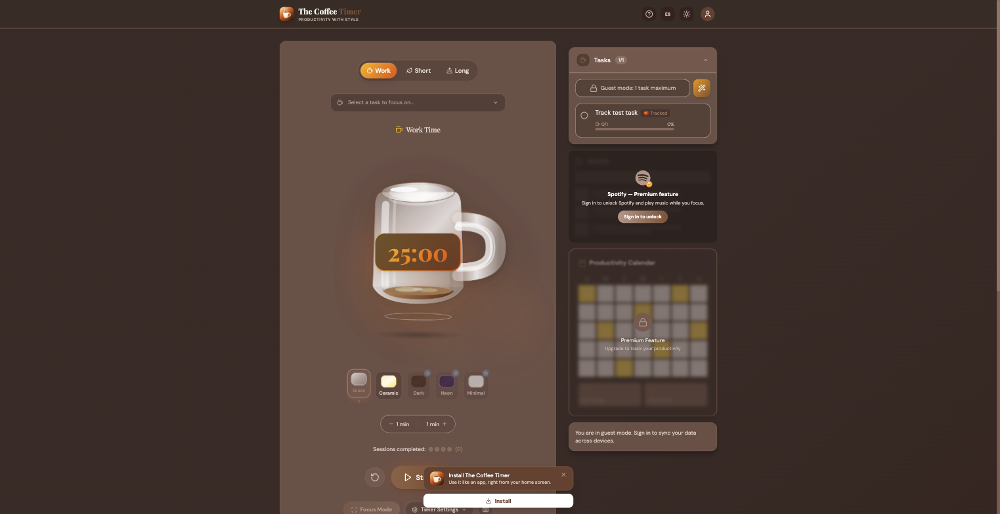

The Coffee Timer is a Pomodoro-style focus timer: work/short/long sessions, a task list you can attach to a session, five visual themes, and a productivity calendar that tracks completed sessions over time. Guest mode works with no account; signing in syncs data across devices and unlocks Spotify playback during focus sessions.

The frontend talks to a .NET backend, with Supabase handling data and auth behind it — subscription and feature-flag checks run server-side rather than hitting Supabase directly from the client, for the reasons covered in [How I Fixed Supabase Rate Limiting in Production](/blog/52-Supabase-Rate-Limiting).
